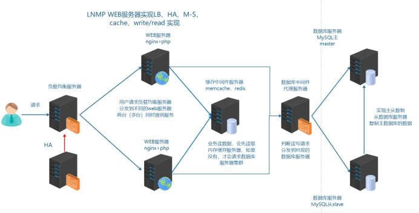

## 大型网站优化

### 1、网站访问流程

随着网站迭代开发，访问会变慢

LNMP 架构中网站应用访问流程

> 浏览器（app）=>web 服务器=>后端服务（php)=>数据库（mysql）

访问流程越多，访问速度和出现问题的几率也越大

优化访问速度，就需要减少访问步骤或者提高单步骤的速度

### 2、如何优化

根据网页的访问流程，可以进行以下优化：

① 提高 web 服务器并发 负载均衡（多台服务器架构） nginx

② 页面静态化 把经常访问，但是数据不经常发生变动的动态页面，制作为静态页面

③ 内存缓存优化 把经常访问的数据，加载到内存中使用

④ 数据库优化 很多时候，还需要取数据库信息，所以优化数据库本身

## 背景描述及其方案设计

随着业务量增加，访问量越来越大，用户在访问某些页面数据时，通过慢查询日志发现慢查询 SQL，经过优化之后效果还是不够明显。而此类数据发生变动的频率又较小，故提出使用缓存中间件（一般会将数据存储到内存中）的方式，降低 MySQL 的读压力，提高整个业务架构集群的稳定和快速响应能力

### 2、模拟运维设计方案

根据以上业务需求，准备加入缓存中间件服务器

根据以上业务需求和方案，服务器架构升级为如下示意图

在本次业务架构中，使用缓存中间件解决以下两个问题：

①session共享

②缓存热点数据，首页面的分类信息