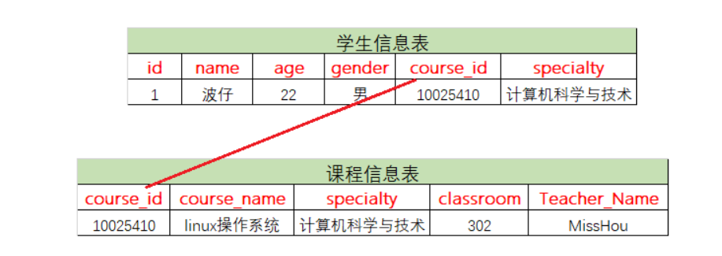

## 1、关系型数据库与非关系型数据库

RDBMS（relational database management system），既关系型数据库管理系统。

简单来说，关系型数据库，是指采用了`二维表格`来组织数据的数据库。

:::tip
扩展：数据库在行业内一般会有两种情况，关系型数据库与非关系型数据库。非关系型数据库并不是通过二维表格来维护数据的，而是通过key/value键值对来维护数据的。
:::

## 2、常见的关系型数据库

`oracle、mysql`、DB2（IBM）、Sybase、`SQL server`（Microsoft微软）、IBM Informix

关系型数据库的**最大特点就是==事务的一致性==**：所以也在对事物一致性的维护中有很大的开销.

## 3、什么是事务

1）事务由一条或者多条sql语句组成；

2）在事务中的操作，这些sql语句要么都成功执行，要么都不执行，这就是一个事务。 

==举例说明：==

1.     登陆ATM机，输入密码； 
2.     连接数据库，验证密码； 
3.     验证成功，获得用户信息，比如存款余额等； 
4.     用户输入需要转账的金额，按下确认键；
5.     ==从后台数据库中减掉用户账户上的对应金额（update语句）；== 
6.     ==从后台数据库中给对方账户增加相应的金额（update语句）；== 
7.     确认，退卡，走人；