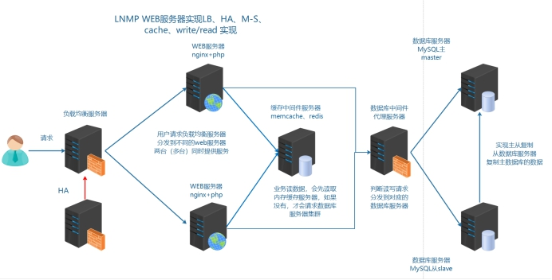
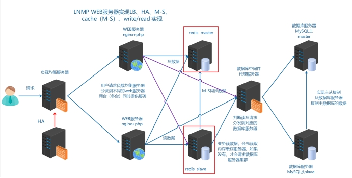
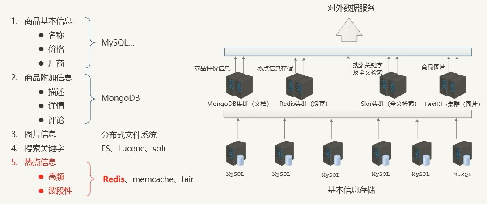
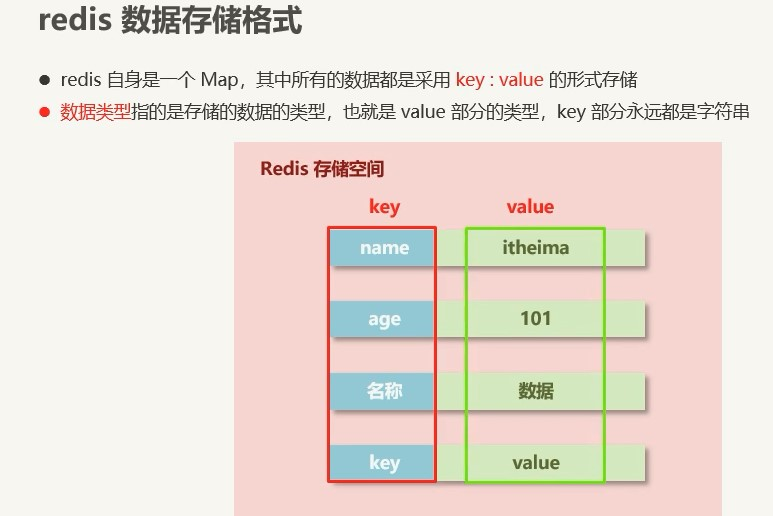
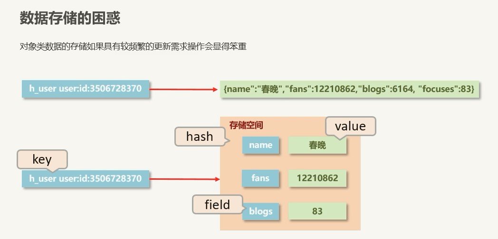
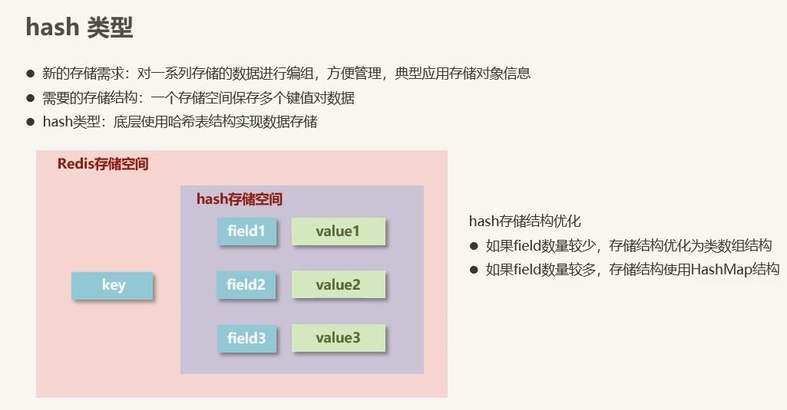
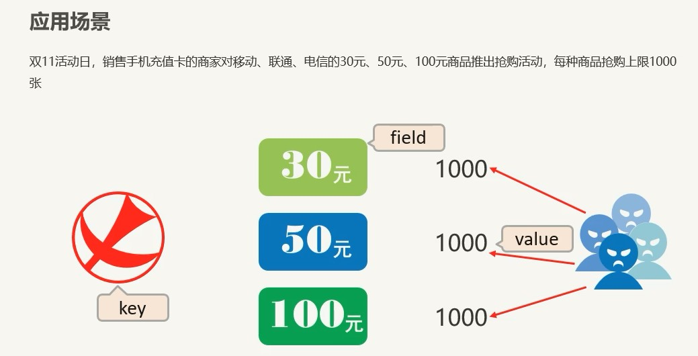

## 模拟运维设计方案

根据以上业务需求，准备加入 Redis 缓存中间件服务器，可以使用到 redis 更加丰富的功能

在商城业务中实现：

①session 共享存储到 redis

②openresty（nginx+lua）动态限制 IP 访问

## Redis 介绍

Nosql 非关系数据库 key => value 键值对

Redis 是**R**emote **D**ictionary **S**erver(远程数据服务)的缩写

由意大利人 antirez(Salvatore Sanfilippo) 开发的一款 内存高速缓存数据库

该软件使用 C 语言编写,它的数据模型为 key-value

它支持丰富的数据结构，比如 **String list（双向链表） hash（哈希） set（集合） sorted set（zset 有序集合）**

可持久化（保存数据到磁盘中），保证了数据安全

### 2、业务使用场合

> **①[Sort Set]**排行榜应用，取 top n 操作，例如 sina 微博热门话题
>
> **②[List]**获得最新 N 个数据 或 某个分类的最新数据
>
> **③[String]**计数器应用
>
> **④[Set]**sns(social network site)获得共同好友
>
> **⑤[Set]**防攻击系统(ip 判断)黑白名单等等

## 3、对比 memcached

> ①Redis 不仅仅支持简单的 k/v 类型的数据，同时还提供 list，set，zset，hash 等数据结构的存储。
>
> ②Redis 支持 master-slave(主—从)模式应用。
>
> ③Redis 支持数据的持久化，可以将内存中的数据保持在磁盘中，重启的时候可以再次加载进行使用。
>
> ④Redis 单个 value 存储 string 的最大限制是 512MB， memcached 只能保存 1MB 的数据
>
> ⑤redis 是单核，memcached 是多核

​ 由于 redis 只能使用单核，而 memcached 可以使用多核，所以在比较上，平均每一个核上 redis 在储存小数据时比 memcached 性能更高。而却 100K 以上数据中，memcached 性能要高于 redis，虽然 redis 最近也在储存大数据的性能上进行优化，但是比起 memcached 还是有点逊色。结论是无论你使用那个，每秒处理请求的次数都不会成为瓶颈。

你需要关注内存使用率。对于 key-vlaue 这样简单的数据储存，memcached 的内存使用率更高，如果采用 hash 结构，redis 的内存使用率会更高，当然这都依赖于具体的应用场景。

## 案例使用

## 主从模式

缓存集群架构示意图

## NoSQL 概念

### 一些问题

现象:

- 12306 崩溃
- 618, 双十一崩溃

海量用户, 高并发

原因:

关系型数据库

- 性能瓶颈: 磁盘 IO 性能低下
- 扩展瓶颈: 数据关系复杂, 扩展性差, 不便于大规模集群

解决思路:

- 降低磁盘 IO 次数, 越低越好 ------ 内存存储
- 去除数据间关系, 越简单越好 ------ 不存储关系, 仅存储数据
- 以上就是 NoSQL

### NoSQL

即 Not-Only SQL (泛指非关系型的数据库), 作为关系型数据库的补充
作用: 应对基于海量用户和海量数据前提下的数据处理问题

- 特征:

  - 可扩容, 可伸缩
  - 大数据量下高性能
  - 灵活的数据模型
  - 高可用

- 常见 Nosql 数据库
  - Redis
  - MongoDB
  - HBase
  - memcache

### 解决方案(电商场景)

## Redis 数据存储类型介绍

### 业务数据的特殊性

1. 原始业务功能设计

- 秒杀, 618, 双十一, 12306

2. 运营平台监控到的突发高频访问数据

- 突发要闻

3. 高频, 复杂的统计数据

- 在线人数
- 投票

### Redis数据类型(5种常用)

1. string类型

- 存储的数据: 单个数据, 最简单的数据存储类型
- 存储数据的格式: 一个存储空间保存一个数据
- 存储内容: 通常使用字符串, 如果字符串以整数的形式展示, 可以作为数字操作使用

2. hash类型

应用场景:

