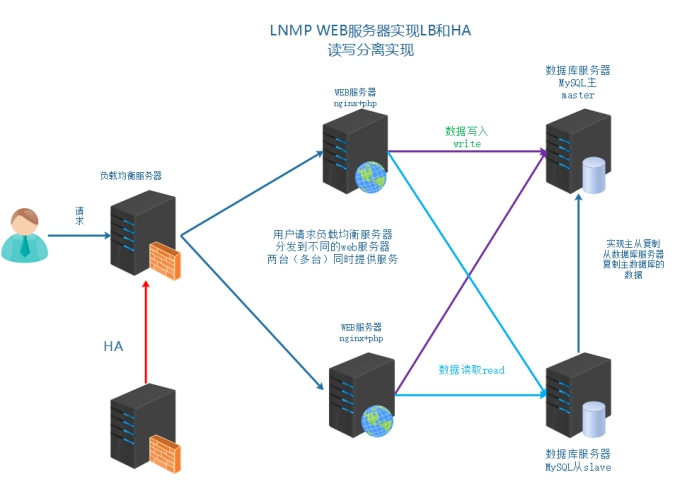
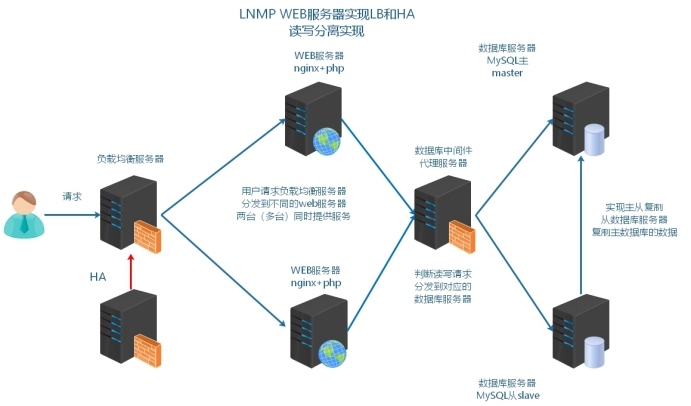

## 业务背景描述

之前业务中是单台 MySQL 提供服务，使用多台 MySQL 数据库服务器，降低单台压力，实现集群架构的稳定性和高可用性 数据的一致性 完整性 replication

通过业务比对和分析发现，随着活跃用户数增多，读取数据的请求变多，故着重解决读取数据的压力

### 模拟运维设计方案


根据以上业务需求，在之前业务架构的基础上实现数据的读写分离



## MySQL 读写分离介绍

### 1、读写分离的目的

**实现数据库负载均衡**：

​ 当数据库请求增多时，单例数据库不能够满足业务需求。需要进行数据库实例的扩容。多台数据库同时相应请求。也就是说需要对数据库的请求，进行`负载均衡`

​ 但是由于数据库服务特殊原因，数据库扩容基本要求为：`数据的一致性和完整性`。所以要`保证多台数据库实例的数据一致性和完整性`，以 MySQL 为例来说，官方提供了`主从复制机制`。

**读写分离：**

​ 数据库的负载均衡不同于其他服务的负载均衡，数据要求一致性。`基于主从复制的基础上，常见的数据库负载均衡使用的是读写分离方式。写入主数据库，读取到从数据库`。可以认为`数据库读写分离，是一种特殊的负载均衡实现。`

**实际业务中，读写分离存在的一个问题，不够实时性。**

**因此对于实时性的解决方案**:

:::tip 对于要求实时性高的业务
① 缓存 写主库 写缓存 读缓存

② 可以读主

③ 添加完数据之后，有一个跳转等待的时间（5s），数据正在审核中
:::

### 2、读写分离常见的实现方式

**① 业务代码的读写分离**

需要在业务代码中，判断数据操作是读还是写，读连接从数据服务器操作，写连接主数据库服务器操作

以当前 LNMP 为例，需要通过 PHP 代码实现读写分离

**② 中间件代理方式的读写分离**

在业务代码中，数据库的操作，不直接连接数据库，而是先请求到中间件服务器（代理）

由代理服务器，判断是读操作去从数据服务器，写操作去主数据服务器

| MySQL Proxy | MySQL 官方 测试版 不再维护                                  |
| ----------- | ----------------------------------------------------------- |
| Atlas       | 奇虎 360 基于 MySQL Proxy https://github.com/Qihoo360/Atlas |
| DBProxy     | 美团点评                                                    |
| Amoeba      | 早期阿里巴巴                                                |
| cobar       | 阿里巴巴                                                    |
| MyCat       | 基于阿里开源的 Cobar                                        |
| kingshared  | go 语言开发https://github.com/flike/kingshard               |
| proxysql    | <http://www.proxysql.com/>                                  |

也就是如下图示架构, 用了中间件服务器对于业务代码来说算是单例服务器, 因为只需要连接中间件



问：如何选择？

① 业务实现读写分离，操作方便，成本低，当前的开发框架基本支持读写分离

② 中间件代理服务器，除了能够实现读写分离，还可以作为数据库集群的管理平台

## MySQL 读写分离案例实现

### 首先搭建 M-S 复制

主从复制的原理 ：主服务器开启 bin-log（记录了写操作） 从服务器获取到主服务器的 bin-log 记录到 relay-log 中。从服务器在通过异步的线程方式，对于 relay-log 进行重放操作。

#### 1、master 配置

**① 在 master 服务器授权，slave 服务器 replication slave 权限**

slave 是通过 MySQL 连接登录到 master 上来读取二进制日志的，因此需要在

master 上给 slave 配置权限

```mysql
mysql > grant replication slave on *.* to 'slave'@'192.168.17.%'identified by '123456';
```

**②master 服务器打开 bin-log 日志，并标识 server-id**

```shell
shell > vim /etc/my.cnf
```

配置文件内容

```shell
[mysqld]
log-bin = mysql-index
server-id = 1
```

注意重启 mysql 使配置生效

**③ 制作一个完整的备份**

如果确认主从的数据库，默认开始数据是一致的，可以不做备份

```shell
shell > mysqldump -uroot -p'123456' --all-databases > /root/mysql.sql
```

**④ 查看 master 上的 bin-log 及其 position 位置**

```mysql
mysql > show master status;
```

查看并记录 File 的值，Position 的值。之后需要在从服务器上，指向这些信息

| 参数     | 作用                          |
| -------- | ----------------------------- |
| File     | 记录到的 bin-log 日志文件名称 |
| Position | bin-log 日志文件所记录的位置  |

#### 2、slave 配置

**① 恢复备份文件**

如果 slave 和 master 的数据本身就是相同的，可以不选择备份和导入

**② 配置 server-id，标识服务器**

```shell
shell > vim /etc/my.cnf
```

配置文件内容

```shell
[mysqld]
server-id=2
```

由于是克隆获取的 MySQL 实例，所以 auto.conf 里记录的 UUID 一样，需要==删除/usr/local/mysql/data/auto.conf 文件==，否则主从无法识别互相身份，重启自动生成新的即可。

**③ 配置 slave replication**

```mysql
mysql > stop slave;
mysql> change master to master_host='192.168.17.101',master_user='slave1',master_password='123456',master_log_file='mysql-bin.000002',master_log_pos=333;
mysql > start slave;
```

> **参数说明**
>
> master_host 主 master 的 IP
>
> master_user 主 master 允许登录，拥有 replication slave 权限
>
> master_password 用户的密码
>
> 需要通过 mysql > show master status; 在 master 执行
>
> master_log_file 主 master 记录的 bin-log 日志文件名称
>
> master_log_pos 主 master 记录的 bin-log 日志文件对应的位置

**④ 启动 replication，并检查结果**

```mysql
mysql > show slave status\G;
```

查看到两个 yes，主从复制成功。否则，查看显示最下面信息，通过 error 信息进行排查问题。

### 方式 1、简单业务代码实现

示例语法代码：

```php
<?php
//创建类
class Mysql {
  //构造方法
  //当类被实例化时,会触发此方法
  public function __construct(){
     $this->master = @new mysqli('192.168.17.100','tp5shop','$Abc3721','tp5shop');
	 $this->slave = @new mysqli('192.168.17.105','tp5shop','$Abc3721','tp5shop');
     // 如果从连接报错,就连接主
     if($this->slave->connect_errno){
      $this->slave=$this->master;
     }
  }
  // SQL执行方法
  public function query($sql){
    //判断语句中是否存在selete
    if(strpos($sql, 'select') !== false){
      //这是查询操作
      $rs = $this->slave->query($sql);
    }else{
      $rs = $this->master->query($sql);
    }
    return $rs;
  }
}
$mysql = new Mysql();
$sql = "select * from tpshop_goods";
$rs = $mysql->query($sql);
while($row = $rs->fetch_assoc()){
    var_dump($row['goods_name']);
}
```

将此代码上传到 web 服务器，测试是否可以实现读写分离。注意修改对应的连接地址、用户名称、密码等信息。

```shell
#命令行执行php代码的方式
#php需要提前配置环境变量  xxx.php为需要执行的php脚本文件
shell > php  xxx.php
```

### 方式 2、框架配置实现读写分离

**① 通过查看 thinkphp5 手册找到处理方案**

**② 修改项目配置文件**

一定要先去确定主从数据库的数据一致（tp5shop），用户名称和密码可以进行登录使用

```shell
shell > vim /usr/local/nginx/html/tp5shop/application/database.php
```

配置文件示例

```php
return [
    // 数据库类型
    'type'            => 'mysql',
    // 服务器地址
    // 1、主从数据库的连接地址  主在前  从在后
    'hostname'        => '192.168.17.100,192.168.17.105',
    // 2、主从数据库的名称、用户、密码一样的话，只配置一份即可。如果不一样，按照先后顺序，逗号分隔
    // 数据库名
    'database'        => 'tp5shop',
    // 用户名
    'username'        => 'tp5shop',
    // 密码
    'password'        => '$Abc3721',
    // 端口
    'hostport'        => '3306',
    // 连接dsn
    'dsn'             => '',
    // 数据库连接参数
    'params'          => [],
    // 数据库编码默认采用utf8
    'charset'         => 'utf8',
    // 数据库表前缀
    'prefix'          => 'tpshop_',
    // 数据库调试模式
    'debug'           => true,
    // 3、项目框架的业务代码实现读写分离，使用的是分布式（主从服务器）  配置为1
    // 数据库部署方式:0 集中式(单一服务器),1 分布式(主从服务器)
    'deploy'          => 1,
    // 4、数据库读写分离是业务代码实现的，配置为true
    // 数据库读写是否分离 主从式有效
    'rw_separate'     => true,
    // 读写分离后 主服务器数量
    'master_num'      => 1,
    // 指定从服务器序号
    'slave_no'        => '',
    // 是否严格检查字段是否存在
```

测试 down 主库，看从库是否可以访问。thinkphp5 中，如果 slave 宕机，master 提供读服务。

### 方式 3、MyCAT 实现读写分离

准备一台服务器，作为数据库的中间件服务器，配置基本环境，网卡、FQDN

Mycat 数据库中间件

国内最活跃的、性能最好的开源数据库中间件！

官方网址：<http://www.mycat.io/>

<https://github.com/MyCATApache/MyCAT-Server/>

因为 mycat 是由 java 语言开发，必须使用 java 的运行环境才能进行启动和操作

#### jdk 安装

java 静态编译的编程语言 代码编译成机器码 执行机器码输出结果。

编译 jdk javac 编译 java 代码

运行 jre 编译好的机器码（可以执行文件） java

**问：公司服务器部署的 java 环境是 jdk 还是 jre？**

答：jre java 解析运行环境 一般情况编译过的可执行的 java 程序 ，jre 就够用了。

jdk javac 编译的环境 如果服务器上传是源代码文件 就可以编译，之后再执行。

实际业务环境中，如果存在需要编译的情况，就选择 jdk。

**① 下载安装 jdk**

<https://www.oracle.com/technetwork/java/javase/downloads/jdk8-downloads-2133151.html>

选择下载 x64 架构.tar.gz 包

上传 mycat 和 jdk 到 soft 目录下

```shell
shell > tar xvf jdk-8u192-linux-x64.tar.gz
shell > mv jdk1.8.0_192 /usr/local/java
```

**② 配置环境变量**

```shell
#追加环境变量
shell > echo "PATH=/usr/local/java/bin:$PATH" >> /etc/profile
shell > source /etc/profile
#检测java环境变量  如果看到版本信息即为成功
shell > java -version
```
