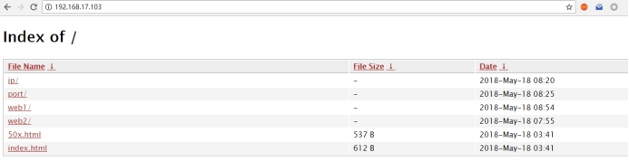
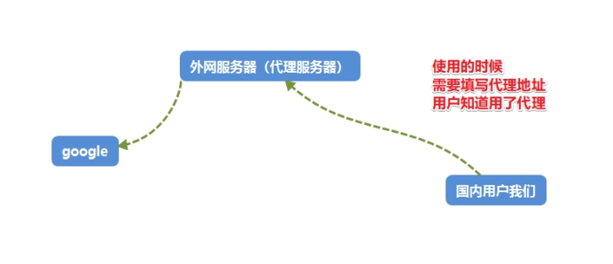
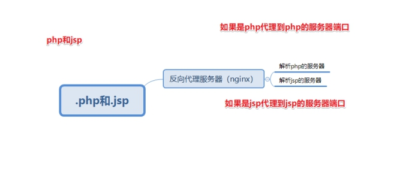

## 默认官方模块

### 1、Gzip 压缩

压缩文件，使文件变小，传输更快了。目前市场上大部分浏览器是支持 gizp 的。IE6 以下支持不好，会出现乱码情况。

**官方文档**：<http://nginx.org/en/docs/http/ngx_http_gzip_module.html>

**示例语法：**

```shell
#配置到http段里，使整个http服务都启用gzip压缩
#开启gzip压缩
gzip on;
#http协议版本
gzip_http_version 1.0;
#IE浏览器不开启gzip  IE6以下会乱码
gzip_disable 'MSIE [1-6].';
#开启gzip 文件的格式
gzip_types image/jpeg image/jpg image/png text/plain text/css;
```

验证文件是否开启 gzip

---

### 2、客户端缓存

B/S 架构里 browser 浏览器 就是客户端

告知浏览器获取的信息是在某个区间时间段是有效的。

官方文档：<http://nginx.org/en/docs/http/ngx_http_headers_module.html#expires>

**示例语法：**

```nginx
location ~ \.(js|css)$ {
    #单位参数 d day 天|H hour 小时  M 分
    expires 1h;
}

#在整个http中生效  配置到http段里
expires 1h
```

### 3、基于 IP 的访问控制

基于 ngx_http_access_module 模块，默认可使用

官方文档：<http://nginx.org/en/docs/http/ngx_http_access_module.html>

> 语法：
>
> ==deny ip== 禁止 ip 访问
>
> allow ip 允许访问

### 4、基于用户的访问控制

基于 ngx_http_auth_basic_module 模块，默认可用

官方文档：<http://nginx.org/en/docs/http/ngx_http_auth_basic_module.html>

> 语法：
>
> auth_basic "提示信息"
>
> auth_basic_user_file /etc/nginx/htpasswd;

**配置实现：**
**① 创建用户名和密码存储文件**

```shell
shell > cd /usr/local/nginx/conf
#htpasswd 如果不存在就通过  yum -y install httpd-tools安装
#生成用户名称和密码
shell > htpasswd -c ./passwd.db lnmp
#输入密码并再次确认密码
#查看passwd.db文件是否创建成功
```

**② 在配置文件中进行配置**

```shell
shell > vim /usr/local/nginx/conf/nginx.conf
```

配置文件内容

```nginx
#根据业务需求，配置到server段里
#登录框显示的标题提示
auth_basic "test login"
#加载用户名称和密码校验文件
auth_basic_user_file  /usr/local/nginx/conf/passwd.db;
```

**③ 测试查看**

### 5、目录列表显示

显示文件列表，或者需要做一个下载列表



官方文档：<http://nginx.org/en/docs/http/ngx_http_autoindex_module.html#autoindex>

**示例语法：**

```nginx
#开启目录列表显示
autoindex on;
#index  当index默认找不到时，才会使用目录列表
index index;
```

> 注意：如果目录中没有配置的默认 index 访问项，而 autoindex 又没有开启，不能够查看访问目录列表，就会报出 403 错误。

### 6、反向代理

**正向代理**



特点：知道自己使用了代理，需要填写代理服务器的 IP 等相关连接信息

​ **==常见于代理客户端上网等操作。==**

**反向代理**



特点：用户是无感知的，不知道使用了代理服务器。反向代理服务器是和真实访问的服务器是在一起的，有关联的。

作用：可以根据实际业务需求，分发代理页面到不同的解释器

​ 可以隐藏真实服务器的路径

**==常见于代理后端服务器==**

官方文档：<http://nginx.org/en/docs/http/ngx_http_proxy_module.html>

**① 配置反向代理**

==**验证例子：**==

**① 安装 httpd 需改端口 8080**

```shell
#安装apache
shell > yum install -y httpd
#配置apache的配置文件
shell > vim /etc/httpd/conf/httpd.conf
```

修改配置项

```apache
listen 8080
```

**② 配置 nginx 的 server 并进行转发**

```nginx
location / {
    proxy_pass http：//127.0.0.1:8080;
}
```

---

## 日志管理

> 日志类型：
>
> ①access.log 访问日志 查看统计用户的访问信息 流量
>
> ②error.log 错误日志 错误信息 重写信息

### 1、访问日志

官方文档：http://nginx.org/en/docs/http/ngx_http_log_module.html

**① 查看 access.log**

```shell
shell > cd /usr/local/nginx/logs
shell > cat access.log
```

access.log 日志文件内容示例

```nginx
127.0.0.1 - - [06/Oct/2017:11:46:16 +0800] "GET /phpinfo.php HTTP/1.1" 200 25206 "-" "Mozilla/5.0 (Windows NT 10.0; Win64; x64) AppleWebKit/537.36 (KHTML, like Gecko) Chrome/62.0.3202.9 Safari/537.36"
```

**② 查看配置解析参数说明**

```shell
shell > vim nginx.conf
```

查看访问日志相关参数

```nginx
#定义日志格式  格式命名    详细格式参数
#log_format  main  '$remote_addr - $remote_user [$time_local] "$request" '
    #                  '$status $body_bytes_sent "$http_referer" '
    #                  '"$http_user_agent" "$http_x_forwarded_for"';
#访问日志的存储路径配置               调用的日志格式
    #access_log  logs/access.log  main;
```

| 参数                  | 意义                                                    |
| --------------------- | ------------------------------------------------------- |
| **$remote_addr**      | 客户端的 ip 地址(代理服务器，显示代理服务 ip)           |
| $remote_user          | 用于记录远程客户端的用户名称（一般为“-”）               |
| $time_local           | 用于记录访问时间和时区                                  |
| **$request**          | 用于记录请求的 url 以及请求方法                         |
| $status               | 响应状态码，例如：200 成功、404 页面找不到等。          |
| $body_bytes_sent      | 给客户端发送的文件主体内容字节数                        |
| **$http_user_agent**  | 用户所使用的代理（一般为浏览器）                        |
| $http_x_forwarded_for | 可以记录客户端 IP，通过代理服务器来记录客户端的 ip 地址 |
| $http_referer         | 可以记录用户是从哪个链接访问过来的                      |

访问日志，可以统计分析用户的流量的相关情况。客情分析

### 2、错误日志

记录一些启动和运行过程中的错误信息

```nginx
# 定义开启错误日志    日志位置    日志级别
#error_log  logs/error.log;
#error_log  logs/error.log  notice;
#error_log  logs/error.log  info;
```

官方文档：<http://nginx.org/en/docs/ngx_core_module.html#error_log>

```shell
shell > cat /usr/local/nginx/logs/error.log
```

格式示例：

```nginx
2019/06/06 11:42:43 [error] 25356#0: *38 open() "/usr/local/nginx/html/favicon.ico" failed (2: No such file or directory), client: 192.168.17.1, server: localhost, request: "GET /favicon.ico HTTP/1.1", host: "192.168.17.220", referrer: "http://192.168.17.220/index.php"
```

### 3、基于域名日志分割

**① 开启日志的定义规则**

```nginx
#定义日志格式  定义http里
log_format  mylogs  '$remote_addr - $remote_user [$time_local] "$request" '
                      '$status $body_bytes_sent "$http_referer" '
                      '"$http_user_agent" "$http_x_forwarded_for"';
```

**② 重启 nginx 测试查看**

```nginx
#访问日志的存储路径配置        调用的日志格式
#在server段里面配置  也就是在当前server里的访问日志，会被写入定义的这里
access_log  logs/shop.lnmp.com_access.log  mylogs;
```

日志切割的方式有很多种：

① 基于域名分开存储

② 日志轮转 时间段

③ 自定义脚本 定时检测大小 根据文件大小进行切割
