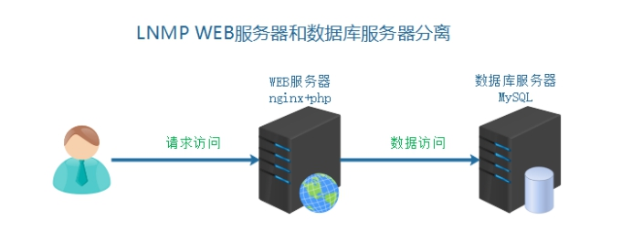
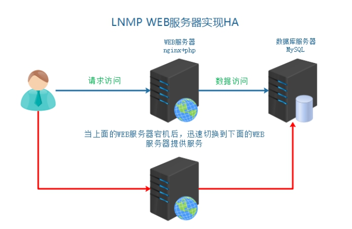
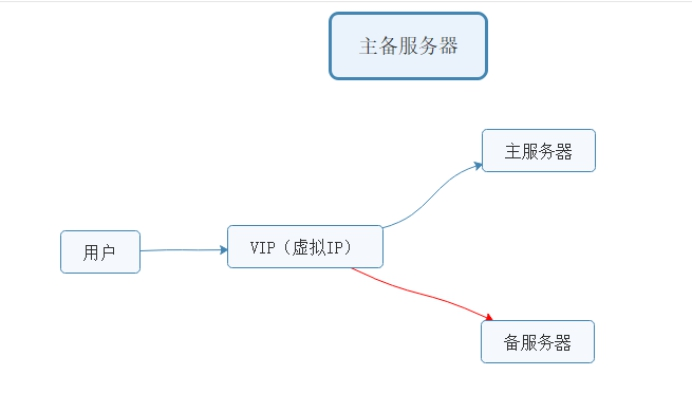
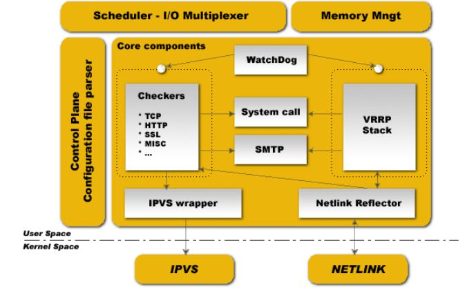

## 背景描述及其方案设计

### 1、业务背景描述

​ 随着用户量增多，单台 WEB 服务器，压力越来越大。虽然单台 WEB 服务器，目前可以完成工作任务。但是如果一旦宕机，用户就完全失去服务了，用户体验特别不好。需要备用一台服务器进行使用，主服务器宕机之后，快速切换为备用服务器

### 2、模拟运维设计方案

在之前架构中，先将数据库服务器单独迁移



针对 web 服务器单点故障，升级为主备服务器架构



## 数据库服务器迁移

### 1、服务器 ip

> server01 WEB 服务器 master 192.168.17.102
>
> server02 数据库服务器 192.168.17.100
>
> server03 WEB 服务器 backup 192.168.17.101

### 2、服务器基本配置

根据之前的服务器基本环境的要求进行配置

因为是克隆获取虚拟机，所以只需要进行 IP 和 MAC 地址的修改即可。

```shell
#1、删除原有网卡mac地址记录信息
shell > cd /etc/udev/rules.d
shell > rm -rf 70-persistent-net.rules
#2、删除eth0里的mac地址项 HWADDR参数
#3、修改主机名称
shell > sed -i "s/server01/server02/" /etc/sysconfig/network;
#4、启动之后，把hosts文件对应也做解析
```

### 3、数据备份和迁移

**① 源数据库服务器导出数据**

```shell
#源数据库是server01 在server01上操作
shell > mysqldump -uroot -p --database tp5shop > /root/tp5shop.sql
```

**② 导入数据到新数据库服务器**

```mysql
#因为数据库服务器克隆来的，所有本身具有数据 可以删除了库，模拟新机器，重新导入
mysql > drop database tp5shop;
#创建数据库并导入数据
mysql > create database tp5shop;
mysql > use tp5shop;
mysql > source /root/tp5shop.sql;
```

**③ 在 server02 MySQL 服务器中建立远程连接用户并授予权限**

```mysql
mysql > grant all on tp5shop.* to 'tp5shop'@'192.168.17.%' identified by '$Abc3721';
```

**④ 修改项目数据库配置文件**

```shell
shell > vim /usr/local/nginx/html/tp5shop/application/database.php
```

修改参考示例：

```php
return [
    // 数据库类型
    'type'            => 'mysql',
    // 服务器地址
    'hostname'        => '192.168.17.100',
    // 数据库名
    'database'        => 'tp5shop',
    // 用户名
    'username'        => 'tp5shop',
    // 密码
    'password'        => '$Abc3721',
    // 端口
    'hostport'        => '3306',
```

**⑤ 访问页面，查看业务使用情况**

---

## 高可用服务搭建

### 1、HA 高可用

​ 高可用 HA（High Availability）是分布式系统架构设计中必须考虑的因素之一，它通常是指通过设计，减少系统服务不可用的时间。假设系统一直能够提供服务，我们说系统的可用性是 100%。如果系统每运行 100 个时间单位，会有 1 个时间单位无法提供服务，我们说系统的可用性是 99%。==很多公司的高可用目标是 4 个 9，也就是 99.99%，这就意味着，系统的年停机时间为 0.876 个小时==。

| **描述**                         | **通俗叫法** | **可用性级别** | **年度停机时间** |
| -------------------------------- | ------------ | -------------- | ---------------- |
| 基本可用性                       | 2 个 9       | 99%            | 87.6 小时        |
| 较高可用性                       | 3 个 9       | 99.9%          | 8.8 小时         |
| **具有故障自动恢复能力的可用性** | **4 个 9**   | **99.99%**     | **53 分钟**      |
| 极高可用性                       | 5 个 9       | 99.999%        | 5 分钟           |

> **实现高可用的核心点：**
>
> ① 冗余（多台服务器）
>
> ② 自动切换

备份服务器：

冷备 服务器不启用（域名不解析），使用的时候再开启，需要手动切换

热备 服务器在等待状态（监控主服务器状态），一旦主宕机，备就接管，自动切换

实现热备，引入 VIP 的切换



**通过 VIP 的方式，切换主备服务器**

① 默认 VIP 绑定在主服务器（master）

②master 不可用，就切换 VIP 到备份服务器（backup）

③ 用户可以使用到连续性更好的服务，通过 VIP 访问服务器

**常用来单独实现高可用的软件：**

`①keepalived`

②heartbeat 较早 属于 redhat HA 工程的一部分

### 2、keepalived 介绍

​ Keepalived 软件起初是专为 LVS 负载均衡软件设计的，用来管理并监控 LVS 集群系统中各个服务节点的状态，后来又加入了可以实现高可用的 VRRP 功能。因此，Keepalived 除了能够管理 LVS 软件外，还可以作为其他服务（例如：Nginx、Haproxy、MySQL 等）的高可用解决方案软件

### 3、keepalived 组成和原理

​ Keepalived 软件主要是通过 VRRP 协议实现高可用功能的。

​ VRRP 是 Virtual Router RedundancyProtocol(虚拟路由器冗余协议）的缩写，VRRP 出现的目的就是为了解决静态路由单点故障问题的，它能够保证当个别节点宕机时，整个网络可以不间断地运行。

​ 虚拟路由冗余协议，可以认为是实现路由器高可用的协议，即将 N 台提供相同功能的路由器组成一个路由器组，这个组里面有一个 master 和多个 backup，master 上面有一个对外提供服务的 vip（该路由器所在局域网内其他机器的默认路由为该 vip），master 会发组播，当 backup 收不到 vrrp 包时就认为 master 宕掉了，这时就需要根据 VRRP 的优先级来选举一个 backup 当 master。这样的话就可以保证路由器的高可用了。




Keepalived 的功能体系结构，大致分两层：**用户空间（user space）和内核空间（kernel space）**。

**内核空间：**

主要包括 IPVS（IP 虚拟服务器，用于实现网络服务的负载均衡）和 NETLINK（提供高级路由及其他相关的网络功能）两个部份。

**用户空间：**

> WatchDog：负载监控 checkers 和 VRRP 进程的状况
>
> VRRP Stack：负载均衡器之间的失败切换 FailOver，如果只用一个负载均衡器，则 VRRP 不是必须的。
>
> Checkers：负责真实服务器的健康检查 healthchecking，是 keepalived 最主要的功能。换言之，可以没有 VRRP Stack，但健康检查 healthchecking 是一定要有的。
>
> IPVS wrapper：用户发送设定的规则到内核 ipvs 代码
>
> Netlink Reflector：用来设定 vrrp 的 vip 地址等。

keepalived 主要使用三个模块，分别是 core、check 和 vrrp。

core 模块为 keepalived 的核心，负责主进程的启动、维护以及全局配置文件的加载和解析。

check 负责健康检查，包括常见的各种检查方式。

vrrp 模块是来实现 VRRP 协议的。

### 4、安装配置启动 keepalived

master 和 backup 都需要进行安装，也就是 server01 和 server03 机器

```shell
#安装keepalived
shell > yum -y install keepalived
```

| 主机名称 | 服务器 IP      |        |
| -------- | -------------- | ------ |
| server01 | 192.168.17.102 | master |
| server03 | 192.168.17.101 | backup |

**keepalived 需要使用的目录和文件：**

| 文件或者目录                    | 作用           |
| ------------------------------- | -------------- |
| /etc/keepalived/keepalived.conf | 生效的配置文件 |
| /etc/init.d/keepalived          | 服务器管理脚本 |
| /var/log/messages               | 日志信息       |

**配置 keepalived**

**① 备份主备服务器的配置文件**

```shell
shell > cd  /etc/keepalived
shell > cp keepalived.conf keepalived.conf_bak
```

**② 分别修改主备服务器配置文件**

```
shell > vim keepalived.conf
```

**示例配置文件说明**

```shell
! Configuration File for keepalived
#发送邮件的配置
global_defs {
   notification_email {
     acassen@firewall.loc
     failover@firewall.loc
     sysadmin@firewall.loc
   }
   notification_email_from Alexandre.Cassen@firewall.loc
   smtp_server 192.168.200.1
   smtp_connect_timeout 30
   router_id LVS_DEVEL
}
#vrrp协议的配置
vrrp_instance VI_1 {
    #工作模式
    state MASTER
    #监听的网卡
    interface eth0
    #虚拟路由id 需要和备服务器一致
    virtual_router_id 51
    #权重 优先级
    priority 100
    #vrrp包的发送周期  1s
    advert_int 1
    #权限验证
    authentication {
        auth_type PASS
        auth_pass 1111
    }
    #需要绑定切换的VIP
    virtual_ipaddress {
        192.168.200.16
        192.168.200.17
        192.168.200.18
    }
}
```

主服务器

```shell
! Configuration File for keepalived
global_defs {
   notification_email {
     acassen@firewall.loc
     failover@firewall.loc
     sysadmin@firewall.loc
   }
   notification_email_from Alexandre.Cassen@firewall.loc
   smtp_server 192.168.200.1
   smtp_connect_timeout 30
   router_id LVS_DEVEL
}
vrrp_instance VI_1 {
    state MASTER
    interface eth0
    virtual_router_id 51
    priority 100
    advert_int 1
    authentication {
        auth_type PASS
        auth_pass 1111
    }
    #master默认只需要修改使用VIP即可
    virtual_ipaddress {
        192.168.17.200
    }
}
```

备服务器

```shell
! Configuration File for keepalived
global_defs {
   notification_email {
     acassen@firewall.loc
     failover@firewall.loc
     sysadmin@firewall.loc
   }
   notification_email_from Alexandre.Cassen@firewall.loc
   smtp_server 192.168.200.1
   smtp_connect_timeout 30
   router_id LVS_DEVEL
}
vrrp_instance VI_1 {
    #修改工作模式为备
    state BACKUP
    interface eth0
    virtual_router_id 51
    priority 100
    advert_int 1
    authentication {
        auth_type PASS
        auth_pass 1111
    }
    #注意修改VIP
    virtual_ipaddress {
        192.168.17.200
    }
}
```

**③ 分别按照顺序启动主服务器和备服务器的 keepalived**

```shell
shell > service keepalived start
```

**④ 查看主备服务器的网卡信息**

```shell
#需要通过ip a命令查看  分别在server01和server03查看
shell > ip a
```

##5、模拟服务器不可用 VIP 切换

服务器整机不可用，常见于服务器断网，或者断电关机等。

**方法一：模拟主服务器断电关闭**

```shell
#关闭主服务器  VIP所在服务器
shell > poweroff
```

**方法二：模拟主服务器断网**

```shell
#关闭VIP所在服务器的网卡  使其不能够联网
shell > service network stop
```

通过以上实验检测，发现当主服务器整机不可用时，VIP 会切换到备用服务器

## 实现服务 HA

​ 通过 keepalived 可以直接实现主服务器整机不可用，实现 VIP 的切换。保证用户可以通过 VIP 进行访问服务。

但是实际情况下，往往并不是服务器整机不可用，只是对应的服务或者软件不可用。

比如说：nginx 提供的 web 服务，nginx 进程关闭

就需要检测当 nginx 不可用时，就切换 VIP

**实现过程分析：**

VIP 实际是由 keepalived 进行绑定的，所以当 nginx 服务不可用时，就关闭当前机器的 keepalived 即可，释放 VIP。进而绑定到其他备用服务器。

① 编写服务检测脚本，实现检测 nginx 是否可用，不可用则关闭当前所在主机的 keepalived

② 在 keepalived 配置中调用检测服务脚本

### 1、Nginx 服务可用检测脚本

主备服务器都要实现此脚本

**① 编写测试脚本 赋予执行权限**

```
shell > cd /etc/keepalived
shell > vim check_nginx.sh
```

**脚本内容：**

```shell
#!/bin/bash
nginx_status=`ps -C nginx --no-header | wc -l`
if [ $nginx_status -eq 0 ];then
   service keepalived stop
fi
```

赋予脚本执行权限 方便之后其他软件调用执行

```shell
shell > chmod +x check_nginx.sh
```

**② 测试脚本可用性**

启动 nginx 和 keepalived

关闭 nginx 执行脚本 查看 keepalived 是否也关闭

### 2、模拟宕机实现服务切换

在多台服务器中配置 keepalived 定时触发检测 nginx 的脚本模块

```shell
#在vrrp_instance外上面定义
vrrp_script check_nginx {
   #调用脚本地址
   script  /etc/keepalived/check_nginx.sh
   #检测间隔时间
   interval 3
}
#在vrrp_instance里调用
track_script {
    #上线定义的名称
    check_nginx
}
```

##3、实现 web 服务器高可用

以上案例已经实现了，服务不可用 VIP 切换到可用服务器。

现在需求用户的服务是连续不间断的，故**用户需要通过 VIP 进行访问**

**① 解析域名到 VIP**

**② 模拟用户访问**

## keepalived 的配置补充

> 脑裂（裂脑）：vip 出现在了多台机器上。网络不通畅，禁用了数据包，主备服务器没法通讯，造成备服务器认为主服务器不可用，绑定 VIP，主服务器 VIP 不会释放。
>
> 解决方案：
>
> ① 双备或者多备模式 BACKUP 通过 priority 权重来区分谁的优先级更高
>
> ② 单播(定向广播)的方式 (一些特定环境禁用了组播方式)
>
> ③ 时间不同步 服务器时间校时

### 1、非抢占模式

**①nopreempt**

在主备服务器的配置文件，vrrp_instance 段中

**② 设置 state 工作模式为 BACKUP**
两个 keepalived 节点都启动后，默认都是 BACKUP 状态，双方在发送组播信息后，会根据优先级来选举一个 MASTER 出来。由于两者都配置了 nopreempt，所以 MASTER 从故障中恢复后，不会抢占 vip。这样会避免 VIP 切换可能造成的服务延迟。

### 2、单播模式

一些特定环境下不允许发送组播，造成备服务器无法收到 vrrp 包，可能会造成脑裂现象。可以通过单播的方式解决。

**单播示例配置：**注意此语法在 keepalived1.2.11 版本以上支持

> unicast_src_ip 192.168.1.21##（本地 IP 地址）
>
> unicast_peer {
>
> ​ 192.168.1.22##（对端 IP 地址）此地址一定不能忘记
>
> }

**主服务器 server01 配置**

```shell
#在vrrp_instace段中加入
#本地IP
unicast_src_ip 192.168.17.102
unicast_peer {
    #对象IP  发送vrrp包给备服务器
    192.168.17.101
}
```

**备服务器 server03 配置**

```shell
#在vrrp_instace段中加入
#本地IP
unicast_src_ip 192.168.17.101
unicast_peer {
    #对象IP  发送vrrp包给备服务器
    192.168.17.102
}
```

**tcpdump 抓 vrrp 包的方式：**

```shell
shell > tcpdump vrrp -n
```
