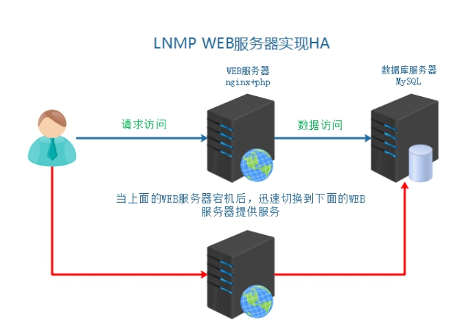
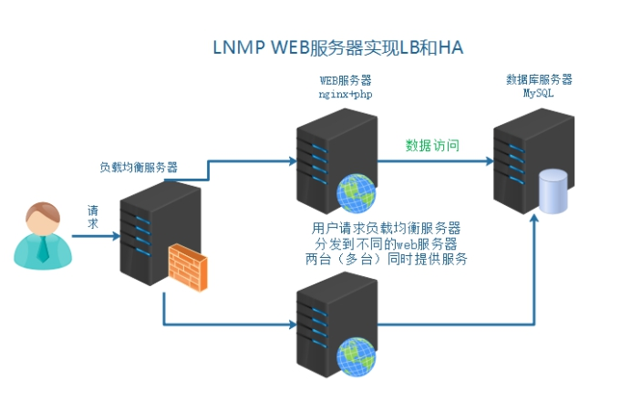
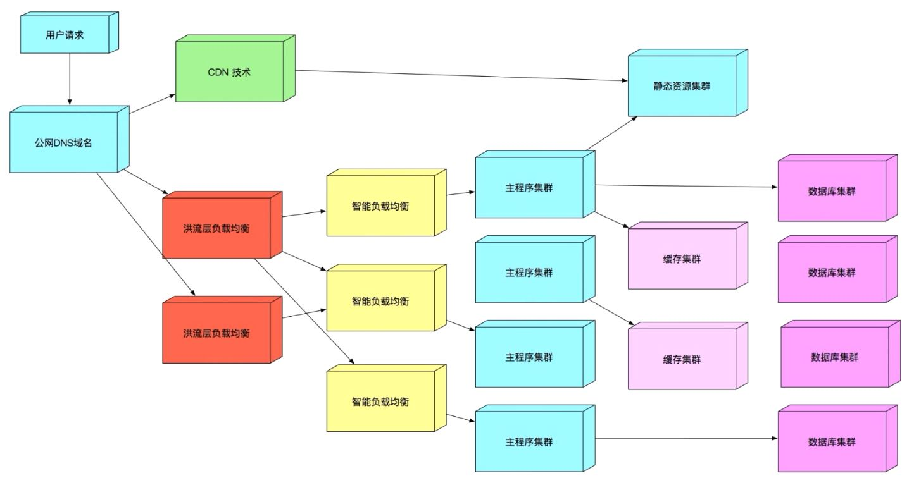
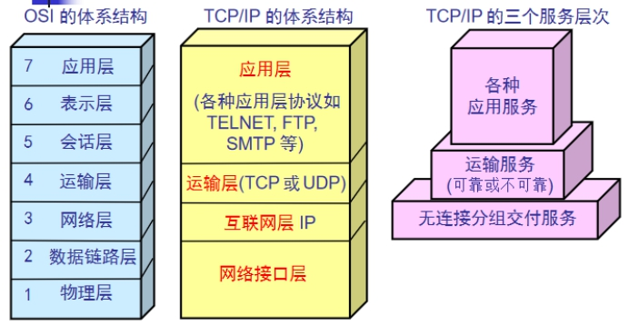
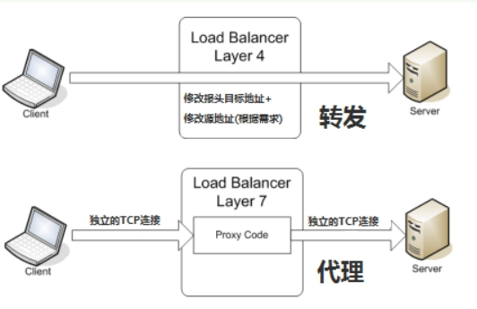
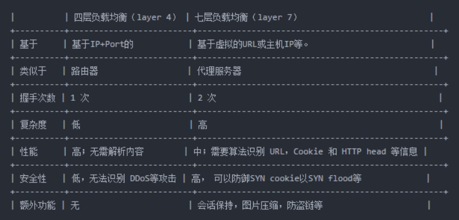
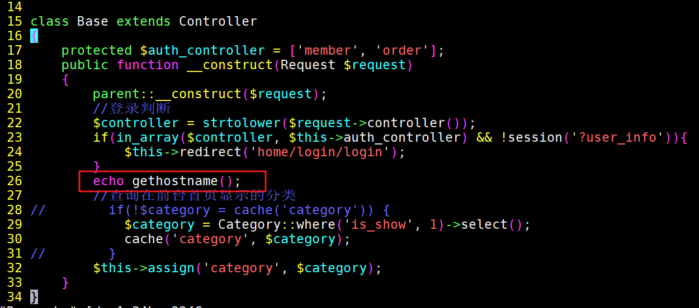
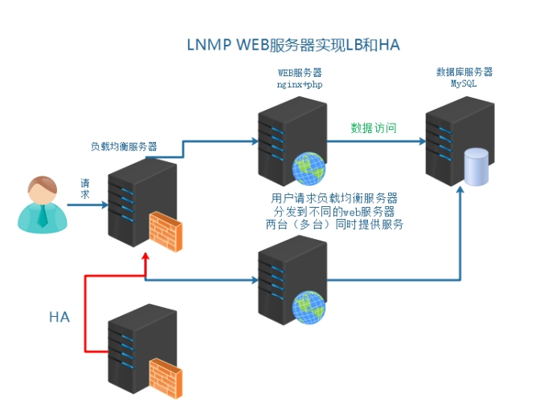

## 业务背景描述

随着业务量骤增，之前单点服务器，已经不能够满足业务使用需要。如果主服务器宕机，备服务器提供服务，因为流量太大，备也宕机。需要多台服务器，同时提供服务。

## 模拟运维设计方案



以上架构服务器，已经不能够满足以上提到的业务需求。架构发生如下变化



## 负载均衡服务器搭建



### 1、引入负载均衡技术

负载均衡技术 （load blance） 是一种概念 把资源的使用进行平均分配。

负载均衡：分发流量、请求到不同的服务器。使流量平均分配（理想的状态的）

**作用：**

服务器容灾 流量分发

**主要作用：**

① 流量分发 请求平均 降低单例压力

**其他作用：**

② 安全 隐藏后端真实服务

③ 屏蔽非法请求（七层负载均衡）

### 2、负载均衡分类



**1）二层负载均衡（mac）**

根据 OSI 模型分的二层进行负载，一般是用虚拟 mac 地址方式，外部对虚拟 MAC 地址请求，负载均衡接收后，再分配后端实际的 MAC 地址响应

**2）三层负载均衡（ip）**

一般采用虚拟 IP 地址方式，外部对虚拟的 ip 地址请求，负载均衡接收后，再分配后端实际的 IP 地址响应

**3）四层负载均衡（tcp）** 也称网络运输层面的负载均衡

在三层负载均衡的基础上，用 ip+port 接收请求，再转发到对应的机器

**4）七层负载均衡（http）** 也称智能型负载均衡

根据虚拟的 url 或 IP，主机接收请求，再转向（反向代理）相应的处理服务器

### 3、常见实现方式

> 实现方式分类：
>
> ① 软件级别 性价比高 可控性强
>
> ② 硬件级别 性能好 价格高 几万到几十万不等

**硬件是实现方式：**

F5 BIG-IP 四层和七层

**软件实现方式：**

| OSI 分层 | 实现方式                          |
| -------- | --------------------------------- |
| 七层     | Nginx、HAProxy                    |
| 四层     | LVS、HAProxy、Nginx（1.9 版本后） |



**四层和七层对比:**



### tip: 三次握手攻击

:::tip
C S

第一次: C 发送数据包给 S  
第二次: S 回复 C 收到的数据包 (ack+1)  
第三次: C 发送数据包 (ack + 1) 给 S 意思是 S 发现 C 把包发回来代表 C 收到了

三次握手攻击是发生在第三次握手之前, 比如第二次之后 S 端给 C 端发了请求
S 端等着 C 端再发回来, syn 攻击客户端不发了, 而 S 端打开了链接一直在等待, 超时时间很长的
话链接一直在开启消耗, 每一个机器能打开的最大连接数有限, 也就是 65535 描述文件数

所以 syn 攻击就是耗尽网络连接数

如何防御:
把超时时间调短一些
可以在七层判断是不是一个客户端, 如果是拿代码没有客户端信息或者身份信息不一致就断开, 不进行请求
:::

### 4、Nginx 负载均衡配置

**官方文档**：<http://nginx.org/en/docs/http/ngx_http_upstream_module.html>

> **架构分析：**
>
> ① 用户访问请求 Nginx 负载均衡服务器
>
> ②Nginx 负载均衡服务器再分发请求到 web 服务器
>
> **实际配置负载均衡，只需修改作为负载均衡服务器的 Nginx 即可。**

**① 在客户端解析域名到负载均衡服务器**

**② 在负载均衡的 Nginx 配置**

```shell
#注意本次架构中  server04的Nginx服务器是负载均衡服务器
shell > cd /usr/local/nginx/conf/nginx.conf
```

**配置文件示例**：

```nginx
#在http段进行配置
#分发请求到后端服务器
upstream shop {
    #web1 server01
    server 192.168.17.102;
    #web2 server02
    server 192.168.17.101；
}
#修改之前的shop的server段配置
server {
    listen 80；
    server_name www.shop.com;
    location / {
        #代理转发到shop段  匹配到上面的upstream
        proxy_pass http://shop;
        #以下两条配置，实质是设置了传输的header头信息
        #传输域名给后端服务器  进行识别  方便匹配对应server虚拟主机
        proxy_set_header Host $host;
        #发送客户端IP  给后端服务器  用来方便后端服务器识别用户真实IP
        proxy_set_header X-Real-IP $remote_addr;
    }
}
```

**③ 重载负载均衡服务器 Nginx 配置测试查看效果**

可以停掉其中一台 web 服务器进行测试

### 5、查看确认负载均衡

> 如何确认服务器是否实现了负载均衡？
>
> ① 在不同的 web 服务器同路由访问的文件中，写入不同的信息，以示区别。
>
> ② 通过查看后端 web 服务器的访问日志进行确定

==**方法一：在不同服务器写入不同信息**==

**① 分别修改 web 服务器的信息**

```shell
shell > vim /usr/local/nginx/html/tp5shop/application/home/controller/Base.php
```

写入一个动态参数，根据 php 语法自动调用当前主机名称



**② 访问查看负载均衡效果**

---

**方法二：查看后端 web 服务器的访问日志**

```shell
shell > cat /usr/local/nginx/logs/access.log
```

### 6、负载均衡后获取客户端 IP

> 负载均衡之后，在后端的 web 服务器获取到的是负载均衡服务器的 IP，而不能够获取到客户端的真实 IP。
>
> 需要进行以下特殊配置：
>
> ① 首先在负载均衡服务器中配置，转发客户端 IP 给后端 web 服务器
>
> ② 后端 web 服务器需要配置，识别从负载均衡服务器传输过来的客户端真实 IP

**官方网址**：<http://nginx.org/en/docs/http/ngx_http_realip_module.html>

**使用 ngx_http_realip_module 模块提供的 set_real_ip_from 语法，默认此模块没有安装，需要编译时添加编译参数**

web 服务器上配置 set_real_ip_from 代表从哪儿来源的 IP，需要识别真实客户端 IP

**示例配置：**

```nginx
#此配置在web服务器上的nginx
#可配置到http、server、location中，推荐配置到server中
#配置需要识别的IP来源   负载均衡的IP
set_real_ip_from  192.168.17.103
```

### 7、upstream 中 server 的关键字

> upstream 中的分发之后的几个关键字：
>
> backup 备 其他的没有 backup 标识的都无响应，才分发到 backup
>
> down 此条配置，不会被分发到

```nginx
upstream shop {
    server 192.168.17.102 down;
    server 192.168.17.101 backup；
}
```

### 8、session 一致性问题

**访问管理后端页面，登录发现验证码不通过**

**分析原因：**

① 比如分发到 web1 服务器，生成验证码，存储到 session 中，默认在服务器本地

② 再次校验的时候，请求分发到 web2 服务器了，所有验证码一直校验不通过

**解决方案思路：**

① 生成和验证 session 都请求同一台服务器

② 共享 session nfs mysql ==内存缓存软件（memcached、redis）==

### 9、Nginx 的负载均衡算法

> **Nginx 官方默认 3 种负载均衡的算法**
>
> ①==Round-Robin RR 轮询（默认）== 一次一个的来（理论上的，实际实验可能会有间隔）
>
> ②==weight 权重== 权重高多分发一些 服务器硬件更好的设置权重更高一些
>
> ③==ip_hash== 同一个 IP，所有的访问都分发到同一个 web 服务器

Tip：

第三方模块实现的调度算法 需要编译安装第三方模块

④fair 根据后端服务器的繁忙程度 将请求发到非繁忙的后端服务器

⑤url_hash 如果客户端访问的 url 是同一个，将转发到同一台后端服务器

**验证一：验证加权轮询算法**

**示例配置：**

```nginx
upstream shop {
    #web1 server01
    server 192.168.17.102 weight=5;
    #web2 server02
    server 192.168.17.101 weight=3；
}
```

server01 web 1 1 1 1 1 1

server03 web 2 1 1 1

8 次中，server01 分发 5 次，server03 分发 3 次

**验证二：ip 一致性算法**

**示例配置:**

```nginx
upstream shop {
    #ip hash 一致性算法配置  设置此项  weight就失效了
    ip_hash;
    #web1 server01
    server 192.168.17.102 weight=5;
    #web2 server02
    server 192.168.17.101 weight=3；
}
```

### 10、实现负载均衡高可用

所有的请求流量，都要经过负载均衡服务器，负载均衡服务器压力很大，防止它宕机，导致后端服务所有都不可用，需要对负载均衡服务器，做高可用



给负载均衡服务器 server04 做一台备用服务器 server05，通过 keepalived 实现高可用。

通过 keepalived 实现 VIP 在负载均衡服务器组的切换。

> server04 master LB 192.168.17.103
>
> server05 backup LB 192.168.17.50

主负载均衡的 keepalived 配置

```shell
vrrp_instance VI_1 {
    state BACKUP
    interface eth0
    #虚拟路由ID 新ID 不要之前的冲突
    virtual_router_id 52
    priority 100
    nopreempt
    advert_int 1
    authentication {
        auth_type PASS
        auth_pass 1111
    }
    virtual_ipaddress {
        #添加新VIP
        192.168.17.201
    }
    track_script {
        check_nginx
    }
}
```

备负载均衡的 keepalived 配置

```shell
vrrp_instance VI_1 {
    state BACKUP
    interface eth0
    #修改route_id
    virtual_router_id 52
    priority 99
    nopreempt
    advert_int 1
    authentication {
        auth_type PASS
        auth_pass 1111
    }
    #unicast_src_ip 192.168.17.101
    #unicast_peer {
    #    192.168.17.102
    #}
    virtual_ipaddress {
        #新VIP
        192.168.17.201
    }
    track_script {
        check_nginx
    }
}

```
