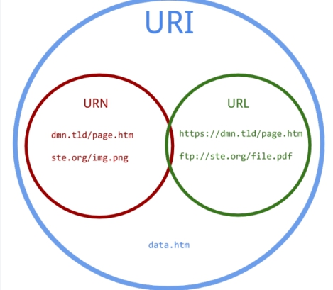

## URL匹配之location

> Location 配置语法
>
> <http://nginx.org/en/docs/http/ngx_http_core_module.html#location>


### 1、location匹配规则



**①   =  精确匹配**

```nginx
location = / {
    #规则
}
```
> 则匹配到 http://www.example.com/ 这种请求

**② ~  大小写敏感   区分大小写**

```nginx
location ~ /Example/ {
    #规则
}
```
> 请求示例
> http://www.example.com/Example/  [成功]
> http://www.example.com/example/  [失败]

**③  ~* 大小写忽略**

```nginx
location ~* /Example/ {
    #规则
}
```
> 请求示例
> http://www.example.com/Example/  [成功]
> http://www.example.com/example/  [成功]

**④  ^~ 只匹配以 uri 开头**

```nginx
location ^~ /img/ {
    #规则
}
```
>请求实例
>以 /img/ 开头的请求，都会匹配上
>http://www.example.com/img/a.jpg   [成功]
>http://www.example.com/img/b.mp4 [成功]
>http://www.example.com/bimg/b.mp4 [失败]
>http://www.example.com/Img/b.mp4 [失败]

**⑤ /     其他匹配都不成功  就匹配此项**

```nginx
location / {
   #规则
}
```

如果路径是资源文件是存在的，会优先获取资源文件

> **location匹配优先级**
>
> (location =) > (location 完整路径) > (location ^~ 路径) > (location ~,~* 正则顺序) > (location 部分起始路径) > (/)

### 2、location匹配跳转

**@+name**
@，nginx内部跳转

```nginx
location /img/ {
    #如果状态码是404  就指定404的页面为什么
    error_page 404 = @img_err;
}    

location @img_err {    
    # 规则
    return  503；
}
```

>以 /img/ 开头的请求，如果链接的状态为 404。则会匹配到 @img_err 这条规则上

### 3、Nginx支持pathinfo路径

需求

```shell
http://www.shop.com/home/goods/index/cate_id/187.html  默认不支持访问
重写成为
http://www.shop.com/index.php?s=home/goods/index/cate_id/187.html
```

语法规则示例

```nginx
location / {
   rewrite /index.html /index.php last;
   #判断请求的路径 不存在
   if (!-e $request_filename) {
      # 捕获到所有路径信息   重写为index.php的s参数   last需要匹配之后的location规则
      rewrite ^(.*)$   /index.php?s=$1 last;
   }
}
```
