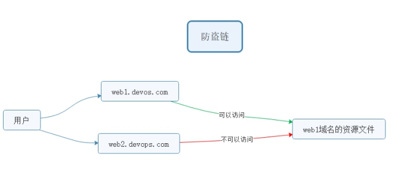

## URL 重写规则

> ==**ngx_http_rewrite_module**==模块用于使用 PCRE 正则表达式更改请求 URI，返回重定向，以及有条件地选择配置

**官方文档地址**：<http://nginx.org/en/docs/http/ngx_http_rewrite_module.html

### 1、return

该指令用于结束规则的执行并返回状态码给客户端.

> 403 Forbidden.服务器已经理解请求,但是拒绝执行它
>
> 404 Not Found.请求失败,请求所希望得到的资源未在服务器上发现.404 这个状态码被⼴泛应⽤于当服务器不想揭示为何请求被拒绝,或者没有其他适合的响应可⽤的情况下.
>
> 500 Internal Server Error.服务器遇到⼀个未曾预料的状况,导致它无法完成对请求的处理.⼀般来说,这个问题都会在服务器的程序码出错时出现.
>
> 502 Bad Gateway.作为网关或代理工作的服务器尝试执行请求时,从上游服务器接收到无效的响应. 比如关掉 php 解析服务器
>
> 503 Service Unavailable.由于临时的服务器维护或过载,服务器当前无法处理请求.这个状况是临时的,并且将在一段时间以后恢复.503 状态码的存在并不意味着服务器在过载的时候必须使⽤它.某些服务器只不过是希望拒绝客户端的连接.
>
> 504 Gateway Timeout 作为网关或代理工作的服务器尝试执行请求时,未能及时从上游服务器(URI 标识出的服务器,例如 HTTP,FTP,LDAP)或辅助服务器(例如 DNS)收到响应。

请求状态码：

<https://developer.mozilla.org/zh-CN/docs/Web/HTTP/Status>

**示例语法：**

```shell
#可以匹配到server location if中，推荐配置到location中
return 403;
```

### 2、rewrite

rewrite 匹配到请求 URI，重写到新的 URI

> rewrite 语法 匹配到，替换为其他内容
>
> 语法 rewrite 匹配内容 替代内容 标记

**官方文档地址**：<http://nginx.org/en/docs/http/ngx_http_rewrite_module.html#rewrite>

> flag 标记说明：
>
> last #本条规则匹配完成后，继续向下匹配新的 location URI 规则，客户端 URL 地址不会发生跳转
>
> break #本条规则匹配完成即终止，不再匹配后面的任何规则，客户端 URL 地址不会发生跳转
>
> redirect #返回 302 临时重定向，浏览器地址会显示跳转后的 URL 地址
>
> permanent #返回 301 永久重定向，浏览器地址栏会显示跳转后的 URL 地址

**匹配顺序**：多条 rewrite，从上到下匹配，匹配到之后就不在匹配其他 rewrite 规则。

---

## URL 相关案例实现

### 1、案例：资源重定向实现

**业务需求描述：**

实际业务不存在 index.html，需要重写访问 index.php

URL 为 index.html，而实际访问的是 index.php，对外被认为是 html 静态页面

以上方案就是`seo 优化伪静态`的使用，把真实的后端的页面，伪装为静态 html 页面。

**① 修改配置**

```shell
shell > vim /usr/local/nginx/conf/nginx.conf
```

添加配置

```nginx
rewrite /index.html /index.php last;
```

**③重载配置测试访问**

---

### 2、案例：域名重定向实现

网站的域名升级了，需要启用新的域名使用。

但是用户却不知道，还可能使用旧的域名访问网站。

需要把通过旧域名访问的来源，重定向到新的域名。

把shop.xxxx.com的请求全部重定向到新域名www.shop.com

```nginx
rewrite / http://www.shop.com permanent;
```

**示例配置：**

```shell
#shop.xxxx.com的请求全部重定向到www.shop.com中
server {
               listen 80;
               server_name shop.xxxx.com;
               # 不需要写root, 因为这个只用来跳转
               rewrite / http://www.shop.com permanent;
        }
        server {
                listen 80;
                #绑定新域名即可
                server_name www.shop.com;
                root html/tp5shop/public;
                index index.php index.html;
                #deny 192.168.17.1;
                #auth_basic "shop login";
                #auth_basic_user_file  /usr/local/nginx/conf/passwd.db;
                access_log  logs/shop.xxxx.com_access.log  mylogs;
                location / {
                  rewrite /index.html /index.php last;
                }
                location ~ \.php$ {
                        fastcgi_pass   127.0.0.1:9000;
                        fastcgi_index  index.php;
                        fastcgi_param  SCRIPT_FILENAME  $document_root$fastcgi_script_name;
                        include        fastcgi_params;
                }
                #location ~ \.(js|css) {
                #     expires 2h;
                #}
        }

```

注意新域名www.shop.com 记得在客户端的hosts文件中解析。

---

### 3、案例：防盗链原理和实现



**业务需求描述：**

域名A的资源文件，经常被域名B直接调用访问。

而用户经常访问域名B，看到的资源（图片等）以为是域名B的，实际则是域名A的。

但是域名A没有从中获得任何收益，缺要给域名B来源的访问耗费服务器资源和带宽。

所以，禁止域名B直接访问和调用域名A的资源的方式，就被称为"防止盗链"

> 语法：
>
> 定义允许访问的域名来源
>
> valid_referers none blocked servername
>
> none blocked  没有referer的情况，直接访问资源的情况
>
> if ($invalid_referer) {}

**模拟:**

1、在ip的虚拟主机，静态文件调用图片

2、shop的虚拟主机，禁止ip的虚拟主机调用图片

**①做一个盗链: ip虚拟主机目录建立静态文件访问shop虚拟主机的图片资源**

```shell
shell > cd /usr/local/nginx/html
shell > echo '' >> img.html
```

**②做防盗链: 在shop虚拟主机配置中，防止其他虚拟机主机盗链**

```shell
#定义在server里  shop的server
#图片请求防盗链
location ~* \.(jpg|png|jpeg|gif|bmp) {
    valid_referers www.shop.com;
	if ($invalid_referer) {
  	    return 404;
	}
}
```