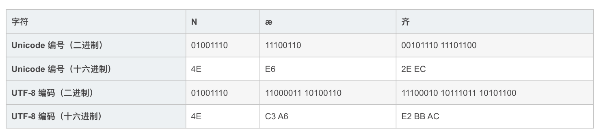

# nodejs核心api

## Buffer

在引入 `TypedArray` 之前，JavaScript 语言没有用于读取或操作二进制数据流的机制。 `Buffer` 类是作为 Node.js API 的一部分引入的，用于在 TCP 流、文件系统操作、以及其他上下文中与八位字节流进行交互。

现在可以使用 `TypedArray`， `Buffer` 类以更优化和更适合 Node.js 的方式实现了 `Uint8Array` API。

`Buffer` 类的实例类似于从 `0` 到 `255` 之间的整数数组（其他整数会通过 `＆ 255` 操作强制转换到此范围），但对应于 V8 堆外部的固定大小的原始内存分配。 `Buffer` 的大小在创建时确定，且无法更改(联想JS的数组, 可以更改)。

`Buffer` 类在全局作用域中，因此无需使用 `require('buffer').Buffer` (在global中)。

 ```js
// 创建一个长度为 10、且用零填充的 Buffer。
const buf1 = Buffer.alloc(10);

// 创建一个长度为 10、且用 0x1 填充的 Buffer。 
const buf2 = Buffer.alloc(10, 1);

// 创建一个长度为 10、且未初始化的 Buffer。
// 这个方法比调用 Buffer.alloc() 更快，
// 但返回的 Buffer 实例可能包含旧数据，
// 因此需要使用 fill() 或 write() 重写。
const buf3 = Buffer.allocUnsafe(10);

// 创建一个包含 [0x1, 0x2, 0x3] 的 Buffer。
const buf4 = Buffer.from([1, 2, 3]);

// 创建一个包含 UTF-8 字节 [0x74, 0xc3, 0xa9, 0x73, 0x74] 的 Buffer。
const buf5 = Buffer.from('tést');

// 创建一个包含 Latin-1 字节 [0x74, 0xe9, 0x73, 0x74] 的 Buffer。
const buf6 = Buffer.from('tést', 'latin1');

 ```

#### utf-8

UTF-8 的编码规则很简单：如果只有一个字节，那么最高的比特位为 0；如果有多个字节，那么第一个字节从最高位开始，连续有几个比特位的值为 1，就使用几个字节编码，剩下的字节均以 10 开头。


具体的表现形式为：

0xxxxxxx：单字节编码形式，这和 ASCII 编码完全一样，因此 UTF-8 是兼容 ASCII 的；
110xxxxx 10xxxxxx：双字节编码形式；
1110xxxx 10xxxxxx 10xxxxxx：三字节编码形式；
11110xxx 10xxxxxx 10xxxxxx 10xxxxxx：四字节编码形式。


xxx 就用来存储 Unicode 中的字符编号。

下面是一些字符的编码实例（绿色部分表示本来的 Unicode 编号）：


<!--  -->

#### TypedArray

```
new TypedArray(); // ES2017中新增
new TypedArray(length); 
new TypedArray(typedArray); 
new TypedArray(object); 
new TypedArray(buffer [, byteOffset [, length]]); 

TypedArray()指的是以下的其中之一： 

Int8Array(); 
Uint8Array(); 
Uint8ClampedArray();
Int16Array(); 
Uint16Array();
Int32Array(); 
Uint32Array(); 
Float32Array(); 
Float64Array();
```

ArrayBuffer对象：代表原始的二进制数据。

TypedArray视图：用来读写简单类型的二进制数据。

DataView视图：用来读写复杂类型的二进制数据。

```js
function str2ab(str) {
  var buf = new ArrayBuffer(str.length * 2); // 每个字符占用2个字节
  var bufView = new Uint8Array(buf);
  for (var i = 0, strLen = str.length; i < strLen; i++) {
    bufView[i] = str.charCodeAt(i);
  }
  return buf;
}
```

上面方法为什么不直接循环buf，而是又创建了一个对象Uint8Array?
因为ArrayBufffer不能直接读写。但是可以通过Uint8Array，Uint16Array.。。等等对象读写。
当然，上面写可以直接创建Uint8Array(str.length * 2);一个效果

#### buffer 与 typedArray

`Buffer` 实例也是 [`Uint8Array`](http://nodejs.cn/s/ZbDkpm) 实例，但是与 [`TypedArray`](http://nodejs.cn/s/oh3CkV) 有微小的不同。 例如，[`ArrayBuffer#slice()`](http://nodejs.cn/s/Ue6KZm) 会创建切片的拷贝，而 [`Buffer#slice()`](http://nodejs.cn/s/uQPgxt) 是在现有的 `Buffer` 上创建而不拷贝，这使得 [`Buffer#slice()`](http://nodejs.cn/s/uQPgxt) 效率更高。

也可以从一个 `Buffer` 创建新的 [`TypedArray`](http://nodejs.cn/s/oh3CkV) 实例，但需要注意以下事项：

1. `Buffer` 对象的内存是被拷贝到 [`TypedArray`](http://nodejs.cn/s/oh3CkV)，而不是共享。
2. `Buffer` 对象的内存是被解释为不同元素的数组，而不是目标类型的字节数组。 也就是说， `new Uint32Array(Buffer.from([1, 2, 3, 4]))` 会创建一个带有 4 个元素 `[1, 2, 3, 4]` 的 [`Uint32Array`](http://nodejs.cn/s/xF6oKR)，而不是带有单个元素 `[0x1020304]` 或 `[0x4030201]` 的 [`Uint32Array`](http://nodejs.cn/s/xF6oKR)。

通过使用 `TypedArray` 对象的 `.buffer` 属性，可以创建一个与 [`TypedArray`](http://nodejs.cn/s/oh3CkV) 实例共享相同内存的新 `Buffer`。

```js
const arr = new Uint16Array(2);

arr[0] = 5000;
arr[1] = 4000;

// 拷贝 `arr` 的内容。
const buf1 = Buffer.from(arr);
// 与 `arr` 共享内存。
const buf2 = Buffer.from(arr.buffer);

console.log(buf1);
// 打印: <Buffer 88 a0>
console.log(buf2);
// 打印: <Buffer 88 13 a0 0f>

arr[1] = 6000;

console.log(buf1);
// 打印: <Buffer 88 a0>
console.log(buf2);
// 打印: <Buffer 88 13 70 17>
```

## 参考
### [什么是 buffer？](http://nodejs.cn/learn/nodejs-buffers/#%E4%BB%80%E4%B9%88%E6%98%AF-buffer)  
### [为什么需要 buffer？](http://nodejs.cn/learn/nodejs-buffers/#%E4%B8%BA%E4%BB%80%E4%B9%88%E9%9C%80%E8%A6%81-buffer)  
### [如何创建 buffer](http://nodejs.cn/learn/nodejs-buffers/#%E5%A6%82%E4%BD%95%E5%88%9B%E5%BB%BA-buffer)  
### [使用 buffer](http://nodejs.cn/learn/nodejs-buffers/#%E4%BD%BF%E7%94%A8-buffer)  

