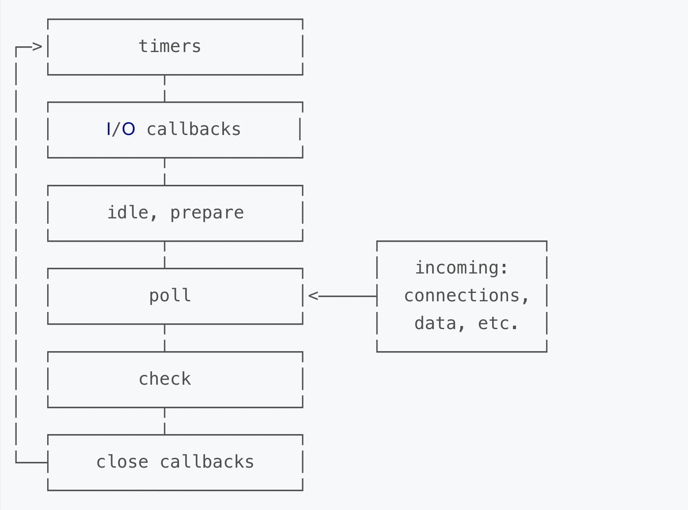

-----
## 事件循环介绍
### 浏览器中的事件循环

为了协调事件（event），用户交互（user interaction），脚本（script），渲染（rendering），网络（networking）等，用户代理（user agent）必须使用事件循环（event loops）。

>  To coordinate events, user interaction, scripts, rendering, networking, and so forth, user agents must use event loops as described in this section. Each agent has an associated event loop.

- 事件：PostMessage,  MutationObserver等
- 用户交互： click， onScroll等
- 渲染： 解析dom，css等
- 脚本：js脚本执行

### nodejs中的事件循环
事件循环允许Node.js执行非阻塞I / O操作 - 尽管JavaScript是单线程的 - 通过尽可能将操作卸载到系统内核。
由于大多数现代内核都是多线程的，因此它们可以处理在后台执行的多个操作。当其中一个操作完成时，内核会告诉Node.js，以便可以将相应的回调添加到轮询队列中以最终执行。

> The event loop is what allows Node.js to perform non-blocking I/O operations — despite the fact that JavaScript is single-threaded — by offloading operations to the system kernel whenever possible.
> Since most modern kernels are multi-threaded, they can handle multiple operations executing in the background. When one of these operations completes, the kernel tells Node.js so that the appropriate callback may be added to the poll queue to eventually be executed. We'll explain this in further detail later in this topic.

- 事件： EventEmitter
- 非阻塞I / O：网络请求，文件读写等
- 脚本：js脚本执行

## 浏览器事件循环
### Javascript为什么是单线程的？

浏览器js的作用是操作DOM，这决定了它只能是单线程，否则会带来很复杂的同步问题。比如，假定JavaScript同时有两个线程，一个线程在某个DOM节点上添加内容，另一个线程删除了这个节点，这时浏览器应该以哪个线程为准？

### 任务队列

单线程就意味着所有任务需要排队，如果因为任务cpu计算量大还好，但是I/O操作cpu是闲着的。所以js就设计成了一门异步的语言，不会做无畏的等待。任务可以分成两种，一种是同步任务（synchronous），另一种是异步任务（asynchronous）。

> （1）所有同步任务都在主线程上执行，形成一个执行栈（execution context stack）。
>
> （2）主线程之外，还存在一个"任务队列"（task queue）。只要异步任务有了运行结果，就在"任务队列"之中放置一个事件。
>
> （3）一旦"执行栈"中的所有同步任务执行完毕，系统就会读取"任务队列"，看看里面有哪些事件。那些对应的异步任务，于是结束等待状态，进入执行栈，开始执行。
>
> （4）主线程不断重复上面的第三步。

``` js
setTimeout(() => {
  console.log('setTimeout')
}, 0);

console.log('main1');
console.log('main2');
```

**主线程从"任务队列"中读取事件，这个过程是循环不断的，所以整个的这种运行机制又称为Event Loop（事件循环）。**

### 宏任务与微任务

除了广义的同步任务和异步任务，JavaScript 单线程中的任务可以细分为宏任务（macrotask）和微任务(microtask)。

- macrotask: script(整体代码), setTimeout, setInterval, setImmediate, I/O, UI rendering。

- microtask：process.nextTick, Promise, Object.observe, MutationObserver。

> 1. 宏任务进入主线程，执行过程中会收集微任务加入微任务队列。
> 2. 宏任务执行完成之后，立马执行微任务中的任务。微任务执行过程中将再次收集宏任务，并加入宏任务队列。
> 3. 反复执行1，2步骤


```js
setTimeout(() => {
  console.log('setTimeout')
}, 0);

Promise.resolve().then(() => {
  console.log('promise');
});

console.log('main');

// 1. main 2. promise 3. setTimeout
// script进入主线程, 碰到settimeout等异步丢到I/O里, 
// 碰到promise 丢到任务队列里， 当主线程执行完成之后， 再去微任务队列里面去找
// 执行微任务队列里的任务, 比如promise. 当微任务执行完成之后, 再开启一轮新的循环, 宏任务   
```

:::tip  详细步骤 
 首先有个宏任务和微任务队列, 除此之外还有个 I/O, 专门负责等待的线程  
 有3个, settimeout promise log('main')  
 首先 settimeout加到宏任务队列,  它有个回调 , 0秒后打印一个log  
 那么I/O里有了 console.log('settimeout'), 此时 settimeout出栈, 因为宏任务已经执行完了  
 promise.resolve 再次入栈, promise.resolve入栈之后, console.log('promise')加入微任务队列  
 promise.resolve 的任务完成, 出栈. 然后console.log('main')入栈, 执行完之后出栈  
 宏任务执行完之后再去微任务队列里看有没有微任务, 此时发现有个console.log('promise') 执行完之后出栈  
 此时, 工作未完成, 因为I/O中还有个 log('settimeout')没执行完, 这个是settimeout的回调函数, 属于宏任务  
 所以, 会产生一个新的宏任务队列.  
 因为, 宏任务执行完之后执行微任务, 微任务执行完又产生新的宏任务, 新的宏任务是log('settimeou')  
 它会加入到新的宏任务队列里, 此时在settimeout函数里没有其他的比如promise, 因此不会产生微任务队列  
 所以微队列是空的, console.log('settimeout')执行完出栈, 整个代码执行完毕  
 所以打印顺序如上
:::

:::info 事件循环
每执行一轮宏任务和微任务, 叫做一轮事件循环

一轮事件循环会执行一次宏任务，以及所有的微任务
这是浏览器标准定义的
:::


### 高频面试题

```js
setTimeout(() => {
  console.log('setTimeout');
}, 0);

Promise.resolve().then(() => {
  console.log('promise');
  Promise.resolve().then(() => {
    console.log('promise2');
  });
});

console.log('main');
```
>  每轮事件循环执行一个宏任务和所有的微任务。


```js
setTimeout(() => {
  Promise.resolve().then(() => {
    console.log('promise');
  });
}, 0);

Promise.resolve().then(() => {
  setTimeout(() => {
  	console.log('setTimeout');
  }, 0);
});

console.log('main');
```

:::tip  任务队列
 任务队列一定会保持先进先出的顺序执行。
:::

## nodejs事件循环

**当Node.js启动时会初始化event loop, 每一个event loop都会包含按如下六个循环阶**

:::caution 注意
nodejs事件循环和浏览器的事件循环完全不一样。
::: 

> *When Node.js starts, it initializes the event loop, processes the provided input script (or drops into the REPL, which is not covered in this document) which may make async API calls, schedule timers, or call process.nextTick(), then begins processing the event loop.*




> *注意: 图中的每个方框被称作事件循环的一个”阶段(phase)”*, 这6个阶段为一轮事件循环。  
> *而在浏览器里面, 一轮宏队列和所有微队列执行, 被称为一轮事件循环*

###  阶段概览

- **timers(定时器)** : 此阶段执行那些由 `setTimeout()` 和 `setInterval()` 调度的回调函数.  
  统称为定时器, 也就是说timers这个阶段去执行定时器的回调

- **I/O callbacks(I/O回调)** : 此阶段会执行几乎所有的回调函数, 除了 **close callbacks(关闭回调)** 和 那些由 **timers** 与 `setImmediate()`调度的回调.

  > setImmediate 是nodejs提供的一个异步调度的方法
  > setImmediate 约等于 setTimeout(cb,0)

- idle(空转), prepare : 此阶段只在内部使用

- **poll(轮询)** : 检索新的I/O事件; 在恰当的时候Node会阻塞在这个阶段

- check(检查) : `setImmediate()` 设置的回调会在此阶段被调用

- close callbacks(关闭事件的回调): 诸如 `socket.on('close', ...)` 此类的回调在此阶段被调用

在事件循环的每次运行之间, Node.js会检查它是否在等待异步I/O或定时器, 如果没有的话就会自动关闭.

> 如果event loop进入了 poll阶段，且代码未设定timer，将会发生下面情况：
>
> - 如果poll queue不为空，event loop将同步的执行queue里的callback,直至queue为空，或执行的callback到达系统上限;
> - 如果poll queue为空，将会发生下面情况：
>   - 如果代码已经被setImmediate()设定了callback, event loop将结束poll阶段进入check阶段，并执行check阶段的queue (check阶段的queue是 setImmediate设定的)
>   - 如果代码没有设定setImmediate(callback)，event loop将阻塞在该阶段等待callbacks加入poll queue,一旦到达就立即执行
>
> 如果event loop进入了 poll阶段，且代码设定了timer：
>
> - 如果poll queue进入空状态时（即poll 阶段为空闲状态），event loop将检查timers,如果有1个或多个timers时间时间已经到达，event loop将按循环顺序进入 timers 阶段，并执行timer queue.

### 代码执行1

> `path.resolve()` 方法会把一个路径或路径片段的序列解析为一个绝对路径。
>
> `fs.readFile` 异步地读取文件的全部内容。
>
> `__dirname` nodejs提供的一个全局的变量, 总是指向被执行文件夹的绝对路径

```js
var fs = require('fs');
var path = require('path');

function someAsyncOperation (callback) {
  // 花费2毫秒
  fs.readFile(path.resolve(__dirname, '/read.txt'), callback);
}

var timeoutScheduled = Date.now();
var fileReadTime = 0;

setTimeout(function () {
  var delay = Date.now() - timeoutScheduled;
  console.log('setTimeout: ' + (delay) + "ms have passed since I was scheduled");
  console.log('fileReaderTime',fileReadtime - timeoutScheduled);
}, 10);

someAsyncOperation(function () {
  fileReadtime = Date.now();
  while(Date.now() - fileReadtime < 20) {

  }
});
```

### 代码执行2

```js
var fs = require('fs');

function someAsyncOperation (callback) {
  var time = Date.now();
  // 花费9毫秒
  fs.readFile('/path/to/xxxx.pdf', callback);
}

var timeoutScheduled = Date.now();
var fileReadTime = 0;
var delay = 0;

setTimeout(function () {
  delay = Date.now() - timeoutScheduled;
}, 5);

someAsyncOperation(function () {
  fileReadtime = Date.now();
  while(Date.now() - fileReadtime < 20) {

  }
  console.log('setTimeout: ' + (delay) + "ms have passed since I was scheduled");
  console.log('fileReaderTime',fileReadtime - timeoutScheduled);
});
```

### 代码执行3

> 在nodejs中， setTimeout(demo, 0) === setTimeout(demo, 1)
>
> 在浏览器里面 setTimeout(demo, 0) === setTimeout(demo, 4)

```js
setTimeout(function timeout () {
  console.log('timeout');
},1);

setImmediate(function immediate () {
  console.log('immediate');
});
// setImmediate它有时候是1ms之前执行，有时候又是1ms之后执行？
```

> 因为event loop的启动也是需要时间的，可能执行到poll阶段已经超过了1ms，此时setTimeout会先执行。反之setImmediate先执行

```js
var path = require('path');
var fs = require('fs');

fs.readFile(path.resolve(__dirname, '/read.txt'), () => {
    setImmediate(() => {
        console.log('setImmediate');
    })
    
    setTimeout(() => {
        console.log('setTimeout')
    }, 0)
});
```


### process.nextTick

**process.nextTick()不在event loop的任何阶段执行，而是在各个阶段切换的中间执行**,即从一个阶段切换到下个阶段前执行。

```js
var fs = require('fs');

fs.readFile(__filename, () => {
  setTimeout(() => {
    console.log('setTimeout');
  }, 0);
  setImmediate(() => {
    console.log('setImmediate');
    process.nextTick(()=>{
      console.log('nextTick3');
    })
  });
  process.nextTick(()=>{
    console.log('nextTick1');
  })
  process.nextTick(()=>{
    console.log('nextTick2');
  })
});
```

#### 设计原因

允许开发者通过递归调用 `process.nextTick()` 来阻塞I/O操作。

#### nextTick应用场景

1. 在多个事件里交叉执行CPU运算密集型的任务：

```js
var http = require('http');

function compute() {
    
    process.nextTick(compute);//
}

http.createServer(function(req, res) {  // 服务http请求的时候，还能抽空进行一些计算任务
     res.writeHead(200, {'Content-Type': 'text/plain'});
     res.end('Hello World');
}).listen(5000, '127.0.0.1');

compute();
```

> 在这种模式下，我们不需要递归的调用compute()，我们只需要在事件循环中使用process.nextTick()定义compute()在下一个时间点执行即可。在这个过程中，如果有新的http请求进来，事件循环机制会先处理新的请求，然后再调用compute()。反之，如果你把compute()放在一个递归调用里，那系统就会一直阻塞在compute()里，无法处理新的http请求了。

2. 保持回调函数异步执行的原则

当你给一个函数定义一个回调函数时，你要确保这个回调是被异步执行的。下面我们看一个例子，例子中的回调违反了这一原则：

``` js
function asyncFake(data, callback) {        
    if(data === 'foo') callback(true);
    else callback(false);
}

asyncFake('bar', function(result) {
    // this callback is actually called synchronously!
});
```
为什么这样不好呢？我们来看Node.js 文档里一段代码：
```js
var client = net.connect(8124, function() { 
    console.log('client connected');
    client.write('world!\r\n');
});
```

在上面的代码里，如果因为某种原因，net.connect()变成同步执行的了，回调函数就会被立刻执行，因此回调函数写到客户端的变量就永远不会被初始化了。

这种情况下我们就可以使用process.nextTick()把上面asyncFake()改成异步执行的：

```js
function asyncReal(data, callback) {
    process.nextTick(function() {
        callback(data === 'foo');       
    });
}
```

3. 用在事件触发过程中

   > EventEmitter有2个比较核心的方法， on和emit。node自带发布/订阅模式

```js
var EventEmitter = require('events').EventEmitter;

function StreamLibrary(resourceName) { 
    this.emit('start');
}
StreamLibrary.prototype.__proto__ = EventEmitter.prototype;   // inherit from EventEmitter

```

```js
var stream = new StreamLibrary('fooResource');

stream.on('start', function() {
    console.log('Reading has started');
});

```

```js
function StreamLibrary(resourceName) {      
    var self = this;

    process.nextTick(function() {
        self.emit('start');
    });  // 保证订阅永远在发布之前

    // read from the file, and for every chunk read, do:        
    
}
```
