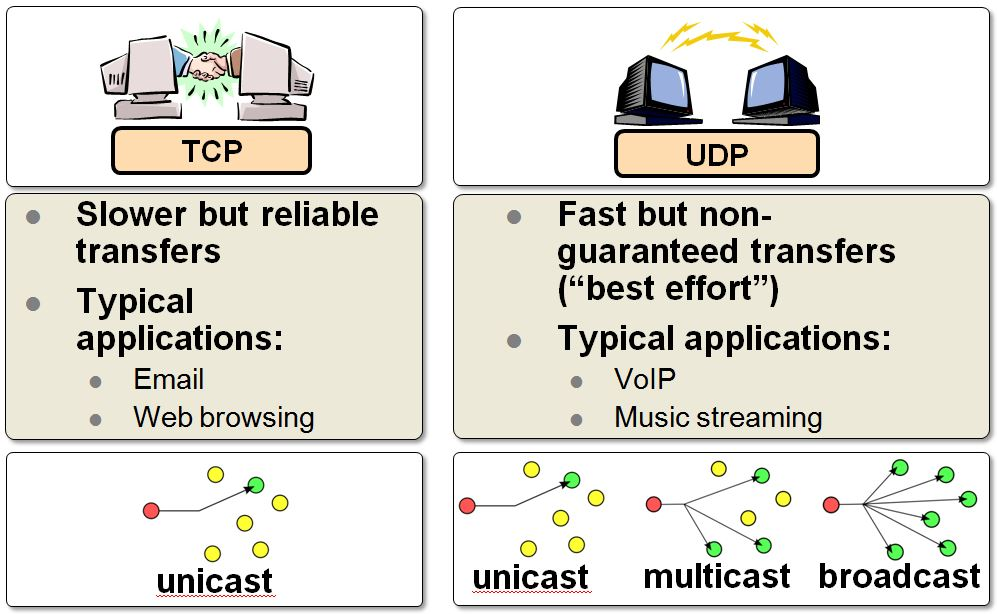
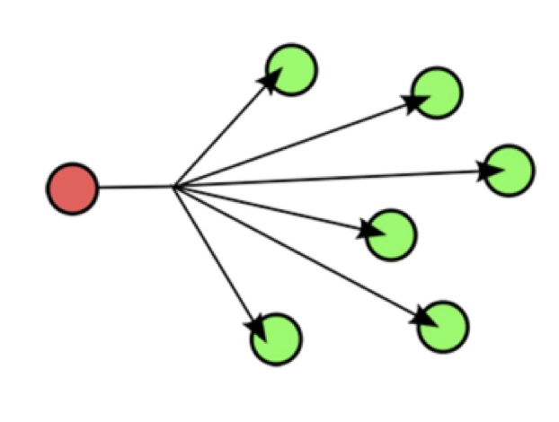
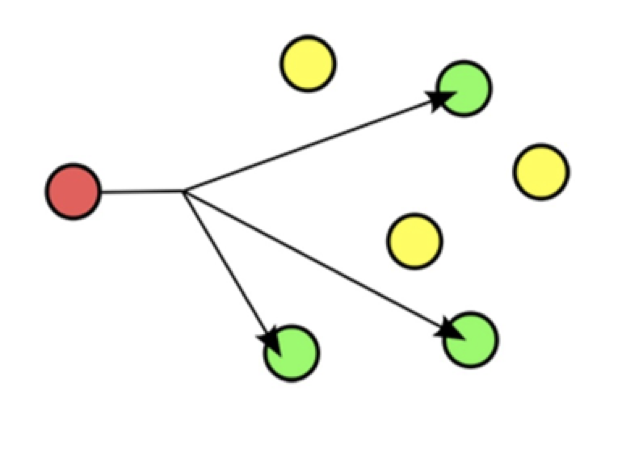
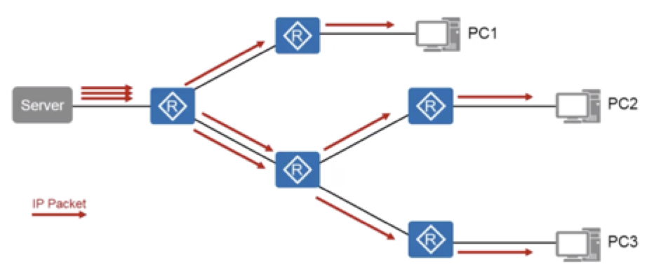
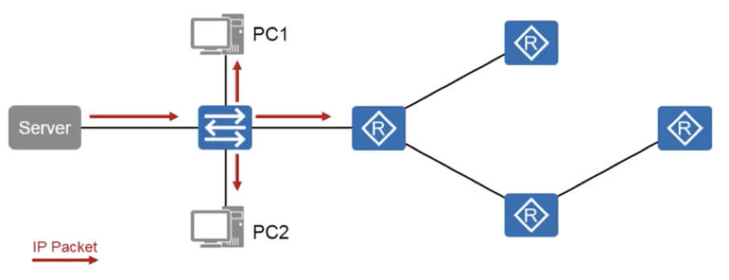

-----

Node 是一个面向网络而生的平台，它具有事件驱动、无阻塞、单线程等特性，具备良好的可伸缩性，使得它十分轻量，适合在分布式网络中扮演各种各样的角色。同时 Node 提供的 API 十分贴合网络，适合用它基础的 API 构建灵活的网络服务。本课程的内容就是给大家介绍 Node 在网络通信编程方面的具体能力。

利用 Node 可以十分方便的搭建网络服务器。在 Web 领域，大多数的编程语言需要专门的 Web 服务器作为容器，如 ASP、ASP.NET 需要 IIS 作为服务器，PHP 需要打在 Apache 或 Nginx 环境等，JSP 需要 Tomcat 服务器等。但对于 Node 而言，只需要几行代码即可构建服务器，无需额外的容器。

Node 提供了 net、dgram、http、https 这4个模块，分别用于处理 TCP、UDP、HTTP、HTTPS，适用于服务器端和客户端。


## 第1章 网络通信相关概念

我们每天使用互联网，你是否想过，它是如何实现的？

全世界几十亿台电脑，连接在一起，两两通信。上海的某一块网卡送出信号，洛杉矶的另一块网卡居然就收到了，两者实际上根本不知道对方的物理位置，你不觉得这是很神奇的事情吗？

互联网的核心是一系列协议，总称为"互联网协议"（Internet Protocol Suite）。它们对电脑如何连接和组网，做出了详尽的规定。理解了这些协议，就理解了互联网的原理。


### 网络七层模型

互联网的实现，分成好几层。每一层都有自己的功能，就像建筑物一样，每一层都靠下一层支持。

用户接触到的，只是最上面的一层，根本没有感觉到下面的层。要理解互联网，必须从最下层开始，自下而上理解每一层的功能。

如何分层有不同的模型，有的模型分七层


为了好理解，有的模型分五层


越下面的层，越靠近硬件；越上面的层，越靠近用户。


### mac 地址

ping 127.0.0.1 能ping通即代表电脑网卡没有问题，网络正常就能上网

### IP 地址

计算机在网络中的标识号码，好比每个人的电话号码。

ip地址的作用： 通过ip地址在网络中找到对应的设备，然后可以给这个设备发送数据

ip地址类型分为：ipv4、ipv6

### Port 端口号

端口号分为知名端口号和动态端口号（知名端口号是系统使用的，动态端口号是程序员设置使用的）

知名端口号：范围从 `0-1023`

动态端口范围：`1024-65535` ，当程序关闭时，同时也就释放了所占用的端口号

查看端口号：`netstat -an`

查看端口号被哪个程序占用： `lsof -i[tcp/udp]:端口号` (找不到时，使用管理员权限，加sudo)

根据进程编号杀死指定进程：`kill -9 进程号`

### 域名

方便记忆某台电脑的主机地址，域名能解析出来一个ip地址（DNS解析）

### TCP 和 UDP

> **TCP和UDP: 都是数据传输方式的协议.比如说我要给你钱, 我是以手把手的方式拿给你呢还是以快递的方式寄给你呢.**

TCP（传输控制协议）

- 需要建立连接（三次握手）,形成一条传输通道,才能传输数据
- 传输数据的大小不受限制
- 是安全可靠的协议,但是速度稍慢

UDP（用户数据报协议）

概念：英文全拼（User Datagram Protocol）简称用户数据报协议，它是无连接的、不可靠的网络传输协议

**核心特点**：无连接、资源开销小、传输速度快、UDP每个数据包最大是64K

**优点**：不需要连接，传输速度快，资源开销小

**缺点**：传输数据不可靠，容易丢失数据包，没有流量控制，当对方没有及时接收数据，发送方一直发送数据会导致缓冲区数据满了，电脑出现卡死情况，所以接收方需要及时接收数据

- 不需要建立连接, 把数据封装成数据包扔给对面
- 每个数据包大小限制在64K内
- 因为不建立连接,所以对方可能收到也可能收不到数据(丢包),因此是不安全的协议, 但是速度比较快

什么时候用 TCP，什么时候用 UDP？

- 对速度要求比较高的时候使用UDP，例如视频聊天, QQ聊天
- 对数据安全要求比较高的时候使用TCP，例如数据传输,文件下载
- 假如对于视频聊天来说,如果画质优先那就选用TCP, 如果流畅度优先那就选用UDP


### 什么是 Socket

Socket应用于两个不同客户端之间的通信及数据传输.中文名字叫套接字.
编程源于生活. 打个活生生的例子来说, 汽车和加油机.我们如果想把加油机里面的油输到汽车上, 那么汽车这边需要有一个端口, 加油机这边也要有一个端口, 两边端口各加一个套接头套着(好比adaptor),然后中间连上管道来输油. 我认为Socket的角色就是这个套接头.
简单来说, 要想在两个客户端之间传数据, 那么两个客户端各自都要有一个Socket.


----


## 第2章 构建 TCP 服务

TCP 服务在网络应用中十分常见，目前大多数的应用都是基于TCP搭建而成的。

TCP 全名为传输控制协议，在 OSI 模型（由七层模型，分别为物理层、数据链路层、网络层、传输层、会话层、表示层、应用层）中属于传输层协议。许多应用层协议基于TCP构建，典型的是HTTP、SMTP、IMAP等协议。

七层协议示意图如下：

| 层级   | 作用               |
| ------ | ------------------ |
| 应用层 | HTTP、SMTP、IMAP等 |
| 表示层 | 加密/解密等        |
| 会话层 | 通信连接/维持会话  |
| 传输层 | TCP/UDP            |
| 网络层 | IP                 |
| 链路层 | 网络特有的链路接口 |
| 物理层 | 网络物理硬件       |

TCP 是面向连接的协议，其显著的特征是在传输之前需要3次握手形成会话，如下图所示


只有会话形成之后，服务器端和客户端之间才能互相发送数据。在创建会话的过程中，服务器端和客户端分别提供一个套接字，这个两个套接字共同形成一个连接。服务器端与客户端则通过套接字实现两者之间连接通信的操作。下面是一个基于 Socket 套接字编程的网络通信模型。


## 基本示例

服务端：

```javascript
const net = require('net');
const server = net.createServer((c) => {
  // 'connection' listener
  console.log('client connected');
  c.on('end', () => {
    console.log('client disconnected');
  });
  c.write('hello\r\n');
  c.pipe(c);
});
server.on('error', (err) => {
  throw err;
});
server.listen(8124, () => {
  console.log('server bound');
});
```

客户端：

```javascript
const net = require('net');
const client = net.createConnection({ port: 8124 }, () => {
  // 'connect' listener
  console.log('connected to server!');
  client.write('world!\r\n');
});
client.on('data', (data) => {
  console.log(data.toString());
  client.end();
});
client.on('end', () => {
  console.log('disconnected from server');
});
```

## 相关 API

> 官方API文档：https://nodejs.org/dist/latest-v10.x/docs/api/net.html

### 服务端相关 API

> [Class: net.Server](https://nodejs.org/dist/latest-v10.x/docs/api/net.html#net_class_net_server)

- [new net.Server([options\][, connectionListener])](https://nodejs.org/dist/latest-v10.x/docs/api/net.html#net_new_net_server_options_connectionlistener) 创建服务器
- [Event: 'close'](https://nodejs.org/dist/latest-v10.x/docs/api/net.html#net_event_close) 当服务器关闭时，触发该事件
- [Event: 'connection'](https://nodejs.org/dist/latest-v10.x/docs/api/net.html#net_event_connection) 当有新的客户端连接进来时，触发该事件
- [Event: 'error'](https://nodejs.org/dist/latest-v10.x/docs/api/net.html#net_event_error) 当服务器发生错误时，触发该事件
- [Event: 'listening'](https://nodejs.org/dist/latest-v10.x/docs/api/net.html#net_event_listening) 当调用 server.listen() 绑定端口后触发，简洁写法为 server.listen(port, listeningListener)，通过 listen() 方法的第二个参数传入
- [server.address()](https://nodejs.org/dist/latest-v10.x/docs/api/net.html#net_server_address) 服务器创建侦听成功后，可以用来获取服务器地址相关信息，包含 `{ port: 12346, family: 'IPv4', address: '127.0.0.1' }` 信息
- [server.close([callback])](https://nodejs.org/dist/latest-v10.x/docs/api/net.html#net_server_close_callback) 当服务器关闭时触发，在调用 server.close() 后，服务器将停止接受新的套接字连接，但保持当前存在的连接，等待所有连接都断开后，会触发该事件
- [server.connections](https://nodejs.org/dist/latest-v10.x/docs/api/net.html#net_server_connections) 获取当前已建立连接的数量
  - 注意：该 API 即将废弃，推荐使用 `server.getConnections()` 替换
- [server.getConnections(callback)](https://nodejs.org/dist/latest-v10.x/docs/api/net.html#net_server_getconnections_callback) 获取当前已建立连接的数量
- [server.listen()](https://nodejs.org/dist/latest-v10.x/docs/api/net.html#net_server_listen) 绑定端口号启动服务，开始等待侦听
  - [server.listen(handle[, backlog\][, callback])](https://nodejs.org/dist/latest-v10.x/docs/api/net.html#net_server_listen_handle_backlog_callback)
  - [server.listen(options[, callback\])](https://nodejs.org/dist/latest-v10.x/docs/api/net.html#net_server_listen_options_callback)
  - [server.listen(path[, backlog\][, callback])](https://nodejs.org/dist/latest-v10.x/docs/api/net.html#net_server_listen_path_backlog_callback)
  - [server.listen([port[, host[, backlog\]]][, callback])](https://nodejs.org/dist/latest-v10.x/docs/api/net.html#net_server_listen_port_host_backlog_callback)
- [server.listening](https://nodejs.org/dist/latest-v10.x/docs/api/net.html#net_server_listening) 获取服务器的侦听状态
- [server.maxConnections](https://nodejs.org/dist/latest-v10.x/docs/api/net.html#net_server_maxconnections) 在服务器连接数较高的时候，可以通过设置该属性用于拒绝超过最大数的连接
- [server.ref()](https://nodejs.org/dist/latest-v10.x/docs/api/net.html#net_server_ref) 恢复服务器侦听
- [server.unref()](https://nodejs.org/dist/latest-v10.x/docs/api/net.html#net_server_unref) 暂停服务器侦听，可以使用 `server.ref()` 恢复服务器侦听


### 套接字 Socket 相关 API

> [Class: net.Socket](https://nodejs.org/dist/latest-v10.x/docs/api/net.html#net_class_net_socket)

- [new net.Socket([options])](https://nodejs.org/dist/latest-v10.x/docs/api/net.html#net_new_net_socket_options) 创建 Socket 连接
- [Event: 'close'](https://nodejs.org/dist/latest-v10.x/docs/api/net.html#net_event_close_1) 当套接字完全关闭时，触发该事件
- [Event: 'connect'](https://nodejs.org/dist/latest-v10.x/docs/api/net.html#net_event_connect) 该事件用于客户端，当套接字与服务端连接成功时会被触发
- [Event: 'data'](https://nodejs.org/dist/latest-v10.x/docs/api/net.html#net_event_data) 当一端调用 `write()` 发送数据时，另一端会触发 `data` 事件，事件传递的数据即是 `write()` 发送的数据
- [Event: 'drain'](https://nodejs.org/dist/latest-v10.x/docs/api/net.html#net_event_drain) 当任意一端调用 write() 发送数据时，当前这端会触发该事件
- [Event: 'end'](https://nodejs.org/dist/latest-v10.x/docs/api/net.html#net_event_end) 当连接中的任意一端发送了 FIN 数据时，将会触发该事件
- [Event: 'error'](https://nodejs.org/dist/latest-v10.x/docs/api/net.html#net_event_error_1) 当异常发生时，触发该事件
- [Event: 'timeout'](https://nodejs.org/dist/latest-v10.x/docs/api/net.html#net_event_timeout)  当一定时间后连接不再活跃时，该事件将会被触发，通知用户当前连接已经被闲置了
- [socket.address()](https://nodejs.org/dist/latest-v10.x/docs/api/net.html#net_socket_address) 获取套接字的连接信息，例如 `{ port: 12346, family: 'IPv4', address: '127.0.0.1' }`
- [socket.localAddress](https://nodejs.org/dist/latest-v10.x/docs/api/net.html#net_socket_localaddress) 获取当前套接字地址
- [socket.localPort](https://nodejs.org/dist/latest-v10.x/docs/api/net.html#net_socket_localport) 获取当前套接字端口号
- [socket.remoteAddress](https://nodejs.org/dist/latest-v10.x/docs/api/net.html#net_socket_remoteaddress) 获取另一端套接字地址
- [socket.remoteFamily](https://nodejs.org/dist/latest-v10.x/docs/api/net.html#net_socket_remotefamily) 获取另一端套接字IP协议版本
- [socket.remotePort](https://nodejs.org/dist/latest-v10.x/docs/api/net.html#net_socket_remoteport) 获取另一端套接字连接端口号
- [socket.setEncoding([encoding])](https://nodejs.org/dist/latest-v10.x/docs/api/net.html#net_socket_setencoding_encoding) 设置获取数据解析的编码格式，默认不处理
- [socket.write(data[, encoding][, callback])](https://nodejs.org/dist/latest-v10.x/docs/api/net.html#net_socket_write_data_encoding_callback) 通过套接字发送数据


### 其它 API

- [net.connect()](https://nodejs.org/dist/latest-v10.x/docs/api/net.html#net_net_connect) 创建 Socket 客户端连接，和 `net.createConnection()` 作用相等
  - [net.connect(options[, connectListener])](https://nodejs.org/dist/latest-v10.x/docs/api/net.html#net_net_connect_options_connectlistener)
  - [net.connect(port[, host\][, connectListener])](https://nodejs.org/dist/latest-v10.x/docs/api/net.html#net_net_connect_port_host_connectlistener)
- [net.createConnection()](https://nodejs.org/dist/latest-v10.x/docs/api/net.html#net_net_createconnection) 创建 Socket 客户端连接
  - [net.createConnection(options[, connectListener])](https://nodejs.org/dist/latest-v10.x/docs/api/net.html#net_net_createconnection_options_connectlistener)
  - [net.createConnection(path[, connectListener])](https://nodejs.org/dist/latest-v10.x/docs/api/net.html#net_net_createconnection_path_connectlistener)
  - [net.createConnection(port[, host\][, connectListener])](https://nodejs.org/dist/latest-v10.x/docs/api/net.html#net_net_createconnection_port_host_connectlistener)
- [net.createServer([options\][, connectionListener])](https://nodejs.org/dist/latest-v10.x/docs/api/net.html#net_net_createserver_options_connectionlistener) 创建Socket服务端，等价于 `new net.Server()`
- [net.isIP(input)](https://nodejs.org/dist/latest-v10.x/docs/api/net.html#net_net_isip_input) 判断是否是IP地址
- [net.isIPv4(input)](https://nodejs.org/dist/latest-v10.x/docs/api/net.html#net_net_isipv4_input) 判断是否是符合 IPv4协议的地址
- [net.isIPv6(input)](https://nodejs.org/dist/latest-v10.x/docs/api/net.html#net_net_isipv6_input) 判断是否是符合 IPv6 协议的地址


## 案例：聊天室

### 初始化

### 核心需求

- 用户第一次进来，提示用户输入昵称进行注册
  - 昵称不允许重复

- 广播消息（群发）
- 用户昵称
- 点对点消息（私聊）


### 数据格式设计（语言协议）

- 什么是数据格式
  - 数据格式（data format）是描述数据保存在文件或记录中的规则。可以是字符形式的文本格式，或二进制数据形式的压缩格式
- 为什么要进行数据格式设计
- 比较常见的数据传输格式
  - **JSON**
  - XML
  - YAML
  - ...


> **用户登录**

客户端：

```json
{
  "type": "login",
  "nickname": "xxx"
}
```

服务端：

```json
{
  "type": "login",
  "success": true | false,
  "message": "登录成功|失败",
  "sumUsers": 10
}
```


> **广播消息**

客户端：

```json
{
  "type": "broadcast",
  "message": "xxx"
}
```

服务端：

```json
{
  "type": "broadcast",
  "nickname": "xxx",
  "message": "xxx"
}
```


> **点对点消息**

客户端：

```json
{
  "type": "p2p",
  "to": "xxx",
  "message": "xxx"
}
```

服务端：

```json
{
  "type": "p2p",
  "from": "xxx",
  "to": "xxx",
  "message": "xxx"
}
```


> 上线|离线通知日志

服务端：

```json
{
  "type": "log",
  "message": "xxx 进入|离开了聊天室，当前在线人数：xx"
}
```


### 用户登录

- 客户端输入昵称发送到服务端
- 服务端接收数据，校验昵称是否重复
  - 如果已重复，则发送通知告诉客户端
  - 如果可以使用，则将用户昵称及通信 Socket 存储到容器中用于后续使用


### 群发消息

- 客户端输入消息发送到服务端
- 服务端将消息发送给所有当前连接（也就是存储客户端Socket的容器）的客户端
- 客户端收到消息，将消息输出到终端

### 私聊

- 客户端输入消息发送到服务端
- 服务端根据消息内容从容器中找到对应的通信客户端，然后将消息发送给该客户端
- 对应的客户端收到消息，将消息输入到终端

### 上线|离线通知

- 上线通知
- 离线通知

## 总结

- TCP 必须建立连接（三次握手建立连接）才能通信


- TCP 只是负责数据的传输，不关心传输的数据格式问题

```json
{
  "type": "xxx"
}
```


- 如果需要使用 TCP 通信完成某种功能，则需要制定数据格式协议，或者使用第三方协议
- Socket 就是与之通信的另一端，通过 Socket 接收或是发送数据
- Socket 通信模型


## 第3章 构建 UDP 服务

内容安排：

- UDP 介绍
- Node 中的核心模块 dgram
- 使用 Node 实现 UDP 单播
- 使用 Node 实现 UDP 广播
- 使用 Node 实现 UDP 组播


### UDP 简介

- User Datagram Protocol，简称 UDP ，又称用户数据报协议

- 和 TCP 一样，位于网络传输层用于处理数据包

- UDP 最大的特点是**无连接**

- UDP 传输**速度快**

- UDP 数据传输**不可靠**
  - 不提供数据包分组、组装和不能对数据包进行排序的缺点，也就是说，当报文发送之后，是无法得知其是否安全完整到达的
  - 可靠性由应用层负责

- 支持一对一通信，也支持一对多通信

- 许多关键的互联网应用程序使用 UDP
  - 如 DNS 域名系统服务、TFTP 简单文件传输协议、DHCP 动态主机设置协议 等
- UDP 适用于对速度要求比较高，对数据质量要求不严谨的应用
  - 例如流媒体、实时多人游戏、实时音视频


### TCP 和 UDP




> **TCP和UDP: 都是数据传输方式的协议.比如说我要给你钱, 我是以手把手的方式拿给你呢还是以快递的方式寄给你呢.**


|          | UDP                        | TCP                    |
| -------- | -------------------------- | ---------------------- |
| 连接     | 无连接                     | 面向连接               |
| 速度     | 无需建立连接，速度较快     | 需要建立连接，速度较慢 |
| 目的主机 | 一对一，一对多             | 仅能一对一             |
| 带宽     | UDP 报头较短，消耗带宽更少 | 消耗更多的带宽         |
| 消息边界 | 有                         | 无                     |
| 可靠性   | 低                         | 高                     |
| 顺序     | 无序                       | 有序                   |


> 注：事实上，UDP协议的这种乱序性基本上很少出现，通常只会在网络非常拥挤的情况下才有可能发生。


什么时候用 TCP，什么时候用 UDP？

- 对速度要求比较高的时候使用UDP，例如视频聊天, QQ聊天
- 对数据安全要求比较高的时候使用TCP，例如数据传输,文件下载
- 假如对于视频聊天来说,如果画质优先那就选用TCP, 如果流畅度优先那就选用UDP


### UDP 的三种传播方式

1、UDP 单播


- 单播是目的地址为单一目标的一种传播方式
- 地址范围：`0.0.0.0 ~ 223.255.255.255`


2、UDP 广播



- 目的地址为网络中的所有设备

- 地址范围分为两种
  - 受限广播：它不被路由转发，IP 地址的网络字段和主机字段全为1就是地址 `255.255.255.255`
  - 直接广播：会被路由转发，IP地址的网络字段定义这个网络，主机字段通常全为1，如 `192.168.10.255`


3、UDP 组播



- 多播（Multicast）也叫组播，把信息传递给一组目的地地址

- 地址范围：`224.0.0.0 ~ 239.255.255.255`

- `224.0.0.0 ~ 224.0.0.255` 为永久组地址，`224.0.0.0.0` 保留不分配，其它供路由协议使用

- `224.0.1.0 ~ 224.0.1.255` 为公用组播地址，可以用于 Internet

- `224.0.2.0 ~ 238.255.255.255` 为用户可用的组播地址（临时组），全网范围有效，使用需要申请

- `239.0.0.0 ~ 239.255.255.255` 为本地管理组播地址，仅在特定本地范围有效

### UDP 一对多通信场景

单播传输（Unicast）：在发送者和每一接收者之间实现[点对点](https://baike.baidu.com/item/%E7%82%B9%E5%AF%B9%E7%82%B9)网络连接。如果一台发送者同时给多个的接收者传输相同的数据，也必须相应的复制多份的相同[数据包](https://baike.baidu.com/item/%E6%95%B0%E6%8D%AE%E5%8C%85)。如果有大量[主机](https://baike.baidu.com/item/%E4%B8%BB%E6%9C%BA)希望获得[数据包](https://baike.baidu.com/item/%E6%95%B0%E6%8D%AE%E5%8C%85)的同一份拷贝时，将导致发送者负担沉重、延迟长、[网络拥塞](https://baike.baidu.com/item/%E7%BD%91%E7%BB%9C%E6%8B%A5%E5%A1%9E)；为保证一定的服务质量需增加[硬件](https://baike.baidu.com/item/%E7%A1%AC%E4%BB%B6)和[带宽](https://baike.baidu.com/item/%E5%B8%A6%E5%AE%BD)。

广播（Broadcast）：是指在IP[子网](https://baike.baidu.com/item/%E5%AD%90%E7%BD%91)内[广播数据包](https://baike.baidu.com/item/%E5%B9%BF%E6%92%AD%E6%95%B0%E6%8D%AE%E5%8C%85)，所有在[子网](https://baike.baidu.com/item/%E5%AD%90%E7%BD%91)内部的[主机](https://baike.baidu.com/item/%E4%B8%BB%E6%9C%BA)都将收到这些数据包。广播意味着网络向子网每一个[主机](https://baike.baidu.com/item/%E4%B8%BB%E6%9C%BA)都投递一份数据包，不论这些主机是否乐于接收该数据包。所以广播的使用范围非常小，只在本地[子网](https://baike.baidu.com/item/%E5%AD%90%E7%BD%91)内有效，通过[路由器](https://baike.baidu.com/item/%E8%B7%AF%E7%94%B1%E5%99%A8)和[网络设备](https://baike.baidu.com/item/%E7%BD%91%E7%BB%9C%E8%AE%BE%E5%A4%87)控制广播传输。在网络中的应用较多，如客户机通过DHCP自动获得IP地址的过程就是通过广播来实现的。但是与单播和多播相比，广播几乎占用了子网内网络的所有带宽

组播：[组播](https://baike.baidu.com/item/%E7%BB%84%E6%92%AD)解决了[单播](https://baike.baidu.com/item/%E5%8D%95%E6%92%AD)和广播方式效率低的问题。当网络中的某些用户需求特定信息时，[组播](https://baike.baidu.com/item/%E7%BB%84%E6%92%AD)源（即组播信息发送者）仅发送一次信息，组播[路由器](https://baike.baidu.com/item/%E8%B7%AF%E7%94%B1%E5%99%A8)借助组播[路由协议](https://baike.baidu.com/item/%E8%B7%AF%E7%94%B1%E5%8D%8F%E8%AE%AE)为组播[数据包](https://baike.baidu.com/item/%E6%95%B0%E6%8D%AE%E5%8C%85)建立树型路由，被传递的信息在尽可能远的分叉路口才开始复制和分发。网上视频会议、网上视频点播特别适合采用多播方式。

1、单播面对 "一对多"



- 在单播通信中每一个数据包都有确切的目的IP地址

- 对于同一份数据，如果存在多个接收者，Server 需发送与接收者数目相同的单播数据包

- 当接收者成百上千时，将极大的加重 Server 的负担


2、广播面对 "一对多"



- 广播数据包被限制在局域网中

- 一旦有设备发送广播数据则广播域内所有设备都收到这个数据包，并且不得不消耗资源去处理，大量的广播数据包将消耗网络的带宽及设备资源

- 在 IPv6 中，广播的报文传输方式被取消


3、组播面对 "一对多"


- 组播非常适合一对多的模型，只有加入到特定组播组的成员，才会接收到组播数据。当存在多个组播组成员时，源无需发送多个数据拷贝，仅需发送一份即可，组播网络设备会根据实际需要转发或拷贝组播数据

- 数据流只发送给加入该组播组的接收者（组成员），而不需要该数据的设备不会收到该组播流量

- 相同的组播报文，在一段链路上仅有一份数据，大大提高了网络资源的利用率

## Node 中的 dgram 模块

Node 为我们提供了 [dgram](<https://nodejs.org/dist/latest-v10.x/docs/api/dgram.html>) 模块用于构建 UDP 服务。

使用该模块创建 UDP 套接字非常简单，UDP 套接字一旦创建，既可以作为客户端发送数据，也可以作为服务器接收数据。

```javascript
const dgram = require('dgram')
const socket = dgram.createSocket('udp4')
```


### Socket 方法

| API               | 说明                   |
| ----------------- | ---------------------- |
| bind()            | 绑定端口和主机         |
| address()         | 返回 Socket 地址对象   |
| close()           | 关闭 Socket 并停止监听 |
| send()            | 发送消息               |
| addMembership()   | 添加组播成员           |
| dropMembership()  | 删除组播成员           |
| setBroadcast()    | 设置是否启动广播       |
| setTTL()          | 设置数据报生存时间     |
| setMulticastTTL() | 设置组播数据报生存时间 |


### Socket 事件

| API       | 说明                       |
| --------- | -------------------------- |
| listening | 监听成功时触发，仅触发一次 |
| message   | 收到消息时触发             |
| error     | 发生错误时触发             |
| close     | 关闭 Socket 时触发         |


## 使用 Node 实现 UDP 单播

### 服务端

```js
const dgram = require('dgram')

const server = dgram.createSocket('udp4')

server.on('listening', () => {
  const address = server.address()
  console.log(`server running ${address.address}:${address.port}`)
})

server.on('message', (msg, remoteInfo) => {
  console.log(`server got ${msg} from ${remoteInfo.address}:${remoteInfo.port}`)
  server.send('world', remoteInfo.port, remoteInfo.address)
})

server.on('error', err => {
  console.log('server error', err)
})

server.bind(3000)

```


### 客户端

```js
const dgram = require('dgram')

const client = dgram.createSocket('udp4')

// client.send('hello', 3000, 'localhost')

client.on('listening', () => {
  const address = client.address()
  console.log(`client running ${address.address}:${address.port}`)

  client.send('hello', 3000, 'localhost')
})

client.on('message', (msg, remoteInfo) => {
  console.log(`client got ${msg} from ${remoteInfo.address}:${remoteInfo.port}`)
})

client.on('error', err => {
  console.log('client error', err)
})

client.bind(8000)

```


## 使用 Node 实现 UDP 广播

### 服务端

```js
const dgram = require('dgram')

const server = dgram.createSocket('udp4')

server.on('listening', () => {
  const address = server.address()
  
  console.log(`server running ${address.address}:${address.port}`)
  
  server.setBroadcast(true) // 开启广播模式
  
  server.send('hello', 8000, '255.255.255.255')

  // 每隔2秒发送一条广播消息
  setInterval(function () {
    // 直接地址 192.168.10.255
    // 受限地址 255.255.255.255
    server.send('hello', 8000, '192.168.10.255')
    // server.send('hello', 8000, '255.255.255.255')
  }, 2000)
})

server.on('message', (msg, remoteInfo) => {
  console.log(`server got ${msg} from ${remoteInfo.address}:${remoteInfo.port}`)
  server.send('world', remoteInfo.port, remoteInfo.address)
})

server.on('error', err => {
  console.log('server error', err)
})

server.bind(3000)

```

### 客户端

```js
const dgram = require('dgram')

const client = dgram.createSocket('udp4')

client.on('message', (msg, remoteInfo) => {
  console.log(`client got ${msg} from ${remoteInfo.address}:${remoteInfo.port}`)
})

client.on('error', err => {
  console.log('client error', err)
})

client.bind(8000)

```


## 使用 Node 实现 UDP 组播

### 服务端

```js
const dgram = require('dgram')

const server = dgram.createSocket('udp4')

server.on('listening', () => {
  const address = server.address()
  setInterval(function () {
    server.send('hello', 8000, '224.0.1.100')
  }, 2000)
})

server.on('message', (msg, remoteInfo) => {
  console.log(`server got ${msg} from ${remoteInfo.address}:${remoteInfo.port}`)
  server.send('world', remoteInfo.port, remoteInfo.address)
})

server.on('error', err => {
  console.log('server error', err)
})

server.bind(3000)

```


### 客户端

```js
const dgram = require('dgram')

const client = dgram.createSocket('udp4')

client.on('listening', () => {
  const address = client.address()
  console.log(`client running ${address.address}:${address.port}`)

  client.addMembership('224.0.1.100')
})

client.on('message', (msg, remoteInfo) => {
  console.log(`client got ${msg} from ${remoteInfo.address}:${remoteInfo.port}`)
})

client.on('error', err => {
  console.log('client error', err)
})

client.bind(8000)

```


# 第4章 构建 HTTP 服务


内容安排：

- Node 中的 http 模块
- 使用 Node 构建 http 服务
- 实现一个静态文件服务器
- 使用模板引擎处理动态网页
- 结合数据库渲染动态页面
- 实现一个留言本案例
- 第三方 HTTP 服务框架


## Node 中的 http 模块

TCP 和 UDP 都属于网络传输层协议，如果要构建高效的网络应用，就应该从传输层进行着手。但是对于经典的浏览器网页和服务端通信场景，如果单纯的使用更底层的传输层协议则会变得麻烦。

所以对于经典的B（Browser）S（Server）通信，基于传输层之上专门制定了更上一层的通信协议：HTTP，用于浏览器和服务端进行通信。由于 HTTP 协议本身并不考虑数据如何传输及其他细节问题，所以属于应用层协议。

Node 提供了基本的 http 和 https 模块用于 HTTP 和 HTTPS 的封装。


```js
const http = require('http')
const server = http.createServer()

```


### Server 实例

| API              | 说明               |
| ---------------- | ------------------ |
| Event：'close'   | 服务关闭时触发     |
| Event：'request' | 收到请求消息时触发 |
| server.close()   | 关闭服务           |
| server.listening | 获取服务状态       |


### 请求对象

| API                 | 说明             |
| ------------------- | ---------------- |
| request.method      | 请求方法         |
| request.url         | 请求路径         |
| request.headers     | 请求头           |
| request.httpVersion | 请求HTTP协议版本 |


### 响应对象

| API                                | 说明             |
| ---------------------------------- | ---------------- |
| response.end()                     | 结束响应         |
| response.setHeader(name, value)    | 设置响应头       |
| response.removeHeader(name, value) | 删除响应头       |
| response.statusCode                | 设置响应状态码   |
| response.statusMessage             | 设置响应状态短语 |
| response.write()                   | 写入响应数据     |
| response.writeHead()               | 写入响应头       |


## 使用 Node 构建 http 服务

### Hello World

```js
const http = require('http')

const hostname = '127.0.0.1'
const port = 3000

const server = http.createServer((req, res) => {
  res.statusCode = 200
  res.setHeader('Content-Type', 'text/plain')
  res.end('Hello World\n')
})

server.listen(port, hostname, () => {
  console.log(`Server running at http://${hostname}:${port}/`)
})
```


### 根据不同 url 处理不同请求

```js
const http = require('http')

const hostname = '127.0.0.1'
const port = 3000

const server = http.createServer((req, res) => {
  const url = req.url
  if (url === '/') {
    res.end('Hello World!')
  } else if (url === '/a') {
    res.end('Hello a!')
  } else if (url === '/b') {
    res.end('Hello b!')
  } else {
    res.statusCode = 404
    res.end('404 Not Found.')
  }
})

server.listen(port, hostname, () => {
  console.log(`Server running at http://${hostname}:${port}/`)
})

```


### 响应 HTML 内容

```js
const http = require('http')
const fs = require('fs')

const hostname = '127.0.0.1'
const port = 3000

const server = http.createServer((req, res) => {
  fs.readFile('./index.html', (err, data) => {
    if (err) {
      throw err
    }
    res.statusCode = 200
    res.setHeader('Content-Type', 'text/html; charset=utf-8')
    res.end(data)
  })

//   res.end(`
// <h1>Hello World!</h1>
// <p>你好，世界！</p>
//   `)
})

server.listen(port, hostname, () => {
  console.log(`Server running at http://${hostname}:${port}/`)
})

```


### 处理页面中的静态资源

```js
const http = require('http')
const fs = require('fs')

const hostname = '127.0.0.1'
const port = 3000

const server = http.createServer((req, res) => {
  const url = req.url
  if (url === '/') {
    fs.readFile('./index.html', (err, data) => {
      if (err) {
        throw err
      }
      res.statusCode = 200
      res.setHeader('Content-Type', 'text/html; charset=utf-8')
      res.end(data)
    })
  } else if (url === '/assets/css/main.css') {
    fs.readFile('./assets/css/main.css', (err, data) => {
      if (err) {
        throw err
      }
      res.statusCode = 200
      res.setHeader('Content-Type', 'text/css; charset=utf-8')
      res.end(data)
    })
  } else if (url === '/assets/js/main.js') {
    fs.readFile('./assets/js/main.js', (err, data) => {
      if (err) {
        throw err
      }
      res.statusCode = 200
      res.setHeader('Content-Type', 'text/javascript; charset=utf-8')
      res.end(data)
    })
  } else {
    res.statusCode = 404
    res.setHeader('Content-Type', 'text/plain; charset=utf-8')
    res.end('404 Not Found.')
  }
})

server.listen(port, hostname, () => {
  console.log(`Server running at http://${hostname}:${port}/`)
})

```


### 统一处理页面中的静态资源

```js
const http = require('http')
const fs = require('fs')
const mime = require('mime')
const path = require('path')

const hostname = '127.0.0.1'
const port = 3000

const server = http.createServer((req, res) => {
  const url = req.url
  if (url === '/') {
    fs.readFile('./index.html', (err, data) => {
      if (err) {
        throw err
      }
      res.statusCode = 200
      res.setHeader('Content-Type', 'text/html; charset=utf-8')
      res.end(data)
    })
  } else if (url.startsWith('/assets/')) {
    // /assets/js/main.js
    fs.readFile(`.${url}`, (err, data) => {
      if (err) {
        res.statusCode = 404
        res.setHeader('Content-Type', 'text/plain; charset=utf-8')
        res.end('404 Not Found.')
      }
      const contentType = mime.getType(path.extname(url))
      res.statusCode = 200
      res.setHeader('Content-Type', contentType)
      res.end(data)
    })
  } else {
    res.statusCode = 404
    res.setHeader('Content-Type', 'text/plain; charset=utf-8')
    res.end('404 Not Found.')
  }
})

server.listen(port, hostname, () => {
  console.log(`Server running at http://${hostname}:${port}/`)
})

```


## 使用模板引擎处理动态页面

假如我们有一份数据 `todos` 需要展示到页面中

```js
const todos = [
  { title: '吃饭', completed: false },
  { title: '睡觉', completed: true },
  { title: '打豆豆', completed: false }  
]

```


如何将一组数据列表展示到一个页面中，最简单的方式就是字符串替换，但是如果有不止一份数据需要展示到页面中的时候就会变得非常麻烦，所以前人将此种方式整合规则之后开发了我们常见的模板引擎。

例如我们经常在网页源码中看到下面这样一段代码

```ejs
<ul>
  <% todos.forEach(function (item) { %>
  <li><%= item.title %></li>
  <% }) %>
</ul>
```

或者是

```ejs
<ul>
  {{ each todos }}
  <li>{{ $value.title }}</li>
  {{ /each }}
</ul>
```

无论如何，我们看到的这些语法都在模板引擎所指定的一些规则，目的就是让我们可以非常方便的在网页中进行字符串替换以达到动态网页的效果。


在 Node 中，有很多优秀的模板引擎，它们大抵相同，但都各有特点

- [marko](https://github.com/marko-js/marko)
- [nunjucks](https://github.com/mozilla/nunjucks)
- [handlebars.js](https://github.com/wycats/handlebars.js)
- [EJS](https://github.com/mde/ejs)
- [Pug](https://github.com/pugjs/pug)
- [art-template](<https://github.com/aui/art-template>)


### 基本使用

```js
const template = require('art-template')

// const ret = template.render('Hello {{ message }}', {
//   message: 'World'
// })

const ret = template.render(`
<!DOCTYPE html>
<html lang="en">
<head>
<meta charset="UTF-8" />
<title>Document</title>
</head>
<body>
  <h1>Hello {{ message }}</h1>
  <ul>
    {{ each todos }}
    <li>{{ $value.title }} <input type="checkbox" {{ $value.completed ? 'checked' : '' }} /></li>
    {{ /each }}
  </ul>
</body>
</html>
`, {
  message: 'World',
  todos: [
    { title: '吃饭', completed: false },
    { title: '睡觉', completed: true },
    { title: '打豆豆', completed: false }
  ]
})

console.log(ret)

```


### 结合 http 服务渲染页面

```js
const http = require('http')
const template = require('art-template')
const fs = require('fs')

const hostname = '127.0.0.1'
const port = 3000

const server = http.createServer((req, res) => {
  const url = req.url
  if (url === '/') {
    fs.readFile('./index2.html', (err, data) => {
      if (err) {
        throw err
      }
      const htmlStr = template.render(data.toString(), {
        message: '黑马程序员',
        todos: [
          { title: '吃饭', completed: true },
          { title: '睡觉', completed: true },
          { title: '打豆豆', completed: false }
        ]
      })
      res.statusCode = 200
      res.setHeader('Content-Type', 'text/html')
      res.end(htmlStr)
    })
  }
})

server.listen(port, hostname, () => {
  console.log(`Server running at http://${hostname}:${port}/`)
})

```


## 实现一个静态文件服务器

## 使用数据库中的数据

## 实现一个留言本案例

## 第三方 HTTP 服务框架

- [Express](http://expressjs.com/)
- [Koa](http://koajs.com/)
- [ThinkJS](https://github.com/thinkjs/thinkjs)
- [Egg](https://eggjs.org/)
- [AdonisJs](http://adonisjs.com/)
- ...

> 更多优秀的第三方资源 [awesome node.js](<https://github.com/sindresorhus/awesome-nodejs#web-frameworks>)


# 第5章 构建 HTTPS 服务

## 占位

# 第6章 构建 WebSocket 服务

- 本章内容
  - 客户端 WebSocket
  - 服务端 WebSocket
  - Socket.IO
- 学习目标
  - 了解什么是 WebSocket
  - 掌握客户端 WebSocket 的基本使用
  - 掌握服务端 WebSocket 的基本使用
  - 掌握 SOCKET.IO 的基本使用

### WebSocket 介绍

类似于 HTTP， [WebSocket](http://websocket.org/) 是一种网络通信协议。


#### 为什么需要 WebSocket

我们已经有了 HTTP 协议，为什么还需要另一个协议？它能带来什么好处？

答案很简单，因为 HTTP 协议有一个缺陷：通信只能由客户端发起，没有请求就没有响应。


举例来说，我们想了解今天的天气，只能是客户端向服务器发出请求，服务器返回查询结果。HTTP 协议做不到服务器主动向客户端推送信息。

这种单向请求的特点，注定了如果服务器有连续的状态变化，客户端要获知就非常麻烦。我们只能使用["轮询"](https://www.pubnub.com/blog/2014-12-01-http-long-polling/)：每隔一段时候，就发出一个询问，了解服务器有没有新的信息。最典型的场景就是聊天室。

轮询的效率低，非常浪费资源（因为必须不停连接，或者 HTTP 连接始终打开）。因此，工程师们一直在思考，有没有更好的方法。WebSocket 就是这样发明的。

#### 什么是 WebSocket

WebSocket 协议在2008年诞生，2011年成为国际标准。所有浏览器都已经支持了。

它的最大特点就是，服务器可以主动向客户端推送信息，客户端也可以主动向服务器发送信息，是真正的双向平等对话，属于[服务器推送技术](https://en.wikipedia.org/wiki/Push_technology)的一种。


其他特点包括：

1. 建立在 TCP 协议之上，服务器端的实现比较容易。

2. 与 HTTP 协议有着良好的兼容性。默认端口也是80和443，并且握手阶段采用 HTTP 协议，因此握手时不容易屏蔽，能通过各种 HTTP 代理服务器。

3. 数据格式比较轻量，性能开销小，通信高效。

4. 可以发送文本，也可以发送二进制数据。

5. 没有同源限制，客户端可以与任意服务器通信。

6. 协议标识符是`ws`（如果加密，则为`wss`），服务器网址就是 URL。

```
ws://example.com:80/some/path
```


### 客户端 WebSocket

#### 基本示例

在浏览器中提供了 `WebSocket` 对象用于创建和管理 [WebSocket](https://developer.mozilla.org/zh-CN/docs/Web/API/WebSockets_API) 连接，以及可以通过该连接发送和接收数据的 API。

下面是一个简单示例

```javascript
var ws = new WebSocket("wss://echo.websocket.org");

ws.onopen = function(evt) { 
  console.log("Connection open ..."); 
  ws.send("Hello WebSockets!");
};

ws.onmessage = function(evt) {
  console.log( "Received Message: " + evt.data);
  ws.close();
};

ws.onclose = function(evt) {
  console.log("Connection closed.");
};
```

#### 常用 API

##### WebSocket 构造函数

WebSocket 对象作为一个构造函数，用于新建 WebSocket 实例。

```javascript
var ws = new WebSocket('ws://localhost:8080');
```

执行上面语句之后，客户端就会与服务器进行连接。

##### 事件： onopen

实例对象的`onopen`属性，用于指定连接成功后的回调函数。

```javascript
ws.onopen = function () {
  
  // 发送消息一定要在建立连接成功以后
  ws.send('Hello Server!');
}

```

如果要指定多个回调函数，可以使用`addEventListener`方法。

```javascript
ws.addEventListener('open', function (event) {
  ws.send('Hello Server!');
});

```

##### 事件： onclose

实例对象的`onclose`属性，用于指定连接关闭后的回调函数。

```javascript
ws.onclose = function(event) {
  var code = event.code;
  var reason = event.reason;
  var wasClean = event.wasClean;
  // handle close event
};

ws.addEventListener("close", function(event) {
  var code = event.code;
  var reason = event.reason;
  var wasClean = event.wasClean;
  // handle close event
});
```

##### 事件： onmessage

实例对象的`onmessage`属性，用于指定收到服务器数据后的回调函数。

```javascript
ws.onmessage = function(event) {
  var data = event.data;
  // 处理数据
};

ws.addEventListener("message", function(event) {
  var data = event.data;
  // 处理数据
});
```

注意，服务器数据可能是文本，也可能是二进制数据（`blob`对象或`Arraybuffer`对象）。

```javascript
ws.onmessage = function(event){
  if(typeof event.data === String) {
    console.log("Received data string");
  }

  if(event.data instanceof ArrayBuffer){
    var buffer = event.data;
    console.log("Received arraybuffer");
  }
}
```

除了动态判断收到的数据类型，也可以使用`binaryType`属性，显式指定收到的二进制数据类型。

```javascript
// 收到的是 blob 数据
ws.binaryType = "blob";
ws.onmessage = function(e) {
  console.log(e.data.size);
};

// 收到的是 ArrayBuffer 数据
ws.binaryType = "arraybuffer";
ws.onmessage = function(e) {
  console.log(e.data.byteLength);
};
```

##### 事件：onerror

实例对象的`onerror`属性，用于指定报错时的回调函数。

```javascript
socket.onerror = function(event) {
  // handle error event
};

socket.addEventListener("error", function(event) {
  // handle error event
});
```

##### 方法：send()

实例对象的`send()`方法用于向服务器发送数据。

```javascript
ws.send('your message');
```

发送 Blob 对象的例子。

```javascript
var file = document
  .querySelector('input[type="file"]')
  .files[0];
ws.send(file);
```

发送 ArrayBuffer 对象的例子。

```javascript
// Sending canvas ImageData as ArrayBuffer
var img = canvas_context.getImageData(0, 0, 400, 320);
var binary = new Uint8Array(img.data.length);
for (var i = 0; i < img.data.length; i++) {
  binary[i] = img.data[i];
}
ws.send(binary.buffer);
```

##### 方法：close()

实例对象的 `close()` 方法用于关闭连接。

```javascript
ws.close()
```

> 连接关闭之后会触发实例对象的 `onclose` 事件。


##### 实例属性：bufferedAmount

实例对象的`bufferedAmount`属性，表示还有多少字节的二进制数据没有发送出去。它可以用来判断发送是否结束。

```javascript
var data = new ArrayBuffer(10000000);
socket.send(data);

if (socket.bufferedAmount === 0) {
  // 发送完毕
} else {
  // 发送还没结束
}
```


### 服务端 WebSocket 实现

WebSocket 服务器的实现，可以查看维基百科的[列表](https://en.wikipedia.org/wiki/Comparison_of_WebSocket_implementations)。

常用的 Node 实现有以下三种。

- [µWebSockets](https://github.com/uWebSockets/uWebSockets)
- [Socket.IO](http://socket.io/)
  - 服务端实现
    - 提供了对所有流行的服务端的支持，例如 Java、PHP、Python、Node.js 等
  - 客户端实现
    - 浏览器
- [WebSocket-Node](https://github.com/theturtle32/WebSocket-Node)

具体的用法请查看它们的文档，这里我们以 Socket.IO 为例。


### 综合案例：聊天室

#### 案例演示

https://socket.io/demos/chat/

#### 开始

- 创建项目目录 `chat`
- `npm init -y` 初始化 `package.json` 文件
- `npm install express`

- 写入以下代码

```javascript
const express = require('express')
const app = express()
const http = require('http').Server(app)

app.get('/', function(req, res){
  res.send('<h1>Hello world</h1>');
})

http.listen(3000, () => {
  console.log('listening on *:3000')
})

```

- 启动服务测试
- 服务静态网页

将 `app.get(/)` 代码替换为以下内容

```javascript
app.use(express.static('./public'))
```

- 测试页面访问
- 使用 Socket.IO
  - 安装 `npm i socket.io`
- 服务端代码修改如下

```javascript
const express = require('express')
const app = express()
const http = require('http').Server(app)
const io = require('socket.io')(http)

app.use(express.static('./public/'))

io.on('connection', socket => {
  console.log('a user connected');
})

http.listen(3000, () => {
  console.log('listening on *:3000')
})

```

- 在网页中

```html
<script src="/socket.io/socket.io.js"></script>
<script>
  // 默认链接当前网页地址，也就是 ws://localhost:3000
  var socket = io()
</script>
```

- 刷新网页测试效果
- 每一个 socket 都有一个 `disconnect` 事件

```javascript
io.on('connection', function(socket){
  console.log('a user connected')
  socket.on('disconnect', () => {
    console.log('user disconnected')
  })
})
```

- 刷新网页测试效果
- 客户端发送消息

```javascript
socket.emit('chat message', 'hello');
```

- 服务端接收消息

```javascript
socket.on('chat message', function(msg){
  console.log('message: ' + msg);
});
```

- 测试
- 给当前连接 socket 发送消息

```javascript
socket.emit('request', '消息');
```


- 服务端发送广播消息

如果你想向除了某个套接字以外的所有人发送消息

```javascript
socket.broadcast.emit('hi');
```

将消息发送给所有人，包括发送消息的客户端

```javascript
io.emit('chat message', msg)
```

- 客户端接收消息

```javascript
socket.on('chat message', function(msg){
  $('#messages').append($('<li>').text(msg));
});
```

- 测试
- 其它功能

- 当有人连接或断开连接时，向连接的用户广播消息
- 添加对昵称的支持
- 不要向发送它的用户发送相同的消息。而是在他按下回车后直接附加消息
- 添加“{user}正在输入”功能。 显示谁在线。 添加私人消息。 分享您的改进！

#### 用户注册

#### 发送消息

#### 总结


### 相关链接

- [MDN WebSocket](https://developer.mozilla.org/zh-CN/docs/Web/API/WebSocket)
- [SOCKET.IO 官网](https://socket.io/)
- [SOCKET.IO GitHub仓库](https://github.com/socketio/socket.io)
- [WebSocket 教程](http://www.ruanyifeng.com/blog/2017/05/websocket.html)
- [WebSocket Echo Test](http://websocket.org/echo.html)
