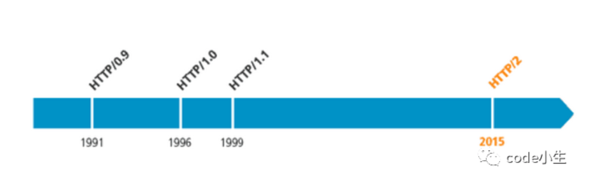
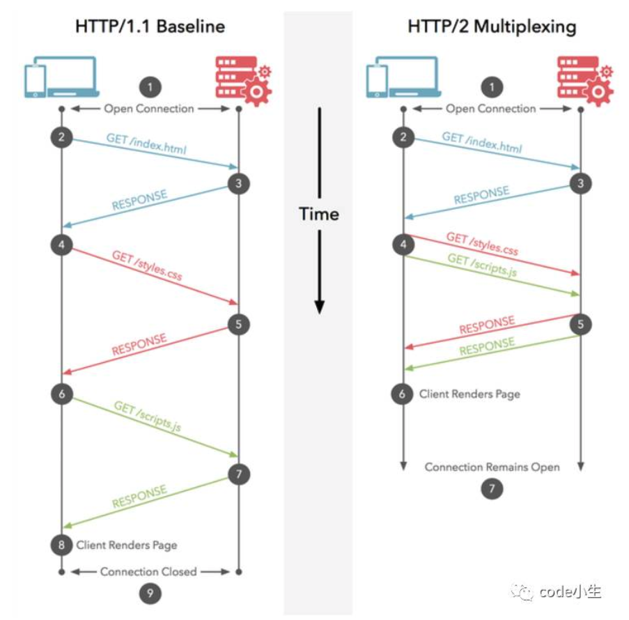
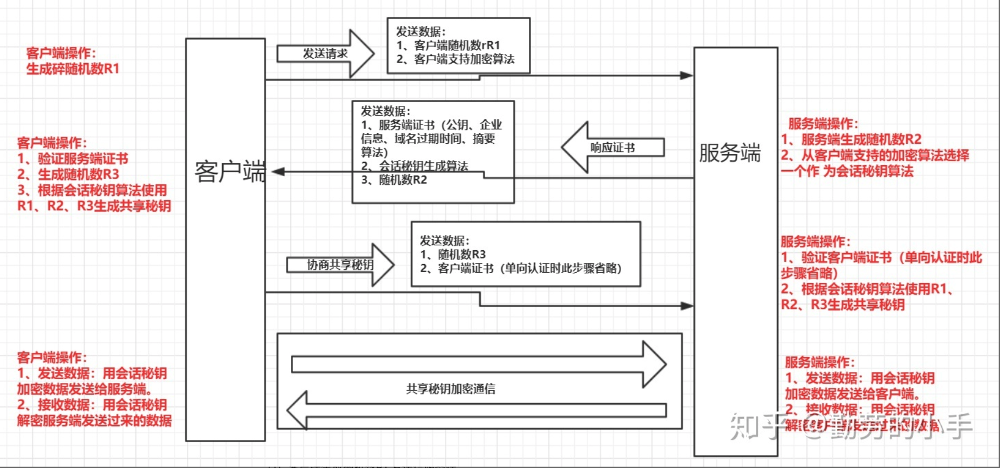

-----

### http模块

```js
var http = require('http');
http.createServer(function (req, res) {
    res.writeHead(200, { 'Content-Type': 'text/html' });
    res.write('<h1>Node.js</h1>');
    res.end('<p>Hello World</p>');
}).listen(3000);
console.log("HTTP server is listening at port 3000.");
```

### http2模块

#### 安装本地证书

`openssl req -newkey rsa:2048 -nodes -keyout rsa_private.key -x509 -days 365 -out cert.crt`

```js
const http2 = require('http2');
const fs = require('fs');

const server = http2.createSecureServer({
  key: fs.readFileSync('rsa_private.key'),
  cert: fs.readFileSync('cert.crt')
});

server.on('error', (err) => console.error(err));

server.on('stream', (stream, headers) => {
  // stream is a Duplex
  stream.respond({
    'content-type': 'text/html',
    ':status': 200
  });
  stream.end('<h1>Hello World</h1>');
});

server.listen(8443);
```

#### http1.0和2.0的区别

早在 HTTP 建立之初，主要就是为了将超文本标记语言(HTML)文档从Web服务器传送到客户端的浏览器。也是说对于前端来说，我们所写的HTML页面将要放在我们的 web 服务器上，用户端通过浏览器访问url地址来获取网页的显示内容，但是到了 WEB2.0 以来，我们的页面变得复杂，不仅仅单纯的是一些简单的文字和图片，同时我们的 HTML 页面有了 CSS，Javascript，来丰富我们的页面展示，当 ajax 的出现，我们又多了一种向服务器端获取数据的方法，这些其实都是基于 HTTP 协议的。同样到了移动互联网时代，我们页面可以跑在手机端浏览器里面，但是和 PC 相比，手机端的网络情况更加复杂，这使得我们开始了不得不对 HTTP 进行深入理解并不断优化过程中。



**http的基本优化**

影响一个 HTTP 网络请求的因素主要有两个：**带宽和延迟。**

- **带宽：**如果说我们还停留在拨号上网的阶段，带宽可能会成为一个比较严重影响请求的问题，但是现在网络基础建设已经使得带宽得到极大的提升，我们不再会担心由带宽而影响网速，那么就只剩下延迟了。

- **延迟：**

- - 浏览器阻塞（HOL blocking）：浏览器会因为一些原因阻塞请求。浏览器对于同一个域名，同时只能有 4 个连接（这个根据浏览器内核不同可能会有所差异），超过浏览器最大连接数限制，后续请求就会被阻塞。
  - DNS 查询（DNS Lookup）：浏览器需要知道目标服务器的 IP 才能建立连接。将域名解析为 IP 的这个系统就是 DNS。这个通常可以利用DNS缓存结果来达到减少这个时间的目的。
  - 建立连接（Initial connection）：HTTP 是基于 TCP 协议的，浏览器最快也要在第三次握手时才能捎带 HTTP 请求报文，达到真正的建立连接，但是这些连接无法复用会导致每次请求都经历三次握手和慢启动。三次握手在高延迟的场景下影响较明显，慢启动则对文件类大请求影响较大。

#### http1.0和http1.1

HTTP1.0最早在网页中使用是在1996年，那个时候只是使用一些较为简单的网页上和网络请求上，而HTTP1.1则在1999年才开始广泛应用于现在的各大浏览器网络请求中，同时HTTP1.1也是当前使用最为广泛的HTTP协议。 主要区别主要体现在：

1. **缓存处理**，在HTTP1.0中主要使用header里的If-Modified-Since,Expires来做为缓存判断的标准，HTTP1.1则引入了更多的缓存控制策略例如Entity tag，If-Unmodified-Since, If-Match, If-None-Match等更多可供选择的缓存头来控制缓存策略。  

 > Expires: 客户端和服务端分别生成俩时间戳, 他们俩对比然后判断文件是否过期, 
 >  这样有个问题,  因为网络有延迟, 包括客户端时间和服务器时间有差异.  
 > 为了解决这个问题, 1.1里出现了memory cache设置本地缓存策略, 过期时间是基于本地的时间
 > 这样的话参照时间变为自己. 这里是1.1为了解决expires时间不同步的问题
 > 所以可以使用expires + memory cache结合来对缓存进行处理
   
2. **带宽优化及网络连接的使用**，HTTP1.0中，存在一些浪费带宽的现象，例如客户端只是需要某个对象的一部分，而服务器却将整个对象送过来了，并且不支持断点续传功能，HTTP1.1则在请求头引入了range头域，它允许只请求资源的某个部分，即返回码是206（Partial Content），这样就方便了开发者自由的选择以便于充分利用带宽和连接。
3. **错误通知的管理**，在HTTP1.1中新增了24个错误状态响应码，如409（Conflict）表示请求的资源与资源的当前状态发生冲突；410（Gone）表示服务器上的某个资源被永久性的删除。
4. **Host头处理**，在HTTP1.0中认为每台服务器都绑定一个唯一的IP地址，因此，请求消息中的URL并没有传递主机名（hostname）。但随着虚拟主机技术的发展，在一台物理服务器上可以存在多个虚拟主机（Multi-homed Web Servers），并且它们共享一个IP地址。HTTP1.1的请求消息和响应消息都应支持Host头域，且请求消息中如果没有Host头域会报告一个错误（400 Bad Request）。
5. **长连接**，HTTP 1.1支持长连接（PersistentConnection）和请求的流水线（Pipelining）处理，在一个TCP连接上可以传送多个HTTP请求和响应，减少了建立和关闭连接的消耗和延迟，在HTTP1.1中默认开启Connection： keep-alive，一定程度上弥补了HTTP1.0每次请求都要创建连接的缺点。

#### http2.0的新特性

- **新的二进制格式**（Binary Format），HTTP1.x的解析是基于文本。比如`JSON`. 基于文本协议的格式解析存在天然缺陷，文本的表现形式有多样性，要做到健壮性考虑的场景必然很多，二进制则不同，只认0和1的组合。基于这种考虑HTTP2.0的协议解析决定采用二进制格式，实现方便且健壮。
- **多路复用**（MultiPlexing），即连接共享，即每一个request都是是用作连接共享机制的。一个request对应一个id，这样一个连接上可以有多个request，每个连接的request可以随机的混杂在一起，接收方可以根据request的 id将request再归属到各自不同的服务端请求里面。
- **header压缩**，如上文中所言，对前面提到过HTTP1.x的header带有大量信息，而且每次都要重复发送，HTTP2.0使用encoder来减少需要传输的header大小，通讯双方各自cache一份header fields表，既避免了重复header的传输，又减小了需要传输的大小。
- **服务端推送**（server push），同SPDY一样，HTTP2.0也具有server push功能。

##### **HTTP2.0的多路复用和HTTP1.X中的长连接复用有什么区别？**

- HTTP/1.* 一次请求-响应，建立一个连接，用完关闭；每一个请求都要建立一个连接；
- HTTP/1.1 Pipeling解决方式为，若干个请求排队串行化单线程处理，后面的请求等待前面请求的返回才能获得执行机会，一旦有某请求超时等，后续请求只能被阻塞，毫无办法，也就是人们常说的线头阻塞；
- HTTP/2多个请求可同时在一个连接上并行执行。某个请求任务耗时严重，不会影响到其它连接的正常执行；
  具体如图：



### https模块

我们知道，HTTP请求都是明文传输的，所谓的明文指的是没有经过加密的信息，如果HTTP请求被黑客拦截，并且里面含有银行卡密码等敏感数据的话，会非常危险。为了解决这个问题，Netscape 公司制定了HTTPS协议，HTTPS可以将数据加密传输，也就是传输的是密文，即便黑客在传输过程中拦截到数据也无法破译，这就保证了网络通信的安全。

#### 密码学基础

在正式讲解HTTPS协议之前，我们首先要知道一些密码学的知识。

**明文**： 明文指的是未被加密过的原始数据。

**密文**：明文被某种加密算法加密之后，会变成密文，从而确保原始数据的安全。密文也可以被解密，得到原始的明文。

**密钥**：密钥是一种参数，它是在明文转换为密文或将密文转换为明文的算法中输入的参数。密钥分为对称密钥与非对称密钥，分别应用在对称加密和非对称加密上。

**对称加密**：对称加密又叫做私钥加密，即信息的发送方和接收方使用同一个密钥去加密和解密数据。对称加密的特点是算法公开、加密和解密速度快，适合于对大数据量进行加密，常见的对称加密算法有DES、3DES、TDEA、Blowfish、RC5和IDEA。
 其加密过程如下：明文 + 加密算法 + 私钥 => 密文
 解密过程如下：密文 + 解密算法 + 私钥 => 明文
 对称加密中用到的密钥叫做私钥，私钥表示个人私有的密钥，即该密钥不能被泄露。
 其加密过程中的私钥与解密过程中用到的私钥是同一个密钥，这也是称加密之所以称之为“对称”的原因。由于对称加密的算法是公开的，所以一旦私钥被泄露，那么密文就很容易被破解，所以对称加密的缺点是密钥安全管理困难。

**非对称加密**：非对称加密也叫做公钥加密。非对称加密与对称加密相比，其安全性更好。对称加密的通信双方使用相同的密钥，如果一方的密钥遭泄露，那么整个通信就会被破解。而非对称加密使用一对密钥，即公钥和私钥，且二者成对出现。私钥被自己保存，不能对外泄露。公钥指的是公共的密钥，任何人都可以获得该密钥。用公钥或私钥中的任何一个进行加密，用另一个进行解密。

#### https通信过程

**HTTPS协议 = HTTP协议 + SSL/TLS协议**，在HTTPS数据传输的过程中，需要用SSL/TLS对数据进行加密和解密，需要用HTTP对加密后的数据进行传输，由此可以看出HTTPS是由HTTP和SSL/TLS一起合作完成的。

HTTPS为了兼顾安全与效率，同时使用了对称加密和非对称加密。数据是被对称加密传输的，对称加密过程需要客户端的一个密钥，为了确保能把该密钥安全传输到服务器端，采用非对称加密对该密钥进行加密传输，总的来说，对数据进行对称加密，对称加密所要使用的密钥通过非对称加密传输。

服务器端的公钥和私钥，用来进行非对称加密。

客户端生成的随机密钥，用来进行对称加密。

#### 数字证书

HTTP不会对通信的双方进行进行身份的验证所以身份有可能被伪装造成安全问题，所以为了解决这个问题所以产生了数字证书，数字证书的使用流程大概如下：

1、服务器首先向一个大家都信任的第三方机构申请一个身份证书。

2、客户端向服务器建立通信之前首先向服务器请求获得服务器的证书。

3、服务器收到请求后把数字证书发送给客户端。

4、客户端获得服务器的证书之后，然后与可信任的第三方机构证书进行验证，验证通过后则进行正常的内容通信。

#### 数字签名(解决数据篡改问题)

Http不会对数据的完整性进行验证，这样会造成就算通信的过程中数据被别人恶意篡改了

，通信的双方也没办法知道，所以就有了数字签名技术。

数字签名主要有两个作用，一是验证数据是否为意料中的对象所发出的，二是对数据的完整性进行验证，验证数据是否被篡改过：

和 webpack的hashmap有点类似

1、对需要发送的数据进行摘要

对数据进行摘要主要目的是确认数据的完整性，发送方首先根据约定的哈希算法把数据进行哈希，得到一个哈希值，因为两个数据有任何一点不相同都会得出不同的哈希值，所以把对数据内容进行哈希得到哈希值作为数据的摘要发给对方；

然后对方收到数据后，首先自己也按照约定的哈希算法把接收到的数据内容进行哈希得到一个哈希值，然后把自己的哈希值与发送过来的摘要信息进行比对，根据哈希值是否一致来确认数据的完整性。

2、对摘要信息进行签名

对摘要进行签名的目的主要是对确认数据发送人的身份，签名技术是使用非对称加密的原理，

非对称加密是使用一个密钥对（一个公钥，一个私钥），公钥加密只能由私钥解密，私钥加密只能由公钥解密； 公钥是公布出来的密钥，私钥由自己安全保管不外泄，所以在私钥不泄漏情况下，我们通过私钥其实就可以确认发送数据方的身份。

那么我们想要对A发送过来的数据进行身份验证，那么我们只需要用A的公钥对数据进行解密即可（如果可以解密，那么就说明该数据是A用自己的私钥进行加密过的，而A的私钥又只有A自己拥有）

#### 通信流程

##### **第一步：客户端向服务端发起请求**

（1）客户端生成随机数R1 发送给服务端；

（2）告诉服务端自己支持哪些加密算法；

##### **第二步：服务器向客户端发送数字证书**

（1）服务端生成随机数R2;

（2）从客户端支持的加密算法中选择一种双方都支持的加密算法（此算法用于后面的会话密钥生成）;

（3）服务端生成把证书、随机数R2、会话密钥生成算法，一同发给客户端;

##### **第三步：客户端验证数字证书。**

（1）验证证书的可靠性，先用CA的公钥解密被加密过后的证书,能解密则说明证书没有问题，然后通过证书里提供的摘要算法进行对数据进行摘要，然后通过自己生成的摘要与服务端发送的摘要比对。

（2）验证证书合法性，包括证书是否吊销、是否到期、域名是否匹配，通过后则进行后面的流程

（3）获得证书的公钥、会话密钥生成算法、随机数R2

（4）生成一个随机数R3。

（5）根据会话秘钥算法使用R1、R2、R3生成会话秘钥。

（6）用服务端证书的公钥加密随机数R3并发送给服务端。 此处就是  服务端和客户端进行数据传输的，对称密钥

##### **第四步：服务器得到会话密钥**

（1）服务器用私钥解密客户端发过来的随机数R3

（2）根据会话秘钥算法使用R1、R2、R3生成会话秘钥

##### **第五步：客户端与服务端进行加密会话**

（1）客户端发送加密数据给服务端

发送加密数据：客户端加密数据后发送给服务端。

（2）服务端响应客户端

解密接收数据：服务端用会话密钥解密客户端发送的数据；

加密响应数据：用会话密钥把响应的数据加密发送给客户端。

（3）客户端解密服务端响应的数据

解密数据：客户端用会话密钥解密响应数据；

