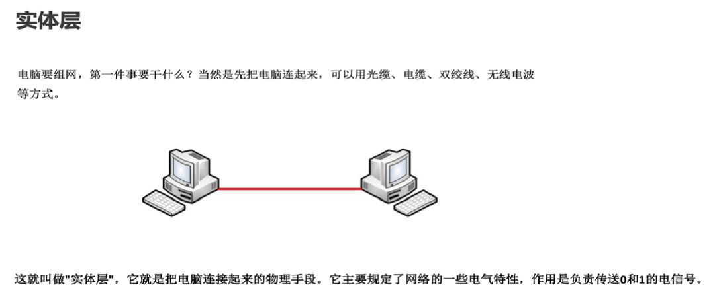
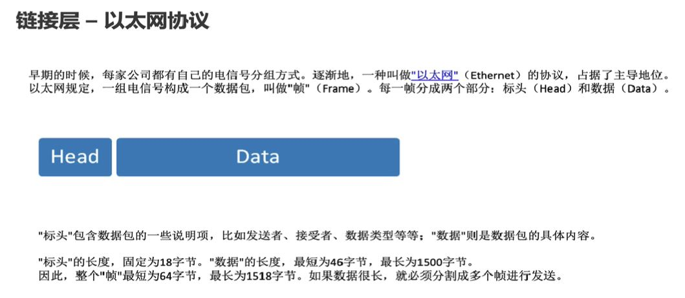
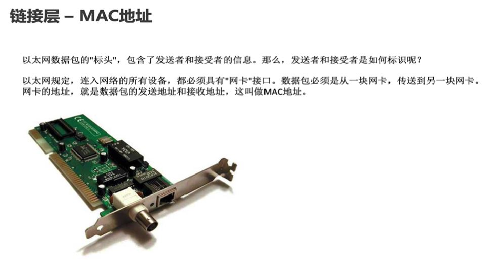
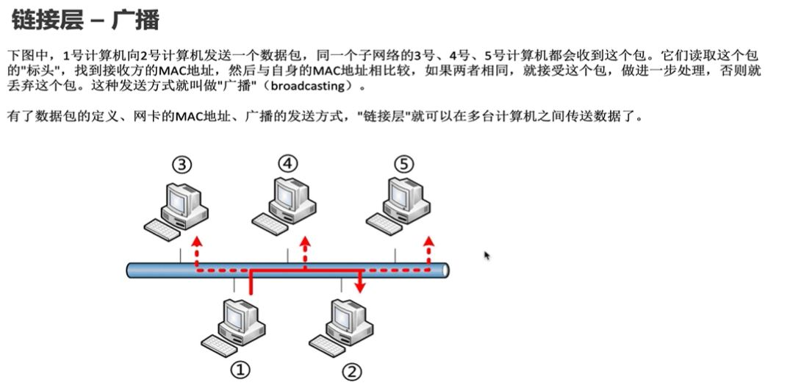
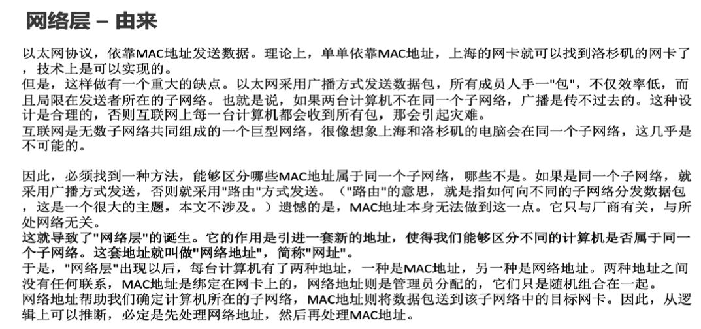
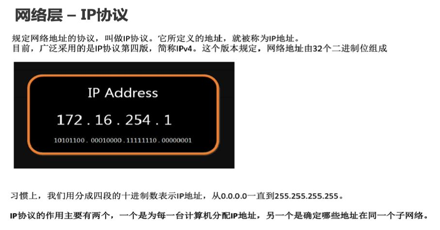
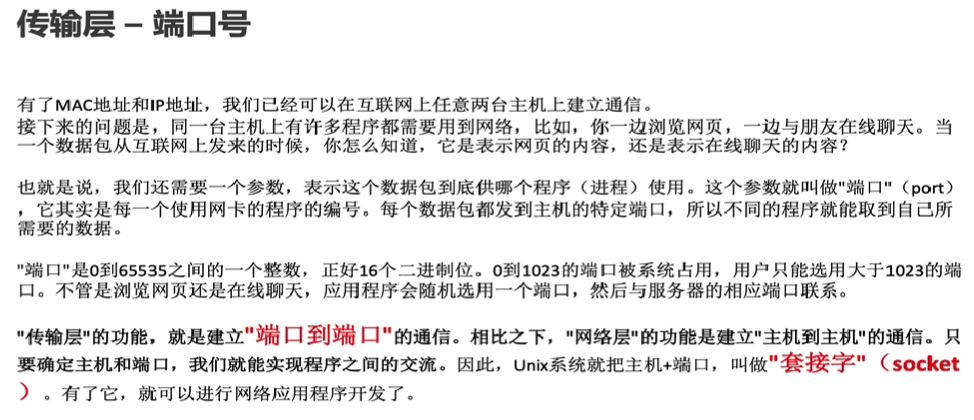
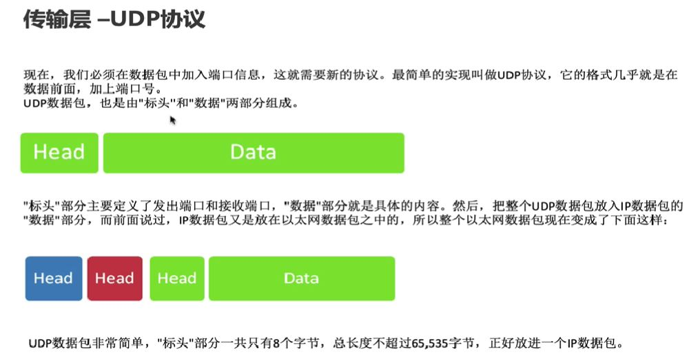
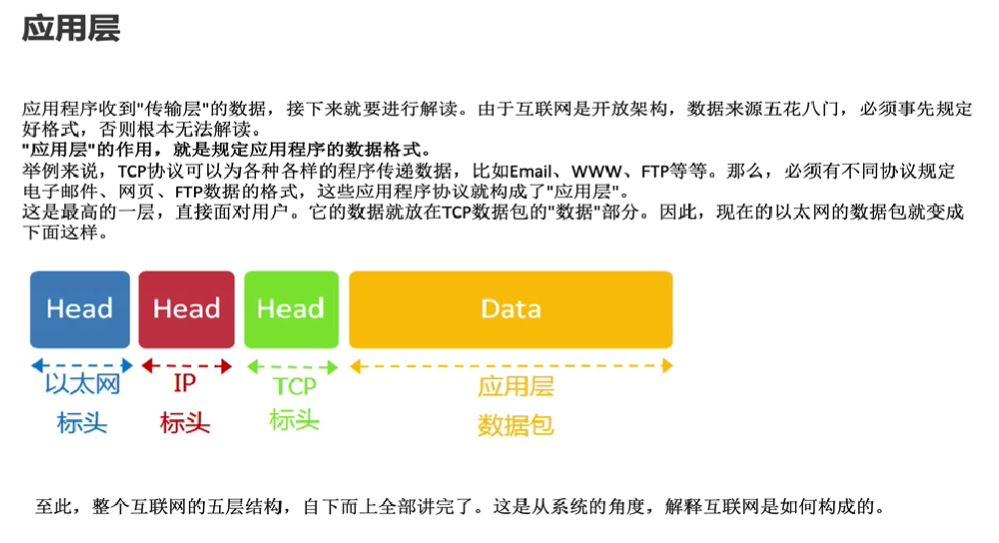
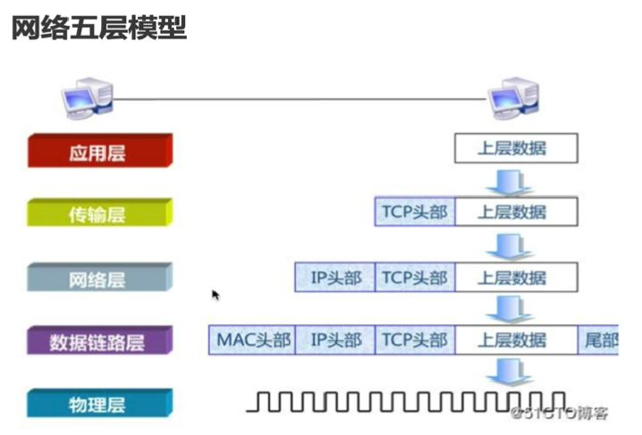

-----

## 物理层

---

## 链路层
单纯的0和1没有任何意义, 必须规定解读方式: 多少个电信号算一组?  
每个信号位有何意义? 这就是"链路层"的功能, 它在"物理层"上方, 确定了0和1的分组方式.

### 链路层 - 以太网协议

### 链路层 - mac协议

### 链路层 - 广播
以太网数据包必须知道接收方的MAC地址, 然后才能发送.  

首先, 一块网卡怎么会知道另一块网卡的MAC地址?  
其次, 就算有了MAC地址, 系统怎样才能把数据包准确送到接收方?  

回答是以太网采用了一种很"原始"的方式, 它不是把数据包准确送到接收方,  
而是向本网络内所有计算机发送, 让每台计算机自己判断, 是否为接收方.

---

## 网络层
  ### 网络层 - 由来
  
  ### 网络层 - ip协议
  

---

## 传输层
  ### 传输层 - 端口号
  
  ### 传输层 - UDP协议
  
  ### 传输层 - TCP协议

  > TCP: Transmission Control Protocol 传输控制协议  

  > 释义: 是一种面向连接的, 可靠的, 基于字节流的传输层通信协议  

  > UDP是不可靠的  
  
  > TCP保证了数据的可靠性

## 会话层

## 表示层

## 应用层
  

## 五层模型图
  

