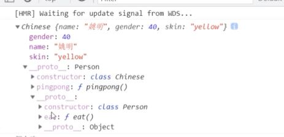

# React创建组件的两种方式

## 函数组件

> 函数组件：使用JS的函数或者箭头函数创建的组件

+ 为了区分普通标签，函数组件的名称必须`大写字母开头`
+ 函数组件`必须有返回值`，表示该组件的结构
+ 如果返回值为null,表示不渲染任何内容

使用函数创建组件

```js
function Hello () {
    return (
    	<div>这是我的函数组件</div>
    )
}
```

使用箭头函数创建组件

```js
const Hello = () => <div>这是一个函数组件</div>
```

使用组件

```js
ReactDOM.render(<Hello />, document.getElementById('root'))
```

## 类与继承

### class 基本语法 

- 在 ES6 之前通过构造函数创建对象
- 在 ES6 中新增了一个关键字 class, 类 和构造函数类似，用于创建对象
  - 类与对象的区别
  - 类：创1，指的是一类的事物，是个概念，比如车 手机 水杯等
  - 对象：一个具体的事物，有具体的特征和行为，比如一个手机，我的手机等， 类可以创建出来对象。
- 类创建对象的基本语法
  - 基本语法`class 类名{}`
  - 构造函数`constructor`的用法，创建对象
  - 在类中提供方法，直接提供即可
  - 在类中不需要使用,分隔

```js title="构造函数与类写法"
// 构造函数写法
function Teacher(name, age) {
  this.name = name
  this.age = age
}

// 为了让所有实例都能访问, 放到原型对象上
Teacher.prototype.sayHi = function () {
  console.log('大家好, 我是' + this.name)
}

const stu = new Teacher('王老师', 29)
console.log(stu)
stu.sayHi()

// class写法
class Teacher {
  constructor (name, age) {
    this.name = name
    this.age = age
  }

  // 虽然sayHi写法与上面不同, 但是本质还是挂到原型上
  sayHi() {
    console.log(`大家好, 我是` + this.name)
  }
}

const stu = new Teacher('王老师', 29)
console.log(stu)
stu.sayHi()
```

### extends 实现继承

- extends 基本使用
- 类可以使用它继承的类中所有的成员（属性和方法）
- 类中可以提供自己的属性和方法
- 注意：如果想要给类中新增属性，必须先调用 super 方法

```js title="示例1"
class Person {
  constructor(name, gender) {
    this.name = name
    this.gender = gender
  }

  eat() {
    console.log('都吃饭')
  }
}

class Chinese extends Person {

}

const c1 = new Chinese()
console.log(c1) // Chinese { name: undefined, gender: undefined }
const c2 = new Chinese('姚明', 40)
console.log(c2) // Chinese { name: '姚明', gender: 490 }
```

```js title="示例2"
class Person {
  constructor(name, gender) {
    this.name = name
    this.gender = gender
  }

  eat() {
    console.log('都吃饭')
  }
}

class Chinese extends Person {
  constructor(name, gender) {
      super(name,gender)
      this.skin = 'yellow'
  }
  pingpong() {
      console.log('play pingpong very well!')
  }
}

class African extends Person {
  constructor(name, gender) {
    super(name,gender)
    this.skin = 'black'
  }
  run() {
      console.log('run fast!')
  }
}

const c1 = new Chinese('姚明', 40)
console.log(c1) // Chinese { name: '姚明', gender: 490 }
const hei = new African('小黑', 20)
```


:::tip
原型链关系  
new的一个对象比如 dog 它的原型是 Dog.prototype  
而Dog.prototype又继承了Animal, 所以是Animal的prototype  
再往上就是Object.prototype  

dog ==> Dog.prototype ==> Animal.prototype ==> Object.prototype
:::

## 类组件

> 类组件：使用ES6的class语法创建组件

约定1：类组件应该继承`React.Component`父类，从而可以使用父类中提供的方法或者属性

约定2：类组件必须提供`render`方法

约定3：render方法`必须有返回值`,表示该组件的结构

定义组件

```js
class Hello extends React.Component {
  render() {
    return <div>这是一个类组件</div>
  }
}
```

使用组件

```js
ReactDOM.render(<Hello />, document.getElementById('root'))
```

## Hooks出现前的有状态组件和无状态组件

+ **状态可以认为是组件的数据**, 比如vue中叫做data, react中叫状态

+ 函数组件又叫做**无状态组件**   函数组件是不能自己提供数据的，，，，，**木偶组件，静态组件**
+ 类组件又叫做**有状态组件  智能组件** 类组件可以自己提供数据，，，，组件内部的状态（数据如果发生了改变，内容会自动的更新）
+ 状态（state）即组件的私有数据，当组件的状态发生了改变，页面结构也就发生了改变。
+ 函数组件是没有状态的，只负责页面的展示（静态，不会发生变化）性能比较高
+ 类组件有自己的状态，负责**更新UI**，只要类组件的数据发生了改变，UI就会发生更新。
+ 在复杂的项目中，一般都是由函数组件和类组件共同配合来完成的。

比如计数器案例，点击按钮让数值+1， 0和1就是不同时刻的状态，当状态从0变成1之后，UI也要跟着发生变化。React想要实现这种功能，就需要使用有状态组件来完成。


## 类组件的状态

+ 状态`state`即数据，是组件内部的`私有数据`,只有在组件内部可以使用
+ `state的值是一个对象`,表示一个组件中可以有多个数据
+ state的基本使用

### 类组件提供状态的两种方式

```jsx title="第一种方式"
class Hello extends React.Component {
  constructor() {
    super()
    // 组件通过state提供数据
    this.state = {
      msg: 'hello react'
      count: 0
    }
  }
  render() {
    return <div>state中的数据--{this.state.msg}</div>
  }
}
```

+ 简洁的语法 - 类实例属性

```jsx title="第二种方式"
class Hello extends React.Component {
  state = {
    msg: 'hello react'
  }
  render() {
    return <div>state中的数据--{this.state.msg}</div>
  }
}
```
