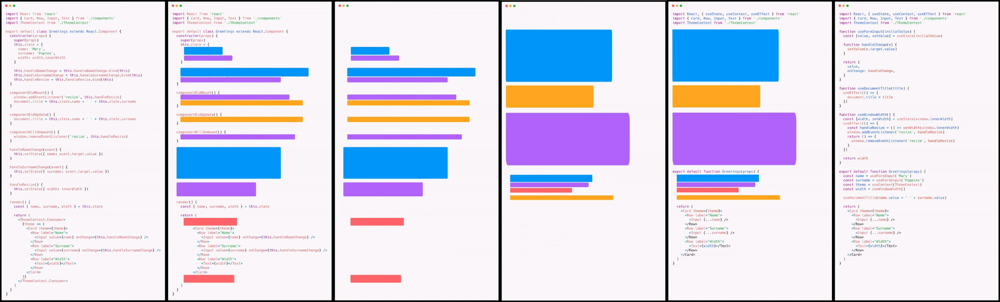
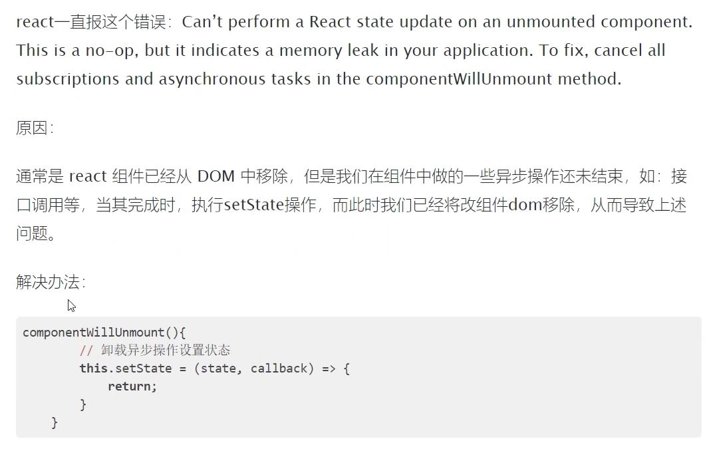

## React Hooks 介绍

1. Hooks 是什么
2. 为什么要有 Hooks

### Hooks 是什么

- `Hooks`：钩子、钓钩、钩住
- `Hooks` 是 **React v16.8** 中的新增功能
- 作用：为**函数组件**提供状态、生命周期等原本 class 组件中提供的 React 功能
  - 可以理解为通过 Hooks 为函数组件钩入 class 组件的特性
- 注意：**Hooks 只能在函数组件中使用**，自此，函数组件成为 React 的新宠儿

React v16.8 版本前后，组件开发模式的对比：

- React v16.8 以前： class 组件(提供状态) + 函数组件(展示内容)
- React v16.8 及其以后：
  1. class 组件(提供状态) + 函数组件(展示内容)
  2. Hooks(提供状态) + 函数组件(展示内容)
  3. 混用以上两种方式：部分功能用 class 组件，部分功能用 Hooks+函数组件

注意1：虽然有了 Hooks，但 React 官方并没有计划从 React 库中移除 class。
注意2：有了 Hooks 以后，不能再把**函数组件**称为无状态组件了，因为 Hooks 为函数组件提供了状态。

### 为什么要有 Hooks

两个角度：1 组件的状态逻辑复用 2 class 组件自身的问题

1. 组件的状态逻辑复用：
   + 在 Hooks 之前，组件的状态逻辑复用经历了：mixins（混入）、HOCs（高阶组件）、render-props 等模式。
   + （早已废弃）mixins 的问题：1 数据来源不清晰 2 命名冲突。
   + HOCs、render-props 的问题：重构组件结构，导致组件形成 JSX 嵌套地狱问题。

2. class 组件自身的问题：
   + 选择：函数组件和 class 组件之间的区别以及使用哪种组件更合适
   + 需要理解 class 中的 this 是如何工作的
   + 相互关联且需要对照修改的代码被拆分到不同生命周期函数中
     + componentDidMount ->  window.addEventListener('resize', this.fn)
     + componentWillUnmount -> window.addEventListener('resize', this.fn)

- 相比于函数组件来说，不利于代码压缩和优化，也不利于 TS 的类型推导

正是由于 React 原来存在的这些问题，才有了 Hooks 来解决这些问题



### hooks的优势

由于原来 React 中存在的问题，促使 React 需要一个更好的自带机制来实现组件状态逻辑复用。

1. Hooks 只能在函数组件中使用，避免了 class 组件的问题
2. 复用组件状态逻辑，而无需更改组件层次结构
3. 根据功能而不是基于生命周期方法强制进行代码分割
4. 抛开 React 赋予的概念来说，Hooks 就是一些普通的函数
1. 具有更好的 TS  类型推导
2. tree- - shaking  友 好，打包时去掉未引用的代码
7. 更好的压 缩


项目开发中，Hooks 的采用策略：

+ 不推荐直接使用 Hooks 大规模重构现有组件
+ 推荐：新功能用 Hooks，复杂功能实现不了的，也可以继续用 class
+ 找一个功能简单、非核心功能的组件开始使用 hooks

### 前面学习的 React 知识是有用的

class 组件相关的 API 不用了，比如：

- `class Hello extends Component`
- `componentDidMount`、`componentDidUpdate`、`componentWillUnmount`
- `this` 相关的用法

原来学习的内容还是要用的，比如：

- JSX：`{}`、`onClick={handleClick}`、条件渲染、列表渲染、样式处理等
- 组件：函数组件、组件通讯
- 路由
- React 开发理念：`单向数据流`、`状态提升` 等
- 解决问题的思路、技巧、常见错误的分析等上

## useState Hook

### 概述

问题：Hook 是什么? 一个 Hook 就是一个特殊的函数，让你在函数组件中获取状态等 React 特性
使用模式：函数组件 + Hooks
特点：从名称上看，Hook 都以 use 开头

### useState Hook 的基本使用

- 使用场景：当你想要在**函数组件中，使用组件状态时**，就要使用 **useState** Hook 了
- 作用：为函数组件提供状态（state）
- 使用步骤：
  1. 导入 `useState` 函数
  2. 调用 `useState` 函数，并传入状态的初始值
  3. 从 `useState` 函数的返回值中，拿到状态和修改状态的函数
  4. 在 JSX 中展示状态
  5. 在按钮的点击事件中调用修改状态的函数，来更新状态

```js
import { useState } from 'react'

const Count = () => {
  // 返回值是一个数组
  const stateArray = useState(0)

  // 状态值 -> 0
  const state = stateArray[0]
  // 修改状态的函数
  const setState = stateArray[1]

  return (
    <div>
      {/* 展示状态值 */}
      <h1>useState Hook -> {state}</h1>
      {/* 点击按钮，让状态值 +1 */}
      <button onClick={() => setState(state + 1)}>+1</button>
    </div>
  )
}
```

- 参数：**状态初始值**。比如，传入 0 表示该状态的初始值为 0
  - 注意：此处的状态可以是任意值（比如，数值、字符串等），而 class 组件中的 state 必须是对象
- 返回值：数组，包含两个值：1 状态值（state） 2 修改该状态的函数（setState）

### 使用数组解构简化

比如，要获取数组中的元素：

1. 原始方式：索引访问

```js
const arr = ['aaa', 'bbb']

const a = arr[0]  // 获取索引为 0 的元素
const b = arr[1]  // 获取索引为 1 的元素
```

2. 简化方式：数组解构
   - 相当于创建了两个变量（可以是任意的变量名称）分别获取到对应索引的数组元素

```js
const arr = ['aaa', 'bbb']

const [a, b] = arr
// a => arr[0]
// b => arr[1]

const [state, setState] = arr
```

- 使用数组解构简化 `useState` 的使用
  - 约定：**修改状态的函数名称以 set 开头，后面跟上状态的名称**

```js
// 解构出来的名称可以是任意名称

const [state, setState] = useState(0)
const [age, setAge] = useState(0)
const [count, setCount] = useState(0)
```

### 状态的读取和修改

状态的使用：1 读取状态 2 修改状态

1. 读取状态：该方式提供的状态，是函数内部的局部变量，可以在函数内的任意位置使用

2. 修改状态：
  - `setCount(newValue)` 是一个函数，参数表示：**新的状态值**
  - 调用该函数后，将**使用新的状态值`替换`旧值**
  - 修改状态后，因为状态发生了改变，所以，该组件会重新渲染

### 组件的更新过程

函数组件使用 **useState** hook 后的执行过程，以及状态值的变化： 

- 组件第一次渲染：
  1. 从头开始执行该组件中的代码逻辑
  2. 调用 `useState(0)` 将传入的参数作为状态初始值，即：0
  3. 渲染组件，此时，获取到的状态 count 值为： 0

- 组件第二次渲染：
  1. 点击按钮，调用 `setCount(count + 1)` 修改状态，因为状态发生改变，所以，该组件会重新渲染
  2. 组件重新渲染时，会再次执行该组件中的代码逻辑
  3. 再次调用 `useState(0)`，此时 **React 内部会拿到最新的状态值而非初始值**，比如，该案例中最新的状态值为 1
  4. 再次渲染组件，此时，获取到的状态 count 值为：1

注意：**useState 的初始值(参数)只会在组件第一次渲染时生效**。 

也就是说，以后的每次渲染，useState 获取到都是最新的状态值。React 组件会记住每次最新的状态值!

### 为函数组件添加多个状态

问题：如果一个函数组件需要多个状态，该如何处理?
回答：调用 `useState` Hook 多次即可，每调用一次 useState Hook 可以提供一个状态。
注意：useState Hook 多次调用返回的 [state, setState] 相互之间，互不影响。

### hooks 的使用规则

注意：**React Hooks 只能直接出现在 函数组件 中，不能嵌套在 if/for/其他函数中**！

否则就会报错：React Hook "useState" is called conditionally. React Hooks must be called in the exact same order in every component render

React 的 useState 这个 Hook 被条件性（放在一个条件判断中）的调用了。

React Hooks 必须要每次组件渲染时，按照**相同的顺序**来调用所有的 Hooks。

- 为什么会有这样的规则？ 因为 React 是按照 Hooks 的调用顺序来识别每一个 Hook，如果每次调用的顺序不同，导致 React 无法知道是哪一个 Hook
- 通过开发者工具可以查看到.

## useEffect Hook

1. side effect - 副作用
2. useEffect 的基本使用
3. useEffect 的依赖
4. useEffect 发送请求

### side effect - 副作用

使用场景：当你想要在函数组件中，**处理副作用（side effect）时**，就要使用 **useEffect** Hook 了
作用：**处理函数组件中的副作用（side effect）**


问题：副作用（side effect）是什么? 
回答：在计算机科学中，如果一个函数或其他操作修改了其局部环境之外的状态变量值，那么它就被称为有副作用
类比，对于 999 感冒灵感冒药来说：

- （**主**）作用：用于感冒引起的头痛，发热，鼻塞，流涕，咽痛等 
- 副作用：可见困倦、嗜睡、口渴、虚弱感

理解：副作用是相对于主作用来说的，一个功能（比如，函数）除了主作用，其他的作用就是副作用
对于 React 组件来说，**主作用就是根据数据（state/props）渲染 UI**，除此之外都是副作用（比如，手动修改 DOM）

React 组件的公式：**UI = f(state)**

常见的副作用（side effect）

- 数据（Ajax）请求、手动修改 DOM、localStorage 操作等

```js
// 不带副作用的情况：
// 该函数的（主）作用：计算两个数的和
function fn(a, b) {
  return a + b
}

// 带副作用的情况：
let c = 1
function fn(a, b) {
  // 因为此处修改函数外部的变量值，而这一点不是该函数的主作用，因此，就是：side effect（副作用）
  c = 2
  return a + b
}

// 带副作用的情况：
function fn(a, b) {
  // 因为 console.log 会导致控制台打印内容，所以，也是对外部产生影响，所以，也是：副作用
  console.log(a)
  return a + b
}

// 没有副作用：
function fn(obj) {
  return obj.name
}

// 有副作用：
function fn(obj) {
  // 此处直接修改了参数的值，也是一个副作用
  obj.name = '大飞哥'
  return obj.name
}
const o = { name: '小马哥' }
fn(o)
```

### useEffect 的基本使用

使用场景：当你想要在函数组件中，处理副作用（side effect）时，就要使用 useEffect Hook 了
作用：处理函数组件中的副作用（side effect）
注意：在实际开发中，副作用是不可避免的。因此，react 专门提供了 **useEffect** Hook **来处理函数组件中的副作用**

```js
import { useEffect } from 'react'

useEffect(function effect() {
  document.title = `当前已点击 ${count} 次`
})

useEffect(() => {
  document.title = `当前已点击 ${count} 次`
})
```

解释：

- 参数：回调函数（称为 **effect**），就是**在该函数中写副作用代码**
- 执行时机：该 effect 会在每次组件更新（DOM更新）后执行
- 相当于componentDidMount + componentDidUpdate

### useEffect 的依赖

- 问题：如果组件中有另外一个状态，另一个状态更新时，刚刚的 effect 回调，也会执行 
- 性能优化：**跳过不必要的执行，只在 count 变化时，才执行相应的 effect**

```js
useEffect(() => {
  document.title = `当前已点击 ${count} 次`
}, [count])
```

解释：

- 第二个参数：可选的，可省略；也可以传一个数组，数组中的元素可以成为依赖项（deps） 
- 该示例中表示：只有当 count 改变时，才会重新执行该 effect

### useEffect 的依赖是一个空数组

useEffect 的第二个参数，还可以是一个**空数组（[]）**，表示只在组件第一次渲染后执行 effect. 因为它依赖一个空值, 空值是永远不会发生变化的. 意味着只执行一次  
使用场景：1 事件绑定 2 发送请求获取数据 等

```js
useEffect(() => {
  const handleResize = () => {}
  window.addEventListener('resize', handleResize)
}, [])
```

解释：

- 该 effect 只会在组件第一次渲染后执行，因此，可以执行像事件绑定等只需要执行一次的操作
  - 此时，相当于 class 组件的 componentDidMount 钩子函数的作用
- 跟 useState Hook 一样，一个组件中也可以调用 useEffect Hook 多次 
- 推荐：一个 useEffect 只处理一个功能，有多个功能时，使用多次 useEffect


---


### useEffect 清理副作用

有时候, 我们只想**在React更新DOM之后运行一些额外的代码** 比如发送网络请求, 手动变更DOM, 记录日志, 这些都是常见的无需清除的操作  

还有一些副作用是需要清除的. 例如**订阅外部数据源, 开启定时器, 注册事件**. 这种情况下, 清除工作是非常重要的, 可以防止引起内存泄漏

问题：如何在组件卸载时，解绑事件？此时，就用到 effect 的返回值了

```jsx
useEffect(() => {
  const handleResize = () => {}
  window.addEventListener('resize', handleResize)
  return () => window.removeEventListener('resize', handleResize)
}, [])

    // 返回的函数称为清理副作用的函数
    // 这个函数会在组件销毁的时候执行 componentWillUnmount
    // 以及每次渲染的时候都会执行
    // 这就是为什么React会在执行当前effect之前对上一个effect进行清除
```

解释：

- effect 的返回值也是可选的，可省略。也可以返回一个清理函数，用来执行事件解绑等清理操作
- 清理函数的执行时机：1【空数组没有依赖】组件卸载时 2 【有依赖项】effect 重新执行前（暂时知道即可） 
  - 此时，相当于 class 组件的 componentWillUnmount 钩子函数的作用
- 推荐：一个 useEffect 只处理一个功能，有多个功能时，使用多次 useEffect 
- 优势：根据业务逻辑来拆分，相同功能的业务逻辑放在一起，而不是根据生命周期方法名称来拆分代码 
- 编写代码时，关注点集中；而不是上下翻滚来查看代码


---

### 总结 useEffect 的使用


```jsx
1. useEffect的语法
// 触发时机：1 第一次渲染会执行 2 每次组件重新渲染都会再次执行
// 等价于componentDidMount + componentDidUpdate 
useEffect(() => {})

// 触发时机：只在组件第一次渲染时执行
// 等价于componentDidMount
useEffect(() => {}, [])

// 触发时机：1 第一次渲染会执行 2 当 依赖项 变化时会再次执行
useEffect(() => {}, [依赖项])


2. 清理副作用的语法
// 当组件销毁的时候, 以及每次回调函数执行之前(除了第一次, 因为第一次来还没有副作用), 都会清理副作用
useEffect(() => {
  // xxxx
  return () => {
    // 清理副作用
  }
})

// 当组件销毁的时候, 清理副作用
useEffect(() => {
  // xxxx
  return () => {
    // 清理副作用
  }
}, [])
```

---


### useEffect 发送请求

在组件中，使用 useEffect Hook 发送请求获取数据（side effect）：

```js
useEffect(() => {
  const loadData = async () => {}
  loadData()
}, [])
```

解释：

- 注意：**effect 只能是一个同步函数，不能使用 async**
- 因为 effect 的返回值应该是一个清理函数，React 会在组件卸载或者 effect 的依赖项变化时重新执行 
- 但如果 effect 是 async 的，此时返回值是 Promise 对象。这样的话，就无法保证清理函数被立即调用
- 如果延迟调用清理函数，也就没有机会忽略过时的请求结果或取消请求
- **为了使用 async/await 语法，可以在 effect 内部创建 async 函数，并调用**

:::tip
effect 只能是一个同步函数，不能使用 async  
Effect callbacks are synchronous to prevent race conditions.  
Put the async function inside: useEffect(() => {async function fetchData() { // You can await here const response = await MyAPI.getData(someId); // ... } fetchData();}, [someId]);  
:::

```js
// 错误演示：

// 不要给 effect 添加 async
useEffect(async () => {}, [])
```
```js title="最佳实践https://github.com/facebook/react/issues/14326#issuecomment-441680293"

// 实例1
  useEffect(() => {
    const getList = async () => {
      const res = await axios.get("xxx");
      setList(res);
    };
    getList();
  }, []);

// 实例2
useEffect(() => {
  // 是否取消本次请求
  let didCancel = false;

  async function fetchMyAPI() {
    let url = 'http://something/' + productId;
    let config = {};
    const response = await myFetch(url);
    // 如果开启其他请求, 就忽略本次(过时)的请求结果
    if (!didCancel) { // Ignore if we started fetching something else
      console.log(response);
    }
  }  

  fetchMyAPI();
  return () => { didCancel = true; }; // Remember if we start fetching something else
}, [productId]);

```

---

### 为何effect不能是异步的

```js
effect将来是可能有返回值的, 
这个返回值可能是个函数, 用来清理副作用
而async函数的返回结果是个promise, 
那么
async function fn() { return () => {} }
fn() // 返回的是个promise
本来清理副作用的话, 把返回的函数调用一下即可, 
promise不能直接调用, 
而是promise.then(fn => fn())
所以清理副作用会导致清理不及时

```

---

### 导致effect的死循环的演示

```jsx
  const [list, setList] = useState([]);
  useEffect(() => {
    const getList = async () => {
      const res = await axios.get("http://geek.itheima.net/v1_0/channels");
      setList(res.data.data.channels);
      console.log(list)
    };
    getList();
  }, []);

为了想查看list在更新后的结果, 写了console.log(list)这句代码,  
控制台报错 React Hook useEffect has a missing dependecy: 'list'  
在依赖项加入list后, 发生死循环

因为依赖了list, 而依赖项发生变化, 传入useEffect的函数就会再次执行,
首次list是空数组是复杂数据类型, 发请求得到结果更改了list, 说明list变了, 
两个数组不会相等,  [] == [] // false {} == {} false  1 == 1 true
复杂数据类型比较地址,  
所以永远认为list变了继续发请求...

如果非要打印list那么放到外面去打印
  useEffect(() => {
    const getList = async () => {
      const res = await axios.get("http://geek.itheima.net/v1_0/channels");
      setList(res.data.data.channels);
      // console.log(res)
    };
    getList();
  }, []);
console.log(list) //这个list会打印两次, 而且首次打印的是个空数组, 因为初始化的空数组
或者可以选择打印内部变量res
```

---

### useEffect取消请求的说明

有时请求过快, 导致请求未完成就切换到其他路由或其他组件, 导致报错  
所以需要在组件销毁的时候把还没完成的请求取消掉 

:::tip 类组件中如何取消
并不是真正取消, 因为请求已经发出了, 而是做到让请求回来后不去调用setState()   

见文
love85g.com/?p=1593

:::

:::tip hooks中如何取消
清理副作用

```jsx

// 代码演示
  useEffect(() => {
    let isCancel = false
    const getList = async () => {
      const res = await axios.get("xxx");
      if (isCancel) return
      setList(res);
    };
    getList();
    return () => {
      // 取消请求
      isCancel = true
    }
  }, []);

// 正常isCancel都是false, if (isCancel) return这句不会执行
// 所以发请求后setList(), 数据发生变化
// 如果这个请求还没回来就跳别的组件了,
// 那么组件就要销毁, 销毁要清理副作用走return () => { isCancel = true }
// isCancel变为true, 过一会请求回来了 const res = await axios.get("xxx"); 得到了res
// 在if (isCancel) return处就不会往下走setList了
```
:::


---

## Dan的博客 解答一切关于useEffect的疑问

https://overreacted.io/zh-hans/a-complete-guide-to-useeffect/
