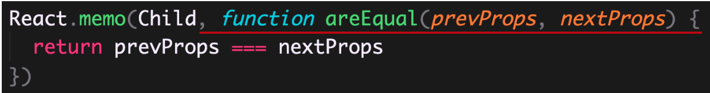

## 自定义hook

```jsx title="继续获取鼠标位置的示例"
// 使用hooks实现猫跟着鼠标移动
function Cat() {
  const [position, setPosition] = useState({
    x: 0,
    y: 0,
  });
  const move = (e) => {
    setPosition({
      x: e.pageX,
      y: e.pageY,
    });
  };
  useEffect(() => {
    document.addEventListener("mousemove", move);
    console.log(111);
    return () => {
      document.removeEventListener("mousemove", move);
    };
  }, []);
  return (
    <>
      </img>
    </>
  );
}
```

除了使用内置的 Hooks之外, 还可以创建自己的Hooks (自定义Hooks)

使用场景: **将组件状态逻辑提取到可重用的函数(自定义Hooks)中, 实现状态逻辑复用**

内置Hooks为函数组件赋予了class组件的功能; 在此之上, 自定义Hooks针对不同组件实现不同状态逻辑复用

- 自定义Hooks是一个函数, **约定函数名称必须以use开头, React就是通过函数名称是否以use开头来判断是不是Hooks**
- Hooks只能在函数组件中或其他自定义Hooks中使用, 否则, 会报错!
- 自定义Hooks用来提取组件的状态逻辑, 根据不同功能可以有不同的参数和返回值(就像普通函数一样)

### 提取到自定义hooks

```js title="自定义hook useMouse"
function useMouse() {
  const [position, setPosition] = useState({
    x: 0,
    y: 0,
  });
  const move = (e) => {
    setPosition({
      x: e.pageX,
      y: e.pageY,
    });
  };
  useEffect(() => {
    document.addEventListener("mousemove", move);
    console.log(111);
    return () => {
      document.removeEventListener("mousemove", move);
    };
  }, []);

  return position;
}

// 使用hooks实现猫跟着鼠标移动
function Cat() {
  const { x, y } = useMouse();

  return (
    <>
      </img>
    </>
  );
}
```

---

## useRef hook

使用场景：在 React 中进行 DOM 操作时，用来获取 DOM

作用：**返回一个带有 current 属性的可变对象，通过该对象就可以进行 DOM 操作了。**

```jsx
const inputRef = useRef(null)
```

解释：

+ 参数：在获取 DOM 时，一般都设置为 null
+ 返回值：包含 current 属性的对象。

```jsx
<input ref={inputRef}/>
```

+ 注意：只要在 React 中进行 DOM 操作，都可以通过 useRef Hook 来获取 DOM（比如，获取 DOM 的宽高等）。

+ 注意：useRef不仅仅可以用于操作DOM，还可以操作组件

---

## useContext hook


### context基础

使用场景：跨组件共享数据。

Context 作用：实现跨组件传递数据，而不必在每个级别手动传递 props，简化组件之间的数据传递过程


Context 对象包含了两个组件

+ Context.Provider value：通过 value 属性提供数据。

+ Context.Consumer：通过 render-props 模式，在 JSX 中获取 Context 中提供的数据。

```jsx
const Context = createContext(defaultValue)
```

注意：

1. 如果提供了 Provider 组件，Consumer 获取到的是 Provider 中 value 属性的值。
2. 如果没有提供 Provider 组件，Consumer 获取到的是 createContext(defaultValue) 的 defaultValue 值。

### useContext使用

作用：在函数组件中，获取 Context 中的值。要配合 Context 一起使用。

useContext Hook 与 Context.Consumer 的区别：获取数据的位置不同，

+ Context.Consumer：在 JSX 中获取 Context 共享的数据。
+ useContext：在 JS 代码中获取 Context 的数据。

```jsx
const ThemeContext = createContext('red')
const value = useContext(ThemeContext)
```

解释：

+ useContext 的参数：Context 对象，即：通过 createContext 函数创建的对象。
+ useContext 的返回值：Context 中提供的 value 数据。

---

## React.memo高阶组件 

### 介绍

React.memo 高阶组件的使用场景说明：

React 组件更新机制：只要父组件状态更新，子组件就会无条件的一起更新。

+ 子组件 props 变化时更新过程：组件代码执行 -> JSX Diff（配合虚拟 DOM）-> 渲染（变化后的内容）【 DOM 操作】。
+ 子组件 props 无变化更新过程：组件代码执行 -> JSX Diff（配合虚拟 DOM）【无 DOM 操作】。

注意：此处更新指的是组件代码执行、JSX 进行 Diff 操作（纯 JS 的操作，速度非常快，不会对性能产生太多影响）。

+ 如果组件 props 改变了，那么，该组件就必须要更新，才能接收到最新的 props。
+ 但是，如果组件 props 没有改变时，组件也要进行一次更新。实际上，这一次更新是没有必要的。

如果要避免组件 props 没有变化而进行的不必要更新（Diff），这种情况下，就要使用 React.memo 高阶组件。

注：`对于 class 组件来说，可以使用 PureComponent 或 shouldComponentUpdate 钩子函数来实现`。

```jsx
import { useState } from 'react'
import ReactDOM from 'react-dom'

const Child2 = ({ count }) => {
  console.log('Child2 子组件代码执行了')
  return <div style={{ backgroundColor: '#abc' }}>子组件2：{count}</div>
}

const Child1 = () => {
  console.log('Child1 子组件代码执行了')
  return <div style={{ backgroundColor: '#def' }}>子组件1</div>
}

const App = () => {
  const [count, setCount] = useState(0)

  return (
    <div style={{ backgroundColor: 'pink', padding: 10 }}>
      <h1>计数器：{count}</h1>
      <button onClick={() => setCount(count + 1)}>+1</button>
      <hr />

      {/* 子组件 */}
      <Child1 />
      <br />
      <Child2 count={count} />
    </div>
  )
}

ReactDOM.render(<App />, document.getElementById('root'))

```

### 语法

使用场景：当你想要避免函数组件 props 没有变化而产生的不必要更新时，就要用到 React.memo 了。

作用：**记忆组件上一次的渲染结果，在 props 没有变化时复用该结果，避免函数组件不必要的更新**。

```jsx
const MemoChild = React.memo(Child)
```

解释：

+ React.memo 是一个高阶组件，用来记忆（memorize）组件。
+ 参数（Child）：需要被记忆的组件，或者说是需要避免不必要更新的组件。
+ 返回值（MemoChild）：React 记住的 Child 组件。

原理：通过对比检查更新前后 props 是否相同，来决定是否复用上一次的渲染结果，

+ 如果相同，复用上一次的渲染结果；
+ 如果不同，重新渲染组件。


**并不是所有的组件都适合使用memo，比如child2组件，每次都需要重新渲染，使用memo反而会使性能变得更低，逻辑也变得更复杂**

### React.memo也是浅层对比

默认情况下，React.memo 只会对更新前后的 props 进行浅对比（shallow compare）与 PureComponent 相同。

也就是说，对于对象类型的 prop 来说，只会比较引用地址是否发生改变, 不会比较里面的值

:::tip 不更改原数据原则
这也告诉我们, 将来改数据的时候,
一直遵循的原则, 不直接改原数据, 应该调第二个参数去改,
而且传一个新数据, 将来去替换旧数据.

因为如果传相同地址的数据, 且该组件用memo去包裹了组件的话, 组件就会出现奇怪的bug
:::

+ 如果更新前后的引用相同，复用上一次的渲染结果（不会重新渲染该组件）。
+ 如果更新前后的引用不同，重新渲染该组件。

如果你要手动控制比较过程，可以使用 React.memo 的第二个参数：



解释：

+ 第二个参数：用来比较更新前后 props 的函数。
+ 返回值：如果返回 true，表示记住（不重新渲染）该组件；如果返回 false，表示重新渲染该组件。

---


## useCallback hook

### 使用场景

在使用 React.memo 时，对于对象类型的 props，只会比较引用（浅对比）。

但是，因为**组件每次更新都会创建新的 props 值**，比如，新的对象、事件处理程序等（函数组件的特性）。

这就导致：React.memo 在处理对象类型的 props 时，会失效（每次的 props 都是新对象）。

但是，我们还是想让 React.memo 在处理对象类型的 props 时，也有效。


为了让 React.memo 处理对象类型的 props 有效，只要在*组件更新期间保持对象类型引用相*等，就可以了。

这时候，就要用到以下两个 Hooks：

+ `useCallback` Hook：记住函数的引用，在组件每次更新时返回相同引用的函数。
+ `useMemo` Hook：记住任意数据（数值、对象、函数等），在组件每次更新时返回相同引用的数据【功能之一】


### 基本使用

使用场景：在使用 React.memo 时，为了组件每次更新时都能获取到相同引用的函数，就要用到 useCallback Hook

注意：**需要配合 React.memo 高阶函数一起使用**。

作用：记忆传入的回调函数，这个被记住的回调函数会一直生效，直到依赖项发生改变


解释：

+ 第一个参数：必选，需要被记忆的回调函数。
+ 第二个参数：必选，依赖项数组，用于指定回调函数中依赖（用到）的数据（类似于 useEffect 的第二个参数）。
+ 即使没有依赖，也得传入空数组（[]），此时，useCallback 记住的回调函数就会一直生效。
+ 返回值：useCallback 记住的回调函数。
+ useCallback 记住的回调函数会一直生效（或者说会一直返回同一个回调函数），直到依赖项发生改变。

```jsx
import { useState, memo, useCallback } from 'react'
import ReactDOM from 'react-dom'

const App = () => {
  const [count, setCount] = useState(0)
  const [money, setMoney] = useState(1000)

  const help = useCallback(() => {
    setCount(count - 1)
  }, [count])
  return (
    <div>
      <h1>计数器</h1>
      <div>豆豆被打了{count}次</div>
      <div>金钱：{money}</div>
      <button onClick={() => setCount(count + 1)}>打豆豆</button>
      <button onClick={() => setMoney(money + 100)}>加钱</button>
      <hr />
      {count < 5 ? <DouDou count={count} help={help}></DouDou> : '豆豆被打死了'}
    </div>
  )
}

const DouDou = memo(({ count, help }) => {
  console.log('豆豆组件渲染')
  return (
    <div>
      <h3>我是豆豆组件{count}</h3>
      <button onClick={help}>续命</button>
    </div>
  )
})

ReactDOM.render(<App />, document.getElementById('root'))

```

**useCallback需要配置React.memo使用才有意义，不然反而性能更低，因为useCallback来包裹函数也是需要开销的**

## useMemo hook

使用场景：类似于 useCallback，可以在组件更新期间保持任意数据引用相等，一般用来处理对象类型的数据

对比：useCallback 只能记忆函数，而 useMemo 可以记忆任意数据。

作用：**记忆任意数据，这个被记住的数据会一直生效，直到依赖项发生改变1**。

```jsx
const memorizedValue = useMemo(() => 需要记住的数据, deps)
```

语法

+ 第一个参数：必选，回调函数。注意：**该回调函数会被调用，并通过返回值指定需要被记住的数据**。
+ 第二个参数：必选，依赖项数组，用于指定回调函数中依赖（用到）的数据。同样，没有依赖项时，传入空数组（[]）。
+ 返回值：useMemo 记住的数据
+ useMemo 记住的数据会一直生效（或者说会一直返回同一个数据），直到依赖项发生改变。

如何选择使用哪一个？

+ 如果处理的是函数，推荐使用 useCallback Hook。
+ 如果处理的是其他数据（比如，对象），推荐使用 useMemo Hook。


### 示例

```jsx title="明显感到卡顿"
const App = () => {
  const [money, setMoney] = useState(1000)
  const sum = Array.from(new Array(1000000)).map((item, index) => index + 1).reduce((prev, item) => prev + item, 0)

  console.log(sum)
  return (
    <div>
      <h1>根组件--{sum}</h1>
      <div>{money}</div>
      <button onClick={() => setMoney(money + 1000)}>按钮</button>
    </div>
  );
};

```

```jsx title="使用useMemo优化"
  const [money, setMoney] = useState(10000);
  const total = useMemo(() => {
    console.log('我执行了')
    return Array.from(new Array(1000000))
      .map((item, index) => index + 1)
      .reduce((prev, item) => prev + item, 0);
  }, []);

```

### 模拟useCallback的用法

> `useCallback(fn, deps)` 相当于 `useMemo(() => fn, deps)`。

```jsx
const help = useCallback(() => {
  setCount(count - 1)
}, [count])


const help = useMemo(() => {
    return () => {
        setCount(count - 1)
    }
}, [count])
```

### 避免昂贵的计算（计算属性）

```js
const memoizedValue = useMemo(() => computeExpensiveValue(a, b), [a, b]);
```

---

## 总结

```js

/** 1. 为什么要有hooks
   1.1 代码逻辑复用: mixin(废弃)  render-props  HOC  hooks  useXXX
   1.2 class的缺点
      class中的this指向总是让人难以理解
      需要考虑到底使用函数组件还是class组件
      class组件不利于代码的压缩和优化
      class组件提供了生命周期函数, 导致一个功能被拆开到多个钩子函数中, 比如didMount里调方法, constructor里提供数据
      
   hooks解决的什么问题
     1. 逻辑复用
     2. 不再使用this
     3. 不需要考虑用哪个组件
     4. 使用函数方便代码压缩和优化(tree shaking)
     5. 一个功能写到一起, 便于阅读和维护
   
   2. useState
      作用: 给函数组件提供状态以及修改状态的方法
      方法: const [count, setCount] = useState(100)
            const [money, setMoney] = useState(() => { return xxx })

      注意: hooks只能在函数组件中或者自定义hooks中使用功能, 而且不能包含在if else for while语句中
            因为hooks依赖记住顺序, 如果改了顺序就乱了

    3. useEffect
      作用: 处理react中的副作用, 实现class组件中的钩子函数的功能.
      语法: useEffect(() => {})  组件第一次渲染以及每一次更新后都会执行
            useEffect(() => {}, [count]) 组件第一次渲染以及count发生改变后都会执行
            useEffect(() => {}, []) 组件第一次渲染

            清理副作用
            useEffect(() => {
              return () => {
                // 清理函数
              }
            })   ..会在销毁的时候以及每一次回调函数执行之前执行

            useEffect(() => {
              return () => {
                // 清理函数
              }
            }, []) ..只会在组件销毁的时候执行, 一般销毁定时器, 销毁注册事件等

      4. useRef
        作用: 用于操作DOM或者组件
            const inputRef = useRef(null)

            <div ref={inputRef}></div>

            inputRef.current 操作DOM

      5. useContext
        作用: 可以获取到context中的数据

        <Context.Provider value={value}></Context.Provider>
        在希望获取value的组件中: const value = useContext(Context)

      6. React.memo()
        作用: 高阶组件, 用于缓存一个组件, 对比组件的props和state是否发生改变, 如果不变, 就不会更新
              如果给组件传递一个函数或者复杂类型, 会导致memo失效, 因为浅层对比

      7. useCallback()
        作用: 缓存一个函数, 除非依赖项发生了变化, 重新缓存, 因为单独用性能更低, 所以需要配合React.memo

            const newFn = useCallback(fn, [depts]) // 缓存fn函数, 得到newFn新函数, 依赖变了就会产生新函数

      8. useMemo
        作用: 缓存任意类型的数据

            const memoData = useMemo(() => data, [depts])
            提供计算属性, 避免昂贵的计算. 复杂的运算尽量放到useMemo中

      9. useReducer 替代redux...
*/ 

```