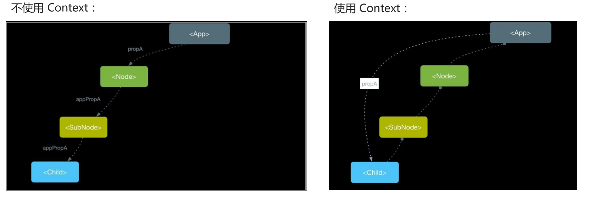

## 自定义hook

```jsx title="继续获取鼠标位置的示例"
// 使用hooks实现猫跟着鼠标移动
function Cat() {
  const [position, setPosition] = useState({
    x: 0,
    y: 0,
  });
  const move = (e) => {
    setPosition({
      x: e.pageX,
      y: e.pageY,
    });
  };
  useEffect(() => {
    document.addEventListener("mousemove", move);
    console.log(111);
    return () => {
      document.removeEventListener("mousemove", move);
    };
  }, []);
  return (
    <>
      </img>
    </>
  );
}
```

除了使用内置的 Hooks之外, 还可以创建自己的Hooks (自定义Hooks)

使用场景: **将组件状态逻辑提取到可重用的函数(自定义Hooks)中, 实现状态逻辑复用**

内置Hooks为函数组件赋予了class组件的功能; 在此之上, 自定义Hooks针对不同组件实现不同状态逻辑复用

- 自定义Hooks是一个函数, **约定函数名称必须以use开头, React就是通过函数名称是否以use开头来判断是不是Hooks**
- Hooks只能在函数组件中或其他自定义Hooks中使用, 否则, 会报错!
- 自定义Hooks用来提取组件的状态逻辑, 根据不同功能可以有不同的参数和返回值(就像普通函数一样)

### 提取到自定义hooks

```js title="自定义hook useMouse"
function useMouse() {
  const [position, setPosition] = useState({
    x: 0,
    y: 0,
  });
  const move = (e) => {
    setPosition({
      x: e.pageX,
      y: e.pageY,
    });
  };
  useEffect(() => {
    document.addEventListener("mousemove", move);
    console.log(111);
    return () => {
      document.removeEventListener("mousemove", move);
    };
  }, []);

  return position;
}

// 使用hooks实现猫跟着鼠标移动
function Cat() {
  const { x, y } = useMouse();

  return (
    <>
      </img>
    </>
  );
}
```

---

## useRef hook

使用场景：在 React 中进行 DOM 操作时，用来获取 DOM

作用：**返回一个带有 current 属性的可变对象，通过该对象就可以进行 DOM 操作了。**

```jsx
const inputRef = useRef(null)
```

解释：

+ 参数：在获取 DOM 时，一般都设置为 null
+ 返回值：包含 current 属性的对象。

```jsx
<input ref={inputRef}/>
```

+ 注意：只要在 React 中进行 DOM 操作，都可以通过 useRef Hook 来获取 DOM（比如，获取 DOM 的宽高等）。

+ 注意：useRef不仅仅可以用于操作DOM，还可以操作组件

---

## useContext hook


### context基础

使用场景：跨组件共享数据。

Context 作用：实现跨组件传递数据，而不必在每个级别手动传递 props，简化组件之间的数据传递过程



Context 对象包含了两个组件

+ Context.Provider value：通过 value 属性提供数据。

+ Context.Consumer：通过 render-props 模式，在 JSX 中获取 Context 中提供的数据。

```jsx
const Context = createContext(defaultValue)
```

注意：

1. 如果提供了 Provider 组件，Consumer 获取到的是 Provider 中 value 属性的值。
2. 如果没有提供 Provider 组件，Consumer 获取到的是 createContext(defaultValue) 的 defaultValue 值。

### useContext使用

作用：在函数组件中，获取 Context 中的值。要配合 Context 一起使用。

useContext Hook 与 Context.Consumer 的区别：获取数据的位置不同，

+ Context.Consumer：在 JSX 中获取 Context 共享的数据。
+ useContext：在 JS 代码中获取 Context 的数据。

```jsx
const ThemeContext = createContext('red')
const value = useContext(ThemeContext)
```

解释：

+ useContext 的参数：Context 对象，即：通过 createContext 函数创建的对象。
+ useContext 的返回值：Context 中提供的 value 数据。

---

