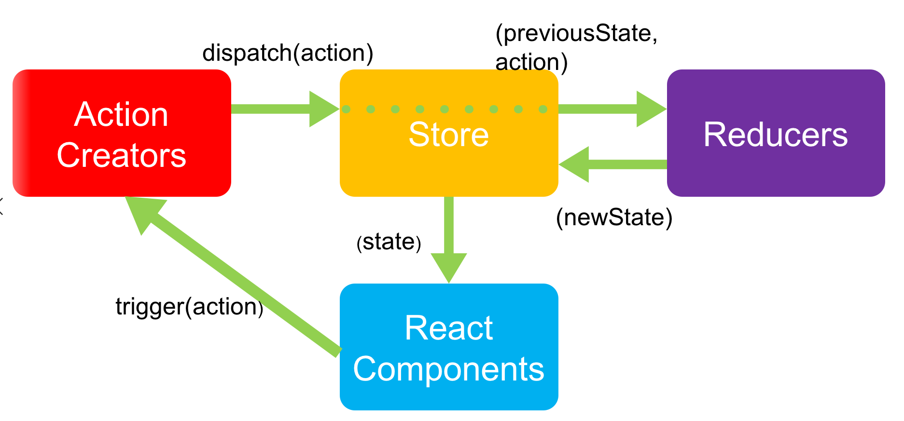
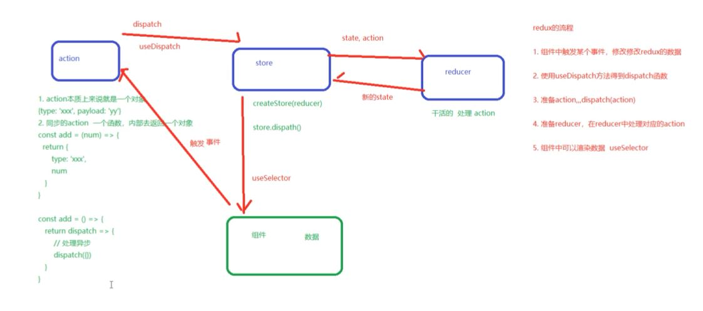

## Redux


## 基本介绍

> 概念

Redux 是 react 中最流行的状态管理工具之一  。 

> 起源

React 只是 DOM 的一个抽象层（UI 库），并不是 Web 应用的完整解决方案。因此react在涉及到数据的处理以及组件之间的通信时会比较

- 对于大型的复杂应用来说，这两方面恰恰是最关键的。因此，只用 React，写大型应用比较吃力。
- 2014 年 Facebook 提出了 Flux 架构的概念，引发了很多的实现。
- 2015 年，Redux 出现，将 Flux 与函数式编程（reducer）结合一起，很短时间内就成为了最热门的前端架构。 
- Flux 是最早的状态管理 工具，它提供了状态管理的思想，也提供对应的实现
- 除了 Flux、Redux 之外，还有：Mobx 等状态管理工具

> 什么时候使用 redux  

- 如果你不知道是否需要 Redux，那就是不需要它。
- 只有遇到 React 实在解决不了的问题，你才需要 Redux

> 为什么需要 redux

集中的方式统一管理所有的共享数据

> react 技术栈

- react 核心 react hooks
- react-router（react-router-dom）
- 状态管理： mobx（简单）/ redux（复杂）  ----中间件： redux-thunk  redux-saga


## Redux基本使用

### redux介绍和安装

1. redux的作用：[redux中文文档](https://www.cntofu.com/book/4/README.md) 	[redux官网（英文）](https://redux.js.org/introduction/getting-started) 
2. redux安装（在react项目中）

```shell
npx create-react-app reduxstudy
cd reduxstudy
yarn start
yarn add redux
新建src/test.html 导入redux包    
<script src="../node_modules/redux/dist/redux.js"></script>
// 测试redux是否安装成功
console.log(window.Redux)
```

`注意`：

1. redux和react没有任何关系，是一个为JS应用程序提供的状态管理工具
2. 关于在react中使用redux，后续会讲解

## redux管理流程

`目标`：明确redux的状态管理流程



### 理解三个核心概念

- 核心概念：`store`、`action`、`reducer`
  - `store`：仓库，存储了数据，管理者，管理 action 和 reducer
  - `action`：“专家”，只提想法不干活
  - `reducer`：劳动者，搬砖的人

```js
store: redux的仓库
	1. 提供了state与操作state的方法
	2. 一个redux项目中，只有一个store
    3. 是整个redux应用的管理者，指挥action和reducer干活的
action: 表示一个动作（添加内容，删除内容等）, 它是一个对象
	1. action描述了需要做一件什么样的事情（不执行）
    2. "专家": 只提想法，不干活
reducer: 劳动者, 是个函数
	1. 根据action来完成这个动作
    2. 实际干活的人
    3. reducer不会主动完成action，需要store控制
    4. 拿着prevState根据action产生newState
```

## redux-state初始数据

所有的 state 都被保存在一个单一对象中

## redux-action基本用法

`目标`：定义一个最基本的action

`内容`：

1.  actions 只是描述了*有事情发生了*这一事实，而不是真正修改数据的位置
2.  action 是任务的抽象，视图中的每个用户交互都是一个 action，比如：添加任务、删除任务、登录、加入购物车 等
3.  Action 本质上是 JavaScript 普通对象
4.  action 内必须使用一个字符串类型的 `type` 字段来表示将要执行的动作
5.  action如果数量过多，将来会采用模块化管理的方式，这里先写简单的

`核心代码`

```js
1. action是一个js对象
2. action必须提供type属性，表示动作的类型
3. type属性的值是一个字符串，采用全大写字母表示，多个单词使用_连接
{
	type: "INCREMENT"
}
4. action中除了type，还可以指定动作需要的其他数据
{
	type: "ADD_TODO",
	todoName: '学习redux'
}
5. 将来要完成的所有功能，都抽象成了一个个的动作

    // redux中action的概念
    // 1. action是一个动作或者行为的抽象
    // 2. 使用一个对象来表示一个action
    // 3. 每一个action有一个唯一的标识 type
    // 4. action除了type之外, 还可以有其他的属性, 用来提供额外的数据
    const add = {
      type: 'ADD'
    }
    const action = {
      type: 'SUB'
    }

    // 添加任务
    const action2 = {
      type: 'ADD_TODO',
      name: '吃饭'
    }

    // 删除任务
    const action3 = {
      type: 'DEL_TODO',
      id: 5
    }
```

`注意`：

1. 以上是过程性代码，还没有写完，不能测试
2. action的编写要点是记住各种规则

## redux-action creator创建函数

`目标`：使用函数去创建一个action

`内容`：

1.  直接使用对象来创建action不灵活，参数写死了。一般会使用函数来创建action，我们把创建action的函数叫做actionCreator
2.  action creator创建函数只是简单的返回一个 action
3.  action creator创建函数的好处是更容易被移植和测试

`核心代码`

```js
// test.html/script
const increment = {
    type: 'INCREMENT'
}
const increment = () => {
    return {
        type: 'INCREMENT'
    }
}
const increment = () => ({
    type: 'INCREMENT'
})

// 使用action创建函数：（添加任务）
const addTodo = {
    type: 'ADD_TODO',
    text: '加班'
}

const addTodo = (text) => ({
  type: 'ADD_TODO',
  text
})
addTodo('加班') // {type: '', text: ''}
addTodo('下课')
```

`注意`：

1. action创建函数只是为了易移植

## redux-reducer函数

`目标`：state、action都书写完毕，但二者目前没任何关系，通过学习reducer将二者产生联系

`内容`：

1. **Reducers** 指定了应用状态的变化如何响应 [actions](https://www.cntofu.com/book/4/docs/basics/Actions.md) 并发送到 store 的（reducer来根据 action 更新 state 的用法）
2.  reducer 就是一个`纯函数`，接收旧的 state 和 action，返回新的 state
3. 不要在reducer函数内部直接修改state（纯函数的要求）

```
1. reducer需要是一个纯函数
2. reducer不能修改传入进来的参数（state），应该根据传入的参数返回新的数据（state)
3. 伪代码语法： (prevState, action) => newState   根据传入的状态和action，完成对应的动作，返回新的状态

注意：
	1. 在reducer中不能修改传入的state状态，保证数据的不可变性（immutability）
    2. 如果有reducer处理不了的任务，需要返回默认的state
```

`核心代码`

```js title="示例1"
// 处理ADD_TODO动作的reducer：
const todos = (state = [], action) => {
  switch (action.type) {
    case 'ADD_TODO':
      // 返回新的state
      return [
        ...state,
        {
          text: action.text,
          completed: false
        }
      ]
  }
  default:
    return state
}

```

```jsx title="示例2"
      // reducer的作用: 处理action
      // 细节处理:
      //  1. reducer的state需要有一个默认值, 这个默认值就是redux的初始值
      //  2. reducer内部需要判断action的type, 根据type进行处理, 处理的时候不能修改原来的数据
      //  3. reducer遇到不认识的type, 一定要返回原来的state(重要)
      function reducer(state = 0, action) {
        // if (action.type === 'ADD') {
        //   return state + 1
        // }
        // if (action.type === 'MINUS') {
        //   return state - 1
        // }
        // return state
        switch (action.type) {
          case "ADD":
            return state + 1;
          case "MINUS":
            return state - 1;
          default:
            return state;
        }
      }
```

`注意`：

1. 要保证reducer函数的传函数特点，不要直接修改state
3. 遇到未知的 action 时，一定要返回旧的 `state`。

### reducer 纯函数的说明

- 特点：只要是固定的输入，必定得到固定的输出
- 原则：（一定要遵守！！！）
  - 不得改写参数
  - 不能调用 Date.now()或者 Math.random()等不纯的方法，因为每次会得到不一样的结果
  - 不能使用全局变量
- 1 reducer 必须是一个纯函数
- 2 纯函数主要的含义就是它不可以修改影响输入值
- 3 没有副作用，副作用指的是例如函数中一些异步调用或者会影响函数作用域之外的变量一类的操作
- 4 纯函数可以被缓存

```js
let num = 1
// 不要进行以下操作：
function todos() {
  // 1 不要调用以下方法：
  // Date.now()
  // Math.random()
  //
  // 2 ajax 请求之类的操作
  //
  // 3 不要尝试修改作用域外的数据
  // num = 3
}
```

## redux-store状态管理

`目标`：state、action、reducer都书写完毕，但目前三者还没联系，reducer函数没有调用，通过store进行使用打通数据管理

`内容`：

1. **Store** 是把actioin、reducer联系到一起的对象 => 利用Redux的API进行创建createStore()
2. 提供 [`getState()`](https://www.cntofu.com/book/4/docs/api/Store.md#getState) 方法获取 state
3. 提供 [`dispatch(action)`](https://www.cntofu.com/book/4/docs/api/Store.md#dispatch) 方法更新 state；
4. 通过 [`subscribe(() => {})`](https://www.cntofu.com/book/4/docs/api/Store.md#subscribe) 注册监听器, 只要state发生了变化, 这个订阅的回调函数就会执行;
5. 通过 [`unsubscribe()`](https://www.cntofu.com/book/4/docs/api/Store.md#subscribe) 函数调用了就会取消订阅。

`核心代码`

```js title="示例1"
//   创建store
const { createStore } = window.Redux
//   createStore(reducer函数,可选=>state初始值)
let store = createStore(addReducer)
// 打印初始状态
console.log(store.getState()) // {count: 1}
// 每次 state 更新时，打印日志
// 注意 subscribe() 返回一个函数用来注销监听器
const unsubscribe = store.subscribe(() => console.log(store.getState()))

// 发起一系列 action
store.dispatch(add(2))
store.dispatch(add(4))
// 停止监听 state 更新
unsubscribe();
```

```js title="示例2"
      const add = () => {
        return {
          type: "ADD",
        };
      };

      // action creator
      const minus = () => ({
        type: "MINUS",
      });

      // reducer
      // reducer是一个函数, 用于提供处理action的逻辑
      // reducer必须是一个纯函数 pure function
      function reducer(state = 100, action) {
        switch (action.type) {
          case "ADD":
            return state + 1;
          case "MINUS":
            return state - 1;
          default:
            return state;
        }
      }

      // store
      const { createStore } = window.Redux;
      // 参数1: 必传reducer
      const store = createStore(reducer);
      console.log(store);

      // store.getState()  作用: 获取redux中的数据, 首次获取的是默认值
      console.log(store.getState());

      store.dispatch(add());
      console.log(store.getState());
```

`注意`：

1. 注意代码顺序：先创建store，启动监听，修改数据时自动在监听里面获取最新数据
2. 总结梳理整个流程


## 小结

1. redux和react目前没有任何关系（结合redux应该怎么使用呢？后续）
2. redux每部分的写法都是基础写法，没有考虑模块化和代码拆分等
3. 纯函数，目前只需要知道的特点是不能直接修改数据
4. 目前不考虑异步action的情况

---

## react-redux（结合react和hooks）

- [ ] 在react项目中如何使用redux

### 在react项目中使用redux

`目标`：在脚手架创建的react项目中使用最基本的redux

`内容`：

1. 把redux的基本代码该写在react项目中的对应文件
2. 考虑代码的模块化和基本拆分

`核心代码`

`store/actions.js`

```js
export const add = () => ({ type: "ADD" });
export const minus = () => ({ type: "MINUS" });
```

`store/reducers.js`

```js
function reducer(state = 0, action) {
  console.log(action);
  if (action.type === "ADD") {
    return state + 1;
  }
  if (action.type === "MINUS") {
    return state - 1;
  }
  return state;
}

export default reducer;
```

`index.js`

```js
import React from "react";
import ReactDom from "react-dom";
import store from "./store";
import { add, minus } from "./store/action";


function App() {
  return (
    <div>
    <h1>根组件</h1>
    <div>我被点击了{store.getState()}次</div>
    <button onClick={() => store.dispatch(add())}>+1</button>
    <button onClick={() => store.dispatch(minus())}>-1</button>
  </div>
  )
}

ReactDom.render(<App />, document.getElementById("root"));

store.subscribe(() => {
  console.log('变化了')
  ReactDom.render(<App />, document.getElementById("root"));
})
```


`问题`：

1. 确实做到了状态的声明和修改都交给了redux
2. 但目前用redux似乎状态管理变得更加麻烦

## react-redux包的基本使用

`目标`：使用[react-redux](https://react-redux.js.org/introduction/getting-started)简化redux在react项目中的使用 

`内容`：

1. 介绍react-redux => yarn add react-redux
2. 安装并且配置react-redux => 参考文档
3. 优化刚才的代码

`核心代码`

`store/store.js`

```js
import { createStore } from 'redux'
import { addReducer } from './reducers.js'
let store = createStore(addReducer)
export default store
```

`store/reducers.js`

```js
export const addReducer = (
  state = {
    count: 1,
  },
  action
) => {
  switch (action.type) {
    case 'ADD':
      return Object.assign({}, state, { count: action.count })
    default:
      return state
  }
}

```

`index.js`

```js
import ReactDOM from 'react-dom'
import App from './App.js'
import store from './store/store.js'
import { Provider } from 'react-redux'
ReactDOM.render(
  <Provider store={store}>
    <App />
  </Provider>,
  document.querySelector('#root')
)

```

`App.js`

```js
import { add } from './store/actions'
import { connect } from 'react-redux'
const App = (props) => {
  console.log(props)
  const { count, dispatch1 } = props
  return (
    <div>
      <h3>App</h3>
      <p>{count}</p>
      <button
        onClick={() => {
          dispatch1()
        }}
      >
        点我+2
      </button>
    </div>
  )
}

const mapStateToProps = (state, ownProps) => {
  const { count } = state
  return {
    count,
  }
}
const mapDispatchToProps = (dispatch, ownProps) => {
  return {
    dispatch1: () => {
      dispatch(add(2))
    },
  }
}

export default connect(mapStateToProps, mapDispatchToProps)(App)

```

`要点`：

1. react-redux只是简化了在react项目中使用redux的过程
2. redux和react-redux两个包都需要安装和使用，各司其职
3. 需要知道Provider和connect的作用
4. connect是高阶组件 => 把redux里面数据和修改数据的方法映射到组件中为了使用方便

### react-redux结合hooks用法-useSelector

`目标`：结合hooks使用react-redux

`内容`：

1. react-redux提供了useSelector
2. useSelector： 从Redux 的 store 中获取 状态(state) 数据。
3.  selector 函数应该是个纯函数

`App.js`

```js
// import { add, addAfterOneSecond } from './store/actions'
import { useSelector } from 'react-redux'

const App = () => {
  const count = useSelector((state) => state.count)
  return (
    <div>
      <h3>App</h3>
      <p>{count}</p>
      <button
        onClick={() => {
          // dispatch(add(2))
        }}
      >
        点我+2
      </button>
      <button
        onClick={() => {
          // dispatch(addAfterOneSecond(2))
        }}
      >
        点我1s后+2
      </button>
    </div>
  )
}

export default App

```

`要点`：

- Provider组件依然需要使用

### react-redux结合hooks用法-useDispatch

`目标`：结合hooks使用react-redux，修改数据

`内容`：

1. react-redux提供了useDispatch
2. useDispatch：修改数据的hooks

`App.js`

```js
import { add, addAfterOneSecond } from './store/actions'
import { useSelector, useDispatch } from 'react-redux'

const App = () => {
  const count = useSelector((state) => state.count)
  const dispatch = useDispatch()
  return (
    <div>
      <h3>App</h3>
      <p>{count}</p>
      <button
        onClick={() => {
          dispatch(add(2))
        }}
      >
        点我+2
      </button>
      <button
        onClick={() => {
          dispatch(addAfterOneSecond(2))
        }}
      >
        点我1s后+2
      </button>
    </div>
  )
}

export default App

```

`要点`：无

## redux-异步action中间件redux-thunk的使用

`目标`：如何处理异步的action呢？比如点击按钮，1s后+1

`内容`：

1. [redux-thunk](https://github.com/reduxjs/redux-thunk)的介绍，安装 
2. 配置redux-thunk
3. 编写异步action
4. App.js中测试

`核心代码`

`store/reducers.js` 不变

`index.js`不变

`store/store.js`

```js
import { createStore, applyMiddleware } from 'redux'
import thunk from 'redux-thunk'
import { addReducer } from './reducers.js'

// let store = createStore(addReducer)
const store = createStore(addReducer, applyMiddleware(thunk))
export default store


```

`store/actions.js`

```js
export const add = (count) => {
  return {
    type: 'ADD',
    count,
  }
}

export const addAfterOneSecond = (count) => {
  return (dispatch) => {
    // console.log(dispatch)
    setTimeout(() => {
      dispatch(add(count))
    }, 1000)
  }
}

```

`App.js`

```js
import { add, addAfterOneSecond } from './store/actions'
// import { add } from './store/actions'

const App = (props) => {
  const {
    store: { getState, dispatch },
  } = props
  const { count } = getState()
  return (
    <div>
      <h3>App</h3>
      <p>{count}</p>
      <button
        onClick={() => {
          dispatch(add(2))
        }}
      >
        点我+2
      </button>
      <button
        onClick={() => {
          dispatch(addAfterOneSecond(2))
        }}
      >
        点我1s后+2
      </button>
    </div>
  )
}

export default App

```

`注意`：

1. redux-thunk是专门处理redux中异步action的中间件
2. 当要异步操作数据变化时，需要用redux-thunk包


## 各包使用的api

```jsx
/**
 * redux
 *  createStore, applyMiddleware, combineReducers
 * react-redux
 *  Provider useSelector useDispatch
 * redux-thunk
 *  import thunk from 'redux-thunk'
 */

```

流程草图
