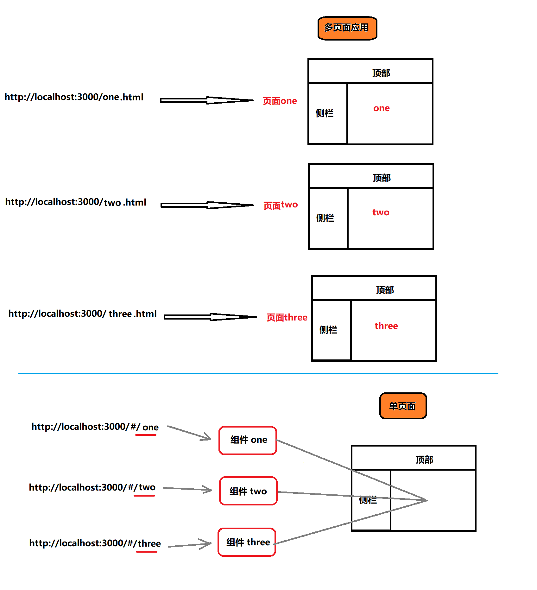
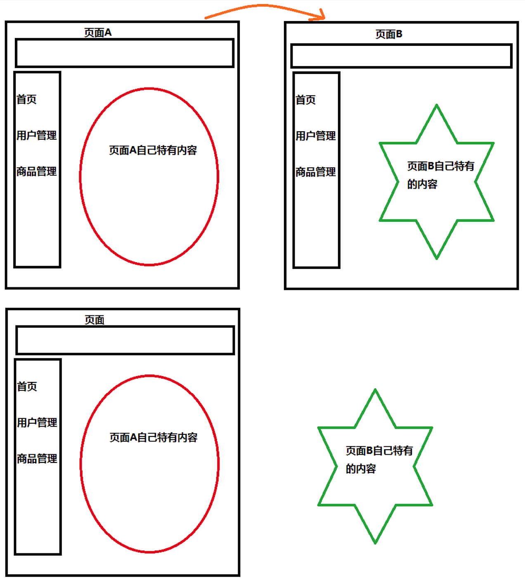
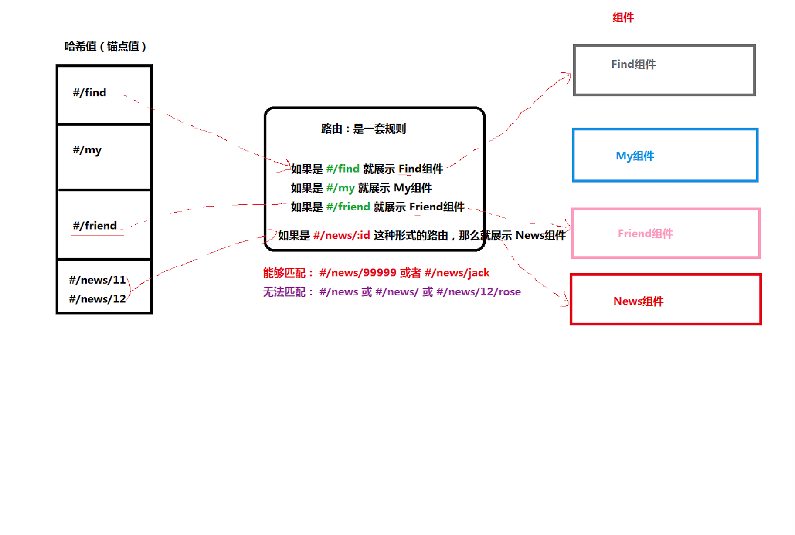

## 路由基本介绍

现代的前端应用大多都是 SPA（单页应用程序），也就是只有一个 HTML 页面的应用程序。因为它的用户体验更好、对服务器的压力更小，所以更受欢迎。为了有效的使用单个页面来管理原来多页面的功能，前端路由应运而生。

+ 前端路由的功能：让用户从一个视图（页面）导航到另一个视图（页面）
+ 前端路由是一套映射规则，在React中，是 URL路径 与 组件 的对应关系  
+ 使用React路由简单来说，就是配置 路径和组件（配对）

- 想要实现单页应用程序（SPA），就必须使用到路由  react-router
- 官网：[react-router](https://reacttraining.com/react-router/)



:::tip 网易云音乐
该网站网页锚点值发生变化, 并不会导致页面跳转  
页面不跳转意味着页面没刷新, 那么加载的静态资源只需要加载一次  
不需要多次加载  
:::

### 单页应用优势

1. 加快页面响应速度, 降低了对服务器的压力
+ 传统的多页应用, 每次请求服务器返回的都是一整个完整的页面
+ 单页面应用程序只有第一次会加载完整的页面, 以后每次请求仅仅获取必要的数据

2. 更好的用户体验, 运行更加流畅



### 单页应用缺点
不利于SEO
+ 因为爬虫只爬取HTML页面中的文本内容, 不会执行JS代码
+ 可以通过SSR(服务端渲染SSR)来解决SEO问题, 先在服务端把内容渲染出来, 然后, 返回给浏览器的就是纯HTML内容
+ 页面静态化, 比如, 对于一个电商应用可以为每一个商品生产一个静态的HTML页面, 静态HTML页面中是带有文字内容的, 所以, 有利于SEO的 

--------------------

## React 路由

- React 路由介绍
- 路由的基本使用
- 路由的执行过程
- 路由的常用操作

### React 路由介绍

现代的前端应用大多都是 SPA（单页应用程序），也就是只有一个 HTML 页面的应用程序。因为它的用户体验更好、对服务器的压力更小，所以更受欢迎。为了**有效的使用单个页面来管理原来多页面的功能，前端路由应运而生**。前端路由的功能：让用户从一个视图（页面）导航到另一个视图（页面）

- 前端路由是一套**映射规则**，在React中，是 *URL路径* 与 *组件* 的对应关系 
- 使用 React 路由简单来说就是：配置路径和组件（配对）




### 模拟路由的实现

```jsx
import React, { PureComponent } from 'react'
import ReactDOM from 'react-dom'
import Home from './pages/Home'
import My from './pages/My'
import Friend from './pages/Friend'
class App extends PureComponent {
  state = {
    currentHash: '',
  }
  // hashchange: 锚点值（hash）改变就会触发
  componentDidMount() {
    // 注册事件
    window.addEventListener('hashchange', () => {
      console.log('hash值变了', window.location.hash)
      this.setState({
        currentHash: window.location.hash.slice(1),
      })
    })
  }
  render() {
    const { currentHash } = this.state
    return (
      <div>
        <h1>app组件</h1>
        <ul>
          <li>
            <a href="#/home">首页</a>
          </li>
          <li>
            <a href="#/my">我的音乐</a>
          </li>
          <li>
            <a href="#/friend">我的朋友</a>
          </li>
        </ul>
        {currentHash === '/home' && <Home></Home>}
        {currentHash === '/my' && <My></My>}
        {currentHash === '/friend' && <Friend></Friend>}
      </div>
    )
  }
}

// 渲染组件
ReactDOM.render(<App />, document.getElementById('root'))

```

## React 路由基本使用

官网：https://reactrouter.com/

### 基本步骤

+ 安装

```js
yarn add react-router-dom
```

+ `react-router-dom`这个包提供了三个核心的组件

```jsx 
import { HashRouter, Route, Link } from 'react-router-dom'
// Link: 导航链接 代替a标签
// Route: 指定路由规则
// HashRouter: 整个路由组件, 类似于vue中的VueRouter,
// 我们项目中想要使用react-router的话，必须使用HashRouter包裹整个内容
// 意思是项目中必须要有个路由对象， 这个对象叫HashRouter 
```

+ 使用`HashRouter`包裹整个应用，一个项目中只会有一个Router

```jsx
<Router>
    <div className="App">
    // … 省略页面内容
    </div>
</Router>
```

+ 使用Link替代a标签指定导航链接

```jsx
<Link to="/first">页面一</Link>
<Link to="/two">页面二</Link>
```

+ 使用`Route`指定路由规则

```jsx
// 在哪里写的Route,最终匹配到的组件就会渲染到这
<Route path="/first" component={First}></Route>
```

### Router详细说明

+ Router 组件：包裹整个应用，一个 React 应用只需要使用一次
+ 两种常用 Router：`HashRouter` 和 `BrowserRouter`, 对比vue路由模式, vue路由模式有hash模式和history模式   
+ HashRouter：使用 URL 的哈希值实现（http://localhost:3000/#/first）
  - 原理：监听 window 的 `hashchange` 事件来实现的
+ （推荐）BrowserRouter：使用 H5 的 history API 实现（http://localhost:3000/first）
  - 原理：监听 window 的 `popstate` 事件来实现的


```jsx title="最佳实践"
import { BrowserRouter as Router, Route, Link } from "react-router-dom";

class App extends React.Component {
  render() {
    return (
      <Router>
        <div>
          <h1>app组件</h1>
          <ul>
            <li>
              <Link to="/home">首页</Link>
            </li>
            <li>
              <Link to="/my">我的</Link>
            </li>
            <li>
              <Link to="/friend">朋友</Link>
            </li>
          </ul>
          <Route path="/home" component={Home}></Route>
          <Route path="/my" component={My}></Route>
          <Route path="/friend" component={Friend}></Route>
        </div>
      </Router>
    );
  }
}
```

## React路由的执行过程

:::tip React路由的执行过程
1. 点击 Link 组件（a标签），修改了浏览器地址栏中的 url
2. React 路由监听到地址栏 url 的变化  hash模式监听hashChange事件  broswer模式监听popState事件. 这样react路由就知道路由发生变化了  
3. React 路由内部遍历所有 Route 组件，也就是找到所有的路由规则(path). 挨个遍历比较, 比较地址栏中的地址跟组件路径是否匹配, 比如/home, /my. 使用路由规则（path）与 pathname（hash）进行匹配  
4. 当路由规则（path）能够匹配地址栏中的 pathname（hash） 时，就展示该 Route 组件的内容, 不匹配不显示  
:::
## Link与NavLink

[A special version of the Link标签 that will add styling attributes to the rendered element when it matches the current URL.](https://v5.reactrouter.com/web/api/NavLink)

`Link`组件最终会渲染成a标签，用于指定路由导航

+ to属性，将来会渲染成a标签的href属性
+ `Link`组件无法实现导航的高亮效果

`NavLink`组件，一个更特殊的`Link`组件，可以用用于指定当前导航高亮

+ to属性，用于指定地址，会渲染成a标签的href属性
+ activeClass: 用于指定高亮的类名，默认`active`
+ exact: 精确匹配，表示必须精确匹配类名才生效

## Route组件

- path 的说明
  - 默认情况下，/能够匹配任意/开始的路径
  - 如果 path 的路径匹配上了，那么就可以对应的组件就会被 render
  - 如果 path 没有匹配上，那么会 render null
  - 如果没有指定 path，那么一定会被渲染
- exact 的说明， exact 表示精确匹配某个路径
  - 一般来说，如果路径配置了 /， 都需要配置 exact 属性

### Switch与404

+ 通常，我们会把`Route`包裹在一个`Switch`组件中

+ 在`Switch`组件中，不管有多少个路由规则匹配到了，都只会渲染第一个匹配的组件
+ 通过`Switch`组件非常容易的就能实现404错误页面的提示

```js
<Switch>
  <Route exact path="/" component={Home}/>
  <Route path="/about" component={About}/>
  <Route path="/user" component={User}/>
  <Route component={NoMatch}/>
</Switch>
```

## 嵌套路由的配置

+ 在React中，配置嵌套路由非常的简单，因为`Route`就是一个组件，可以在任意想配置的地方进行配置

+ 但是配置嵌套路由的时候，需要对路径进行处理，必须要先匹配到父级路由，才能匹配到子路由

```js
// 通过/home可以匹配Home父组件  再通过/list匹配子组件
<Route path="/home/list" component={List} />
```

## 编程式导航

+  场景：点击登录按钮，登录成功后，通过代码跳转到后台首页，如何实现？
+  编程式导航：通过 JS 代码来实现页面跳转
+  history 是 React 路由提供的，用于获取浏览器历史记录的相关信息
+  push(path)：跳转到某个页面，参数 path 表示要跳转的路径
+  go(n)： 前进或后退到某个页面，参数 n 表示前进或后退页面数量（比如：-1 表示后退到上一页）

```js
class Login extends Component {
    handleLogin = () => {
        // ...
        this.props.history.push('/home')
    }
    render() {...省略其他代码}
}
```

## 动态路由与路由参数获取

+ 可以使用`:id`的方式来配置动态的路由参数

```js
// 可以匹配 /users/1  /users/2  /users/xxx
<Route path="/users/:id" component={Users} />
```

+ 在组件中，通过`props`可以接收到路由的参数

```js
render(){
    console.log(this.props.match.params)
}
```

