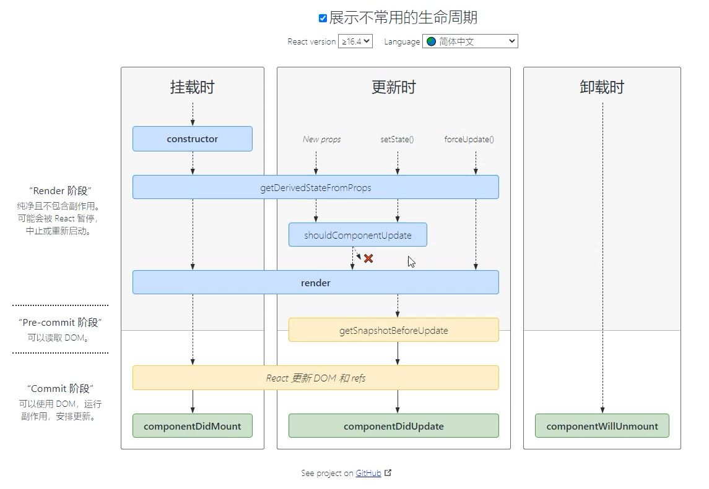

## setState

### 更新数据

+ setState() 是异步更新数据的
+ 注意：使用该语法时，后面的 setState() 不要依赖于前面的 setState()

```js
1. 当你调用 setState 的时候，React.js 并不会马上修改 state （为什么）
2. 而是把这个对象放到一个更新队列里面
3. 稍后才会从队列当中把新的状态提取出来合并到 state 当中，然后再触发组件更新。
```

+ 可以多次调用 setState() ，只会触发一次重新渲染

```js
this.state = { count: 0 }
this.setState({
	count: this.state.count + 1
})
console.log(this.state.count) // 0

// setState异步的意味着
// 当调用setState时, 异步在浏览器执行,
// 可以理解为count + 1不是立马执行, 而是继续执行下面console.log代码
// 所以先打印console, 打印完再执行setState
// 因为setState干两件事, 更新dom并且修改数据更新dom 
```

在使用 React.js 的时候，并不需要担心多次进行 `setState` 会带来性能问题。

### 推荐语法

+  推荐：使用 `setState((preState) => {})` 语法

+  这样写可以依赖到上一次的state

+  参数preState: React.js 会把上一个 `setState` 的结果传入这个函数

```jsx
this.setState((preState) => {
    return {
    	count: preState.count + 1
    }
})
console.log(this.state.count) // 1
```

**这种语法依旧是异步的，但是state可以获取到最新的状态，适用于需要调用多次setState**

### 第二个参数

+ 场景：在状态更新（页面完成重新渲染）后立即执行某个操作
+  语法：`setState(updater[, callback])`
+ 这个回调函数会等状态更新完 , 包括dom重新渲染之后才会执行第二个参数回调 

```jsx
this.setState(
	(state) => ({}),
	() => {console.log('这个回调函数会在状态更新后立即执行')}
)
```


```js
this.setState(
	(state, props) => {},
	() => {
		document.title = '更新state后的标题：' + this.state.count
	}
)
```

## 组件更新机制

+  setState() 的两个作用： 1. 修改 state 2. 更新组件（UI）
+ 过程：父组件重新渲染时，也会重新渲染子组件。但只会渲染当前组件子树（当前组件及其所有子组件）

 

:::tips
props2更新了,  
下面的child1和child2以及孙组件都跟着更新  
虽然性能没有太大影响, 但是考虑如何进行一些优化.  
见下
:::

### 组件性能优化

1. 功能第一
2. 性能优化

###  减轻state

+ 减轻 state：只存储跟组件渲染相关的数据（比如：count / 列表数据 / loading 等）
+ 注意：不用做渲染的数据不要放在 state 中，比如定时器 id等  
+ 这种东西会变, 但是变了不需要重新更新dom, 就不要放到state中  
+ 因为如果要改需要setState去改, 用setState改就会导致一些不必要的更新, 下面代码    
+ 对于这种需要在多个方法中用到的数据，应该直接放在 this 中 
  + this.xxx = 'bbb'
  + this.xxx

```jsx
class Hello extends Component {
    componentDidMount() {
        // timerId存储到this中，而不是state中
        this.timerId = setInterval(() => {}, 2000)
    }
    componentWillUnmount() {
    	clearInterval(this.timerId)
    }
    render() { … }
}
```

vue中不要把和渲染无关的数据放到data中

### 避免不必要的重新渲染

+  组件更新机制：父组件更新会引起子组件也被更新，这种思路很清晰
+ 问题：子组件没有任何变化时也会重新渲染 （接收到的props没有发生任何的改变）
+ 如何避免不必要的重新渲染呢？
+  解决方式：使用钩子函数 `shouldComponentUpdate(nextProps, nextState)`

+  作用：通过返回值决定该组件是否重新渲染，返回 true 表示重新渲染，false 表示不重新渲染
+ 触发时机：更新阶段的钩子函数，组件重新渲染前执行 （shouldComponentUpdate => render）

```jsx
class Hello extends Component {
    shouldComponentUpdate() {
        // 根据条件，决定是否重新渲染组件
        return false
    }
    render() {…}
}

 shouldComponentUpdate(nextProps, nextState) {
        console.log(this.props)  // 这里打印的props是更新前的
        console.log(nextProps)  // 是即将要更新时的props, 也就是接收到的props
        return false
    }
    render() {…}
```

 


## 纯组件

+ 纯组件：`React.PureComponent` 与 `React.Component `功能相似
+ 区别：PureComponent 内部自动实现了 shouldComponentUpdate 钩子，不需要手动比较
+ 原理：纯组件内部通过分别 对比 前后两次 props 和 state 的值，来决定是否重新渲染组件

:::tip
注意纯组件内部用到的是浅层对比(shallow compare)  
:::

```jsx
class Hello extends React.PureComponent {
    render() {
        return (
        	<div>纯组件</div>
        )
    }
}
```

**只有在性能优化的时候可能会用到纯组件，不要所有的组件都使用纯组件，因为纯组件需要消耗性能进行对比**

### 浅层对比(shallow compare)
```jsx
-----------值比较-------------
class App extends React.PureComponent {
  state = {
    msg: "hello"
  }
  render() {
    console.log('render')
    return (
      <div>
        <h1>app组件-- {this.state.msg}</h1>
        <button onClick={this.handleClick}>修改</button>
       </div>
    );
  }

  handleClick = () => {
    this.setState({ msg: "world" });
  }
}

// msg变为world之后, render不会再次打印


-----------引用类型比较-------------
class App extends React.PureComponent {
  state = {
    msg: "hello",
    user: {
      name: "zs",
      age: 18,
    },
  };
  render() {
    console.log("render");
    return (
      <div>
        <h1>app组件-- {this.state.msg}</h1>
        <div>{this.state.user.name} - {this.state.user.age}</div>
        <button onClick={this.handleClick}>修改</button>
      </div>
    );
  }

  handleClick = () => {
    // this.setState({ msg: "wrold" });
    this.setState({
      user: {
        ...this.state.user,
        age: 20
      }
    })
  };
}
// 这样user给的是新对象, 所以对比时发现, user变化了
// 因为新老对象不一样, 这样是正确的用法.
// 如果错误的用法如下
  handleClick = () => {
    this.state.user.age = 20 
    this.setState({
      user: this.state.user
    })
  };

// 这样依然不会更新, 因为判断出user还是原来的user
// 浅层对比只判断当前对象是否是新对象, 不是新对象就不会更新 
// 所以不要改原来的数据, 要给新数据
```

### 纯组件比较-值类型

+ 说明：纯组件内部的对比是 shallow compare（浅层对比）

+  对于值类型来说：比较两个值是否相同（直接赋值即可，没有坑）

```jsx
let number = 0
let newNumber = number
newNumber = 2
console.log(number === newNumber) // false
```

```jsx
state = { number: 0 }
setState({
  number: Math.floor(Math.random() * 3)
})
// PureComponent内部对比：
最新的state.number === 上一次的state.number // false，重新渲染组件
```

### 纯组件比较-引用类型

+ 说明：纯组件内部的对比是 shallow compare（浅层对比）
+ 对于引用类型来说：只比较对象的引用（地址）是否相同

```jsx
const obj = { number: 0 }
const newObj = obj
newObj.number = 2
console.log(newObj === obj) // true
```


```jsx
state = { obj: { number: 0 } }
// 错误做法
state.obj.number = 2
setState({ obj: state.obj })
// PureComponent内部比较：
最新的state.obj === 上一次的state.obj // true，不重新渲染组件
```

纯组件的最佳实践：

 注意：state 或 props 中属性值为引用类型时，应该创建新数据，不要直接修改原数据！

```jsx
// 正确！创建新数据
const newObj = {...state.obj, number: 2}
setState({ obj: newObj })
// 正确！创建新数据
// 不要用数组的push / unshift 等直接修改当前数组的的方法
// 而应该用 concat 或 slice 等这些返回新数组的方法
this.setState({
	list: [...this.state.list, {新数据}]
})

```


