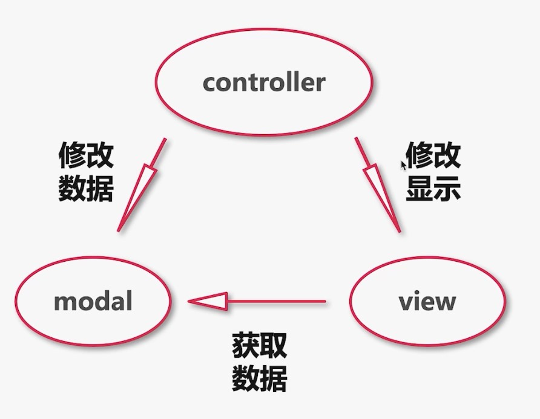

## 前端架构历史简介

### 初始无架构

前端代码内嵌到后端应用中

### 后端 mvc 架构

将视图层, 数据层, 控制层做分离

缺点: 重度依赖开发环境, 代码混淆严重. 比如前端调试时, 需要启动和安装后端所有依赖, 从本地调试. 非常复杂. 很多依赖通过后端服务注入.

### 前后端分离架构

将前端代码从后端环境中提炼出来(ajax 促进了前后端分离架构的发展)多页面架构

缺点:

- 前端缺乏独立部署能力, 整体流程依赖后端环境

发展:

Nodejs 发展诞生了多元化前端开发方式, 使得前端开发可以脱离整体后端环境

### 单页面架构

打包: gulp, rollup, webpack, vite..

框架: react/vue/angular..

ui 库: antd/iview/elementui/mintui...

优势:

切换页面无刷新浏览器, 用户体验好

组件化开发方式

缺点:

不利于 SEO, 首次渲染可能会较长时间白屏

### 大前端

后端框架: express, koa

包管理: npm, yarn

node 版本管理: nvm

### 微前端

- 技术栈无关

- 独立开发独立部署

- 支持增量升级

- 微前端是一种非常好的实施渐进式重构的手段和策略

- 微应用仓库独立, 前后端可独立开发, 主框架自动完成同步更新

缺点:

接入难度高

应用场景: 移动端少, 多在 PC 端管理后台上应用

### 总结

过于灵活的实现也导致了前端应用拆分过多, 维护困难

往往一个功能或需求会跨两三个项目进行开发
