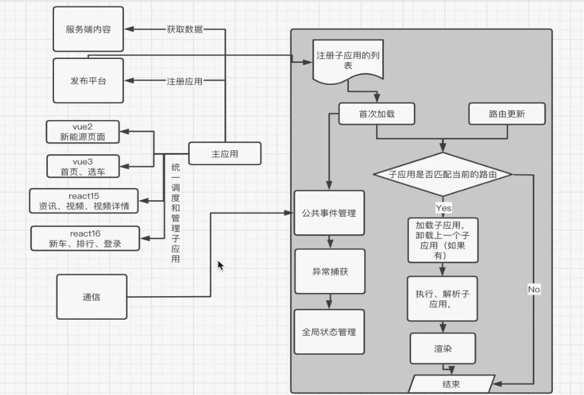

## 微前端实现方式对比

### 1. iframe

优势:

- 技术成熟, 浏览器支持好

- 支持页面嵌入, 通过 url 即可

- 天然支持运行沙箱隔离, 独立运行

劣势:

- 页面之间可以是不同域名, 在鉴权时需要处理, 增加开发量

- 需要对应的设计一套应用通讯机制, 如何监听, 传参格式等内容

### 2. web component

是 H5 的新技术

优势:

- 支持自定义元素

- 支持 shadow dom, 不占用原有 dom 层级, 并可通过关联关系进行控制

- 支持模板 template 和插槽 slot, 引入自定义组件内容

劣势:

- 接入微前端需要重写当前项目

- 生态不完善, 技术过新容易出现兼容性问题

- 整体架构设计复杂, 组件与组件之间拆分过细时, 容易造成通讯和控制繁琐

### 3. 框架

优势:

- 高度定制, 满足需要做兼容的一切场景

- 独立的通信机制和沙箱运行环境, 可解决应用之间相互影响的问题

- 支持不同技术栈子应用, 可无缝实现页面无刷新渲染

劣势:

- 需要设计一套定制的通信机制

- 首次加载会出现资源过大的情况

## 技术选型

### 主应用

主应用来控制子路由的改变和加载

### 子应用

### 后端服务和发布应用

## 绘制项目框架图

### 分析需求

- 主子应用功能

- 框架功能

#### 示例

1. 主应用

注册子应用

加载, 渲染子应用

路由匹配(配置 active 或者 rules - 由框架判断路由是否与子应用匹配)

获取数据(公共依赖, 通过数据做鉴权处理)

通信(父子通信, 子父的通信)

2. 子应用的功能

渲染

监听通信(主应用传递过来的数据)

3. 微前端框架的主要功能点

实现子应用的注册

有开始内容(应用加载完成, 路由更新判断匹配对应子应用)

加载子应用的内容

完成所有依赖项的执行

将子应用渲染在固定的容器内

公共事件的管理

异常的捕获和报错

全局的状态管理内容

沙箱的隔离

通信机制

4. 服务端的功能

提供数据

5. 发布平台

主子应用的打包和发布

### 架构图

