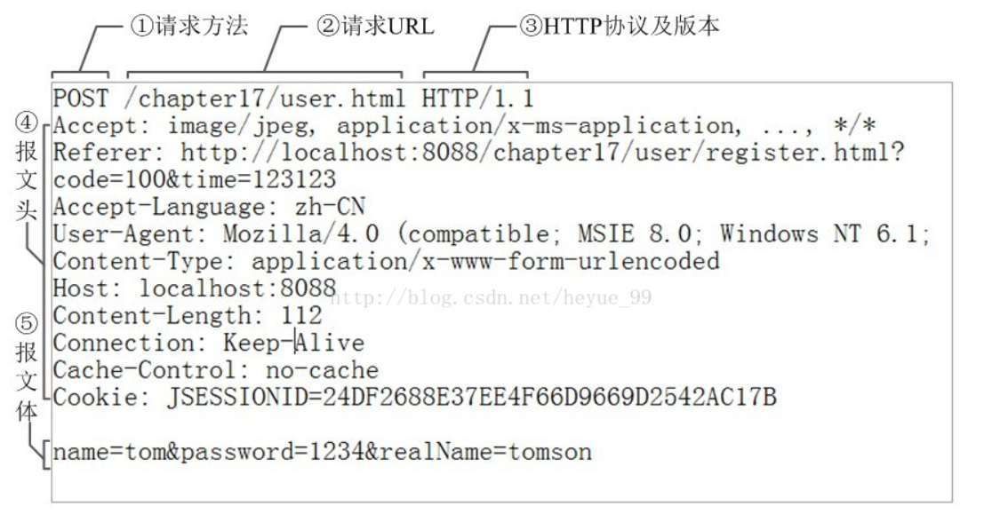
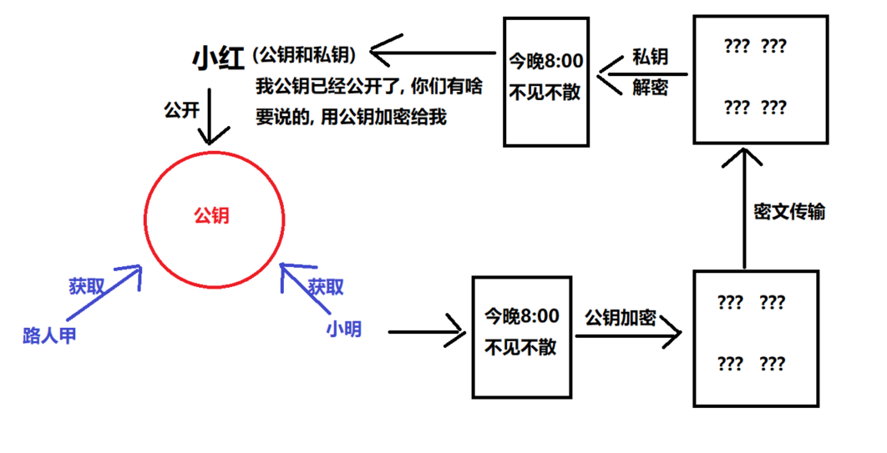

## 1. HTTP 有哪些方法？

HTTP 1.0 标准中，定义了 3 种请求⽅法：GET、POST、HEAD

HTTP 1.1 标准中，新增了请求⽅法：PUT、PATCH、DELETE、OPTIONS、TRACE、CONNECT

## 2. 各个 HTTP 方法的具体作用是什么？

|  方法   | 功能                                                                                                                                                             |
| :-----: | ---------------------------------------------------------------------------------------------------------------------------------------------------------------- |
|   GET   | 通常⽤于请求服务器发送某些资源                                                                                                                                   |
|  POST   | 发送数据给服务器                                                                                                                                                 |
|  HEAD   | 请求资源的头部信息, 并且这些头部与 HTTP GET ⽅法请求时返回的⼀致。该请求⽅法的⼀个使⽤场景是在下载⼀个⼤⽂件前先获取其⼤⼩再决定是否要下载, 以此可以节约带宽资源 |
|   PUT   | ⽤于全量修改⽬标资源 (看接口, 也可以用于添加)                                                                                                                    |
| DELETE  | ⽤于删除指定的资源                                                                                                                                               |
| OPTIONS | ⽤于获取⽬的资源所⽀持的通信选项 (跨域请求前, 预检请求, 判断目标是否安全)                                                                                        |
|  TRACE  | 该方法会 让服务器 原样返回任意客户端请求的信息内容, 用于诊断和判断                                                                                               |
| CONNECT | HTTP/1.1 协议中预留给能够将连接改为管道⽅式的代理服务器(把服务器作为跳板，让服务器代替用户去访问其它网页, 之后把数据原原本本的返回给用户)                        |
|  PATCH  | ⽤于对资源进⾏部分修改                                                                                                                                           |

GET POST PUT PATCH DELETE

GET/DELETE 参数是在地址栏中传递的

PUT/PATCH/POST 参数是在请求体传递的

## 3. GET 方法和 POST 方法有何区别？

默认的 http 请求的内容, 在网络中传输, 明文的形式传递的 (https 对内容加密)

|                  | GET 方法                                                                                                                                               | POST 方法                                          |
| ---------------- | ------------------------------------------------------------------------------------------------------------------------------------------------------ | -------------------------------------------------- |
| **数据传输⽅式** | 通过 URL 传输数据 (地址栏拼接参数)                                                                                                                     | 通过请求体传输                                     |
| **数据安全**     | 数据暴露在 URL 中，可通过浏览历史记录、缓存等很容易查到数据信息                                                                                        | 数据因为在请求主体内，<br />所以有⼀定的安全性保证 |
| **数据类型**     | 只允许 ASCII 字符                                                                                                                                      | ⽆限制                                             |
| **GET ⽆害**     | 刷新、后退等浏览器操作是⽆害的                                                                                                                         | 可能会引起重复提交表单                             |
| **功能特性**     | 安全且幂等（这⾥的安全是指只读特性，就是使⽤这个⽅法不会引起服务器状态变化。<br />**幂等的概念是指同⼀个请求⽅法执⾏多次和仅执⾏⼀次的效果完全相同）** | ⾮安全(会引起服务器端的变化)、**⾮幂等**           |

## 4. HTTP 请求报文是什么样的？

HTTP 请求报⽂的组成：请求⾏、请求头、(空⾏)、请求体。

实际请求报文实例:



**请求行**

包含了请求⽅法、URL、HTTP 协议版本，它们之间⽤空格进行分隔。例如：

```bash
GET http://www.abc.com/articles HTTP/1.1
```

**请求头**

请求头由键值对组成，每⾏⼀对，键值之间⽤英⽂冒号`:`进行分隔。例如：

```
Content-Type: application/json
Host: www.abc.com
```

**请求体**

请求体中放置 POST、PUT、PATCH 等请求方法所需要携带的数据。

## 5. HTTP 响应报文是什么样的？

HTTP 响应报⽂的组成: 响应⾏、响应头、空⾏、响应体。

**响应行**

响应行由协议版本、状态码、状态码的原因短语 3 个内容组成，中间以空格分隔。例如：

```bash
HTTP/1.1 200 OK
```

**响应头**

响应头由键值对组成，每⾏⼀对，键值之间⽤英⽂冒号`:`进行分隔。例如：

```
Content-Length: 1024
Content-Type: application/json
```

**响应体**

服务器发送过来的数据。

## 6. 你了解的 HTTP 状态码有哪些？

**成功（2XX）**

| 状态码  | 原因短语        | 说明                                                                                                                                                     |
| ------- | --------------- | -------------------------------------------------------------------------------------------------------------------------------------------------------- |
| **200** | OK              | 表示从客户端发来的请求在服务器端被正确处理                                                                                                               |
| **201** | Created         | 请求已经被实现，⽽且有⼀个新的资源已经依据请求的需要⽽建⽴, 通常是在 POST 请求，或是某些 PUT 请求之后创建了内容, 进行的返回的响应 , 规范的后台一般有这个 |
| 202     | Accepted        | 请求服务器已接受，但是尚未处理，不保证完成请求, 适合异步任务或者说需要处理时间比较长的请求，避免 HTTP 连接一直占用 . 比如检索服务端是否存在某数据        |
| 204     | No content      | 表示请求成功，但响应报⽂不含实体的主体部分                                                                                                               |
| **206** | Partial Content | 进⾏的是范围请求, 表示服务器已经成功处理了部分 GET 请求, 响应头中会包含获取的内容范围 (常用于分段下载) , 断点续传                                        |

**重定向（3XX）**

| 状态码  | 原因短语           | 说明                                                                                                                                                                           |
| ------- | ------------------ | ------------------------------------------------------------------------------------------------------------------------------------------------------------------------------ |
| 301     | Moved Permanently  | 永久性重定向，表示资源已被分配了新的 URL<br />比如，我们访问 **http**://www.baidu.com 会跳转到 **https**://www.baidu.com                                                       |
| 302     | Found              | 临时性重定向，表示资源临时被分配了新的 URL, 支持搜索引擎优化<br />比如一开始访问首页, 遇到了需要登录才能操作的内容, 此时要重定向到登录页或其他页面, 但是登录成功之后还是要回去 |
| 303     | See Other          | 对于 POST 请求，它表示请求已经被处理，客户端可以接着使用 GET 方法去请求 Location 里的 URI。                                                                                    |
| **304** | **Not Modified**   | **自从上次请求后，请求的网页内容未修改过。<br />服务器返回此响应时，不会返回网页内容。(协商缓存)**                                                                             |
| 307     | Temporary Redirect | 对于 POST 请求，表示请求还没有被处理，客户端应该向 Location 里的 URI 重新发起 POST 请求。                                                                                      |

因为 post 请求, 是非幂等的, 从 302 中, 细化出了 303 和 307

非幂等大概意思是我已经提交一次, 再提交一次的结果就不一样了. 303 告诉 Post 请求已经被处理过了, 下一次就不要发 post 了, 使用 get 就可以

307 表示不对请求做额外处理, 正常发送请求, 请求 location 中的 url 地址

协商缓存: 假设缓存时间到了, 过期那就重新获取资源, 但是存在这样的情况: 虽然过期了, 但是和服务端的内容其实还是一样的, 没必要再重请求资源. 此时发请求去问服务端: 我这里资源过期了, 现在手里的资源还能用吗? 服务器查了之后告诉客户端没过期 还能用.

简而言之:

- 301 302 307 都是重定向 303 因为会改变请求方式所以用的少
- 304 协商缓存

**客户端错误（4XX）**

| 状态码  | 原因短语        | 说明                                        |
| ------- | --------------- | ------------------------------------------- |
| **400** | **Bad Request** | **请求报⽂存在语法错误(（传参格式不正确）** |
| 401     | UnAuthorized    | 权限认证未通过(没有权限)                    |
| 403     | Forbidden       | 表示对请求资源的访问被服务器拒绝            |
| 404     | Not Found       | 表示在服务器上没有找到请求的资源            |
| 408     | Request Timeout | 客户端请求超时                              |
| 409     | Confict         | 请求的资源可能引起冲突                      |

**服务端错误（5XX）**

| 状态码 | 原因短语                   | 说明                                                                                                     |
| ------ | -------------------------- | -------------------------------------------------------------------------------------------------------- |
| 500    | Internal Sever Error       | 表示服务器端在执⾏请求时发⽣了错误                                                                       |
| 501    | Not Implemented            | 请求超出服务器能⼒范围，例如服务器不⽀持当前请求所需要的某个功能，<br />或者请求是服务器不⽀持的某个⽅法 |
| 503    | Service Unavailable        | 表明服务器暂时处于超负载或正在停机维护，⽆法处理请求                                                     |
| 505    | Http Version Not Supported | 服务器不⽀持，或者拒绝⽀持在请求中使⽤的 HTTP 版本                                                       |

## 7. HTTP 的 keep-alive 是什么作用？

作用：使客户端到服务器端的连接**持续有效**(长连接)，当出现对服务器的后继请求时，

Keep-Alive 功能避免了建立或者重新建立连接。

早期 HTTP/1.0 在每次请求的时候，都要创建⼀个新的连接，⽽创建连接的过程需要消耗资源和时间，

为了减少资源消耗、缩短响应时间，就需要复⽤已有连接。

在后来的 HTTP/1.0 以及 HTTP/1.1 中引⼊了复⽤连接的机制，也就是在请求头中加⼊ Connection: keep-alive，

以此告诉对⽅这个请求响应完成后不要关闭连接，下⼀次还⽤这个请求的连接进行后续交流。

**协议规定，如果想要保持连接，则需要在请求头中加上 Connection: keep-alive。**

**keep-alive 的优点** (复用连接)

- 较少的 CPU 和内存的占⽤（因为要打开的连接数变少了, 复用了连接）
- 减少了后续请求的延迟（⽆需再进⾏握⼿）
- ...

缺点: 因为在处理的暂停期间，本来可以释放的资源仍旧被占用。请求已经都结束了, 但是还一直连接着也不合适

解决：Keep-Alive: timeout=5, max=100

- timeout：过期时间 5 秒（对应 httpd.conf 里的参数是：KeepAliveTimeout），

- max 是最多一百次请求，强制断掉连接。

  就是在 timeout 时间内又有新的连接过来，同时 max 会自动减 1，直到为 0，强制断掉。

## 8. 为什么需要 HTTPS？

HTTPS 是安全版的 HTTP。

HTTP 协议在传输数据时采用的是明⽂方式传递，因此，⼀些敏感信息的传输就变得很不安全。

而 HTTPS 就是为了解决 HTTP 的不安全⽽产⽣的。

## 9. HTTPS 是如何保证安全的？

HTTPS 在传输数据的过程中会对数据进行加密处理，保证安全性。

那 HTTPS 采用的什么样的加密方式呢？我们来了解下一些加密的基本概念。

目前常见的加密算法可以分成三类，`对称加密算法`，`非对称加密算法`和 `Hash 算法`。

1. 对称加密算法: 相同密钥加密解密, 可逆的, 可以用于加密解密传输数据, 想使用对称加密算法, 一定要保证密钥不被泄露(且进行密钥的传输约定时, 一定要保证安全, 所以我们用到了下面的非对称加密算法)
2. 非对称算法: 有两把钥匙, 公钥和私钥, 可逆的, 可以用于 https 的初步交换密钥
3. hash 算法: 不可逆的, 根据一段内容, 生成一段唯一标识, 一般用于验证数据是否被修改

### 9.1 **什么是对称加密？**

对称加密的特点是文件加密和解密使用相同的密钥，即加密密钥也可以用作解密密钥，一般是可逆的

这种方法在密码学中叫做对称加密算法，对称加密算法使用起来简单快捷，密钥较短，且破译困难

通信的双⽅都使⽤同⼀个秘钥进⾏加解密。⽐如，两个人事先约定的暗号，就属于对称加密。


对称加密的特点是：

- 优点:

  计算量小、加密速度快、加密效率高。

- 缺点:

  在数据传送前，发送方和接收方必须商定好秘钥，然后双方保存好秘钥。

  `如果一方的秘钥被泄露，那么加密信息也就不安全了`

使用场景：本地数据加密、https 通信、网络传输等

常见算法：AES、DES、3DES、DESX、Blowfish、IDEA、RC4、RC5、RC6

:::tip
那如何确定密钥是什么, 如何建立密钥约定, 所以涉及密钥传输问题, 也就是非对称加密来解决该问题
:::

### 9.2 **什么是⾮对称加密？**

而加密和解密其实可以使用不同的规则，只要这两种规则之间存在某种对应关系即可，

这样就避免了直接传递密钥。这种新的加密模式被称为"非对称加密算法"。

通信的双方使用不同的秘钥进行加密解密，即秘钥对（私钥 + 公钥）。

特征: 私钥可以解密公钥加密的内容, 公钥可以解密私钥加密的内容



非对称加密的特点是：

- 优点：非对称加密与对称加密相比其安全性更好

- 缺点：加密和解密花费时间长、速度慢，只适合对少量数据进行加密。

使用场景：https 会话前期、CA 数字证书、信息加密、登录认证等

常见算法：RSA、ECC（移动设备用）、Diffie-Hellman、El Gamal、DSA（数字签名用）

### 9.3 **HTTPS 加密解决⽅案**

结合了两种加密⽅式：

- 将 `对称加密的密钥(一串约定的字符串)` ⽤非对称加密的公钥, 进⾏加密并发送出去，接收⽅使⽤私钥解密得到 `对称加密密钥`

- 双⽅沟通时使⽤ `对称加密密钥` 进⾏

**可以看到，只有在发送秘钥阶段才使用非对称加密，而后续的通信都使用对称加密，这样解决了性能问题。**

HTTPS 目前所使用的 TLS 或 SSL 协议, 就是目前采用的加密通道的规范协议

它利用对称加密、(公私钥)非对称加密, 以及其密钥交换算法，可完成可信任的信息传输

### 9.4 数字证书

为了安全性, 一般还需要签发数字证书!

客户端 和 服务器端要初步互通消息时, 客户端发送请求可以拿到公开的公钥信息

进而进行非对称加密, 使用公钥, 加密`对称加密密钥`, 传递给服务器, 后续通信都使用对称加密!

**问题是: 初步互通消息时, 如果请求拿到的公钥信息, 就是假的, 或者不安全的! 那么后续的所有操作, 都将是不安全的!**

如何保证公钥的安全性呢? 比如访问百度和淘宝, 他们俩都会分别给公钥, 对于浏览器来说谁给我不重要, 重要的是我要知道百度给的钥匙是不是百度给的, 淘宝给的钥匙是不是淘宝给的. 那怎么确认是淘宝给的, 不是别人给的,

所以, 就需要有数字证书(CA 证书), 一般是 CA 机构(具有公信力的机构 )颁发的, 证明这个公钥是安全可靠的!

**CA 证书中心会对你网站的公钥, 网站的域名地址, 证书到期时间, 等一些相关信息一起加密签发数字证书, 保证你网站的安全性**

当公司申请了 CA 证书后, 就应该在响应时, 将数字证书(证书里包含公钥)一起发送给客户端

而客户端, 接收到消息后, 就可以查看证书

1. 如果正在访问的网站 和 证书记载的网址 不一致, 说明不安全, 可能被冒用, 浏览器就会发出警告!!!

2. 如果签发证书的机构, 不权威, 发出警告

3. 如果证书过期了, 浏览器也会发出警告

### 9.5 数字签名

但这还是有问题：如果证书被篡改了怎么办?

这时就需要用⼀个技术：**数字签名**。 (根据证书内容, 生成的一个唯一标识)

数字签名就是先⽤ **CA ⾃带的 Hash 算法来计算出证书内容的⼀个摘要**，然后使⽤ CA 私钥进行加密，组成数字签名。

当别⼈把他的证书发过来时，**接收方⽤同样的算法再次⽣成摘要**，⽤ CA 公钥解密后得到 CA 生成的摘要，两者进行对⽐后,

就能确定中间是否被⼈篡改。这样就能最⼤程度的保证通信的安全了。

[博客参考](https://blog.csdn.net/u014044812/article/details/80723009)

### 简要小结

1. 为什么需要 https?

- 因为 http 是明文传输的, 不安全, 而 https 是会对内容加密的

2. https 的加密策略是什么?

- 先用 非对称加密, 传递对称加密的密钥(保证了密钥传输的安全)
- 后续使用 对称加密, 进行交流(保证了传输数据的安全)

3. 问题: 就算第一次交流是用非对称加密, 公钥也是要在网络中传输的, 比如 vpn. 如何证明公钥是可靠的? 如何证明网站是可靠的?

- 需要 CA 机构认证, 网站需要申请数字证书, 请求网站时, 网站会将数字证书给到浏览器, 浏览器默认会检测证书的可靠性. 如何检测 看是否是权威机构发布的, 看证书中记录的地址和当前访问的网站的地址, 是否一致, 只有一致才可靠, 看证书是否过期

4. 如何保证证书不被篡改 => 通过数字签名, 可以根据证书的所有内容, 生成一个唯一标识, 一旦内容如果被修改了, 再次生成唯一标识时, 和之前生成的唯一标识就不一样(hash 加密算法), 检测是否被修改

## 10. HTTP2 和 HTTP1.x 比，有什么优势和特点？

1. HTTP/2 采⽤`⼆进制格式`来传输数据，⽽⾮ HTTP 1.x 的⽂本格式，⼆进制协议`解析起来更⾼效`
2. HTTP/2 采用一些`头部压缩技术`，减少在请求和响应头中重复携带的数据，`降低网络负担`
3. HTTP/2 采⽤`服务器推送`方式，主动向客户端推送资源，提高页面加载效率
4. HTTP/2 采⽤`多路复用机制`，减少需要创建的连接数量，降低资源占用和性能消耗

下面是一些与之关联的技术知识。

**⼆进制格式分帧**

帧：HTTP/2 数据通信的最⼩单位消息，是指 HTTP/2 中逻辑上的 HTTP 消息（例如请求、响应等）。消息由⼀个或多个帧组成

流：存在于连接中的⼀个虚拟通道，它可以承载双向消息，且每个流都有唯⼀的整数 ID

**头部压缩**

在 HTTP/1.x 中，请求和响应中会重复携带一些不常改变、冗⻓的头数据，给⽹络带来额外负担。

在 HTTP/2 中，客户端和服务端使⽤ **“⾸部表”** 来跟踪和存储之前发送过的键值对，

相同的数据不再随着每次请求和响应发送。⾸部表在连接存续期间始终存在，由客户端和服务器共同渐进更新。

每个新的⾸部键值对，要么被追加到当前表的末尾，要么替换表中已存在的键值对。

> 可以简单的理解为：只发送差异数据，⽽不是全部发送，从⽽减少头部的信息量

**服务器推送**

服务端可以在发送⻚⾯ HTML 内容时，再主动推送一些其它资源，⽽不⽤等到浏览器解析到相应的位置时发起请求后再作响应。

例如，服务端可以主动把 JS 和 CSS ⽂件推送给客户端，⽽不需要客户端解析 HTML 时再发送这些请求。

不过，服务端的主动推送行为，客户端有权利选择是否要接收。

如果服务端推送的资源已经被浏览器缓存过，浏览器可以通过发送 RST_STREAM 帧来拒收。

**多路复用**

在 HTTP 1.x 中如果想并发多个请求的话，必须使⽤多个 TCP 链接，但浏览器为了控制资源，

会对单个域名有 6-8 个 TCP 链接的数量限制。而在 HTTP 2 中：

- 同域名下的所有通信，都在单个连接上完成
- 单个连接可以承载任意数量的双向数据流
- 数据流以消息的形式发送，⽽消息⼜由⼀个或多个帧组成（多个帧可以乱序发送，因为可以根据帧⾸部的流标识来重新组装）

[参考文章：HTTP/2 特性及其在实际应用中的表现](https://zhuanlan.zhihu.com/p/30166894)

## 11. http 缓存控制

### 11.1 基本认知

**Web 服务缓存** 大致可以分为：数据库缓存、服务器端缓存（代理服务器缓存、CDN 服务器缓存）、浏览器缓存。

**浏览器缓存** 也包含很多内容： HTTP 缓存、indexDB、cookie、localstorage 等等。**`这里我们只讨论 HTTP 缓存相关内容`。**

**HTTP 缓存**:

- **强缓存**
- **协商缓存**

在具体了解 HTTP 缓存之前先来明确几个术语：

- 缓存命中率：从缓存中得到数据的请求数 与 所有请求数的比率。理想状态是越高越好。
- 过期内容：超过设置的有效时间，被标记为“陈旧”的内容。
- 验证：验证缓存中的过期内容是否仍然有效，验证通过的话刷新过期时间。
- 失效：失效就是把内容从缓存中移除。

**浏览器缓存主要是 HTTP 协议定义的缓存机制。**

**浏览器缓存, HTTP 缓存分类**

浏览器缓存分为`强缓存 `和 `协商缓存`，浏览器加载一个页面的简单流程如下：

1. 浏览器先根据这个资源的 **http 头信息** 来 **判断是否命中强缓存**。

   如果命中则直接加载在缓存中的资源，并不会将请求发送到服务器。（强缓存）

2. 如果未命中强缓存，则浏览器会将资源加载请求发送到服务器。

   服务器来判断浏览器本地缓存是否失效。

   若可以使用，则服务器并不会返回资源信息，浏览器继续从缓存加载资源。（协商缓存）

3. 如果未命中协商缓存，则服务器会将完整的资源返回给浏览器，浏览器加载新资源，并更新缓存。（新的请求）

### 11.2 强缓存 (食品过期时间判断)

**(进行判断, 是否资源过期, 如果未过期, 直接用缓存)**

**强缓存**

命中强缓存时，浏览器并不会将请求发送给服务器。

在 Chrome 的开发者工具中看到 http 的返回码是 200，但是在 Size 列会显示为(from cache)。


强缓存是利用 http 的返回的响应头中的 Expires 或者 Cache-Control (优先级更高) 两个字段来控制的，用来表示资源的缓存时间。

Expires: 指定一个具体时间(2020 年 12 月 12 日 17:00), 到了这个时间了, 缓存过期了, 在时间内, 都是有效的, 可以直接读

Cache-Control : 指定一个过期时间 (3600s), 这个资源你加载到后, 可以用 3600s

**Expires**

缓存过期时间，用来指定资源到期的时间，是服务器端的具体的时间点。也就是说，Expires=max-age + 请求时间，需要和 Last-modified 结合使用。但在上面我们提到过，cache-control 的优先级更高。

Expires 是 Web 服务器响应消息头字段，在响应 http 请求时告诉浏览器在过期时间前浏览器可以直接从浏览器缓存取数据，而无需再次请求。
