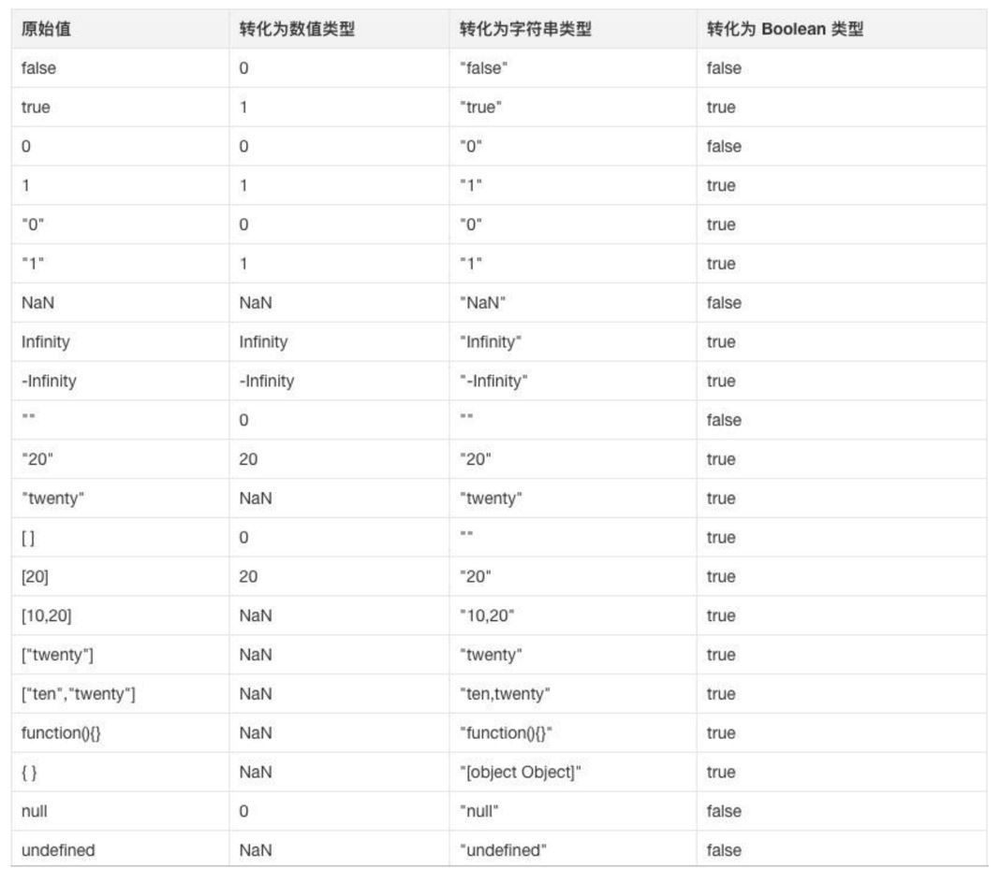

## 1. 谈谈对作用域链的理解


简单版:

内部函数可以访问到外部函数声明的变量, 外部函数又可以访问到全局的, 一层层的关系就是作用域链

正常版:

js 全局有全局可执行上下文, 每个函数调用时, 有着函数的可执行上下文, 当函数执行时会进入到 js 的调用栈, 每个可执行的上下文都会包含对于上一层可执行上下文的一个引用, 或者说叫词法作用域的引用. 说白了可以访问自己的变量, 也可以访问外部的变量, 这个外部上下文也有着对于再外部的上下文词法作用域的引用, 形成了作用于链

## 2. 谈谈对闭包的理解

- 对闭包的基本概念的理解
- 对闭包的作用的了解

### 什么是闭包?

- MDN 的官方解释:

  - 闭包是函数和声明该函数的词法环境的组合.

- 更通俗一点的解释:
  - 闭包 = 函数 + 该函数内可访问的所有函数外的变量
  - 或者说
  - 内部函数, 访问了外部函数的变量, 就可以形成闭包

### 闭包的基本形式

```js
// 闭包的基本形式
function fn() {
  let num = 1;
  function inner() {
    num = num + 1;
    console.log(num);
  }
}
let result = fn();
result(); //2
```

### 闭包的作用

常见应用: `实现数据私有`

例 1: 计数器

```js
let count = 0; // count是全局变量, 容易被随意修改

function fn() {
  count++;
  console.log("函数被调用了" + count + "次");
}
fn();

// 但我们希望有些数据是私有的, 不让外部随意的访问

function fn() {
  let count = 0;
}
fn();
console.log(count); //报错Uncaught ReferenceError: count is not defined, 因为fn函数一执行完, 函数里的就释放掉了
// 使用闭包
function fn() {
  let count = 0;

  function inner() {
    count++;
    console.log("函数被调用了" + count + "次");
  }
  return inner;
}
let result = fn();
result();
result();
result();
```

:::tip
注意: 外部函数中, 一般需要 return 引用, 内存才不会被释放
:::

例 2: 计数器

```js
for (var i = 1; i <= 5; i++) {
  setTimeout(() => {
    console.log(i);
  }, i * 1000);
}
// 6 6 6 6 6

// 如果把var 换成let 可以解决问题, 输出1,2,3,4,5, 但是没有let的话,
// 早期, 闭包还用于解决for循环中, 定时打印内容的问题

for (var i = 1; i <= 5; i++) {
  (function (num) {
    // 形参也可以理解为函数中局部变量
    setTimeout(() => {
      console.log(num);
    }, num * 1000);
  })(i);
}
```

## 3. js 中数据类型的隐式转换规则

在 if 语句、逻辑语句、数学运算逻辑、== 等情况下都可能出现隐式类型转换。

下表展示了一系列原始值，通过隐式转换成数字、字符串、布尔类型后所得到的值：



坑: 判断时, 尽量不要用 `==` , 要用 `===` ( 两个等号判断, 如果类型不同, 默认会进行隐式类型转换再比较)

## 4. 谈谈对原型链的理解

要讲清楚这个问题，主要着重这几个方面：

- 什么是原型对象
- 构造函数, 原型对象, 实例的三角关系图
- 原型链如何形成

```js
// 构造函数
function Person() {
  this.name = name;
  this.age = age;

  this.sayHi = function () {
    console.log("hello");
  };
}

let p1 = new Person("zs", 18);
let p2 = new Person("ls", 20);
console.log(p1.sayHi === p2.sayHi); //false

// 对比下图
```


**原型对象**

在 JavaScript 中，除去一部分内建函数，绝大多数的函数都会包含有一个叫做 `prototype` 的属性，指向原型对象，

基于构造函数创建出来的实例, 都可以共享访问原型对象的属性。

例如我们的 `hasOwnProperty`, `toString` ⽅法等其实是 Obejct 原型对象的方法，它可以被任何对象当做⾃⼰的⽅法来使⽤。

`hasOwnProperty` 用于判断, 某个属性, 是不是自己的 (还是原型链上的)

来看一段代码：

```js
let person = {
  name: "Tom",
  age: 18,
  job: "student",
};

console.log(person.hasOwnProperty("name")); // true
console.log(person.hasOwnProperty("hasOwnProperty")); // false
console.log(Object.prototype.hasOwnProperty("hasOwnProperty")); // true
```

可以看到，`hasOwnProperty` 并不是 `person` 对象的属性，但是 `person` 却能调用它。

那么 `person` 对象是如何找到 Object 原型中的 `hasOwnProperty` 的呢？这就要靠原型链的能力了。

需求: 简单绘制原型三角关系图!

**原型链**

在 JavaScript 中，每个对象中都有一个 `__proto__` 属性，这个属性指向了当前对象的构造函数的原型。

对象可以通过自身的 `__proto__`属性与它的构造函数的原型对象连接起来，

而因为它的原型对象也有 `__proto__`，因此这样就串联形成一个链式结构，也就是我们称为的原型链。


## 5. 谈谈继承的理解

**为什么要学习继承 ?**

写的构造函数, 定义了一个类型 (人类), 万一项目非常大, 又有了细化的多个类型 (老师, 工人, 学生)

学习继承, 可以让多个构造函数之间建立关联, 便于管理和复用

**什么是继承 ?**

继承: 从别人那里, 继承东西过来 (财产, 房产)

代码层面的继承: 继承一些属性和方法

### 继承 - 原型继承

原型继承: 通过改造原型链, 利用原型链的语法, 实现继承方法!

分析需求:

​ 人类, 属性: name, age

​ 学生, 属性: name, age, className

​ 工人, 属性: name, age, companyName

无论学生, 还是工人, => 都是人类, 所以人类原型上有的方法, 他们都应该要有

```js
// 1. 定义Person构造函数
function Person(name, age) {
  this.name = name;
  this.age = age;
}
Person.prototype.say = function () {
  console.log("人类会说话");
};

// 2. 定义Student构造函数
function Student(name, age, className) {
  this.name = name;
  this.age = age;
  this.className = className;
}
// 3. 原型继承: 利用原型链, 继承于父级构造函数, 继承原型上的方法
// 语法: 子构造函数.prototype = new 父构造函数()
Student.prototype = new Person();
Student.prototype.study = function () {
  console.log("学生在学习");
};

let stu = new Student("张三", 18, "80期");
stu.say();
console.log(stu);
```


### 继承 - 组合继承

组合继承有时候也叫伪经典继承，指的是将原型链 和 借用构造函数 call 技术组合到一块，

从而发挥二者之长的一种继承模式，其背后的思路: **是使用原型链实现对原型属性和方法的继承 (主要是方法)，**

**而通过借用构造函数来实现对实例属性构造的继承**。这样既通过在原型上定义方法实现了函数复用，又能保证每个实例都有它的自己的属性。

```js
// 1. 定义Person构造函数
function Person(name, age) {
  this.name = name;
  this.age = age;
}
Person.prototype.say = function () {
  console.log("人类会说话");
};

// 2. 定义Student构造函数
function Student(name, age, className) {
  Person.call(this, name, age); // 实现构造属性的继承
  this.className = className;
}

// 3. 原型继承: 利用原型链, 继承于父级构造函数, 继承原型上的方法
// 语法: 子构造函数.prototype = new 父构造函数()
Student.prototype = new Person();
Student.prototype.study = function () {
  console.log("学生在学习");
};

let stu = new Student("张三", 18, "80期");
stu.say();
console.log(stu);

// 方法通过 原型继承
// 属性通过 父构造函数的.call(this, name, age)
```

### 继承 - 寄生组合继承

student 实例上有 name age, 而原型 `__proto__`上不需要再有这些属性, 所以利用 Object.create 改装下

Object.create(参数对象),

1. Object.create 会创建一个新对象,
2. 并且这个新对象的`__proto__` 会指向传入的参数对象

```js
// 1. 定义Person构造函数
function Person(name, age) {
  this.name = name;
  this.age = age;
}
Person.prototype.say = function () {
  console.log("人类会说话");
};

// 2. 定义Student构造函数
function Student(name, age, className) {
  Person.call(this, name, age);
  this.className = className;
}

// 3. 原型继承: 利用原型链, 继承于父级构造函数, 继承原型上的方法
// 语法: 子构造函数.prototype = new 父构造函数()
Student.prototype = Object.create(Person.prototype);
Student.prototype.study = function () {
  console.log("学生在学习");
};

let stu = new Student("张三", 18, "80期");
stu.say();
console.log(stu);

// 总结:
// Object.create() 以参数的对象, 作为新建对象的__proto__属性的值, 返回新建的对象
```


### es6 - class 实现继承 extends

```jsx
// 继承关键字 => extends
class Person {
  constructor(name, age) {
    this.name = name;
    this.age = age;
  }
  jump() {
    console.log("会跳");
  }
}

class Teacher extends Person {
  constructor(name, age, lesson) {
    super(name, age); // extends 中, 必须调用 super(), 会触发执行父类的构造函数
    this.lesson = lesson;
    console.log("构造函数执行了");
  }
  sayHello() {
    console.log("会打招呼");
  }
}

let teacher1 = new Teacher("zs", 18, "体育");
console.log(teacher1);
```

## 6. 判断是否是数组

```js
console.log(typeof []); //object
```

### 方法一：使用 `toString` 方法

调用的是 Object.prototype.toString 方法

```js
function isArray(arg) {
  return Object.prototype.toString.call(arg) === "[object Array]";
}

let arr = [1, 2, 3];
isArray(arr); // true
```

### 方法二：使用 ES6 新增的 `Array.isArray` 方法

Array 构造函数身上的静态方法 isArray

```js
let arr = [1, 2, 3];
Array.isArray(arr); // true
```

## 7. 谈谈对 this 的理解

```js
// 函数中的this, 要看如何调用的
function fn() {
  console.log(this);
}
let obj = {
  name: 'zs';
}
obj.fn = fn

obj.fn() // 指向obj
```

`this` 是一个在运行时才进行绑定的引用，在不同的情况下它可能会被绑定不同的对象。

**默认绑定** (指向 window 的情况) (函数调用模式 fn() )

默认情况下，`this` 会被绑定到全局对象上，比如在浏览器环境中就为`window`对象，在 node.js 环境下为`global`对象。

如下代码展示了这种绑定关系：

```js
message = "Hello";

function test() {
  console.log(this.message);
}

test(); // "Hello"
```

**隐式绑定** (谁调用, this 指向谁) (方法调用模式 obj.fn() )

如果函数的调用是从对象上发起时，则该函数中的 `this` 会被自动隐式绑定为对象：

```js
function test() {
  console.log(this.message);
}

let obj = {
  message: "hello,world",
  test: test,
};

obj.test(); // "hello,world"
```

**显式绑定** (又叫做硬绑定) (上下文调用模式, 想让 this 指向谁, this 就指向谁)

硬绑定 => call apply bind

可以显式的进行绑定：

```js
function test() {
  console.log(this.message);
}

let obj1 = {
  message: "你好世界123",
};

let obj2 = {
  message: "你好世界456",
};

test.bind(obj1)(); // "你好世界123"
test.bind(obj2)(); // "你好世界456"
```

**new 绑定** (构造函数模式)

另外，在使用 `new` 创建对象时也会进行 `this` 绑定

当使用 `new` 调用构造函数时，会创建一个新的对象并将该对象绑定到构造函数的 `this` 上：

```js
function Greeting(message) {
  this.message = message;
}

var obj = new Greeting("hello,world");
obj.message; // "hello,world"
```

小测试:

```jsx
let obj = {
  a: {
    fn: function () {
      console.log(this);
    },
    b: 10,
  },
};
obj.a.fn();
let temp = obj.a.fn;
temp();

// -------------------------------------------------------------

function Person(theName, theAge) {
  this.name = theName;
  this.age = theAge;
}
Person.prototype.sayHello = function () {
  // 定义函数
  console.log(this);
};

let per = new Person("小黑", 18);
per.sayHello();
```

### this 指向的情况

1. 函数调用模式 fn() 指向 window(默认绑定)
2. 方法调用模式 obj.fn() 指向调用者 (隐式绑定, 虽然没有刻意的绑定, 但是执行时, 会自动将函数的 this 指向调用者)
3. 上下文调用模式 call apply bind 想指向谁就指向谁 (显示绑定, 硬绑定)
4. 构造函数模式 new Person() 指向创建的实例(new 绑定)

- new 四步:
- 1. 创建 1 个新对象
- 2. 让构造函数的 this, 指向新对象
- 3. 执行构造函数
- 4. 返回实例

## 8. 箭头函数中的 this 指向什么？

箭头函数不同于传统函数，它其实没有属于⾃⼰的 `this`，

它所谓的 `this` 是, 捕获其外层 上下⽂的 `this` 值作为⾃⼰的 `this` 值。

并且由于箭头函数没有属于⾃⼰的 `this` ，它是不能被 `new` 调⽤的。

我们可以通过 Babel 转换前后的代码来更清晰的理解箭头函数:

```js
// 转换前的 ES6 代码
const obj = {
  test() {
    return () => {
      console.log(this === obj);
    };
  },
};
```

```js
// 转换后的 ES5 代码
var obj = {
  test: function getArrow() {
    var that = this;
    return function () {
      console.log(that === obj);
    };
  },
};
```

这里我们看到，箭头函数中的 `this` 就是它上层上下文函数中的 `this`。

## 9. Promise 的静态方法

promise 的三个状态: pending(默认) fulfilled(成功) rejected(失败)

1. resolve 函数被执行时, 会将 promise 的状态从 pending 改成 fulfilled 成功
2. reject 函数被执行时, 会将 promise 的状态从 pending 改成 rejected 失败

### Promise.reject()

Promise.reject()等价于以下代码, 是下面代码的简写

```js
new Promise((resolve, reject) => {
  reject();
});
```

### Promise.resolve()

Promise.reject()等价于以下代码, 是下面代码的简写

```jsx
new Promise((resolve, reject) => {
  resolve();
});
```

### Promise.all

**Promise.all([promise1, promise2, promise3])** 等待原则, 是在所有 promise 都完成后执行, 可以用于处理一些`并发的任务`

```jsx
// 后面的.then中配置的函数, 是在前面的所有promise都完成后执行, 可以用于处理一些并发的任务
Promise.all([promise1, promise2, promise3]).then((values) => {
  // values 是一个数组, 会收集前面promise的结果 values[0] => promise1的成功的结果 values[1] => promise2的成功的结果
});
// 比如希望同时并发3个请求, 给用户loading效果, 只要网页没加载完, 就显示loading, 只有全部请求都完成, loading关闭
```

Promise.race([promise1, promise2, promise3]) 赛跑, 竞速原则, 只要三个 promise 中有一个满足条件, 就会执行.then(用的较少)

### Promise.race

## 10. 宏任务 微任务 是什么

js 是单线程的, 如果遇到了异步的内容, 交给浏览器处理(等待, 监听)

宏任务: 主线程代码, setTimeout 等属于宏任务, 上一个宏任务执行完, 才会考虑执行下一个宏任务

微任务: promise .then .catch 的需要执行的内容, 属于微任务, 满足条件的微任务, 会被添加到当前宏任务的最后去执行


**事件循环队列 eventLoop**


### 例题

例题 1:

```jsx
console.log(1);

setTimeout(function () {
  console.log(2); // 宏任务
}, 0);

const p = new Promise((resolve, reject) => {
  resolve(1000);
});
p.then((data) => {
  console.log(data); // 微任务
});

console.log(3);
```


例题 2:

```jsx
// async 可以用于修饰一个函数, 表示一个函数是异步的
// async 只有在遇到了await 开始, 才是异步的开始
// 因为这里没有await 所以仍然是同步函数输出 111 222
async function fn() {
  console.log(111);
}
fn();
console.log(222);

// 111 222
```

例题 3:

```jsx
// await 下面的内容可以理解为写在.then的内容, .then是异步的, 而且.then相当于微任务, 微任务不会立刻执行, 而是等待主线程代码执行完再执行, 所以222输出后才输出2
async function fn() {
  const res = await 2;
  console.log(res);
}
fn();
console.log(222);

// 222 1
```

例题 4:

```jsx
// 注意 await 后面的执行函数 fn2() 也是立刻执行 同步的, 它跟嘿嘿属于宏任务1的内容
async function fn() {
  console.log("嘿嘿");
  const res = await fn2();
  console.log(res); // 微任务
}
async function fn2() {
  console.log("gaga");
}
fn();
console.log(222);

// 嘿嘿 嘎嘎 22 undefined
```


考察点: async 函数只有从 await 往下才是异步的开始

## 11. async/await 是什么？

ES7 标准中新增的 `async` 函数，从目前的内部实现来说其实就是 `Generator` 函数的语法糖。

它基于 Promise，并与所有现存的基于 Promise 的 API 兼容。

**async 关键字**

1. `async` 关键字用于声明⼀个异步函数（如 `async function asyncTask1() {...}`）

2. `async` 会⾃动将常规函数转换成 Promise，返回值也是⼀个 Promise 对象

3. `async` 函数内部可以使⽤ `await`

**await 关键字**

1. `await` 用于等待异步的功能执⾏完毕 `var result = await someAsyncCall()`

2. `await` 放置在 Promise 调⽤之前，会强制 async 函数中其他代码等待，直到 Promise 完成并返回结果

3. `await` 只能与 Promise ⼀起使⽤

4. `await` 只能在 `async` 函数内部使⽤

## 12. 相较于 Promise，async/await 有何优势？

1. 同步化代码的阅读体验（Promise 虽然摆脱了回调地狱，但 then 链式调⽤的阅读负担还是存在的）
2. 和同步代码更一致的错误处理方式（ async/await 可以⽤成熟的 try/catch 做处理，比 Promise 的错误捕获更简洁直观）
3. 调试时的阅读性, 也相对更友好

```js
// 普通的promise捕获错误
p.then().catch();
// 存在嵌套的promise捕获错误
p.then(() => {
  p.then(() => {}).catch();
}).catch();
// 存在嵌套的promise复杂写法
p.then(() => {
  return p2;
}).then(() => {
  // 这个.then是对上面p2去执行的
});
```

## 13. 深拷贝 浅拷贝

引用类型, 进行赋值时, 赋值的是地址

1. 浅拷贝

   ```jsx
   let obj = {
     name: "zs",
     age: 18,
   };
   let obj2 = {
     ...obj,
   };
   ```

2. 深拷贝

   ```jsx
   let obj = {
     name: "zs",
     age: 18,
     car: {
       brand: "宝马",
       price: 100,
     },
   };

   let obj2 = JSON.parse(JSON.stringify(obj));
   console.log(obj2);
   ```

   当然递归也能解决, 只是比较麻烦~

   ...

其他方案, 可以参考一些博客

---

### 浅拷贝的实现方式

1. Object.assign()

```js
var obj = { a: { a: "hello", b: 21 } };
var initalObj = Object.assign({}, obj);
initalObj.a.a = "changed";
console.log(obj.a.a); //  "changed"
```

2. 展开运算符

```js
let obj1 = { name: "Kobe", address: { x: 100, y: 100 } };
let obj2 = { ...obj1 };
obj1.address.x = 200;
obj1.name = "wade";
console.log("obj2", obj2); // obj2 { name: 'Kobe', address: { x: 200, y: 100 } }
```

### 深拷贝实现方式

1. JSON.parse(JSON.stringify(OBJECT))

```js
var obj1 = { body: { a: 10 } };
var obj2 = JSON.parse(JSON.stringify(obj1));
obj2.body.a = 20;
console.log(obj1);
// { body: { a: 10 } } <-- 沒被改到
console.log(obj2);
// { body: { a: 20 } }
console.log(obj1 === obj2);
// false
console.log(obj1.body === obj2.body);
// false
```

封装成函数

```js
var cloneObj = function (obj) {
  var str,
    newobj = obj.constructor === Array ? [] : {};
  if (typeof obj !== "object") {
    return;
  } else if (window.JSON) {
    (str = JSON.stringify(obj)), //系列化对象
      (newobj = JSON.parse(str)); //还原
  } else {
    for (var i in obj) {
      newobj[i] = typeof obj[i] === "object" ? cloneObj(obj[i]) : obj[i];
    }
  }
  return newobj;
};
```

2. lodash deepclone

3. 递归

```js
function deepClone(initalObj, finalObj) {
  var obj = finalObj || {};
  for (var i in initalObj) {
    var prop = initalObj[i]; // 避免相互引用对象导致死循环，如initalObj.a = initalObj的情况
    if (prop === obj) {
      continue;
    }
    if (typeof prop === "object") {
      obj[i] = prop.constructor === Array ? [] : {};
      arguments.callee(prop, obj[i]);
    } else {
      obj[i] = prop;
    }
  }
  return obj;
}
var str = {};
var obj = { a: { a: "hello", b: 21 } };
deepClone(obj, str);
console.log(str.a);
```
