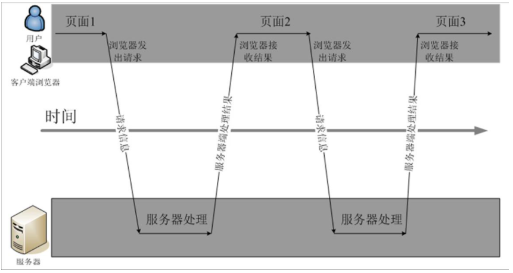
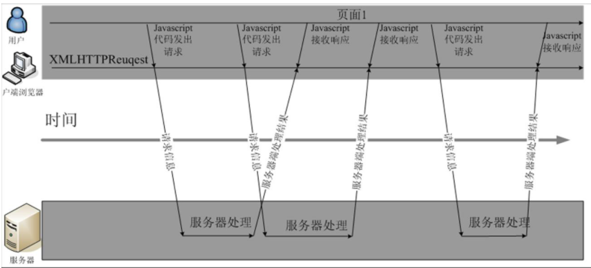
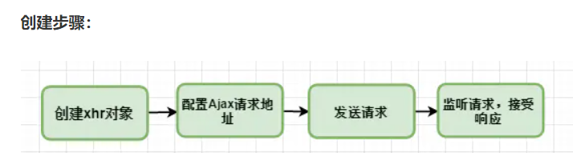
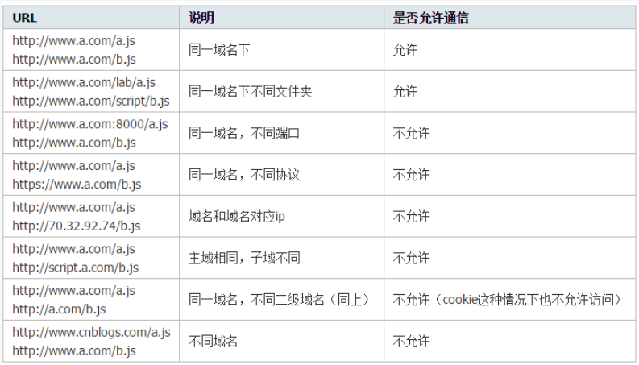

## 1、什么是 AJAX

Ajax 是一种异步请求数据的 web 开发技术，对于改善用户的体验和页面性能很有帮助。简单地说，在不需要重新刷新页面的情况下，Ajax 通过异步请求加载后台数据，并在网页上呈现出来。常见运用场景有表单验证是否登入成功、百度搜索下拉框提示和快递单号查询等等。

**Ajax 的目的是提高用户体验，较少网络数据的传输量**。同时，由于 AJAX 请求获取的是数据而不是`html`文档，因此它也节省了网络带宽，让互联网用户的网络冲浪体验变得更加顺畅。

关于提高用户的体验，可以通过下面来进行体会

下图是普通的请求方式



下图是`ajax`请求的方式



## 2、AJAX 原理是什么

`Ajax`相当于在用户和服务器之间加了一个中间层,使用户操作与服务器响应异步化。并不是所有的用户请求都提交给服务器，像一些数据验证和数据处理等都交给 Ajax 引擎自己来做，只有确定需要从服务器读取新数据时再由 Ajax 引擎代为向服务器提交请求。

Ajax 的原理简单来说通过`XmlHttpRequest`对象来向服务器发送异步请求，从服务器获得数据，然后用 JavaScript 来操作 DOM 而更新页面。

`XMLHttpRequest`是`ajax`的核心机制，它是在`IE5`中首先引入的，是一种支持异步请求的技术。简单的说，也就是 JavaScript 可以及时向服务器提出请求和处理响应，而不阻塞用户。达到无刷新的效果。

## 3、AJAX 基本的使用

这里主要掌握的是能够手动创建`AJAX`.

创建步骤：



创建`xhr`对象

```js
let xhr = null;
if (window.XMLHttpRequest) {
  // 兼容 IE7+, Firefox, Chrome, Opera, Safari
  xhr = new XMLHttpRequest();
} else {
  // 兼容 IE6, IE5
  xhr = new ActiveXObject("Microsoft.XMLHTTP");
}
```

配置请求地址与发送请求

```js
xhr.open(method, url, async);
send(string); //`POST`请求时才使用字符串参数，否则不用带参数。
// method：请求的类型；GET 或 POST
// url：文件在服务器上的位置
// async：true（异步）或 false（同步）
```

**注意：POST 请求一定要设置请求头的格式内容**

```js
xhr.open("POST", "test.html", true);
xhr.setRequestHeader("Content-type", "application/x-www-form-urlencoded");
xhr.send("fname=Henry&lname=Ford"); //`POST`请求参数放在send里面，即请求体
```

处理响应

```js
xhr.onreadystatechange = function () {
  if (xhr.readyState == 4 && xhr.status == 200) {
    document.GetElementById("mydiv").innerHTML = xhr.responseText;
  }
};
```

##### 什么是 readyState？

:::tip
readyState 是 XMLHttpRequest 对象的一个属性，用来标识当前 XMLHttpRequest 对象处于什么状态。
readyState 总共有 5 个状态值，分别为 0~4，每个值代表了不同的含义：

0：未初始化 — 尚未调用.open()方法；
1：启动 — 已经调用.open()方法，但尚未调用.send()方法；
2：发送 — 已经调用.send()方法，但尚未接收到响应；
3：接收 — 已经接收到部分响应数据；
4：完成 — 已经接收到全部响应数据，而且已经可以在客户端使用了；
:::

## 4、AJAX 优缺点分析

**优点**

(1)无刷新更新数据

`AJAX`最大的优点是在不需要刷新浏览器的情况下，能够与服务器保持通信，并且能够减少不必要的数据数据传输，降低网络数据流量，这样可以加快响应用户的请求，避免不必要的等待时间，提高用户的体验。

(2)前后端分离

前端人员只关注前端页面逻辑的开发，通过`ajax`获取后端数据然后进行展示处理，而后端专注于请求的获取，响应的处理，职责明确。

**缺点：**

(1) 破坏浏览器的后退功能

浏览器有一个比较重要的功能就是历史记录的功能，通过后退按钮可以后退到浏览器之前访问的页面，但是使用了`ajax`后无法后退，也就是破坏了浏览器的后退机制。

（2）不利于搜索引擎的优化

百度，谷歌在进行搜索引擎优化的时候(`SEO`),会获取页面中的内容，而通过`ajax`请求返回的数据是通过`javascript`动态添加到页面上的，而百度等搜索引擎无法抓取到这些通过`javascript`动态生成的内容，所以不利于`SEO`

(3) 破坏了`URL`统一资源定位的功能。

由于`AJAX`的请求并不会修改浏览器中地址栏的`URL`，因此对于相同的`URL`，不同的用户看到的内容是不一样的，例如，你访问某个电商网站，在该电商网站中搜索到一件非常好的商品，你现在把地址发给你的同学，而你的同学打开这个地址后，却看不到这件商品。

所以网站的搜索的实现，一般不是通过`ajax`来发送请求。

## 5、Get 和 Post 请求数据的区别

(1)参数传递

`get`请求会将参数添加到`URL`地址的后面，在调用`ajax`的`send`方法的时候，传递的参数是`null`，即`xhr.send()`;

`post`请求的数据会放在请求体中，用户是无法通过`URL`地址直接看到的，调用`send`方法的时候，需要指定要发送到服务端的数据，即`xhr.send(data)`

(2)服务端的处理

针对`get`请求与`post`请求，在服务端的处理也是不一样的。如果以`Express`来作为服务端，`get`的请求需要通过`Request.query`来获取参数，而`post`请求的处理，需要通过`Request.body`来获取数据。

（3）传递的数据量

`get`请求的数据量小，对于不同的浏览器是有差异 ，谷歌浏览器限制`8k`.`post`请求传递的数据量比较大，一般默认不受限制。但是服务器一般会做限制。

（4）安全性

`get`请求的安全性比较低，因为请求的数据会出现在`url`上，通过浏览器的缓存或者是历史记录很容易获取到请求的数据。`post`请求是将数据放在请求体中进行传递，数据不会出现在`URL`，安全性比较高。

## 6、Get 和 Post 请求的应用场景

在了解了`get`方式和`post`请求方式的区别以后，下面看一下它们的应用场景。

`get`的应用场景

（1）数据的搜索，单击搜索按钮，搜索网站中指定的数据。

(2) 传递的数据量小，适合用于`url`方式进行传递

(3) 数据安全性要求不高的情况

`post`请求的应用场景

(1) 传递数据量比较大的情况，例如上传文件

(2) 表单提交，例如用户登录，注册，要求数据安全性比较高的情况。

(3) 请求会修改数据库中数据的情况，例如，添加数据，修改数据等。

## 7、浏览器同源策略

浏览器同源策略是浏览器最基本也是最核心的安全功能，它规定客户端脚本在没有明确授权的情况下，不能读写不同源的目标资源。

所谓的同源指的是相同协议，域名和端口号，如果两个资源路径在协议，域名，端口号上有任何一点不同，则它们就不属于同源的资源，

另外在同源策略上，又分为两种表现形式：

第一：禁止对不同页面进行`DOM`操作

第二：禁止使用`XMLHttpRequest`向不是同源的服务器发送`ajax`请求。

## 8、为什么浏览器会有跨域限制的问题？

什么是跨域呢？

访问同源的资源是被浏览器允许的，但是如果访问不同源的资源，浏览器默认是不允许的。访问不同源的资源那就是我们所说的跨域。

如下表格所示：



从表中可以看出域名，子域名，端口号，协议不同都属于不同源，当脚本被认为是来至不同源时，均被浏览器拒绝请求。

浏览器对跨域访问的限制，可以在很大的程度上保护用户数据的安全。

第一：假如没有`Dom`同源策略的限制，就有可能会出现如下的安全隐患

黑客做了一个假的的网站，通过`iframe`嵌套了一个银行的网站，然后把`iframe`的高度宽度调整到占据浏览器的可视区域 ，这样用户进入这个假的网站后，看到就是和真正的银行网站是一样的内容。如果用户输入了用户名和密码，这个假的网站就可以跨域访问到所嵌套的银行网站的`DOM`节点，从而黑客就可以获取到用户输入的用户名和密码了。

第二：如果浏览器没有`XMLHttpRequest`同源策略限制，黑客可以进行跨站请求伪造(`CSRF`)攻击，具体方式如下：

(1)用户登录了个人银行页面`A`,页面`A`会在`Cookie`中保存用户信息

(2)后来用户又访问了一个恶意的页面`B`,在该页面中执行了恶意`Ajax`请求的代码

(3)这时页面`B`会向页面`A`发送`Ajax`请求，该请求会默认发送用户`Cookie`信息。

(4)页面`A`会从请求的`Cookie`中获取用户信息，验证无误后，就会返回用户的一系列相关的数据，而这些数据就会被恶意的页面 B 所获取，从而造成用户数据的泄漏。

正是存在这些危险的场景存在，所以同源策略的限制就显得非常总要。

## 9、跨域问题演示

创建一个文件夹，在该文件夹中创建`index.html`文件，该文件中的代码如下：

```html
<!DOCTYPE html>
<html lang="en">
  <head>
    <meta charset="UTF-8" />
    <meta http-equiv="X-UA-Compatible" content="IE=edge" />
    <meta name="viewport" content="width=device-width, initial-scale=1.0" />
    <title>Document</title>
    <script>
      window.onload = function () {
        var btn = document.getElementById("btnLogin");
        btn.addEventListener("click", function () {
          sendRequest();
        });
      };
      function sendRequest() {
        var userName = document.getElementById("userName").value;
        //这里为了简单，暂时不考虑浏览器兼容性问题
        var xhr = new XMLHttpRequest();
        let url = "http://localhost:3000/getUserNameInfo?name=" + userName;
        xhr.open("get", url, true);
        xhr.send();
        xhr.onreadystatechange = function () {
          if (xhr.readyState === 4 && xhr.status === 200) {
            console.log(xhr.responseText);
          }
        };
      }
    </script>
  </head>
  <body>
    用户名:<input type="text" id="userName" /> <br />
    <button id="btnLogin">登录</button>
  </body>
</html>
```

在该文件夹下面安装`express`

```
npm install express
```

同时创建`server.js`文件，该文件的代码如下：

```js
var express = require("express");
var app = express();
app.get("/getUserNameInfo", function (req, res) {
  var userName = req.query.name;
  var result = {
    id: 10001,
    userName: userName,
    userAge: 21,
  };
  var data = JSON.stringify(result);
  res.writeHead(200, { "Content-type": "application/json" });
  res.write(data);
  res.end();
});
app.listen(3000, function () {
  console.log("服务端启动....");
});
```

下面启动服务端

同时`index.html`文件也通过`vscode`自带的服务器进行访问。

这时会出现如下错误：

```
Access to XMLHttpRequest at 'http://localhost:3000/getUserNameInfo?name=admin' from origin 'http://127.0.0.1:5500' has been blocked by CORS policy: No 'Access-Control-Allow-Origin' header is present on the requested resource.
```

通过以上错误可以发现，现在的程序出现 跨域的问题，

下面看一下具体的解决方案

## 10、CORS

通过上面的错误，我们明白了，客户端不能发送跨域请求是因为服务端并不接收跨域的请求，所以为了解决跨域请求的问题，我们可以将服务端设置为可以接收跨域请求。

这里我们需要使用`CORS`('跨域资源共享'),来解决跨域请求的问题。`CORS`主要的实现方式是服务端通过对响应头的设置，接收跨域请求的处理。

服务端修改后的代码如下：

```js
var express = require("express");
var app = express();
app.all("*", function (req, res) {
  //设置可以接收请求的域名
  res.header("Access-Control-Allow-Origin", "*");
  res.header("Access-Control-Allow-Methods", "GET, POST,PUT");
  res.header("Access-Control-Allow-Headers", "Content-Type");
  res.header("Content-Type", "application/json;charset=utf-8");
  req.next();
});
app.get("/getUserNameInfo", function (req, res) {
  var userName = req.query.name;
  console.log("userName=", userName);
  var result = {
    id: 10001,
    userName: userName,
    userAge: 21,
  };
  var data = JSON.stringify(result);
  res.writeHead(200, { "Content-type": "application/json" });
  res.write(data);
  res.end();
});
app.listen(3000, function () {
  console.log("服务端启动....");
});
```

在原有的代码中，我们主要是添加了如下的代码：

```js
app.all("*", function (req, res) {
  //设置可以接收请求的域名
  res.header("Access-Control-Allow-Origin", "http://127.0.0.1:5500");
  res.header("Access-Control-Allow-Methods", "GET, POST,PUT");
  res.header("Access-Control-Allow-Headers", "Content-Type");
  res.header("Content-Type", "application/json;charset=utf-8");
  req.next();
});
```

在上面的代码中，最主要的是` res.header('Access-Control-Allow-Origin', 'http://127.0.0.1:5500');`这行代码，

这行代码是必须的，表示服务器可以接收哪个域发送的请求，可以用通配符`*`，表示接收全部的域，但是为了安全，我们最好设置特定的域。我们这里测试的是`http://127.0.0.1:5500`(注意：如果客户端地址是`127.0.0.1`,这里不能写成`localhost`,同时还需要注意，这里地址最后没有`/`)

后面请求头信息可以根据情况进行选择设置，例如接收请求的方法，数据传输的格式等。

通过对服务端的处理不会对前端代码做任何的处理，但是由于不同系统服务端采用的语言与框架是不同的，所以导致服务端的处理方式不同。
