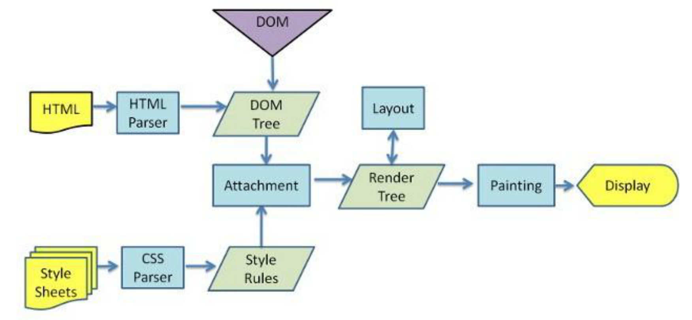

## 1. DOM 的事件流是什么？

**事件流**

⼜称为事件传播，是⻚⾯中接收事件的顺序。DOM2 级事件规定的事件流包括了 3 个阶段：

- 事件捕获阶段（capture phase）
- 处于⽬标阶段（target phase）
- 事件冒泡阶段（bubbling phase）


如上图所示，事件流的触发顺序是：

1. 事件捕获阶段，为截获事件提供了机会
2. 实际的⽬标元素接收到事件
3. 事件冒泡阶段，可在这个阶段对事件做出响应

**事件冒泡（Event Bubbling）**

事件开始由最具体的元素（⽂档中嵌套层次最深的那个节点）接收到后，开始逐级向上传播到较为不具体的节点。

```html
<html>
  <head>
    <title>Document</title>
  </head>

  <body>
    <button>按钮</button>
  </body>
</html>
```

如果点击了上面页面代码中的 `<button>` 按钮，那么该 `click` 点击事件会沿着 DOM 树向上逐级传播，在途经的每个节点上都会发生，具体顺序如下：

1. button 元素
2. body 元素
3. html 元素
4. document 对象

**事件捕获（Event Capturing）**

事件开始由较为不具体的节点接收后，然后开始逐级向下传播到最具体的元素上。

事件捕获的最大作用在于：事件在到达预定⽬标之前就可以捕获到它。

如果仍以上面那段 HTML 代码为例，当点击按钮后，在事件捕获的过程中，document 对象会首先接收到这个 `click` 事件，然后再沿着 DOM 树依次向下，直到 `<button>`。具体顺序如下：

1. document 对象
2. html 元素
3. body 元素
4. button 元素

## 2. 说说什么是事件委托？

事件委托，就是利用了事件冒泡的机制，在较上层位置的元素上添加一个事件监听函数，

来管理该元素及其所有子孙元素上的某一类的所有事件。

**示例**

```html
<ul id="list">
  <li>111</li>
  <li>222</li>
  <li>333</li>
  <li>444</li>
  <li>555</li>
</ul>

<script type="text/javascript">
  // ⽗元素
  var list = document.getElementById("list");

  // 为⽗元素绑定事件，委托管理它的所有⼦元素li的点击事件
  list.onclick = function (event) {
    var currentTarget = event.target;
    if (currentTarget.tagName.toLowerCase() === "li") {
      alert(currentTarget.innerText);
    }
  };
</script>
```

> 适用场景：在绑定大量事件的时候，可以选择事件委托

**优点**

- 事件委托可以减少事件注册数量，节省内存占⽤!
- 当新增⼦元素时，⽆需再次做事件绑定，因此非常适合动态添加元素 (vue 解析模板时, 会对新创建的元素, 额外进行绑定的)

---

## 浏览器底层原理

### 1. 浏览器是如何解析 CSS 选择器的？

在生成渲染树的过程中，渲染引擎会根据选择器提供的信息来遍历 DOM 树，找到对应的 DOM 节点后将样式规则附加到上面。

来看一段样式选择器代码、以及一段要应用样式的 HTML：

```css
.mod-nav h3 span {
  font-size: 16px;
}
```

```html
<div class="mod-nav">
  <header>
    <h3>
      <span>标题</span>
    </h3>
  </header>

  <div>
    <ul>
      <li><a href="#">项目一</a></li>
      <li><a href="#">项目一</a></li>
      <li><a href="#">项目一</a></li>
    </ul>
  </div>
</div>

<div class="box">...</div>
```

渲染引擎是怎么根据以上样式选择器去遍历这个 DOM 树的呢？是按照从左往右的选择器顺序去匹配，还是从右往左呢？

为了更直观的观查，我们先将这棵 DOM 树先绘制成图：


然后我们来对比一下两种顺序的匹配：

**从左往右：`.mod-nav => h3 => span`**

1. 遍历所有的元素, 找有 .mod-nav 类的节点

2. 从 `.mod-nav` 开始遍历所有的⼦孙节点 `header`、`div` 、 `h3`、 `ul` ....

   遍历所有的后代元素后, 知道了, 整个子孙后代只有一个 h3

3. 找到 `h3` , 还要继续重新遍历 `h3` 的所有子孙节点, 去找 `span`

   ...

**问题: 会进行大量树形结构子孙节点的遍历, 这是非常消耗成本的!**

**这在真实页面中⼀棵 DOM 树的节点成百上千的情况下，这种遍历方式的效率会非常的低，根本不适合采用。**

**从右往左：`span => h3 => .mod-nav`**

1. 先找到所有的 `span` 节点 ，然后基于每⼀个 `span` 再向上查找 `h3`

2. 由 `h3` 再向上查找 `.mod-nav` 的节点

3. 最后触及根元素 `html` 结束该分⽀遍历

   ...

从右向左的匹配规则, 只有第一次会遍历所有元素找节点, 而剩下的就是在看父辈祖辈是否满足选择器的条件, 匹配效率大大提升!

因此，浏览器遵循 “从右往左” 的规则来解析 CSS 选择器！

### 2. 浏览器是如何进行界面渲染的？

:::tip
浏览器渲染的整体流程:

1. 解析最新的 html 结构, 生成 dom 树
2. 同时解析最新的 css 样式, 生成样式规则 rules
3. 将 dom 树和样式规则 rules 结合 => 生成 render tree
4. 基于渲染树, 进行运算布局(重排)
5. 进行绘制(重绘制)
   :::

不同的渲染引擎的具体做法稍有差异，但是大体流程都是差不多的，下面以 chrome 渲染引擎 的 渲染流程来说明：



上图展示的流程是：

1. 获取 HTML ⽂件并进⾏解析，生成一棵 DOM 树（DOM Tree）

2. 解析 HTML 的同时也会解析 CSS，⽣成样式规则（Style Rules）

3. 根据 DOM 树和样式规则，生成一棵渲染树（Render Tree）

4. 进行布局（Layout）(重排)，即为每个节点分配⼀个在屏幕上应显示的确切坐标位置

5. 进⾏绘制（Paint）(重绘)，遍历渲染树节点，调⽤ GPU(图形处理器) 将元素呈现出来

### 3. 重绘(repaint)和重排(回流 reflow)是什么?

**重排**

重排是指部分或整个渲染树需要重新分析，并且节点的尺⼨需要重新计算。

表现为 **重新⽣成布局，重新排列元素。**

**重绘**

重绘是由于节点的⼏何属性发⽣改变，或由于样式发⽣改变（例如：改变元素背景⾊）。

表现为某些元素的外观被改变。或者重排后, 进行重新绘制!

**两者的关系**

> 重绘不⼀定会出现重排，重排必定会触发重绘。

每个页面至少需要一次回流+重绘。(初始化渲染)

重排和重绘的代价都很⾼昂，频繁重排重绘, 会破坏⽤户体验、让界面显示变迟缓。

我们需要尽可能避免频繁触发重排和重绘, 尤其是重排

### 4. 何时会触发重排？

重排什么时候发生？

1、添加或者删除可见的 DOM 元素；

2、元素位置改变；

3、元素尺寸改变——边距、填充、边框、宽度和高度

4、内容改变——比如文本改变或者图片大小改变而引起的计算值宽度和高度改变；

5、页面渲染初始化；

6、浏览器窗口尺寸改变——resize 事件发生时；

### 5. 浏览器对重绘重排的优化

思考下述代码的重绘重排过程!

```javascript
let s = document.body.style;
s.padding = "2px"; // 重排 + 重绘
s.border = "1px solid red"; // 再一次 重排 + 重绘
s.color = "blue"; // 再一次重绘
s.backgroundColor = "#ccc"; // 再一次 重绘
s.fontSize = "14px"; // 再一次 重排 + 重绘
document.body.appendChild(document.createTextNode("abc!")); // 添加node，再一次 重排 + 重绘
```

**聪明的浏览器:**

从上个实例代码中可以看到几行简单的 JS 代码就引起了 4 次重排、6 次重绘。

而且我们也知道重排的花销也不小，如果每句 JS 操作都去重排重绘的话，浏览器可能就会受不了!

所以浏览器会优化这些操作，**浏览器会维护 1 个队列，把所有会引起重排、重绘的操作放入这个队列**，

**等队列中的操作到了一定的数量或者到了一定的时间间隔，浏览器就会 flush 队列，进行一个`批处理`。**

这样就会让多次的重排、重绘变成了一次重排重绘。

虽然有了浏览器的优化，但有时候我们写的一些代码可能会强制浏览器提前 flush 队列，这样浏览器的优化可能起不到作用了。

比如当你请求向浏览器获取一些样式信息的时候(保证获取结果的准确性)，就会让浏览器 flush 队列

1. offsetTop, offsetLeft, offsetWidth, offsetHeight
2. scrollTop/Left/Width/Height
3. clientTop/Left/Width/Height
4. 请求了 getComputedStyle()
5. ....

**猜一猜, 页面效果是什么:**

```html
<!DOCTYPE html>
<html lang="en">
  <head>
    <meta charset="UTF-8" />
    <meta http-equiv="X-UA-Compatible" content="IE=edge" />
    <meta name="viewport" content="width=device-width, initial-scale=1.0" />
    <title>Document</title>
    <style>
      div {
        width: 200px;
        height: 200px;
        background-color: pink;
        transition: all 1s;
      }
    </style>
  </head>
  <body>
    <div id="box"></div>

    <script>
      const div = document.getElementById("box");
      // console.log(div.offsetWidth)
      div.style.width = "400px";
      div.style.height = "400px";
    </script>
  </body>
</html>
```

### 6. 重绘重排角度, 我们应该如何优化页面渲染性能 ？

优化页面渲染性能的角度: 尽可能减少重绘和重排的次数

主要有几大方式来避免：

- 1 集中修改样式 (这样可以尽可能利用浏览器的优化机制, 一次重排重绘就完成渲染)

- 2 尽量避免在遍历循环中, 进行元素 offsetTop 等样式值的获取操作, 会强制浏览器刷新队列, 进行渲染

- 3 利用 transform 实现动画变化效果, 去代替 left top 的变换 (轮播图等)

  transform 变换, 只是视觉效果! 不会影响到其他盒子, 只触发了自己的重绘

- 4 使用文档碎片（DocumentFragment）可以用于批量处理, 创建元素

**文档碎片的理解:**

**documentFragment**是一个保存多个元素的容器对象（保存在内存）当更新其中的一个或者多个元素时，页面不会更新。

当 documentFragment 容器中保存的所有元素操作完毕了, 只有将其插入到页面中才会更新页面。

```html
<ul id="box"></ul>

<script>
  let ul = document.getElementById("box");
  for (let i = 0; i < 20; i++) {
    let li = document.createElement("li");
    li.innerHTML = "index: " + i;
    ul.appendChild(li);
  }

  // let ul = document.getElementById("box")
  // let fragment = document.createDocumentFragment()
  // for (let i = 0; i < 20; i++) {
  //     let li = document.createElement("li")
  //     li.innerHTML = "index: " + i
  //     fragment.appendChild(li)
  // }
  // ul.appendChild(fragment)
</script>
```

vue 底层渲染更新, 就用了 document.createDocumentFragment
