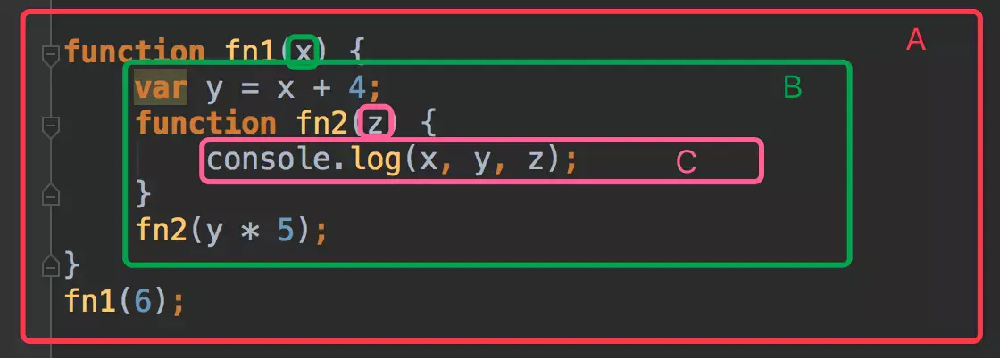

## 1、函数定义有哪几种实现方式

在使用函数前，先需要对函数进行定义。关于函数的定义总体上可以分为三类。

第一类是函数声明。

第二类是函数表达式

第三类是通过`Function`构造函数来完成函数的定义。

首先来看一下**函数的声明**。

函数声明是直接通过`function`关键字接一个函数名，同时可以接收参数。

```js
function sum(num1, num2) {
  return num1 + num2;
}
```

**函数表达式**

函数表达式的形式类似于普通变量的初始化，只不过这个变量初始化的值是一个函数。如下代码所示：

```js
var sum = function (num1, num2) {
  return num1 + num2;
};
```

这个函数表达式没有名称，属于匿名函数表达式。

**`Function( )`构造函数**

使用`new`操作符，调用`Function( )`构造函数，传入参数，也可以定义一个函数。

```js
var sum = new Function("num1", "num2", "return a+b ");
```

其中的参数，除了最后一个参数是要执行的函数体，其它的参数都是函数的形参。

## 2、Function( )构造函数定义函数的问题

但是，我们在实际的应用中很少使用`Function( )`构造函数来实现对函数的定义。

原因是：

第一：`Function( )` 构造函数每次执行时，都会解析函数体，并创建一个新的函数对象，所以当在一个循环或者是一个频繁执行的函数中去使用`Function( )`构造函数的时候，相对来说性能是比较低的。

第二：通过`Function( )` 构造函数创建的函数，并不遵循典型的作用域。

如下代码所示：

```js
var a = "12";
function fun() {
  var a = "11";
  return new Function("return a");
}
console.log(fun()()); //12
```

## 3、函数表达式的应用场景

关于函数表达式非常典型的应用就是实现了块级作用域

```js
var person = (function () {
  var _name = "";
  return {
    getName: function () {
      return _name;
    },
    setName: function (userName) {
      _name = userName;
    },
  };
})();
person.setName("zhangsan");
console.log(person.getName());
```

## 4、函数声明与函数表达式有什么区别

函数声明与函数表达式虽然是两种定义函数的方式，但是两者之间还是有区别的。

第一点就是：函数名称

```js
// 函数声明，函数名称sum是必须的
function sum(num1, num2) {
  return num1 + num2;
}
// 没有函数名称的匿名函数表达式
var sum = function (num1, num2) {
  return num1 + num2;
};
```

第二点就是关于：函数提升

```js
console.log(add(1, 2)); // 3
console.log(sum(3, 6)); // Uncaught TypeError: sum is not a function
// 函数声明
function add(num1, num2) {
  return num1 + num2;
}
// 函数表达式
var sum = function (num1, num2) {
  return num1 + num2;
};
```

## 5、函数常见的调用模式有哪些

**函数调用模式**

```js
function add(num1, num2) {
  return num1 + num2;
}
// 函数表达式
var sum = function (num1, num2) {
  return num1 + num2;
};

console.log(add(1, 2));
console.log(sum(3, 6));
```

**方法调用模式**

```js
var obj = {
  userName: "zhangsan",
  getUserName: function () {
    return this.userName;
  },
};
console.log(obj.getUserName());
```

```js
var obj = {
  userName: "zhangsan",
  getUserName: function () {
    return this.userName;
  },
};
// console.log(obj.getUserName());
console.log(obj["getUserName"]());
```

```js
var obj = {
  userName: "zhangsan",
  getUserName: function () {
    return this.userName;
  },
  setUserName: function (name) {
    this.userName = name;
    return this;
  },
};
console.log(obj.setUserName("lisi").getUserName()); // lisi
```

**构造器(构造函数)调用模式**

```js
//定义构造函数
function Person(name) {
  this.userName = name; //定义属性
}
// 在原型上定义函数
Person.prototype.getUserName = function () {
  return this.userName;
};
// 通过new来创建实例
var p = new Person("zhangsan");
// 调用原型上的方法
console.log(p.getUserName());
```

```js
function sum(num1, num2) {
  return num1 + num2;
}
//定义一个对象
var obj = {};
//通过call()和apply( )函数调用sum( )函数
console.log(sum.call(obj, 2, 6));
console.log(sum.apply(obj, [3, 6]));
```

**匿名函数调用模式**

所谓的匿名函数，就是没有函数名称的函数。匿名函数的调用有两种方式，一种是通过函数表达式定义函数，并赋值给变量，通过变量进行调用。如下所示：

```js
//通过函数表达式定义匿名函数，并赋值给变量sum
var sum =funciton (num1,num2){
    return num1 + num2
}
// 通过sum来进行调用
sum(2,6)
```

另外一种是使用小括号`()`将匿名函数括起来，然后在后面使用小括号`( )`,传递对应的参数从而完成对应的调用。

```js
(function (num1, num2) {
  console.log(num1 + num2);
})(2, 6);
```

## 6、实参与形参有哪些区别

第一：在函数的调用过程中，数据传递是单向的，也就是只能把实参的值传递给形参，而不能把形参的值反向传递给实参

第二：当实参是基本数据类型的值的时候，在向形参传递的时候，实际上是将实参的值复制一份传递给形参，在函数运行结束以后

形参释放，而实参中的值不会发生变化。当实参是引用类型的值的时候，实际是将实参的内存地址传递给形参，即实参与形参都指向了

相同的内存地址，此时形参可以修改实参的值。

```js
var person = { age: 21 };
function fn(obj) {
  obj.age = 22;
}
fn(person);
console.log(person.age);
```

第三：函数可以不用定义形参，在函数体中可以通过`arguments`对象获取传递过来的实参的值，并进行处理。

第四：在函数定义形参时，形参的个数并一定要和实参的个数相同，实参与形参会按照从前向后的顺序进行匹配，没有匹配到的形参被当作`undefined`来处理。

第五：实参并不需要与形参的数据类型一致，因为形参的数据类型只能在执行的时候才能够被确定，因为会通过隐式数据类型的转换。

## 7、介绍一下 arguments 对象

`arguments`对象是所有函数都具有的一个内置的局部变量，表示的是函数实际接收到的参数，是一个类似数组的结构。

下面我们说一下`arguments`对象都具有哪些性质。

第一：`arguments`对象只能在函数内部使用，无法在函数的外部访问到`arguments`对象。同时`arguments`对象存在于函数级的作用域中。

```js
console.log(arguments); //Uncaught ReferenceError: arguments is not defined
function fn() {
  console.log(arguments.length);
}
fn(1, 2, 3);
```

第二：可以通过索引来访问`arguments`对象中的内容，因为`arguments`对象类似数组结构。

```js
function fn() {
  console.log(arguments[0]); // 1
  console.log(arguments[1]); // 2
  console.log(arguments[2]); // undefined
}
fn(1, 2);
```

第三：`arguments` 对象的值由实参决定，不是有形参决定。

```js
function fn(num1, num2, num3) {
  console.log(arguments.length); // 2
}
fn(1, 2);
```

因为`arguments`对象的`length`属性是由实际传递的实参的个数决定的，所以这里输出的是 2.

```js
function fn(num1, num2, num3) {
  arguments[0] = 23;
  console.log("num1=", num1); //23
  num2 = 33;
  console.log(arguments[1]); // 33
}
fn(1, 2);
```

```js
function fn(num1, num2, num3) {
  // arguments[0] = 23;
  // console.log("num1=", num1); //23
  // num2 = 33;
  // console.log(arguments[1]); // 33

  arguments[2] = 19;
  console.log(num3); //undefined
  num3 = 10;
  console.log(arguments[2]); // 19
}
fn(1, 2);
```

```js
function fn(num1, num2, num3) {
  // arguments[0] = 23;
  // console.log("num1=", num1); //23
  // num2 = 33;
  // console.log(arguments[1]); // 33

  arguments[2] = 19;
  console.log(num3); //undefined
  num3 = 10;
  console.log(arguments[2]); // 19

  console.log(arguments.length); // 2 长度还是2
}
fn(1, 2);
```

## 8、arguments 对象有哪些应用场景

第一：进行参数个数的判断。

```js
function fn(num1, num2, num3) {
  // 判断传递的参数个数是否正确
  if (arguments.length !== 3) {
    throw new Error(
      "希望传递3个参数，实际传递的参数个数为:" + arguments.length
    );
  }
}
fn(1, 3);
```

第二：对任意个数参数的处理，也就是说只会对函数中前几个参数做特定处理，后面的参数不论传递多少个都会统一进行处理，这种情况我们可以使用`arguments`对象来完成。

```js
function fn(sep) {
  var arr = Array.prototype.slice.call(arguments, 1);
  // console.log(arr); // ["a", "b", "c"]
  return arr.join(sep);
}
console.log(fn("-", "a", "b", "c"));
```

第三：模拟函数的重载

什么是函数的重载呢？

函数的重载指的是在函数名称相同的情况下，函数的形参的类型不同或者是个数不同。

但是在`JavaScript`中没有函数的重载。

```js
function fn(num1, num2) {
  return num1 + num2;
}
function fn(num1, num2, num3) {
  return num1 + num2 + num3;
}
console.log(fn(1, 2)); // NaN
console.log(fn(1, 2, 3)); // 6
```

```js
function fn() {
  //将arguments对象转换成数组
  var arr = Array.prototype.slice.call(arguments);
  // console.log(arr);  // [1,2]
  //调用数组中的reduce方法完成数据的计算
  return arr.reduce(function (pre, currentValue) {
    return pre + currentValue;
  });
}
console.log(fn(1, 2));
console.log(fn(1, 2, 3));
console.log(fn(1, 2, 3, 4, 5));
```

## 9、说一下普通函数与构造函数的区别

在`JavaScript`的函数中，有一类比较特殊的函数：'构造函数'。当我们创建对象的时候，经常会使用构造函数。

构造函数与普通函数的区别：

第一：构造函数的函数名的第一字母通常会大写。

第二：在构造函数的函数体内可以使用`this`关键字，表示创建生成的对象实例。而且构造函数并不会显示返回任何内容, 因为默认返回 this

```js
function Person(userName) {
  this.userName = userName;
}
var person = new Person("zhangsan");
console.log(person);
```

第三：在使用构造函数的时候，必须与`new`操作符配合使用。

第四：构造函数的执行过程与普通函数也是不一样的。通过 new 创建对象的时候, 会在内存中创建新的区域, 并且为 this 确定指向, 最后确定对象当中的属性, 然后返回对象

代码如下：

```js
function Person(userName) {
  this.userName = userName;
  this.sayHi = function () {
    console.log(this.username);
  };
}
var p1 = new Person("zhangsan");
var p2 = new Person("lisi");
console.log(p1.sayHi === p2.sayHi); // false
```

```js
function Person(userName) {
  this.userName = userName;
  // this.sayHi = function () {
  //   console.log(this.username);
  // };
}
Person.prototype.sayHi = function () {
  console.log(this.username);
};
var p1 = new Person("zhangsan");
var p2 = new Person("lisi");
console.log(p1.sayHi === p2.sayHi); // true
```

## 10、什么是变量提升，什么是函数提升

在`javascript`中存在一些比较奇怪的现象。在一个函数体内，变量在定义之前就可以被访问到，而不会抛出异常。

如下所示：

```js
function fn() {
  console.log(num); // undefined
  var num = 2;
}
fn();
```

同样函数在定义之前也可以被调用，而不会抛出异常。

如下代码所示：

```js
fn();
function fn() {
  console.log("hello");
}
```

导致出现以上情况的原因是，在`javascript`中存在变量提升与函数提升的机制。

在讲解变量提升之前，先来说以作用域的问题。

### 作用域

在`JavaScript`中，一个变量的定义与调用都是在一个固定的范围内的，这个范围我们称之为作用域。

作用域可以分为全局的作用域，局部作用域(函数作用域)和块级作用域。

如下程序：

```js
function fn() {
  var userName = "zhangsan"; // 局部作用域
  console.log(userName);
}
fn(); //zhangsan
```

下面，再看如下代码：

```js
var userName = "zhangsan"; // 全局作用域
function fn() {
  console.log(userName); // 在局部里没找到, 去外层全局作用域找
}
fn(); //zhangsan
```

综上两个案例，我们可以总结出，**作用域本质就是一套规则，用于确定在何处以及如何查找变量的规则。**

下面，我们再来看一个比较复杂的结构图，来体验一下作用域



- 作用域链

下面，我们再来看一下前面的代码：

```js
var userName = "zhangsan";
function fn() {
  console.log(userName);
}
fn(); //zhangsan
```

我们在查找`userName`这个变量的时候，现在函数的作用域中进行查找，没有找到，再去全局作用域中查找。你会注意到，这是一个往外层查找的过程，即顺着一条链条从下往上查找变量。这个链条，我们就称之为作用域链。

如下图所示：


对应的代码如下：


### 面试中关于作用域与作用域链的问题

第一题：以下代码的执行结果是：

```js
var a = 1;
function fn1() {
  function fn2() {
    console.log(a);
  }
  function fn3() {
    var a = 4;
    fn2();
  }
  var a = 2;
  return fn3;
}
var fn = fn1();
fn(); // 2
```

第二题：以下代码的执行结果是：

```js
var a = 1;
function fn1() {
  function fn3() {
    var a = 4;
    fn2();
  }
  var a = 2;
  return fn3;
}

function fn2() {
  console.log(a);
}
var fn = fn1();
fn(); // 1
```

第三题：以下代码的输出结果为

```js
var a = 1;
function fn1() {
  function fn3() {
    function fn2() {
      console.log(a);
    }
    var a;
    fn2();
    a = 4;
  }
  var a = 2;
  return fn3;
}
var fn = fn1();
fn(); //undefined
```

第四题：以下代码的输出结果为：

```js
var x = 10;
bar(); //10
function foo() {
  console.log(x);
}
function bar() {
  var x = 30;
  foo();
}
```

第五题： 以下代码的输出结果为：

```js
var x = 10;
bar(); //30
function bar() {
  var x = 30;
  function foo() {
    console.log(x);
  }
  foo();
}
```

第六题：以下代码的输出结果为:

```js
var x = 10;
bar(); //30
function bar() {
  var x = 30;
  (function () {
    console.log(x);
  })();
}
```

### 变量提升

所谓变量提升，是将变量的声明提升到函数顶部的位置，也就是将变量声明提升到变量所在的作用域的顶端，而变量的赋值并不会被提升。

```js
var str = "hello world";
(function () {
  console.log(str);
  var str = "hello vue";
})(); // undefined
```

```js
var str = "hello world";
(function () {
  var str; //变量的声明得到提升
  console.log(str);
  str = "hello vue"; // 变量的赋值没有得到提升
})();
```

如下代码所示：

```js
(function () {
  console.log(str);
  str = "hello vue";
})(); // str is not defined
```

以下代码的执行结果是：

```js
function foo() {
  var a = 1;
  console.log(a); //1
  console.log(b); //undefined
  var b = 2;
}
foo();
```

上面的代码等价于

```js
function foo() {
  var a;
  var b;
  a = 1;
  console.log(a); // 1
  console.log(b); // undefined
  b = 2;
}
foo();
```

### 函数提升

不仅通过`var`定义的变量会出现提升的情况，使用函数声明方式定义的函数也会出现提升。函数表达式定义的函数, 不会进行函数提升

如下代码：

```js
foo(); // hello 函数提升
function foo() {
  console.log("hello");
}
```

```js
function foo() {
  console.log("hello");
}
foo(); //'hello'
```

但是通过函数表达式定义的函数, 不会进行函数提升, 本质是变量提升

```js
foo(); // foo is not a function
var foo = function () {
  console.log("hello");
};
```

看一下如下程序的执行结果：

```js
function foo() {
  function bar() {
    return 3;
  }
  return bar();
  function bar() {
    return 9;
  }
}
console.log(foo()); // 9
```

如下程序的执行结果：

```js
var a = true;
foo();
function foo() {
  if (a) {
    var a = 20;
  }
  console.log(a); // undefined
}
```

以上的代码的执行过程如下：

```js
var a;
a = true;
function foo() {
  var a;
  if (a) {
    a = 20;
  }
  console.log(a);
}
foo();
```

如下程序的执行结果：

```js
function v() {
  var a = 1;
  function a() {}
  console.log(a);
}
v(); // 1
```

下面我们再来看一段代码：

```js
function fn() {
  console.log(typeof foo); // function
  var foo = "hello";
  function foo() {
    return "abc";
  }
  console.log(typeof foo); // string
}
fn();
```

执行上面的代码，首先打印的是`function`,然后是`string`.

上面的代码实际上可以修改成如下的代码段。

```js
function fn1() {
  // 变量提升到函数的顶部
  var foo;
  // 函数提升，但是优先级低，所以出现在变量声明的后面。
  function foo() {
    return "abc";
  }
  console.log(typeof foo); //function
  foo = "hello";
  console.log(typeof foo); //string
}
```

下面，我们再来看一段代码，看一下对应的输出结果是：

```js
function foo() {
  var a = 1;
  function b() {
    a = 10;
    return;
    function a() {}
  }
  b();
  console.log(a);
}
foo(); //1
```

上面的代码可以修改成如下的代码。

```js
function foo() {
  //变量a提升
  var a;
  //函数声明b的提升
  function b() {
    //内部的函数声明a的提升
    function a() {}
    //全局变量
    a = 10;
    return;
  }
  a = 1;
  b();
  console.log(a); //在当前的作用域中，可以找到变量a，不需要获取全局变量a,所以其值为1，所以打印结果为1，
}
foo();
```

## 11、闭包

在正常的情况下，如果定义了一个函数，就会产生一个函数作用域，在函数体中的局部变量会在这个函数的作用域中使用。

一旦函数执行完毕后，函数所占用的空间就会被回收，存在于函数体中的局部变量同样也会被回收，回收后将不能被访问。

如果我们期望在函数执行完毕以后，函数中的局部变量仍然可以被访问到，应该怎样实现呢？

这里我们可以通过闭包来实现。

在讲解闭包的问题之前，我们先说一个概念，执行上下文环境。

### 执行上下文环境

`JavaScript`的每段代码的执行都会存在于一个执行上下文环境中。

执行上下文有且只有三类，全局执行上下文，函数上下文，与`eval`上下文；由于`eval`一般不会使用，这里不做讨论

```js
function f1() {
  f2();
  console.log(1);
}

function f2() {
  f3();
  console.log(2);
}

function f3() {
  console.log(3);
}

f1(); //3 2 1
```

为了方便理解，我们假设执行栈是一个数组，在代码执行初期一定会创建全局执行上下文并压入栈，因此过程大致如下：

```js
//代码执行前创建全局执行上下文
ECStack = [globalContext];
// fn1调用
ECStack.push("fn1 functionContext");
// fn1又调用了f2，f2执行完毕之前无法console 1
ECStack.push("fn2 functionContext");
// fn2又调用了f3，f3执行完毕之前无法console 2
ECStack.push("fn3 functionContext");
// fn3执行完毕，输出3并出栈
ECStack.pop();
// fn2执行完毕，输出2并出栈
ECStack.pop();
// fn1执行完毕，输出1并出栈
ECStack.pop();
// 此时执行栈中只剩下一个全局执行上下文
```

### 什么是闭包

关于闭包的官方概念：一个拥有许多变量和绑定了这些变量执行上下文环境的表达式，通常是一个函数。

简单的理解就是：闭包就是能够读取其它函数内部变量的函数。由于在`JavaScript`语言中，只有函数内部的子函数才能读取局部变量，因此可以把闭包简单理解成“定义在一个函数内部的函数”。

```js
function outer () {
    ...
    function inner () {
        ...
    }
}
```

所以，本质上，闭包就是将函数内部和函数外部连接起来的一座桥梁。

闭包有两个比较显著的特点：

第一：函数拥有的外部变量的引用，在函数返回时，该变量仍然处于活跃状态。

第二：闭包作为一个函数返回时，其执行上下文环境不会销毁，仍然处于执行上下文环境中。

在`JavaScript`中存在一种内部函数，即函数声明和函数表达式可以位于另一个函数的函数体内，在内部函数中可以访问外部函数声明的变量，当这个内部函数在包含它们外部函数之外被调用时，就会形成闭包。

```js
function makeFunc() {
  var name = "Mozilla";
  function displayName() {
    alert(name);
  }
  return displayName;
}

var myFunc = makeFunc();
myFunc();
```

下面，我们再来看另外一段代码：

```js
function fn() {
  var max = 10;
  return function bar(x) {
    if (x > max) {
      console.log(x);
    }
  };
}
var f1 = fn();
f1(11); // 11
```
