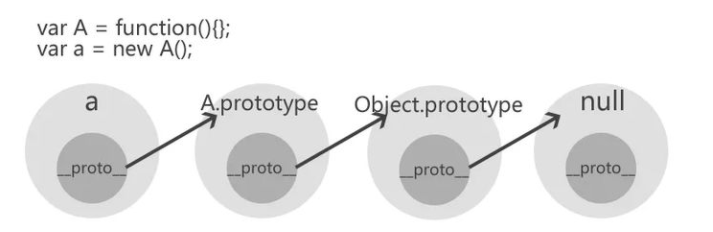
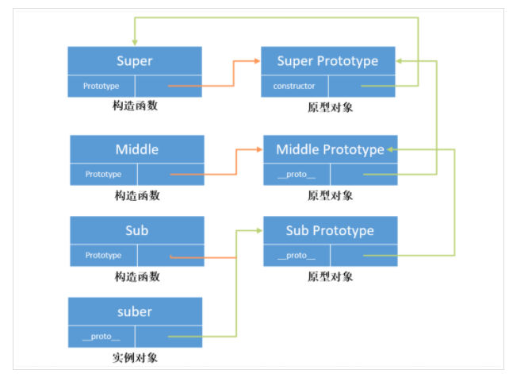
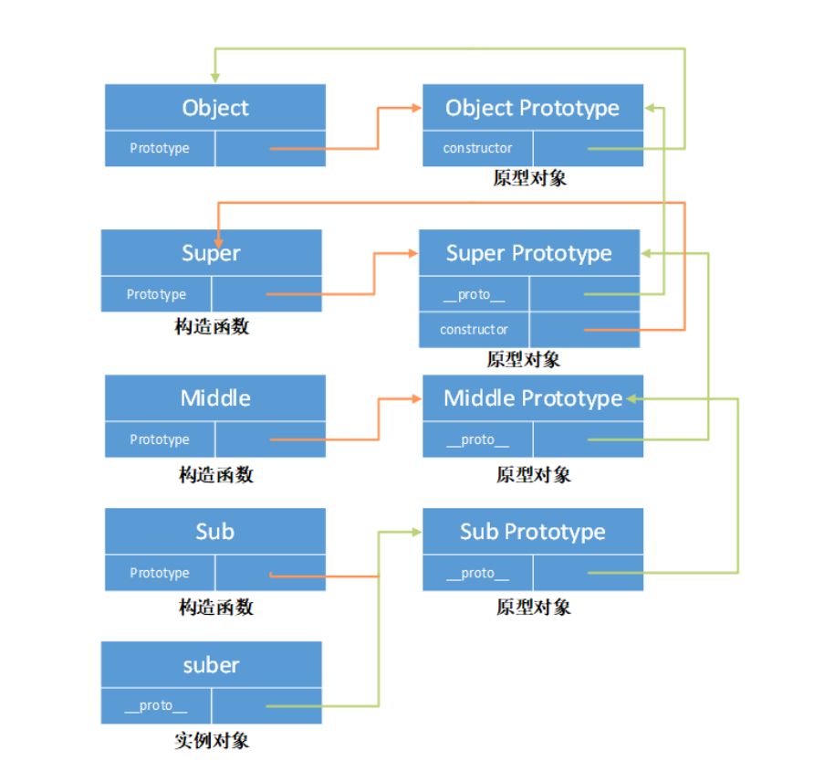

## 回顾值类型和引用类型区别

引用类型有`Object`,`Function`,`Array`,`Date`，`Math`等。

引用类型与基本数据类型的区别:

(1)引用数据类型的实例需要通过`new`关键字创建。

(2)将引用数据类型赋值给变量，实际上赋值的是内存地址

(3)引用数据类型的比较是对内存地址的比较，而基本数据类型的比较是对值的比较。

由于引用数据类型的实例都是通过`new`关键字来创建的，所以我们先来探讨有关`new`操作相关的问题。

### 1.1 new 操作符的作用

`new`操作符在执行过程中会改变`this`的指向，所以下面我们先来看一下`this`的用法。

```js
   <script>
      function Person(userName, age) {
        this.userName = userName;
        this.age = age;
      }
      console.log(new Person("zhangsan", 20));
    </script>
```

执行上面的代码，发现输出的是一个`Person`对象，包含了`userName`和`age`的数据。

但是，问题是，在构造函数`Person`中，我们没有添加`return`,为什么会有返回值呢？

其实就是`this`这个关键字起作用。

```js
  <script>
      function Person(userName, age) {
        console.log(this);//输出的是Person{ }对象
        this.userName = userName;
        this.age = age;
      }
      new Person("zhangsan", 20);
    </script>
```

执行上面的代码，我们可以看到`this` 这里就是一个`Person`的空对象，后面的两行代码就相当于给`Person`对象添加了`userName`和`age`这两个属性。

下面我们把代码修改成如下的形式：

```js
 <script>
      function Person(userName, age) {
        var Person = {};
        Person.userName = userName;
        Person.age = age;
      }
      console.log(new Person("zhangsan", 20));
    </script>
```

以上打印的结果中，输出的是`Person{}`，并没有包含`userName`和`age`,原因是什么呢？

因为在 构造函数中如果没有添加`return`,则默认返回的是`return this`.

修改后的代码如下：

```js
  <script>
      function Person(userName, age) {
        var Person = {};
        Person.userName = userName;
        Person.age = age;
        return Person;
      }
      console.log(new Person("zhangsan", 20));
    </script>
```

对`this`有了一个简单的了解以后，下面重点看如下代码

```js
var person = new Person("zhangsan", 20);
```

从上面的代码中，主要的作用就是创建一个`Person`对象，然后赋值给了`person`这个变量，该变量中包含了`Person`对象中的属性和函数。

其实，在`new`操作符做了如下 3 件事情。

```js
var person = {};
person.__proto__ = Person.prototype;
Person.call(person);
```

### 1.2 原型对象理解

#### 函数对象的 prototype 属性

我们创建的每一个函数都有一个 `prototype` 属性，这个属性是一个指针，指向一个对象。这个对象的用途是包含可以由特定类型的所有实例共享的属性和方法，简单来说，该函数实例化的所有对象的`__proto__`的属性指向这个对象，它是该函数所有实例化对象的原型。

```js
function Person() {}

// 为原型对象添加方法
Person.prototype.sayName = function () {
  alert(this.name);
};
```

下面我们来看一下它们之间的关系。


**简易图**

<!--  -->

#### constructor 属性

当函数创建，`prototype `属性指向一个原型对象时，在默认情况下，这个原型对象将会获得一个 constructor 属性，这个属性是一个指针，指向 `prototype` 所在的函数对象。

拿前面的一个例子来说 `Person.prototype.constructor` 就指向 `Person `函数对象。

```js
console.log(Person.prototype.constructor == Person);
```

下面我们来更新一下它们之间的关系图。

<!--  -->

**简易图**

<!--  -->

#### 对象的 `__proto__ `属性

当我们调用构造函数创建一个新实例后，在这个实例的内部将包含一个指针，指向构造函数的原型对象.

根据前面的 `Person` 构造函数我们新建一个实例

```js
var student = new Person();

console.log(student.__proto__ === Person.prototype); // true
```

从上面我们可以看出，这个连接是存在与实例与构造函数的原型对象之间的，而不是存在于实例和构造函数之间的。

下面我们来看一下现在这几个对象之间的关系

<!--  -->

`isPrototypeOf()` 方法用于测试一个对象是否存在于另一个对象的原型链上。

```js
console.log(Person.prototype.isPrototypeOf(student)); // true
```

**简易图**

<!--  -->

### 1.3 原型属性

#### 属性访问

每当代码读取对象的某个属性时，首先会在对象本身搜索这个属性，如果找到该属性就返回该属性的值，如果没有找到，则继续搜索该对象对应的原型对象，以此类推下去。

因为这样的搜索过程，因此我们如果在实例中添加一个属性时，这个属性就会屏蔽原型对象中保存的同名属性，因为在实例中搜索到该属性后就不会再向后搜索了。

#### 属性判断

既然一个属性既可能是实例本身的，也有可能是其原型对象的，那么我们该如何来判断呢？

在属性确认存在的情况下，我们可以使用 `hasOwnProperty() `方法来判断一个属性是存在与实例中，还是存在于原型中

```js
function Person() {}

Person.prototype.name = "laker";

var student = new Person();

console.log(student.name); // laker
console.log(student.hasOwnProperty("name")); // false

student.name = "xiaoming";
console.log(student.name); //xiaoming 屏蔽了原型对象中的 name 属性
console.log(student.hasOwnProperty("name")); // true
```

```js
function hasPrototypeProperty(object, name) {
  return !object.hasOwnProperty(name) && name in object;
}
```

#### 所有属性获取

```js
function Person() {
  this.name = "KXY";
}
Person.prototype = {
  job: "student",
};

var kxy = new Person();
Object.defineProperty(kxy, "sex", {
  value: "female",
  enumerable: false,
});

console.log(Object.keys(kxy)); //["name"] //无法获取不可枚举的属性与原型链上继承的属性
console.log(Object.getOwnPropertyNames(kxy)); //["name", "sex"]
//for...in能获取原型链上继承的属性，无法获取不可枚举的属性
for (var pro in kxy) {
  console.log("kxy." + pro + " = " + kxy[pro]); // kxy.name = KXY
  //kxy.job = student
}
```

**怎样判断属性是否为实例属性并且是否可枚举**

如果想判断指定名称的属性是否为实例属性并且是否可枚举的，可以使用`propertyIsEnumerable`

```js
function Student(userName) {
  this.userName = userName;
}
Student.prototype.sayHello = function () {
  console.log("hello" + this.userName);
};
var stu = new Student();
console.log(stu.propertyIsEnumerable("userName")); //true:userName为自身定义的实例属性
console.log(stu.propertyIsEnumerable("age")); // false:age属性不存在，返回false
console.log(stu.propertyIsEnumerable("sayHello")); // false :sayHello属于原型上的函数
//将userName属性设置为不可枚举
Object.defineProperty(stu, "userName", {
  enumerable: false,
});
console.log(stu.propertyIsEnumerable("userName")); // false: userName设置了不可枚举
```

### 1.4 `Object.create( )`方法

#### 基本使用

该函数的主要作用是创建并返回一个指定原型和指定属性的新对象，语法格式如下：

```js
Object.create(prototype, propertyDescriptor);
```

`prototype`属性为对象的原型（必须），可以为`null`,如果为`null`，则对象的原型为`undefined`.

`propertyDescriptor`表示的是属性描述符（可选），具体的格式如下：

```js
propertyName:{
    value:'',  // 用来设置属性的值
    writable:true, // 用来设置属性是否可写入, 默认为false, 表示只读
    enumerable:true, // 用来设置属性是否可枚举, 默认为false, 不可枚举
    configurable:true // 设置属性是否可配置, 例如是否可以修改属性的特性以及是否可以删除属性, 默认值为false
}
```

基本实现：

```js
 <script type="text/javascript">
      const person = {
        userName: "zhangsan",
        sayHello: function () {
          console.log("hello " + this.userName);
        },
      };
      const stu = Object.create(person);  // 这样操作后student原型就是person  student.__proto__ === person
      stu.userName = "lisi";
      stu.sayHello(); //hello lisi  覆盖了person中的userName属性原有的值
    </script>
```

通过以上的代码，可以看到`stu`对象的原型是`person`.也就是`stu.__proto__===person`

下面再来看一个案例：

```js
var obj = Object.create(null, {
  userName: {
    value: "wangwu",
    writable: true,
    enumerable: true,
    configurable: true,
  },
  age: {
    value: 23,
  },
});
console.log(obj.userName);
console.log(obj.age);
obj.age = 26;
console.log(obj.age);
for (var o in obj) {
  console.log(o);
}
delete obj.userName;
console.log(obj.userName);
delete obj.age;
console.log(obj.age);
```

#### 实现原理

通过如下的伪代码来查看对应的实现原理

```js
Object.create = function (proto, propertiesObject) {
  //省略了其它判断操作
  function F() {}
  F.prototype = proto;
  if (propertiesObject) {
    Object.defineProperties(F, propertiesObject);
  }
  return new F();
};
```

通过以上的代码，我们可以得出如下的结论：

```js
var f = new F();
f.__proto__ === F.prototype;
```

下面我们可以通过一个例子来验证一下：

```js
var obj = { x: 12, y: 13 };
var test = Object.create(obj);
console.log(test);
console.log(test.x);
console.log(test.__proto__.x);
```

**最后，这里演示一下`Object.defineProperties`方法的基本使用**

该方法的主要作用就是添加或修改对象的属性。

如下代码所示：

```js
var person = {};

Object.defineProperties(person, {
  userName: {
    value: "张三",
    enumerable: true,
  },
  age: {
    value: 12,
    enumerable: true,
  },
});
for (var p in person) {
  console.log(p);
}
person.age = 20;
console.log(person.age);
```

#### 应用场景

对于`Object.create`方法很重要的一个应用场景是用来实现继承

```js
function Person(name, sex) {
  this.name = name;
  this.sex = sex;
}
Person.prototype.getInfo = function () {
  console.log("getInfo: [name:" + this.name + ", sex:" + this.sex + "]");
};
var a = new Person("jojo", "femal");
var b = Object.create(Person.prototype);
console.log(a.name);
console.log(b.name);
console.log(b.getInfo);
```

下面看一下怎样实现完整的继承操作。

```js
function Person(name, sex) {
  this.name = name;
  this.sex = sex;
}
Person.prototype.getInfo = function () {
  console.log("getInfo: [name:" + this.name + ", sex:" + this.sex + "]");
};
function Student(name, sex, age) {
  Person.call(this, name, sex);
  this.age = age;
}
Student.prototype = Object.create(Person.prototype);
var s = new Student("coco", "femal", 25);
s.getInfo();
```

下面，我们简单的分析一下，上面的代码。

对象`s`的`__proto__`指向的是`s`的构造函数`Student`的`prototype`

```js
s.__proto__ === Student.prototype;
```

那么`Student.prototype`的`__proto__`指向什么呢？

```js
Student.prototype.__proto__ === Person.prototype;
```

```js
s.__proto__.__proto__ === Person.prototype;
```

而我们知道对象`s`是有`Student` 创建的，所以其构造函数为`Student`,所以我们在修改了原型以后，这里应该重新修正构造函数。

```js
function Person(name, sex) {
  this.name = name;
  this.sex = sex;
}
Person.prototype.getInfo = function () {
  console.log("getInfo: [name:" + this.name + ", sex:" + this.sex + "]");
};
function Student(name, sex, age) {
  Person.call(this, name, sex);
  this.age = age;
}
Student.prototype = Object.create(Person.prototype);
Student.prototype.constructor = Student;
var s = new Student("coco", "femal", 25);
s.getInfo();
```

### 1.5 `Object.create( )`与`new Object()`的区别

Object.create 和 new Object() 都是创建一个新的对象, 首先先看 new Object(), 就要看 new 操作符了,

new 出来对象会继承构造函数的 prototype, 也就是新创建出来的对象的**proto** === 构造函数.prototype

Object.create 创建的对象必须传入参数, 第一个参数也是对象, 所以 Object.create 创建出来新的对象的原型指向传入的第一个参数,

而 new Object()创建出的指向构造函数的 prototype. 这就是第一个区别

第二个区别, Object.create()可以传一个 null, 代表创建一个非常干净的对象, 没有原型. 此时这种新创建出的对象没法使用 Object 上通用的属性,

比如 toString()

```js
const a = { age: 20 };
const b = new Object(a);
console.log(a === b); //true
```

### 1.6 模拟`new`操作符的实现

在前面我们介绍了`new`操作符所做的三件事情，下面我们来模拟实现一下。

```js
function Person(name, age) {
  this.name = name;
  this.age = age;
}

function New() {
  var obj = {};

  return obj;
}
// 此时返回的obj 并没有name和age两个属性, 而为了实现New函数完成对Person创建新对象. 所以对New函数进行补充
function New() {
  var obj = {};
  Person.apply(obj, arguments); //这一行代码完成了对Person的调用, 同时让this指向了obj对象, obj对象就具有了name和age两个属性
  return obj;
}
console.log(New("zhangsan", 19));
// 至此完成了对new简单的实现, 但是还没有考虑Person的原型对象上的内容, 比如给Person的原型对象上添加sayHello方法, New函数创建出的
// 对象上无法调用sayHello方法
// 我们可以让obj.__proto__ 指向 Person.prototype

function New() {
  var obj = {};
  obj.__proto__ = Person.prototype;
  Person.apply(obj, arguments);
  return obj;
}
console.log(New("zhangsan", 19));
```

```js
function Person(name, age) {
  this.name = name;
  this.age = age;
}
function New() {
  var obj = {};
  var res = Person.apply(obj, arguments);
  return typeof res === "object" ? res : obj;
}
console.log(New("zhangsan", 19));
```

:::tip
所以 new 做的三件事:

1. 创建空对象
2. 将空对象的**proto**属性指向构造函数的 prototype
3. 对象构造函数方法的调用, 同时让 this 指向 new 出来的对象

:::

### 1.7 原型链理解

下面我们通过一个案例来看一个简单的原型链过程。初步代码如下

```js
var A = function () {};
var a = new A();
```

通过`a` 实例沿着原型链第一次的追溯，`__proto__`属性指向`A()`构造函数的原型对象。

```js
a.__proto__ === A.prototype;
```

`a`实例沿着原型链第二次的追溯，`A`原型对象的`__proto__`属性指向`Object`类型的原型对象.

```js
a.__proto__.__proto__ === A.prototype.__proto__;
A.prototype.__proto__ === Object.prototype;
```

`a` 实例沿着原型链第三次追溯，`Object`类型的原型对象的`__proto__`属性为`null`

```js
a.__proto__.__proto__.__proto__ === Object.prototype.__proto__;
Object.prototype.__proto__ === null;
```

具体的图如下所示：



下面，我们再来看一个案例：

```js
function Super() {}

function Middle() {}
function Sub() {}

Middle.prototype = new Super();
Sub.prototype = new Middle();
var suber = new Sub();
```

对应的原型链如下图所示：



上面的图其实并不完整，因为漏掉了`Object`.所以完整的图如下



### 1.8 原型链特点

关于原型链的特点，主要有两个

第一个特点：由于原型链的存在，属性查找的过程不再只是查找自身的原型对象，而是会沿着整个原型链一直向上，直到追溯到`Object.prototype`.也就是说，当`js`引擎在查找对象的属性时，先查找对象本身是否存在该属性，如果不存在，会在原型链上查找，直到`Object.prototype`.如果`Object.prototype`上也找不到该属性，则返回`undefined`,如果期间在对象本身找到了或者是某个原型对象上找到了该属性，则会返回对应的结果。

由于这个特点，我们在自定义的对象中，可以调用某些未在自定义构造函数中定义的函数，例如`toString( )`函数。

```js
function Person() {}
var p = new Person();
p.toString(); // 实际上调用的是Object.prototype.toString( )
```

第二个特点：由于属性查找会经历整个原型链，因此查找的链路越长，对性能的影响越大。

### 1.9 属性的区分

对象属性的查找往往会涉及到整个原型链，那么应该怎样区分属性是实例自身的还是从原型链中继承的呢？

关于这个问题，前面我们也已经讲解过，是通过`hasOwnProperty( )`函数来完成的，这里我们在简单的复习强调一下。

```js
function Person(name, age) {
  this.name = name;
}
//在对象的原型上添加age属性
Person.prototype.age = 21;
var p = new Person("zhangsan");
console.log(p.hasOwnProperty("name")); //true
console.log(p.hasOwnProperty("age")); //false
```

`name`属性为实例属性，在调用`hasOwnProperty`方法时，会返回`true`。`age`属性为原型对象上的属性，在调用`hasOwnProperty`函数时，会返回`false`.

在使用`for...in`运算符，遍历对象的属性时，一般可以配合`hasOwnProperty`方法一起使用，检测某个属性是否为对象自身的属性，如果是，可以做相应的处理。

```js
for (var p in person) {
  if (person.hasOwnProperty(p)) {
  }
}
```

## 2、Array 类型

`Array`类型中提供了丰富的函数用于对数组进行处理，例如，过滤，去重，遍历等等操作。

### 2.1 怎样 判断一个变量是数组还是对象

这里，我们可能会想到使用`typeof`运算符，因为`typeof`运算符是专门用于检测数据类型的，但是`typeof`运算符能够满足我们的需求吗？

```js
var a = [1, 2, 3];
console.log(typeof a);
```

#### 方式一: 2.1.1 `instanceof`运算符

`instanceof`运算符用于通过查找原型链来检查某个变量是否为某个类型数据的实例，使用`instanceof`运算符可以判断一个变量是数组还是对象。

```js
var a = [1, 2, 3];
console.log(a instanceof Array); // true
console.log(a instanceof Object); // true

var userInfo = { userName: "zhangsan" };
console.log(userInfo instanceof Array); // false
console.log(userInfo instanceof Object); // true
```

这里我们可以封装一个函数，用于判断变量是数组类型还是对象类型。

```js
var a = [1, 2, 3];
function getType(o) {
  if (o instanceof Array) {
    return "Array";
  } else if (o instanceof Object) {
    return "Object";
  } else {
    return "参数类型不是Array也不是Object";
  }
}
console.log(getType(a));
```

#### 方式二: 2.1.2 通过构造函数来判断

判断一个变量是否是数组还是对象，其实就是判断变量的构造函数是`Array`类型还是`Object`类型。

因为一个对象的实例都是通过构造函数创建的。

```js
var a = [1, 2, 3];
console.log(a.__proto__.constructor === Array);
```

```js
console.log(a.__proto__.constructor === Object); // false
```

同样这里，这里我们也可以封装一个函数，来判断变量是数组类型还是对象类型。

```js
function getType(o) {
  //获取构造函数
  var constructor = o.__proto__.constructor;
  if (constructor === Array) {
    return "Array";
  } else if (constructor === Object) {
    return "Object";
  } else {
    return "参数类型不是Array也不是Object";
  }
}
var a = [1, 2, 3];
console.log(getType(a));
```

#### 方式三: 2.1.3 通过`toString( )`函数来判断

我们知道，每种引用类型都会直接或间接继承`Object`类型，因此它们都包含`toString( )`函数。

不同数据类型的`toString( )`函数返回值也不一样，所以通过`toString( )`函数就可以判断一个变量是数组还是对象，当然，这里我们需要用到`call`方法来调用`Object`原型上的`toString( )`函数来完成类型的判断。

如下所示：

```js
var arr = [1, 2, 3];
var obj = { userName: "zhangsan" };
console.log(Object.prototype.toString.call(arr)); //[object Array]
console.log(Object.prototype.toString.call(obj)); // [object Object]
console.log(arr.toString()); // 1,2,3
```

#### 方式四: 2.1.4 通过`Array.isArray( )`函数来判断

`Array.isArray` 方法用来判断变量是否为数组。

```js
var arr = [1, 2, 3];
var obj = { name: "zhangsan" };
console.log(Array.isArray(1)); //false
console.log(Array.isArray(arr)); //true
console.log(Array.isArray(obj)); //false
```
