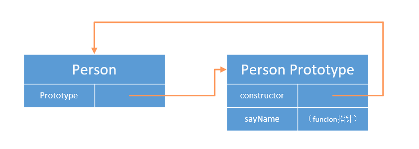
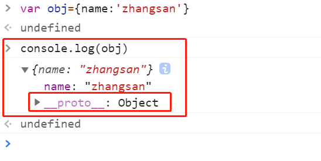
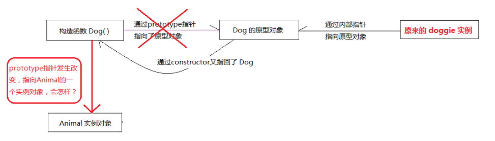
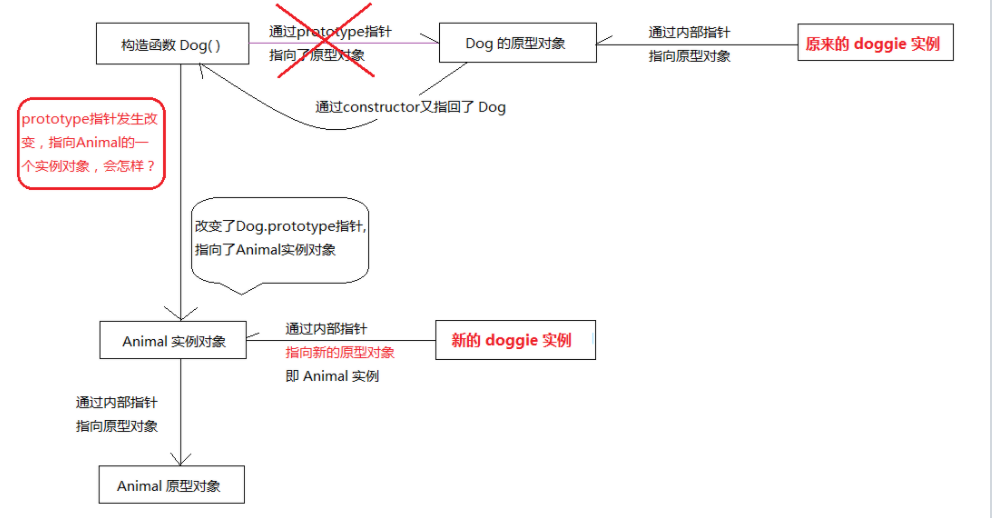

## 1、对象的属性

给对象添加属性非常的简单如下所示：

```js
var person = {
  userName: "zhangsan",
};
```

如果想修改属性的特性，可以通过`Object.defineProperty()`来完成。

```js
var person = {
  userName: "zhangsan",
};
Object.defineProperty(person, "userName", {
  writable: false,
});
person.userName = "lisi"; //无法完成值的修改
console.log(person.userName); //zhangsan
```

我们可以给`Object.defineProperty`添加`getter()`函数和`setter( )`函数，这两个函数可以实现对象的私有属性，私有属性不对外公布，如果想要对私有属性进行读取和写入，可以通过`getter()`函数和`setter( )`函数。

```js
var person = {
  _age: 20, // _age表示私有属性
};
Object.defineProperty(person, "age", {
  get: function () {
    return this._age;
  },
  //在给私有属性赋值的时候，完成对应的校验功能
  set: function (value) {
    if (value >= 18) {
      this._age = value;
      console.log("可以浏览该网站");
    } else {
      console.log("不可以浏览该网站");
    }
  },
});
console.log(person.age); //20
person.age = 12;
console.log(person.age); //20
person.age = 30;
console.log(person.age); // 30
```

关于`Object.defineProperty`更详细的内容，可以参考`vue`响应式原理的课程。

## 2、属性访问方式的区别

我们知道访问对象中的属性，有两种方式。

第一种方式:通过‘.’来访问。

第二种方式:通过‘[ ]’来访问属性。

两种方式有什么区别呢？

第一：使用方括号来访问属性，可以借助于变量来实现。

```js
var person = {
  userName: "zhangsan",
};
var myName = "userName";
console.log(person[myName]);
```

第二：使用方括号来访问属性，也可以通过数字来做属性。

```js
var person = {};
person[1] = "hello";
console.log(person[1]);
```

## 3、创建对象有哪几种方式

### **字面量方式创建对象**

```js
var userInfo = {
  userName: "zhangsan",
  userAge: 18,
  getUserInfo: function () {
    console.log(this.userName + ":" + this.userAge);
  },
};
userInfo.getUserInfo();
```

字面量创建对象比较简单，但是问题也比较突出，每次只能创建一个对象，复用性比较差，如果需要创建多个对象，代码冗余比较高。

### **通过工厂模式创建对象**

工厂模式是一个比较重要的设计模式，该模式提供了一个函数，在该函数中完成对象的创建。

```js
function createUser(userName, userAge) {
  var o = new Object();
  o.userName = userName;
  o.userAge = userAge;
  o.sayHi = function () {
    console.log(this.userName + ":" + this.userAge);
  };
  return o;
}
var user1 = createUser("wangwu", 20);
var user2 = createUser("lisi", 20);
console.log(user1.userName + ":" + user2.userName);
```

通过工厂模式创建对象，解决了字面量创建对象的问题，也就是当创建多个相似对象的时候代码重复的问题。

但是问题是，所创建的所有对象都是`Object`类型，无法进一步的区分对象的具体类型是什么。

### **通过构造函数创建对象**

```js
function Person(userName, userAge) {
  this.userName = userName;
  this.userAge = userAge;
  this.sayHi = function () {
    console.log(this.userName + ":" + this.userAge);
  };
}
var p = new Person("zhangsan", 19);
p.sayHi();
```

构造函数创建对象的优点：解决了工厂模式中对象类型无法识别的问题，也就是说通过构造函数创建的对象可以确定其所属的类型。

但是通过构造函数创建对象的问题：

在使用构造函数创建对象的时候，每个方法都会在创建对象时重新创建一遍，也就是说，根据`Person`构造函数每创建一个对象，我们就会创建一个`sayHi`方法，但它们做的事情是一样的，因此会造成内存的浪费。

### **通过原型模式创建对象**

我们知道，每个函数都有一个`prototype`属性，这个属性指向函数的原型对象，而所谓的通过原型模式创建对象就是将属性和方法添加到`prototype`属性上。

```js
function Person() {}
Person.prototype.userName = "wangwu";
Person.prototype.userAge = 20;
Person.prototype.sayHi = function () {
  console.log(this.userName + ":" + this.userAge);
};
var person1 = new Person();
person1.sayHi();
var person2 = new Person();
console.log(person1.sayHi === person2.sayHi); // true
```

通过上面的代码，我们可以发现，使用基于原型模式创建的对象，它的属性和方法都是相等的，也就是说不同的对象会共享原型上的属性和方法，这样我们就解决了`构造函数`创建对象的问题。

但是这种方式创建的对象也是有问题的，因为所有的对象都是共享相同的属性，所以改变一个对象的属性值，会引起其他对象属性值的改变。而这种情况是我们不允许的，因为这样很容易造成数据的混乱。

```js
function Person() {}
Person.prototype.userName = "wangwu";
Person.prototype.userAge = 20;
Person.prototype.arr = [1, 2];
Person.prototype.sayHi = function () {
  console.log(this.userName + ":" + this.userAge);
};
var p1 = new Person();
var p2 = new Person();
console.log(p1.userName);
p2.userName = "zhangsan";
console.log(p1.userName); //wangwu,基本数据类型不受影响
p1.arr.push(3);
console.log(p1.arr); // [1,2,3]
console.log(p2.arr); // [1,2,3]
//引用类型受影响
```

### **组合使用构造函数模式和原型模式**

为了解决上面的问题

通过构造函数和原型模式创建对象是比较常用的一种方式。

在构造函数中定义对象的属性，而在原型对象中定义对象共享的属性和方法。

```js
//在构造函数中定义对象的属性
function Person(userName, userAge) {
  this.userName = userName;
  this.userAge = userAge;
}
//在原型对象中添加共享的方法
Person.prototype.sayHi = function () {
  return this.userName;
};
var p = new Person("zhangsan", 21);
var p1 = new Person("lisi", 22);
console.log(p1.sayHi());
console.log(p.sayHi());
// 不同对象共享相同的函数，所以经过比较发现是相等的。
console.log(p.sayHi === p1.sayHi);
//修改p对象的userName属性的值，但是不会影响到p1对象的userName属性的值
p.userName = "admin";
console.log(p.sayHi());
console.log(p1.sayHi());
```

通过构造函数与原型模式组合创建对象的好处就是：每个对象都有自己的属性值，也就是拥有一份自己的实例属性的副本，同时又共享着方法的引用，最大限度的节省了内存。

**使用动态原型模式创建对象**

所谓的使用动态原型模式创建对象，其实就是将所有的内容都封装到构造函数中，而在构造函数中通过判断只初始化一次原型。

```js
function Person(userName, userAge) {
  this.userName = userName;
  this.userAge = userAge;
  if (typeof this.sayHi !== "function") {
    console.log("abc"); //只输出一次
    Person.prototype.sayHi = function () {
      console.log(this.userName);
    };
  }
}
var person = new Person("zhangsan", 21);
var person1 = new Person("zhangsan", 21);
person.sayHi();
person1.sayHi();
```

通过上面的代码可以看出，我们将所有的内容写在了构造函数中，并且在构造函数中通过判断只初始化一次原型，而且只在第一次生成实例的时候进行原型的设置。这种方式创建的对象与构造函数和原型混合模式创建的对象功能上是相同的。

## 4、对象拷贝

拷贝指的就是将某个变量的值复制给另外一个变量的过程，关于拷贝可以分为浅拷贝与深拷贝。

针对不同的数据类型，浅拷贝与深拷贝会有不同的表现，主要表现于基本数据类型和引用数据类型在内存中存储的值不同。

对于基本数据类型，变量存储的是值本身，

对于引用数据类型，变量存储的是值在内存中的地址，如果有多个变量同时指向同一个内存地址，其中对一个变量的值进行修改以后，其它的变量也会受到影响。

```js
var arr = [1, 23, 33];
var arr2 = arr;
arr2[0] = 10;
console.log(arr); //  [10, 23, 33]
```

在上面的代码中，我们把`arr`赋值给了`arr2`,然后修改`arr2`的值，但是`arr`也受到了影响。

正是由于数据类型的不同，导致在进行浅拷贝与深拷贝的时候首先的效果是不一样的。

**基本数据类型不管是浅拷贝还是深拷贝都是对值的本身的拷贝。对拷贝后值的修改不会影响到原始的值。**

**对于引用数据类型进行浅拷贝，拷贝后的值的修改会影响到原始的值，如果执行的是深拷贝，则拷贝的对象和原始对象之间相互独立，互不影响。**

所以，这里我们可以总结出什么是浅拷贝，什么是深拷贝。

浅拷贝：如果一个对象中的属性是基本数据类型，拷贝的就是基本类型的值，如果属性是引用类型，拷贝的就是内存地址，也就是拷贝后的内容与原始内容指向了同一个内存地址，这样拷贝后的值的修改会影响到原始的值。

深拷贝：如果一个对象中的属性是基本数据类型，拷贝的也是基本类型的值，如果属性是引用类型，就将其从内存中完整的拷贝一份出来，并且会在堆内存中开辟出一个新的区域存来进行存放，而且拷贝的对象和原始对象之间相互独立，互不影响。

### 浅拷贝

下面我们先来看一下**浅拷贝**的内容

```js
var obj = { a: 1, arr: [2, 3], o: { name: "zhangsan" } };
var shallowObj = shallowCopy(obj);

function shallowCopy(src) {
  var dst = {};
  for (var prop in src) {
    if (src.hasOwnProperty(prop)) {
      dst[prop] = src[prop];
    }
  }
  return dst;
}
obj.o.name = "lisi";
console.log(shallowObj.o.name); //lisi,值受到了影响
obj.arr[0] = 20;
console.log(shallowObj.arr[0]); //20，值受到了影响
obj.a = 10;
console.log(shallowObj.a); // 1,值没有收到影响
```

除了以上方式实现浅拷贝以外，还可以通过`ES6`中的`Object.assign()`函数来实现，该函数可以将源对象中的可枚举的属性复制到目标对象中。

```js
var obj = { a: 1, arr: [2, 3], o: { name: "zhangsan" } };
var result = {};
//将obj对象拷贝给result对象
Object.assign(result, obj);
console.log(result);
obj.a = 10;
console.log(result.a); // 1，不受影响
obj.arr[0] = 20;
console.log(result.arr[0]); //20 受影响
obj.o.name = "lisi";
console.log(result.o.name); // lisi 受影响
```

### 深拷贝

下面，我们来看一下**深拷贝**内容

这里，我们可以使用

```js
JSON.parse(JSON.stringify());
```

来实现深拷贝。

`JSON.stringify()`可以将对象转换为字符串

`JSON.parse()`可以将字符串反序列为一个对象

```js
var obj = { a: 1, arr: [2, 3], o: { name: "zhangsan" } };
var str = JSON.stringify(obj);
var resultObj = JSON.parse(str);
obj.a = 10;
console.log(resultObj.a); // 1 不受影响
obj.arr[0] = 20;
console.log(resultObj.arr[0]); // 2 不受影响
obj.o.name = "lisi";
console.log(resultObj.o.name); // zhangsan 不受影响
```

以上通过`JSON`对象，虽然能够实现深拷贝，但是还是有一定的问题的。

第一：无法实现对函数的拷贝

第二：如果对象中存在循环引用，会抛出异常。

第三：对象中的构造函数会指向`Object`,原型链关系被破坏。

```js
function Person(userName) {
  this.userName = userName;
}
var person = new Person("zhangsan");
var obj = {
  fn: function () {
    console.log("abc");
  },
  // 属性o的值为某个对象
  o: person,
};
var str = JSON.stringify(obj);
var resultObj = JSON.parse(str);
console.log("resultObj=", resultObj); // 这里丢失了fn属性。因为该属性的值为函数
console.log(resultObj.o.constructor); //指向了Object,导致了原型链关系的破坏。
console.log(obj.o.constructor); // 这里指向Person构造函数，没有问题
```

下面我们再来看一下循环引用的情况：

```js
var obj = {
  userName: "zhangsan",
};
obj.a = obj;
var result = JSON.parse(JSON.stringify(obj));
```

以上的内容会抛出异常。

### **自己模拟实现深拷贝**

这里，我们实现一个简单的深拷贝，当然也可以使用第三方库中的方法来实现深拷贝，例如：可以使用`jQuery`中的`$.extend()`

在浅拷贝中，我们通过循环将源对象中属性依次添加到目标对象中，而在深拷贝中，需要考虑对象中的属性是否有嵌套的情况（属性的值是否还是一个对象），如果有嵌套可以通过递归的方式来实现，直到属性为基本类型，也就是说，我们需要将源对象各个属性所包含的对象依次采用递归的方式复制到**新对象**上。

```js
function clone(target) {
  if (typeof target === "object") {
    let objTarget = {};
    for (const key in target) {
      //通过递归完成拷贝
      objTarget[key] = clone(target[key]);
    }
    return objTarget;
  } else {
    return target;
  }
}
var obj = {
  userName: "zhangsan",
  a: {
    a1: "hello",
  },
};
var result = clone(obj);
console.log(result);
```

:::tip
打点

```js
// ----------------
function clone(target) {
  if (typeof target === "object") {
    let newObj = {};
    console.log("88");
    for (const item in target) {
      console.log(item, "11");

      console.log(target, "22");

      console.log(target[item], "33");

      newObj[item] = clone(target[item]);

      console.log(newObj[item], "44");
      console.log(newObj, "55");
    }
    console.log("66");
    console.log(newObj, "-----");
    return newObj;
  } else {
    console.log(target, "77");
    return target;
  }
}
var obj = {
  name: "zhangsan",
  o: {
    score: 99,
  },
};

var result = clone(obj);
console.log(result);
// ------------
```

:::

以上就是一个最简单的深拷贝功能，但是在这段代码中我们只考虑了普通的`object`,还没有实现数组，所以将上面的代码修改一下，让其能够兼容到数组。

```js
function clone(target) {
  if (typeof target === "object") {
    //判断target是否为数组
    let objTarget = Array.isArray(target) ? [] : {};
    for (const key in target) {
      objTarget[key] = clone(target[key]);
    }
    return objTarget;
  } else {
    return target;
  }
}
var obj = {
  userName: "zhangsan",
  a: {
    a1: "hello",
  },
  //添加数组
  arr: [2, 3],
};
var result = clone(obj);
console.log(result);
```

在上面的代码中，添加了` let objTarget = Array.isArray(target) ? [] : {};`判断`target`是否为数组。

下面我们来看一下循环引用的情况：

```js
function clone(target) {
  if (typeof target === "object") {
    //判断target是否为数组
    let objTarget = Array.isArray(target) ? [] : {};
    for (const key in target) {
      objTarget[key] = clone(target[key]);
    }
    return objTarget;
  } else {
    return target;
  }
}
var obj = {
  userName: "zhangsan",
  a: {
    a1: "hello",
  },
  //添加数组
  arr: [2, 3],
};
obj.o = obj; //构成了循环引用
var result = clone(obj);
console.log(result);
```

在上面的代码中，添加了`obj.o=obj`.然后出现了`Maximum call stack size exceeded`

以上的错误表明了递归进入了死循环导致栈内存溢出。

原因是：对象存在循环引用的情况，也就是对象的属性间接或直接引用了自身的情况。

解决的方法：这里我们可以额外开辟一个存储空间，在这个存储空间中存储当前对象和拷贝对象之间的对应关系。

当需要拷贝当前的对象的时候，先去这个存储空间中进行查找，如果没有拷贝过这个对象，执行拷贝操作。如果已经拷贝过这个对象，直接返回，这样就可以解决循环引用的问题。

```js
let map = new WeakMap();
function clone(target) {
  if (typeof target === "object") {
    //判断target是否为数组
    let objTarget = Array.isArray(target) ? [] : {};
    // 如果有直接返回
    if (map.get(target)) {
      return target;
    }
    //存储当前对象与拷贝对象的对应关系
    map.set(target, objTarget);
    for (const key in target) {
      objTarget[key] = clone(target[key]);
    }
    return objTarget;
  } else {
    return target;
  }
}
var obj = {
  userName: "zhangsan",
  a: {
    a1: "hello",
  },
  //添加数组
  arr: [2, 3],
};
obj.o = obj; //构成了循环引用
var result = clone(obj);
console.log(result);
```

以上就是一个基本的深拷贝的案例。

以上就是一个基本的深拷贝的案例。

## 5、重写原型对象的问题

**原型对象**



在前面的课程中，我们讲解过原型对象，我们知道每个函数在创建的时候都会有一个`prototype`属性，它指向函数的原型对象。

在这个对象中可以包含所有实例共享的属性和方法。例如上图中的`sayName`方法。

同时在每个原型对象上都会增加一个`constructor`属性，该属性指向`prototype`属性所在的构造函数，如上图所示。


当我们通过`new`操作符创建一个实例的时候，该实例就有了一个`__proto__`属性，该属性指向了构造函数的原型对象，如上图所示：

所以说，`__proto__`属性可以看作是一个连接实例与构造函数的原型对象的桥梁。

:::tip

```js
function Person(name) {
  this.name = name;
}

const stu = new Person("zhangsan");

console.log(stu.__proto__ === Person.prototype); //true
console.log(Person.prototype.constructor === Person); //true
```

:::

**所以三者的关系是，每个构造函数都有一个原型对象，原型对象都包含一个指向构造函数的指针，而实例都包含一个指向原型对象的内部指针。**通俗点说就是，实例通过内部指针可以访问到原型对象，原型对象通过 constructor 指针，又可以找到构造函数。也就是上图体现的内容。

下面我们来看一个问题：**重写原型对象**

我们在前面写代码的时候，每次都是为原型对象添加一个属性或者函数时，都是直接给`Person.prototype`上添加，这种写法比较冗余。

我们可以将属性和方法写成一个字面量对象的形式，然后在赋值给`prototype`属性。

如下代码所示：

```js
function Person() {}
Person.prototype = {
  userName: "zhangsan",
  age: 20,
  sayHi: function () {
    console.log(this.userName);
  },
};
var person = new Person();
person.sayHi(); //zhangsan
```

通过执行的结果，依然可以获取到原型对象上属性的值。

当我们把一个字面量对象赋值给`prototype`属性以后，实际上就是重写了原型对象。

但是这时候，我们打印`Person.prototype.constructor`的时候，发现不在指向`Person`这个构造函数,而是指向了`Object`构造函数。

```js
function Person() {}
Person.prototype = {
  userName: "zhangsan",
  age: 20,
  sayHi: function () {
    console.log(this.userName);
  },
};
var person = new Person();
person.sayHi();
console.log(Person.prototype.constructor); // Object
```

原因是：在重写`prototype`的时候，我们使用字面量创建了一个新的对象，并且这个新的对象中少了`constructor`属性，

如下图所示



而我们可以看到在字面量对象中有一个`__proto__`属性，指向了`Object`的原型对象,这时，只能去`Object`原型对象中查找是否有`constructor`属性，而`Object`原型对象中的`constructor`指向的还是`Object`.所以最终输出结果为`Object`.

我们怎样避免这种情况呢？

可以在重写原型对象的时候添加`constructor`属性。这样就不用在去新对象的原型对象中查找`constructor`属性了。

```js
function Person() {}
Person.prototype = {
  constructor: Person, //添加constructor
  userName: "zhangsan",
  age: 20,
  sayHi: function () {
    console.log(this.userName);
  },
};
var person = new Person();
person.sayHi();
console.log(Person.prototype.constructor); // Person
```

重写了原型对象以后，还需要注意一个问题，就是在重写原型对象之前，已经生成的对象的实例，无法获取新的原型对象中的属性和方法。

如下代码所示：

```js
  <script>
      function Person() {}
      var person = new Person();//在重写原型对象之前，生成对象的实例
      Person.prototype = {
        constructor: Person, //添加constructor
        userName: "zhangsan",
        age: 20,
        sayHi: function () {
          console.log(this.userName);
        },
      };
      //   var person = new Person();
      person.sayHi(); //  person.sayHi is not a function,无法获取sayHi函数。
      console.log(Person.prototype.constructor);
    </script>
```

造成上面错误的原因是：`person`这个对象指向的是最初的原型对象，而最初的原型对象中是没有`sayHi`这个方法的。

所以在执行的时候会抛出异常。

## 6、继承的实现方式有哪些

关于继承的实现方式，在前面，我们也已经讲解过，这里做一个汇总。

### 原型链继承

代码如下：

```js
function Animal() {
  this.superType = "Animal";
  this.name = name || "动物";
  //实例方法
  this.sleep = function () {
    console.log(this.name + "正在睡觉!!");
  };
}
//原型上的函数
Animal.prototype.eat = function (food) {
  console.log(this.name + "正在吃:" + food);
};
function Dog(name) {
  this.name = name;
}
// 改变Dog的prototype指向，指向了一个Animal实例，实现了原型继承
Dog.prototype = new Animal();
var doggie = new Dog("wangcai");
console.log(doggie.superType);
doggie.sleep();
doggie.eat("狗粮");
```

在上面的代码中，将`Animal`的实例赋值给了`Dog`的原型对象，这样就实现了原型的继承，所以`Dog`的实例可以获取父类`Animal`中的`superType`属性，调用父类中的实例方法，原型上的函数。

下面，可以通过一张图来理解一下：



原来的构造函数`Dog`的`prototype`指向的是`Dog`的原型对象，但是现在指向了`Animal`的实例对象。也就是说构造函数`Dog`的原型对象为`Animal`的实例对象。

这样会出现什么样的效果呢？



注意：上面我们所写的代码还是有一个小的问题的。

`Dog.prototype.constructor`指向了`Animal`

```js
Dog.prototype.constructor === Animal; // true
```

这里，还是要求`Dog.prototype.constructor`指向`Dog`

```js
function Animal() {
  this.superType = "Animal";
  this.name = name || "动物";
  //实例方法
  this.sleep = function () {
    console.log(this.name + "正在睡觉!!");
  };
}
Animal.prototype.eat = function (food) {
  console.log(this.name + "正在吃:" + food);
};
function Dog(name) {
  this.name = name;
}
// 改变Dog的prototype指向，指向了一个Animal实例，实现了原型继承
Dog.prototype = new Animal();
// 将Dog的构造函数指向自身
Dog.prototype.constructor = Dog;
var doggie = new Dog("wangcai");
console.log(doggie.superType);
doggie.sleep();
doggie.eat("狗粮");
```

原型继承的优点：

第一：实现起来非常简单

只要设置子类的`portotype`属性为父类的实例即可。

第二：可以通过子类的实例直接访问父类原型链中的属性和函数。

原型继承的缺点：

第一：我们知道子类的所有实例将共享父类的属性，这样就会导致一个问题：如果父类中的某个属性的值为引用类型，某个子类的实例去修改这个属性的值，就会影响到其它实例的值。

如下代码所示：

```js
function Person() {
  this.emotion = ["吃饭", "睡觉", "学习"]; // 爱好
}
function Studnet(id) {
  this.id = id; // 学号
}
Studnet.prototype = new Person();
Studnet.prototype.constructor = Studnet;
var stu1 = new Studnet(1001);
console.log(stu1.emotion); // ["吃饭", "睡觉", "学习"]
stu1.emotion.push("玩游戏");
console.log(stu1.emotion); // ["吃饭", "睡觉", "学习", "玩游戏"]
//创建 stu2对象
var stu2 = new Studnet(1002);
console.log(stu2.emotion); // ["吃饭", "睡觉", "学习", "玩游戏"]
```

通过上面的代码，我们可以看到`stu1`对象向数组`emotion`数组中添加了一项以后，`stu2`对象也收到了影响。

第二：在创建子类的实例的时候，无法向父类的构造函数中传递参数。

在通过`new`操作符创建子类的实例的时候，会调用子类的构造函数，而在子类的构造函数中并没有设置与父类的关联操作，所以无法向父类的构造函数中传递参数。

第三：在给子类的原型对象上添加属性或者是方法的时候，一定要放在`Student.prototype=new Person`语句的后面。

如下代码：

```js
function Person() {
  this.emotion = ["吃饭", "睡觉", "学习"]; // 爱好
}
function Studnet(id) {
  this.id = id; // 学号
}
//在Studnet.prototype = new Person();代码前给Student的prototype添加study方法。
Studnet.prototype.study = function () {
  console.log("好好学习，天天向上");
};
Studnet.prototype = new Person();
Studnet.prototype.constructor = Studnet;
var stu1 = new Studnet(1001);
stu1.study();
```

指向上面的代码，会出现`stu1.study is not a function`的错误。

原因：后面通过`Studnet.prototype = new Person();`这行代码对`Student`的原型对象进行了重写，所以导致`study`方法无效了。

修改后的代码：

```js
function Person() {
  this.emotion = ["吃饭", "睡觉", "学习"]; // 爱好
}
function Studnet(id) {
  this.id = id; // 学号
}

Studnet.prototype = new Person();
Studnet.prototype.constructor = Studnet;
//放在了Studnet.prototype=new Person语句的后面
Studnet.prototype.study = function () {
  console.log("好好学习，天天向上");
};
var stu1 = new Studnet(1001);
stu1.study();
```

### 构造函数继承

在子类的构造函数中，通过`apply()`方法或者是`call()`方法，调用父类的构造函数，从而实现继承功能。

```js
function Person() {
  this.emotion = ["吃饭", "睡觉"]; // 爱好
}
function Studnet(id) {
  this.id = id; // 学号
  Person.call(this);
}
var stu1 = new Studnet(1001);
console.log(stu1.emotion); // ["吃饭", "睡觉"]
```

如下代码：

```js
function Person() {
  this.emotion = ["吃饭", "睡觉", "学习"]; // 爱好
}
function Studnet(id) {
  this.id = id; // 学号
  Person.call(this);
}
var stu1 = new Studnet(1001);
var stu2 = new Studnet(1002);
stu1.emotion.push("玩游戏");
console.log(stu1.emotion); // ["吃饭", "睡觉", "学习", "玩游戏"]
console.log(stu2.emotion); // ["吃饭", "睡觉", "学习"]
```

通过上面的代码，可以看到`stu1`对象向`emotion`数组中添加数据，并不会影响到`stu2`对象。

**构造函数继承的优点**

第一：由于在子类的构造中通过`call`改变了父类中的`this`指向，导致了在父类构造函数中定义的属性或者是方法都赋值给了子类，这样生成的每个子类的实例中都具有了这些属性和方法。而且它们之间是互不影响的，及时是引用类型。

第二：创建子类的实例的时候，可以向父类的构造函数中传递参数。

```js
//传递age参数
function Person(age) {
  this.emotion = ["吃饭", "睡觉", "学习"];
  this.age = age;
}
//传递age参数
function Studnet(id, age) {
  this.id = id;
  // 传递age参数
  Person.call(this, age);
}
var stu1 = new Studnet(1001, 20); //传递年龄
var stu2 = new Studnet(1002, 21);
stu1.emotion.push("玩游戏");
console.log(stu1.emotion); // ["吃饭", "睡觉", "学习", "玩游戏"]
console.log(stu2.emotion); // ["吃饭", "睡觉", "学习"]
console.log(stu1.age); // 20
console.log(stu2.age); // 21
```

**构造函数继承的缺点**

第一：子类只能继承父类中实例的属性和方法，无法继承父类原型对象上的属性和方法。

```js
function Person(age) {
  this.emotion = ["吃饭", "睡觉", "学习"]; // 爱好
  this.age = age;
}
// 原型上的方法
Person.prototype.study = function () {
  console.log("好好学习，天天向上");
};
function Studnet(id, age) {
  this.id = id; // 学号
  Person.call(this, age);
}
var stu = new Studnet(1001, 20);
console.log(stu.age); // 20
stu.study(); //stu.study is not a function
```

第二：在父类的构造函数中添加一个实例方法，对应的子类也就有了该实例方法，但是问题时，每创建一个子类的实例，都会有一个父类中的实例方法，这样导致的结果就是占用内存比较大。以前我们是定义在`prototype`原型上来解决这个问题的，但是在构造函数的继承中，又出现了这个。

```js
function Person(age) {
  this.emotion = ["吃饭", "睡觉", "学习"]; // 爱好
  this.age = age;
  this.study = function () {
    console.log(this.id + "号同学要努力学习");
  };
}

function Studnet(id, age) {
  this.id = id; // 学号
  Person.call(this, age);
}
var stu = new Studnet(1001, 20);
stu.study();
var stu1 = new Studnet(1002, 20);
stu1.study();
//stu对象和stu1对象都单独有一个study方法。
```

### 拷贝继承

所谓的拷贝继承指的是先创建父类的实例，然后通过`for...in`的方式来遍历父类实例中的所有属性和方法，并依次赋值给子类的实例，同时原型上的属性和函数也赋给子类的实例。

```js
function Person(age) {
  this.emotion = ["吃饭", "睡觉", "学习"]; // 爱好
  this.age = age;
  this.study = function () {
    console.log(this.id + "号同学要努力学习");
  };
}
Person.prototype.run = function () {
  console.log(this.id + "号学生正在跑步,年龄是:" + this.age);
};

function Studnet(id, age) {
  var person = new Person(age);
  for (var key in person) {
    if (person.hasOwnProperty(key)) {
      this[key] = person[key];
    } else {
      Studnet.prototype[key] = person[key];
    }
  }
  // 子类自身的属性
  this.id = id;
}
var student = new Studnet(1001, 21);
student.study();
student.run();
```

在上面的代码中，创建了父类`Person`,并且在该类中指定了相应的实例属性和实例方法，同时为其原型对象中也添加了方法。

在`Studnet`这个子类中，首先会创建父类`Person`的实例，然后通过`for...in`来进行遍历，获取父类中的属性和方法，获取以后进行判断，如果`person.hasOwnProperty(key)`返回值为`false`，表示获取到的是父类原型对象上的属性和方法，所以也要添加到子类的`prototype`属性上，成为子类的原生对象上的属性或者是方法。

最后创建子类的实例`student`,通过子类的实例`student`,可以访问继承到的属性或者是方法。

**拷贝继承的优点**

第一：可以实现向父类中的构造方法中传递参数。

第二：能够实现让子类继承父类中的实例属性，实例方法以及原型对象上的属性和方法。

**拷贝继承的缺点**

父类的所有属性和方法，子类都需要复制拷贝一遍，所以比较消耗内存。

### 组合继承

组合继承的核心思想是将构造函数继承与原型继承两种方式组合在一起。

```js
function Person(age) {
  this.emotion = ["吃饭", "睡觉", "学习"]; // 爱好
  this.age = age;
  this.study = function () {
    console.log(this.id + "号同学要努力学习");
  };
}
Person.prototype.run = function () {
  console.log(this.id + "号学生正在跑步,年龄是:" + this.age);
};
function Studnet(id, age) {
  Person.call(this, age);
  this.id = id; //子类独有的属性
}
Studnet.prototype = new Person();
Studnet.prototype.constructor = Studnet;
var student = new Studnet(1001, 21);
student.run();
console.log("爱好是:" + student.emotion);
```

**组合继承的优点**

第一：通过`Person.call(this,ge)`这个行代码，可以将父类中的实例属性和方法添加到子类`Student`中，另外通过`Studnet.prototype = new Person();` 可以将父类的原型对象上的属性和函数绑定到`Student`的原型对象上。

第二：可以向父类的构造函数中传递参数。

**组合继承的缺点**

组合继承的主要缺点是父类的实例属性会绑定两次。

第一次是在子类的构造函数中通过`call( )`函数调用了一次父类的构造函数，完成实例属性和方法的绑定操作。

第二次是在改写子类`prototype`属性的时候，我们执行了一次`new Person()`的操作，这里又将父类的构造函数调用了一次，完成了属性的绑定操作。

所以在整个组合继承的过程中，父类实例的属性和方法会进行两次的绑定操作。当然这里需要你注意的一点是：通过`call()`函数完成父类中实例属性和方法的绑定的优先级要高于通过改写子类`prototype`的方式。也就是说第一种方式会覆盖第二种方式：

如下代码所示：

```js
function Person(age) {
  this.emotion = ["吃饭", "睡觉", "学习"]; // 爱好
  this.age = age;
  //实例方法
  this.study = function () {
    console.log(this.id + "号同学要努力学习");
  };
}
Person.prototype.run = function () {
  console.log(this.id + "号学生正在跑步,年龄是:" + this.age);
};
// 原型方法
Person.prototype.study = function () {
  console.log(this.id + "号学生需要好好学习");
};
function Studnet(id, age) {
  Person.call(this, age);
  this.id = id; //子类独有的属性
}
Studnet.prototype = new Person();
Studnet.prototype.constructor = Student;
var student = new Studnet(1001, 21);
student.run();
console.log("爱好是:" + student.emotion);
student.study(); //调用父类的实例方法student
```

在上面的代码中，在父类`Person`的构造函数中定义了实例方法`study`,同时在其原型对象上也定义了一个`study`方法。

通过子类的实例调用`study`方法的时候，调用的是父类的实例方法`study`.

### 寄生式组合继承

```js
function Person(age) {
  this.emotion = ["吃饭", "睡觉", "学习"]; // 爱好
  this.age = age;
  this.study = function () {
    console.log(this.id + "号同学要努力学习");
  };
}
Person.prototype.run = function () {
  console.log(this.id + "号学生正在跑步,年龄是:" + this.age);
};
Person.prototype.study = function () {
  console.log(this.id + "号学生需要好好学习");
};
function Studnet(id, age) {
  Person.call(this, age);
  this.id = id;
}
// 定义Super构造函数
function Super() {}
//Super.prototype原型对象指向了Person.prototype
Super.prototype = Person.prototype;
//Student.prototype原型对象指向了Super的实例，这样就去掉了Person父类的实例属性。
Studnet.prototype = new Super();
Studnet.prototype.constructor = Studnet;
var student = new Studnet(1001, 21);
student.run();
console.log("爱好是:" + student.emotion);
student.study();
```

在上面的代码中，创建了一个`Super`构造函数，让`Super.prototype`的原型指向了`Person.prototype`,同时将`Super`的对象赋值给了`Student.prototype`，这样就去掉了`Person`父类的实例属性。

通过寄生式组合继承解决了组合继承的问题。

同时，在以后的应用中，可以使用组合继承，也可以使用寄生式组合继承。

## 7、模拟 jQuery 实现

下面我们通过模拟实现一个简单的`jQuery`,来巩固原型的应用。

```js
  <script>
      // 为jQuery起一个别名，模仿jQuery的框架
      var $ = (jQuery = function () {});
      // 为jQuery原型起一个别名
      //这里没有直接赋值给fn，否则它属于window对象，容易造成全局污染
      //后面要访问jquery的原型，可以直接通过jQuery.fn来实现
      jQuery.fn = jQuery.prototype = {
        version: "6.1.1", //添加原型属性，表示jquery的版本
        //添加原型方法，表示返回jquery对象的长度
        size: function () {
          return this.length;
        },
      };

    </script>
```

下面，我们使用`jQuery`原型中的`size`方法和`version`属性。

```js
// 为jQuery起一个别名，模仿jQuery的框架
var $ = (jQuery = function () {});
// 为jQuery原型起一个别名
//这里没有直接赋值给fn，否则它属于window对象，容易造成全局污染
//后面要访问jquery的原型，可以直接通过jQuery.fn来实现
jQuery.fn = jQuery.prototype = {
  version: "6.1.1", //添加原型属性，表示jquery的版本
  //添加原型方法，表示返回jquery对象的长度
  size: function () {
    return this.length;
  },
};
var jq = new $();
console.log(jq.version); // 6.1.1
console.log(jq.size()); // undefined
```

在上面的代码中，我们是创建了一个`jquery`的实例，然后通过该实例完成了原型属性和方法的调用。

但是在`jquery`库中，是采用如下的方式进行调用。

```js
$().version;
$().size();
```

通过以上的两行代码，我们可以看到在`jQuery`库中，并没有使用`new`操作符，而是直接使用小括号运算符完成了对`jQuery`构造函数的调用。然后后面直接访问原型成员。

那应该怎样实现这种操作？

我们想到的就是，在`jquery`的构造函数中，直接创建`jQuery`类的实例。

```js
// 为jQuery起一个别名，模仿jQuery的框架
var $ = (jQuery = function () {
  return new jQuery();
});
// 为jQuery原型起一个别名
//这里没有直接赋值给fn，否则它属于window对象，容易造成全局污染
//后面要访问jquery的原型，可以直接通过jQuery.fn来实现
jQuery.fn = jQuery.prototype = {
  version: "6.1.1", //添加原型属性，表示jquery的版本
  //添加原型方法，表示返回jquery对象的长度
  size: function () {
    return this.length;
  },
};
$().version;
//   var jq = new $();
//   console.log(jq.version); // 6.1.1
//   console.log(jq.size());
```

在上面的代码中，给`jQuery`构造函数直接返回了`它的实例`，`return new jQuery();`

然后获取原型对象中的`size`属性的值:`$().version`.

但是，出现了如下的错误：

```
Uncaught RangeError: Maximum call stack size exceeded
```

以上错误的含义是栈内存溢出。

原因就是：当我们通过`$()`调用构造函数的时候，内部有执行了`new`操作，这时，又会重新执行`jQuery`的构造函数，这样就造成了死循环。

```js
var $ = (jQuery = function () {
  return jQuery.fn.init(); //调用原型中的`init方法`
});

jQuery.fn = jQuery.prototype = {
  init: function () {
    return this; //返回jquery的原型对象
  },
  version: "6.1.1",
  size: function () {
    return this.length;
  },
};
console.log($().version);
```

在上面的代码中，在`jQuery`的构造方法中，调用的是原型中的`init`方法，在该方法中，返回了`jquery`的原型对象。

最后进行输出:`cosnole.log($().version)`

但是，以上的处理还是隐藏一个问题，具体看如下代码：

```js
var $ = (jQuery = function () {
  return jQuery.fn.init();
});
jQuery.fn = jQuery.prototype = {
  init: function () {
    this.length = 0; //原型属性length
    this._size = function () {
      //原型方法
      return this.length;
    };
    return this;
  },
  version: "6.1.1",
  length: 1, // 原型属性
  size: function () {
    return this.length;
  },
};
console.log($().version);
console.log($()._size()); // 0
console.log($().size()); // 0
```

在上面的代码中，在`init`这个原型方法中添加了`lenght`属性与`_size`方法，在该方法中打印`length`的值。

```js
var $ = (jQuery = function () {
  return new jQuery.fn.init(); //调用原型中的`init方法`
});
```

在`jQuery`的构造函数中，通过`new`操作符创建了一个实例对象，这样`init()`方法中的`this`指向的就是`init`方法的实例，而不是`jQuery.prototype`这个原型对象了。

```js
console.log($().version); // 返回undefined
console.log($()._size()); // 0
console.log($().size()); // 抛出异常：Uncaught TypeError: $(...).size is not a function
```

下面，我们来看一下怎样解决现在面临的问题。

```js
var $ = (jQuery = function () {
  return new jQuery.fn.init(); //调用原型中的`init方法`
});
jQuery.fn = jQuery.prototype = {
  init: function () {
    this.length = 0;
    this._size = function () {
      return this.length;
    };
    return this;
  },
  version: "6.1.1",
  length: 1,
  size: function () {
    return this.length;
  },
};
// 将`jQuery`的原型对象覆盖掉init的原型对象。
jQuery.fn.init.prototype = jQuery.fn;
console.log($().version); //6.1.1
console.log($()._size()); // 0
console.log($().size()); // 0
```

在上面的代码中，我们添加了一行代码：

```js
jQuery.fn.init.prototype = jQuery.fn;
```

```js
console.log($().version);
```

**下面，要实现的是选择器功能**

`jQuery`构造函数包括两个参数，分别是`selector`和`context`,`selector`表示的是选择器，`context`表示匹配的上下文，也就是可选择的访问，一般表示的是一个`DOM`元素。这里我们只考虑标签选择器。

```js
<script>
      // 给构造函数传递selector,context两个参数
      var $ = (jQuery = function (selector, context) {
        return new jQuery.fn.init(selector, context); //调用原型中的`init方法`
      });
      jQuery.fn = jQuery.prototype = {
        init: function (selector, context) {
          selector = selector || document; //初始化选择器，默认值为document
          context = context || document; // 初始化上下文对象，默认值为document
          if (selector.nodeType) {
            // 如果是DOM元素
            // 把该DOM元素赋值给实例对象
            this[0] = selector;
            this.length = 1; //表示包含了1个元素
            this.context = selector; //重新设置上下文对象
            return this; //返回当前实例
          }
          if (typeof selector === "string") {
            //如果选择器是一个字符串
            var e = context.getElementsByTagName(selector); // 获取指定名称的元素
            //通过for循环将所有元素存储到当前的实例中
            for (var i = 0; i < e.length; i++) {
              this[i] = e[i];
            }
            this.length = e.length; //存储元素的个数
            this.context = context; //保存上下文对象
            return this; //返回当前的实例
          } else {
            this.length = 0;
            this.context = context;
            return this;
          }
          //   this.length = 0;
          //   console.log("init==", this);
          //   this._size = function () {
          //     return this.length;
          //   };
          //   return this;
        },

        // version: "6.1.1",
        // length: 1,
        // size: function () {
        //   return this.length;
        // },
      };
      jQuery.fn.init.prototype = jQuery.fn;
      window.onload = function () {
        console.log($("div").length);
      };
      //   console.log($().version);
      //   console.log($()._size()); // 0
      //   console.log($().size()); // 0
      //   var jq = new $();
      //   console.log(jq.version); // 6.1.1
      //   console.log(jq.size());
    </script>
    <div></div>
    <div></div>
  </body>
```

在上面的代码中，当页面加载完以后，这时会触发`onload`事件，在该事件对应的处理函数中，通过`$("div")`,传递的是字符串，

`selector`参数表示的就是`div`这个字符串，这里没有传递`context`参数，表示的就是`document`对象。

最后打印元素的个数。

在使用`jQuery`库的时候，我们经常可以看到如下的操作：

```js
$("div").html();
```

以上代码的含义就是直接在`jQuery`对象上调用`html( )`方法来操作`jQuery`包含所有的`DOM`元素。

`html()`方法的实现如下：

```js
<!DOCTYPE html>
<html lang="en">
  <head>
    <meta charset="UTF-8" />
    <meta http-equiv="X-UA-Compatible" content="IE=edge" />
    <meta name="viewport" content="width=device-width, initial-scale=1.0" />
    <title>Document</title>
  </head>
  <body>
    <script>
      // 给构造函数传递selector,context两个参数
      var $ = (jQuery = function (selector, context) {
        return new jQuery.fn.init(selector, context); //调用原型中的`init方法`
      });
      jQuery.fn = jQuery.prototype = {
        init: function (selector, context) {
          selector = selector || document; //初始化选择器，默认值为document
          context = context || document; // 初始化上下文对象，默认值为document
          if (selector.nodeType) {
            // 如果是DOM元素
            // 把该DOM元素赋值给实例对象
            this[0] = selector;
            this.length = 1; //表示包含了1个元素
            this.context = selector; //重新设置上下文对象
            return this; //返回当前实例
          }
          if (typeof selector === "string") {
            //如果选择器是一个字符串
            var e = context.getElementsByTagName(selector); // 获取指定名称的元素
            //通过for循环将所有元素存储到当前的实例中
            for (var i = 0; i < e.length; i++) {
              this[i] = e[i];
            }
            this.length = e.length; //存储元素的个数
            this.context = context; //保存上下文对象
            return this; //返回当前的实例
          } else {
            this.length = 0;
            this.context = context;
            return this;
          }
          //   this.length = 0;
          //   console.log("init==", this);
          //   this._size = function () {
          //     return this.length;
          //   };
          //   return this;
        },
        html: function (val) {
          jQuery.each(
            this,
            function (val) {
              this.innerHTML = val;
            },
            val
          );
        },

        // version: "6.1.1",
        // length: 1,
        // size: function () {
        //   return this.length;
        // },
      };
      jQuery.fn.init.prototype = jQuery.fn;

      //提供each扩展方法
      jQuery.each = function (object, callback, args) {
        //通过for循环的方式来遍历jQuery对象中的每个DOM元素。
        for (var i = 0; i < object.length; i++) {
          // 在每个DOM元素上调用回调函数
          callback.call(object[i], args);
        }
        return object; //返回jQuery对象。
      };
      window.onload = function () {
        // console.log($("div").length);
        $("div").html("<h2>hello<h2>");
      };
      //   console.log($().version);
      //   console.log($()._size()); // 0
      //   console.log($().size()); // 0
      //   var jq = new $();
      //   console.log(jq.version); // 6.1.1
      //   console.log(jq.size());
    </script>
    <div></div>
    <div></div>
  </body>
</html>

```

在上面的代码中，首先添加了`jQuery.each`方法。

```js
//提供each扩展方法
jQuery.each = function (object, callback, args) {
  //通过for循环的方式来遍历jQuery对象中的每个DOM元素。
  for (var i = 0; i < object.length; i++) {
    // 在每个DOM元素上调用回调函数
    //这里的让回调函数中的this指向了dom元素。
    callback.call(object[i], args);
  }
  return object; //返回jQuery对象。
};
```

在上面的代码中，通过`for`循环遍历`jQuery`对象中的每个`DOM`元素。然后执行回调函数`callback`

在`jQuery`的原型对象上，添加`html`方法

```js
  html: function (val) {
          jQuery.each(
            this, //表示jQuery原型对象
            function (val) {
                //this表示的是dom元素，这里是div元素
              this.innerHTML = val;
            },
            val //表示传递过来的`<h2>hello<h2>`
          );
        },
```

在`html`方法中完成对`jQuery.each`方法的调用。

`window.onload`的方法修改成如下的形式：

```js
window.onload = function () {
  // console.log($("div").length);
  $("div").html("<h2>hello<h2>");
};
```

## \*\*下面我们实现`jQuery`的扩展功能

jQuery 提供了良好的扩展接口，方便用户自定义 jQuery 方法。根据设计习惯，如果为 jQuery 或者 jQuery.prototype 新增方法时，我们可以直接通过点语法来实现，例如上面我们扩展的`html`方法，或者在 jQuery.prototype 对象结构内增加。但是，如果分析 jQuery 源码，会发现它是通过 extend() 函数来实现功能扩展的。

通过`extend()`方法来实现扩展的好处是：方便用户快速的扩展`jQuery`功能，但不会破坏`jQuery`框架的结构。如果直接在`jQuery`源码中添加方法，这样就破坏了`Jquery`框架的结构，不方便后期的代码维护。

如果后期不需要某个功能，可以直接使用`Jquery`提供的方法删除，而不需要从源码中在对该功能进行删除。

extend() 函数的功能很简单，它只是把指定对象的方法复制给` jQuery` 对象或者 `jQuery.prototype`。

```html
<!DOCTYPE html>
<html lang="en">
  <head>
    <meta charset="UTF-8" />
    <meta http-equiv="X-UA-Compatible" content="IE=edge" />
    <meta name="viewport" content="width=device-width, initial-scale=1.0" />
    <title>Document</title>
  </head>
  <body>
    <script>
      // 给构造函数传递selector,context两个参数
      var $ = (jQuery = function (selector, context) {
        return new jQuery.fn.init(selector, context); //调用原型中的`init方法`
      });
      jQuery.fn = jQuery.prototype = {
        init: function (selector, context) {
          selector = selector || document; //初始化选择器，默认值为document
          context = context || document; // 初始化上下文对象，默认值为document
          if (selector.nodeType) {
            // 如果是DOM元素
            // 把该DOM元素赋值给实例对象
            this[0] = selector;
            this.length = 1; //表示包含了1个元素
            this.context = selector; //重新设置上下文对象
            return this; //返回当前实例
          }
          if (typeof selector === "string") {
            //如果选择器是一个字符串
            var e = context.getElementsByTagName(selector); // 获取指定名称的元素
            //通过for循环将所有元素存储到当前的实例中
            for (var i = 0; i < e.length; i++) {
              this[i] = e[i];
            }
            this.length = e.length; //存储元素的个数
            this.context = context; //保存上下文对象
            return this; //返回当前的实例
          } else {
            this.length = 0;
            this.context = context;
            return this;
          }
          //   this.length = 0;
          //   console.log("init==", this);
          //   this._size = function () {
          //     return this.length;
          //   };
          //   return this;
        },
        // html: function (val) {
        //   jQuery.each(
        //     this,
        //     function (val) {
        //       this.innerHTML = val;
        //     },
        //     val
        //   );
        // },

        // version: "6.1.1",
        // length: 1,
        // size: function () {
        //   return this.length;
        // },
      };
      jQuery.fn.init.prototype = jQuery.fn;

      //提供each扩展方法
      jQuery.each = function (object, callback, args) {
        //通过for循环的方式来遍历jQuery对象中的每个DOM元素。
        for (var i = 0; i < object.length; i++) {
          // 在每个DOM元素上调用回调函数
          callback.call(object[i], args);
        }
        return object; //返回jQuery对象。
      };

      jQuery.extend = jQuery.fn.extend = function (obj) {
        for (var prop in obj) {
          this[prop] = obj[prop];
        }
        return this;
      };
      jQuery.fn.extend({
        html: function (val) {
          jQuery.each(
            this,
            function (val) {
              this.innerHTML = val;
            },
            val
          );
        },
      });
      window.onload = function () {
        // console.log($("div").length);
        $("div").html("<h2>hello<h2>");
      };
      //   console.log($().version);
      //   console.log($()._size()); // 0
      //   console.log($().size()); // 0
      //   var jq = new $();
      //   console.log(jq.version); // 6.1.1
      //   console.log(jq.size());
    </script>
    <div></div>
    <div></div>
  </body>
</html>
```

在上面的代码中，我们为`jQuery`的原型对象添加了`extend`方法

```js
jQuery.extend = jQuery.fn.extend = function (obj) {
  for (var prop in obj) {
    this[prop] = obj[prop];
  }
  return this;
};
```

把`obj`对象中的属性添加到`jQuery`原型对象上。

下面调用`extend`方法，同时设置`html`属性

```js
jQuery.fn.extend({
  html: function (val) {
    jQuery.each(
      this,
      function (val) {
        this.innerHTML = val;
      },
      val
    );
  },
});
```

这样`jQuery`原型对象上就有了`html`方法。

而把原来的`html`方法的代码注释掉。

刷新浏览器，查看对应的效果。

**参数传递**

我们在使用`jquery`的方法的时候，需要进行参数的传递，而且一般都要求传递的参数都是对象。

使用对象作为参数进行传递的好处，就是方便参数的管理，例如参数个数不受限制。

如果使用对象作为参数进行传递，需要解决的问题：如何解决并提取参数，如何处理默认值等问题。

```js
<!DOCTYPE html>
<html lang="en">
  <head>
    <meta charset="UTF-8" />
    <meta http-equiv="X-UA-Compatible" content="IE=edge" />
    <meta name="viewport" content="width=device-width, initial-scale=1.0" />
    <title>Document</title>
  </head>
  <body>
    <script>
      // 给构造函数传递selector,context两个参数
      var $ = (jQuery = function (selector, context) {
        return new jQuery.fn.init(selector, context); //调用原型中的`init方法`
      });
      jQuery.fn = jQuery.prototype = {
        init: function (selector, context) {
          selector = selector || document; //初始化选择器，默认值为document
          context = context || document; // 初始化上下文对象，默认值为document
          if (selector.nodeType) {
            // 如果是DOM元素
            // 把该DOM元素赋值给实例对象
            this[0] = selector;
            this.length = 1; //表示包含了1个元素
            this.context = selector; //重新设置上下文对象
            return this; //返回当前实例
          }
          if (typeof selector === "string") {
            //如果选择器是一个字符串
            var e = context.getElementsByTagName(selector); // 获取指定名称的元素
            //通过for循环将所有元素存储到当前的实例中
            for (var i = 0; i < e.length; i++) {
              this[i] = e[i];
            }
            this.length = e.length; //存储元素的个数
            this.context = context; //保存上下文对象
            return this; //返回当前的实例
          } else {
            this.length = 0;
            this.context = context;
            return this;
          }
          //   this.length = 0;
          //   console.log("init==", this);
          //   this._size = function () {
          //     return this.length;
          //   };
          //   return this;
        },
        // html: function (val) {
        //   jQuery.each(
        //     this,
        //     function (val) {
        //       this.innerHTML = val;
        //     },
        //     val
        //   );
        // },

        // version: "6.1.1",
        // length: 1,
        // size: function () {
        //   return this.length;
        // },
      };
      jQuery.fn.init.prototype = jQuery.fn;

      //提供each扩展方法
      jQuery.each = function (object, callback, args) {
        console.log("args=", args);
        //通过for循环的方式来遍历jQuery对象中的每个DOM元素。
        for (var i = 0; i < object.length; i++) {
          // 在每个DOM元素上调用回调函数
          callback.call(object[i], args);
        }

        return object; //返回jQuery对象。
      };

      // jQuery.extend = jQuery.fn.extend = function (obj) {
      //   for (var prop in obj) {
      //     this[prop] = obj[prop];
      //   }
      //   return this;
      // };
      jQuery.extend = jQuery.fn.extend = function () {
        var destination = arguments[0],
          source = arguments[1];
        //如果存在两个参数，并且都是对象
        if (typeof destination === "object" && typeof source === "object") {
          //把第二个对象合并到第一个参数对象中，并返回合并后的对象
          for (var property in source) {
            destination[property] = source[property];
          }
          return destination;
        } else {
          for (var prop in destination) {
            this[prop] = destination[prop];
          }
          return this;
        }
      };
      jQuery.fn.extend({
        html: function (val) {
          jQuery.each(
            this,
            function (val) {
              this.innerHTML = val;
            },
            val
          );
        },
      });
      jQuery.fn.extend({
        fontStyle: function (obj) {
          var defaults = {
            color: "#ccc",
            size: "16px",
          };
          //如果有参数，会覆盖掉默认的参数
          defaults = jQuery.extend(defaults, obj || {});
          //为每个DOM元素执设置样式.
          jQuery.each(this, function () {
            this.style.color = defaults.color;
            this.style.fontSize = defaults.size;
          });
        },
      });
      window.onload = function () {
        // console.log($("div").length);
        $("div").html("<h2>hello<h2>");
        $("p").fontStyle({
          color: "red",
          size: "30px",
        });
      };
      //   console.log($().version);
      //   console.log($()._size()); // 0
      //   console.log($().size()); // 0
      //   var jq = new $();
      //   console.log(jq.version); // 6.1.1
      //   console.log(jq.size());
    </script>
    <div></div>
    <div></div>
    <p>学习前端</p>
    <p>学习前端</p>
  </body>
</html>

```

在上面的代码中，重新改造`extend`方法。

```js
jQuery.extend = jQuery.fn.extend = function () {
  var destination = arguments[0],
    source = arguments[1];
  //如果存在两个参数，并且都是对象
  if (typeof destination === "object" && typeof source === "object") {
    //把第二个对象合并到第一个参数对象中，并返回合并后的对象
    for (var property in source) {
      destination[property] = source[property];
    }
    return destination;
  } else {
    for (var prop in destination) {
      this[prop] = destination[prop];
    }
    return this;
  }
};
```

在`extend`方法中，首先获取两个参数，然后判断这两个参数是否都是对象，如果都是对象，把第二个参数对象合并到第一个参数对象中，并返回合并后的对象。

否则，将第一个参数对象复制到`jquery`的原型对象上。

```js
jQuery.fn.extend({
  fontStyle: function (obj) {
    var defaults = {
      color: "#ccc",
      size: "16px",
    };
    //如果有参数，会覆盖掉默认的参数
    defaults = jQuery.extend(defaults, obj || {});
    // console.log("this==", this);//init {0: p, 1: p, length: 2, context: document}
    //为每个DOM元素执设置样式.
    jQuery.each(this, function () {
      //这里的this表示的是p标签，因为在each方法内部通过call改变了this指向，让this指向了每个遍历得到的p元素
      this.style.color = defaults.color;
      this.style.fontSize = defaults.size;
    });
  },
});
```

在上面的代码中， 调用了`extend`方法，然后传递了`fontStyle`,这个`fontStyle`可以用来设置文本的颜色与字体大小。

当我们第一次调用`extend`方法的时候，只是传递了`fontStyle`这个对象，这时，会将该对象添加到`jQuery`原型对象上。

```js
    window.onload = function () {
        // console.log($("div").length);
        $("div").html("<h2>hello<h2>");
        $("p").fontStyle({
          color: "red",
          size: "30px",
        });
      };

 <div></div>
    <div></div>
    <p>学习前端</p>
    <p>学习前端</p>
```

在`onload`事件中，调用`fontStyle`方法，并且传递了一个对象，这时在`fontStyle`方法的内部，首先会创建一个`defaults`默认的对象，然后再次调用`extend`方法，将传递的对象合并到默认对象上，当然完成了值的覆盖。

下面调用`each`方法，在`each`方法中遍历每个元素，执行回调函数，并且改变`this`的指向。

**封装成独立的命名空间**

以上已经实现了一个简单的`jQuery`库，

但是这里还有一个问题，需要解决：当编写了大量的`javascript`代码以后，引入该`jquery`库就很容易出现代码冲突的问题，所以这里需要将`jquery`库的代码与其他的`javascript`代码进行隔离，这里使用闭包。

```js
<!DOCTYPE html>
<html lang="en">
  <head>
    <meta charset="UTF-8" />
    <meta http-equiv="X-UA-Compatible" content="IE=edge" />
    <meta name="viewport" content="width=device-width, initial-scale=1.0" />
    <title>Document</title>
  </head>
  <body>
    <script>
      (function (window) {
        // 给构造函数传递selector,context两个参数
        var $ = (jQuery = function (selector, context) {
          return new jQuery.fn.init(selector, context); //调用原型中的`init方法`
        });
        jQuery.fn = jQuery.prototype = {
          init: function (selector, context) {
            selector = selector || document; //初始化选择器，默认值为document
            context = context || document; // 初始化上下文对象，默认值为document
            if (selector.nodeType) {
              // 如果是DOM元素
              // 把该DOM元素赋值给实例对象
              this[0] = selector;
              this.length = 1; //表示包含了1个元素
              this.context = selector; //重新设置上下文对象
              return this; //返回当前实例
            }
            if (typeof selector === "string") {
              //如果选择器是一个字符串
              var e = context.getElementsByTagName(selector); // 获取指定名称的元素
              //通过for循环将所有元素存储到当前的实例中
              for (var i = 0; i < e.length; i++) {
                this[i] = e[i];
              }
              this.length = e.length; //存储元素的个数
              this.context = context; //保存上下文对象
              return this; //返回当前的实例
            } else {
              this.length = 0;
              this.context = context;
              return this;
            }
            //   this.length = 0;
            //   console.log("init==", this);
            //   this._size = function () {
            //     return this.length;
            //   };
            //   return this;
          },
          // html: function (val) {
          //   jQuery.each(
          //     this,
          //     function (val) {
          //       this.innerHTML = val;
          //     },
          //     val
          //   );
          // },

          // version: "6.1.1",
          // length: 1,
          // size: function () {
          //   return this.length;
          // },
        };
        jQuery.fn.init.prototype = jQuery.fn;

        //提供each扩展方法
        jQuery.each = function (object, callback, args) {
          //通过for循环的方式来遍历jQuery对象中的每个DOM元素。
          for (var i = 0; i < object.length; i++) {
            // 在每个DOM元素上调用回调函数
            callback.call(object[i], args);
          }

          return object; //返回jQuery对象。
        };

        // jQuery.extend = jQuery.fn.extend = function (obj) {
        //   for (var prop in obj) {
        //     this[prop] = obj[prop];
        //   }
        //   return this;
        // };
        jQuery.extend = jQuery.fn.extend = function () {
          var destination = arguments[0],
            source = arguments[1];
          //如果存在两个参数，并且都是对象
          if (typeof destination === "object" && typeof source === "object") {
            //把第二个对象合并到第一个参数对象中，并返回合并后的对象
            for (var property in source) {
              destination[property] = source[property];
            }
            return destination;
          } else {
            for (var prop in destination) {
              this[prop] = destination[prop];
            }
            return this;
          }
        };
        // 开发jqueyr
        window.jQuery = window.$ = jQuery;
      })(window);

      jQuery.fn.extend({
        html: function (val) {
          jQuery.each(
            this,
            function (val) {
              this.innerHTML = val;
            },
            val
          );
        },
      });
      jQuery.fn.extend({
        fontStyle: function (obj) {
          var defaults = {
            color: "#ccc",
            size: "16px",
          };
          //如果有参数，会覆盖掉默认的参数
          defaults = jQuery.extend(defaults, obj || {});

          // console.log("this==", this);//init {0: p, 1: p, length: 2, context: document}
          //为每个DOM元素执设置样式.
          jQuery.each(this, function () {
            //这里的this表示的是p标签，因为在each方法内部通过call改变了this指向，让this指向了每个遍历得到的p元素

            this.style.color = defaults.color;
            this.style.fontSize = defaults.size;
          });
        },
      });
      window.onload = function () {
        // console.log($("div").length);
        $("div").html("<h2>hello<h2>");
        $("p").fontStyle({
          color: "red",
          size: "30px",
        });
      };
      //   console.log($().version);
      //   console.log($()._size()); // 0
      //   console.log($().size()); // 0
      //   var jq = new $();
      //   console.log(jq.version); // 6.1.1
      //   console.log(jq.size());
    </script>
    <div></div>
    <div></div>
    <p>学习前端</p>
    <p>学习前端</p>
  </body>
</html>

```

在上面的代码中，将`jQuery`库放在匿名函数中，然后进行自调用，并且传入`window`对象。

在上面所添加的代码中还要注意如下语句：

```js
window.jQuery = window.$ = jQuery;
```

以上语句的作用：把闭包中的私有变量`jQuery`传递给`window`对象的`jQuery`属性。这样就可以在全局作用域中通过`jQuery`变量来访问闭包体内的`jQuery`框架了。

以上就是我们模拟的`jQuery`库。
