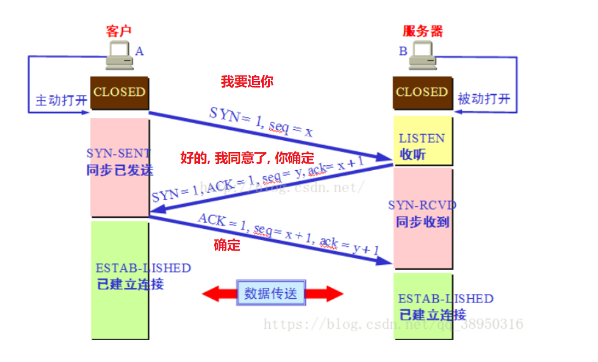

## TCP 的特性

HTTP 底层还是基于 TCP, 传输数据和发送消息, 第一件事情都是先建立 tcp 连接, 客户端和服务端建立连接之后才能够进行消息的传递

## 1. TCP 协议是什么?

TCP(Transmission Control Protocol 传输控制协议) 是一种面向连接(连接导向) 的、可靠的、 基于 IP 的传输层协议。

TCP 使⽤校验、确认和重传机制来保证可靠传输

**而 HTTP 协议 就是建立在 TCP / IP 协议 之上的一种应用。**

TCP: 三次握手, 四次挥手~

## 2. 一次完整的 HTTP 服务过程是什么

当我们在 web 浏览器的地址栏中输入：`www.baidu.com`，具体发生了什么？

1. 对`www.baidu.com`这个网址进行 DNS 域名解析，得到对应的 IP 地址
2. 根据这个 IP，找到对应的服务器，发起 TCP 的三次握手
3. 建立 TCP 连接后, 发起 HTTP 请求
4. 服务器响应 HTTP 请求，浏览器得到 html 代码
5. 浏览器解析 html 代码，并请求 html 代码中的资源（如 js、css、图片等）（先得到 html 代码，才能去找这些资源）
6. 浏览器对页面进行渲染呈现给用户
7. 服务过程完毕, 关闭 TCP 连接, 四次挥手

注：

1.DNS 怎么找到域名的？

> DNS 域名解析采用的是递归查询的方式，过程是，先去找 DNS 缓存->缓存找不到就去找根域名服务器->根域名又会去找下一级，这样递归查找之后，找到了，给我们的 web 浏览器

2.为什么 HTTP 协议要基于 TCP 来实现？

> TCP 是一个端到端的可靠面相连接的协议，HTTP 基于传输层 TCP 协议不用担心数据传输的各种问题（当发生错误时，可以重传）

3.最后一步浏览器是如何对页面进行渲染的？

> a）解析 html 文件构成 DOM 树
> b）解析 CSS 文件构成渲染树
> c）边解析，边渲染
> d）JS 单线程运行，JS 有可能修改 DOM 结构，意味着 JS 执行完成前，后续所有资源的下载是没有必要的，所以 JS 是单线程，会阻塞后续资源下载

## 3. 什么是 DNS 解析

**DNS 解析（域名解析服务器）** 将 域名 转换成 ip 地址 (一个域名和 ip 的映射关系, 具体登记在哪里, 看我们如何申请关联的!)

假定请求的是 www.baidu.com

a）首先会搜索浏览器自身的 DNS 缓存（缓存时间比较短，大概只有 1 分钟，且只能容纳 1000 条缓存）

b）如果浏览器自身的缓存里面没有找到，那么浏览器会搜索系统自身的 DNS 缓存

c）如果还没有找到，那么尝试从 hosts 文件里面去找 (一个系统电脑的文件, 可以编辑, 可以存 域名 和 ip 的对应关系)

d）在前面三个过程都没获取到的情况下，就递归地去域名服务器去查找(就近查找)，具体过程如下

DNS 优化两个方面：DNS 缓存、DNS 负载均衡 (准备多台 dns 服务器, 进行 dns 解析)

## 4. TCP 三次握手理解 (双方确认)

TCP 是一个端到端的 **可靠** 面相连接的协议，

HTTP 基于传输层 TCP 协议不用担心数据传输的各种问题（当发生错误时，可以重传）

根据这个 IP，找到对应的服务器，发起 TCP 的三次握手 ([tcp 三次握手四次挥手](https://blog.csdn.net/qq_38950316/article/details/81087809) )

**为什么要 3 次握手**

我们假定第一次发送的请求, 因为网络延迟很慢才到达服务端，

然后客户端以为这服务器居然不理睬我，然后默默的关闭的等待连接的请求，走开了（好比追女神）；

但事实呢？女神（服务器）是因为各种各样的原因，很晚才看到，然后说我接受你了, 同意你的要求咱们两结婚吧！

但是，A 早已经远走高飞，这个请求 A 完全不会收到（在第二次握手，服务端打开连接，等待客户端的响应），

那么女生呢，以为对方收到了，就会一直等待，这样 B 的资源就会被浪费的（创建连接的时候，空间浪费以及端口消耗）；

而三次握手, 就不会发生，服务端同意连接了，但是 A 缺一直没有下一步的动作，导致资源浪费；

## 5. 关闭 TCP 连接四次挥手的理解 (客气挽留)

目标: 关闭连接(四次挥手)

不能直接一次性断开连接(双方知晓), 万一还有什么数据没有传完, 造成数据的丢失!

这和有礼貌的好友道别一样：（a：客户端 b:服务端）
1、一开始 A 想要回家离开，但是呢？怕 B 还有事情要交代，那么呢？只好先向 B 打招呼，我要走了，请求停止交谈(请求断开连接)

​ (此时，a 到 B 的连接没有断开，依旧可以进行通信）；
2、同意 A 的请求，说好的，但是我这里可能还有一些话（数据）没说完。我检查看看, 你等等, 等我说完你再走。
3、B 确实没啥要补充的了，就告知你我可以撤了
4、A 说好的，知道了，88；（B 得知 A 走开了，关闭了自己的连接 )

**完整的一次 http 请求流程才算结束**

---
