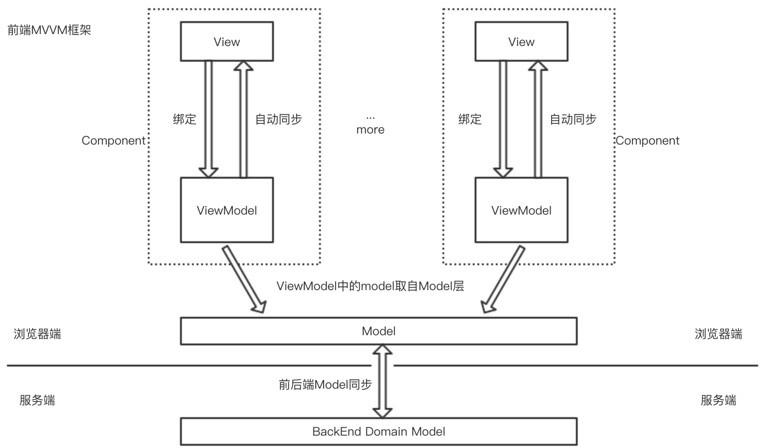

## 1. 什么是 M V VM

Model-View-ViewModel 模式

**Model 层**: 数据模型层

通过 `Ajax`、`fetch` 等 API 完成客户端和服务端业务模型的同步。

**View 层**: 视图层

作为视图模板存在，其实 View 就是⼀个动态模板。

**ViewModel 层**: 视图模型层

负责暴露数据给 View 层，并对 View 层中的数据绑定声明、 指令声明、 事件绑定声明, 进行实际的业务逻辑实现。

**数据变化了, 视图自动更新** => ViewModel 底层会做好监听 Object.defineProperty，当数据变化时，View 层会自动更新

**视图变化了, 绑定的数据自动更新** => 会监听双向绑定的表单元素的变化，⼀旦变化，绑定的数据也会得到⾃动更新。

## 2. MVVM 的优缺点有哪些？

**优点**

1. 实现了视图（View）和模型（Model）的分离，降低代码耦合、提⾼视图或逻辑的复⽤性

2. 提⾼了可测试性：ViewModel 的存在可以帮助开发者更好地编写测试代码

3. 能⾃动更新 DOM：利⽤双向绑定，数据更新后视图⾃动更新，让开发者从繁琐的⼿动操作 DOM 中解放出来

**缺点**

1. Bug 难被调试：因为使⽤了双向绑定的模式，当我们看到界⾯发生异常了，有可能是 View 的代码产生的 Bug，

   也有可能是 Model 代码的问题。数据绑定使得⼀个位置的 Bug 被快速传递到别的位置，

   要定位原始出问题的地⽅就变得不那么容易了

   可采用的调试方案:

   (1) 注释掉一段代码, 确定代码的位置

   (2) debugger 打断点 或者 console 进行调试

2. 在⼀个⼤的模块中 Model 也会很⼤，虽然使⽤上来说⽅便了，但如果⻓期持有不释放内存，就会造成更多的内存消耗

   占用的是 浏览器的 内存

## 3. 谈谈对 Vue 生命周期的理解？

**生命周期的概念**

每个 Vue 实例(每个组件也都是一个 vue 实例)都有⼀个完整的⽣命周期：

1. 开始创建 (空实例)
2. 初始化数据 beforeCreate beforeCreated
3. 编译模版
4. 挂载 DOM
5. 渲染、更新数据 => 重新渲染
6. 卸载

这⼀系列过程我们称之为 Vue 的⽣命周期。

**各个生命周期的作用**

| 生命周期      | 执行时机                                                                                  |
| ------------- | ----------------------------------------------------------------------------------------- |
| beforeCreate  | 在组件实例被创建之初、组件的属性⽣效之前被调用                                            |
| created       | 在组件实例已创建完毕。此时属性也已绑定，但真实 DOM 还未⽣成，$el 还不可⽤                 |
| beforeMount   | 在组件挂载开始之前被调⽤。相关的 render 函数⾸次被调⽤                                    |
| mounted       | 在 el 被新建的 vm.$el 替换并挂载到实例上之后被调用                                        |
| beforeUpdate  | 在组件数据修改了, 视图更新之前调⽤。发⽣在虚拟 DOM 打补丁之前                             |
| updated       | 在组件数据修改了, 视图更新之后被调用                                                      |
| activited     | 在组件被激活时调⽤（使用了 `<keep-alive>` 的情况下）                                      |
| deactivated   | 在组件被停用时调⽤（使用了 `<keep-alive>` 的情况下）                                      |
| beforeDestory | 在组件销毁前调⽤ (销毁: vue 默认会进行释放掉实例所有的监听, 释放掉所有的组件...)          |
| destoryed     | 在组件销毁后调⽤ (像定时器, webscoket 连接, ... 跟 vue 没有太大关联的资源, 需要手动释放!) |

## 4. 在 Vue 中网络请求应该放在哪个生命周期中发起？

至少在 `created` 之后, 因为数据才基本初始化完毕, 当然 `mounted` 中也可以 (比 created 稍晚一些)
