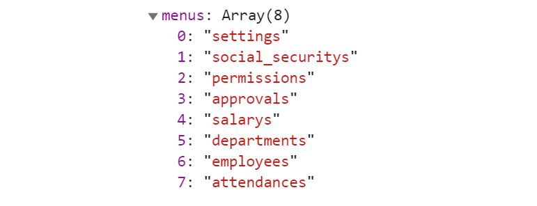

## 1. 什么是 M V VM

Model-View-ViewModel 模式


**Model 层**: 数据模型层

通过 `Ajax`、`fetch` 等 API 完成客户端和服务端业务模型的同步。

**View 层**: 视图层

作为视图模板存在，其实 View 就是⼀个动态模板。

**ViewModel 层**: 视图模型层

负责暴露数据给 View 层，并对 View 层中的数据绑定声明、 指令声明、 事件绑定声明, 进行实际的业务逻辑实现。

**数据变化了, 视图自动更新** => ViewModel 底层会做好监听 Object.defineProperty，当数据变化时，View 层会自动更新

**视图变化了, 绑定的数据自动更新** => 会监听双向绑定的表单元素的变化，⼀旦变化，绑定的数据也会得到⾃动更新。

## 2. MVVM 的优缺点有哪些？

**优点**

1. 实现了视图（View）和模型（Model）的分离，降低代码耦合、提⾼视图或逻辑的复⽤性

2. 提⾼了可测试性：ViewModel 的存在可以帮助开发者更好地编写测试代码

3. 能⾃动更新 DOM：利⽤双向绑定，数据更新后视图⾃动更新，让开发者从繁琐的⼿动操作 DOM 中解放出来

**缺点**

1. Bug 难被调试：因为使⽤了双向绑定的模式，当我们看到界⾯发生异常了，有可能是 View 的代码产生的 Bug，

   也有可能是 Model 代码的问题。数据绑定使得⼀个位置的 Bug 被快速传递到别的位置，

   要定位原始出问题的地⽅就变得不那么容易了

   可采用的调试方案:

   (1) 注释掉一段代码, 确定代码的位置

   (2) debugger 打断点 或者 console 进行调试

2. 在⼀个⼤的模块中 Model 也会很⼤，虽然使⽤上来说⽅便了，但如果⻓期持有不释放内存，就会造成更多的内存消耗

   占用的是 浏览器的 内存

## 3. 谈谈对 Vue 生命周期的理解？

**生命周期的概念**

每个 Vue 实例(每个组件也都是一个 vue 实例)都有⼀个完整的⽣命周期：

1. 开始创建 (空实例)
2. 初始化数据 beforeCreate beforeCreated
3. 编译模版
4. 挂载 DOM
5. 渲染、更新数据 => 重新渲染
6. 卸载

这⼀系列过程我们称之为 Vue 的⽣命周期。

**各个生命周期的作用**

| 生命周期      | 执行时机                                                                                  |
| ------------- | ----------------------------------------------------------------------------------------- |
| beforeCreate  | 在组件实例被创建之初、组件的属性⽣效之前被调用                                            |
| created       | 在组件实例已创建完毕。此时属性也已绑定，但真实 DOM 还未⽣成，$el 还不可⽤                 |
| beforeMount   | 在组件挂载开始之前被调⽤。相关的 render 函数⾸次被调⽤                                    |
| mounted       | 在 el 被新建的 vm.$el 替换并挂载到实例上之后被调用                                        |
| beforeUpdate  | 在组件数据修改了, 视图更新之前调⽤。发⽣在虚拟 DOM 打补丁之前                             |
| updated       | 在组件数据修改了, 视图更新之后被调用                                                      |
| activited     | 在组件被激活时调⽤（使用了 `<keep-alive>` 的情况下）                                      |
| deactivated   | 在组件被停用时调⽤（使用了 `<keep-alive>` 的情况下）                                      |
| beforeDestory | 在组件销毁前调⽤ (销毁: vue 默认会进行释放掉实例所有的监听, 释放掉所有的组件...)          |
| destoryed     | 在组件销毁后调⽤ (像定时器, webscoket 连接, ... 跟 vue 没有太大关联的资源, 需要手动释放!) |


## 4. 在 Vue 中网络请求应该放在哪个生命周期中发起？

至少在 `created` 之后, 因为数据才基本初始化完毕, 当然 `mounted` 中也可以 (比 created 稍晚一些)

## 5. Vue 组件之间如何进行通信？

父传子, 子传父, 非父子, Vuex

### 5.1 props 和 $emit

(1) 通过 `props` 将数据在组件树中进行⾃上⽽下的传递；

```jsx
<jack :money="count" :obj="myobj"></jack>
```

```jsx
export default {
  // props: ['money']
  props: {
    money: {
      type: Number,
      default: 1,
    },
    obj: {
      type: Object,
      default: () => {
        return {
          name: "zs",
          age: 18,
        };
      },
    },
  },
};
```

附件: props [验证](https://cn.vuejs.org/v2/guide/components-props.html#Prop-%E9%AA%8C%E8%AF%81)

(2) 通过 `$emit` 和 `@` 来作信息的向上传递。

```js
this.$emit('add-action', 参数1, 参数2, ...)
```

```jsx
<jack @add-action="fatherFn"></jack>
```

### 5.2 eventBus 事件总线

可通过 EventBus 进⾏信息的发布与订阅。 (创建一个都能访问到的事件总线)

```jsx
Vue.prototype.$eventBus = new Vue(); // this.$eventBus
```

```jsx
// A组件中, 监听 bus的事件
this.$eventBus.$on('事件名', function(参数1, 参数2, ...) {
	...
})

// B组件中, 触发 bus的事件
this.$eventBus.$emit('事件名', 参数1, 参数2, ...)
```

### 5.3 $children $parent $refs

(1) $children

父组件中, $children 返回的是一个组件集合，如果你能清楚的知道子组件的顺序，你也可以使用下标来操作

```jsx
// 父组件中
<template>
  <div class="hello_world">
    <com-a></com-a>
    <com-b></com-b>
  </div>
</template>
```

this.$children[0] => `<com-a></com-a>`

this.$children[1] => `<com-b></com-b>`

(2) $parent

子组件中, this.$parent 指向父组件

this.$parent.xxx = 200

this.$parent.fn()

(3) $refs

通过添加 ref 和 $refs 配合, 也可以很方便的获取子组件, 访问调用子组件的属性或方法

```jsx
// 父组件中
<template>
  <div class="hello_world">
    <com-a ref="coma"></com-a> // this.$refs.coma.count = 200
    <com-b ref="comb"></com-b> // this.$refs.comb.addFn()
  </div>
</template>
```

this.$refs.coma => `<com-a></com-a>`

this.$refs.comb => `<com-b></com-b>`

### 5.4 provide inject

**成对出现：**provide 和 inject 是成对出现的

**作用**：用于父组件向子孙组件传递数据

**使用方法：**

- provide 在父组件中, 返回要传给下级的数据
- inject 在需要使用这个数据的子孙组件中注入数据。（不论组件层次有多深）

父组件

```jsx
export default {
  provide() {
    return {
      value: this.value, // 共享给子孙组件的数据
    };
  },
  data() {
    return {
      value: "父组件的数据",
      money: 100,
    };
  },
};
```

子孙组件

```jsx
export default {
    inject: ['value'],
    props: {
        ...
    }
}
```

### 5.5 $attrs $listeners

在 Vue 2.4 版本中加⼊的 `$attrs` 和 `$listeners` 可以用来作为跨级组件之间的通信机制。 (父传孙)

**父组件**

```jsx
<template>
  <div>
    <my-child1 :money="100" desc='你好哇' @test1="fn1" @test2="fn2"></my-child1>
  </div>
</template>
```

**子组件**

```vue
<template>
  <div class="my-child1">
    <!-- $attrs => { "money": 100, "desc": "你好哇" } -->
    <div>{{ $attrs }}</div>
    <my-child2 v-bind="$attrs" v-on="$listeners"></my-child2>
  </div>
</template>

<script>
import MyChild2 from "./my-child2";
export default {
  created() {
    console.log(this.$listeners);
  },
  components: {
    MyChild2,
  },
};
</script>
```


**孙组件**

```jsx
<template>
  <div>
    我是child2 - {{ money }} - {{ desc }}
    <button @click="clickFn">按钮</button>
  </div>
</template>

<script>
export default {
  props: ['money', 'desc'],
  methods: {
    clickFn () {
      this.$emit('test1', '嘎嘎')
      this.$emit('test2', '嘿嘿')
    }
  }
}
</script>
```


### 5.6 Vuex

全局状态管理库。可通过它来进行全局数据流的管理。

**state**: 存放数据

**mutations**: 存放操作数据的方法

**actions**: 存放一些异步操作 (也可以进行一些同步处理) 注意: actions 是不能直接修改 state 数据的, 需要提交 mutation

**getters**: 存放基于 state 计算出来的一些值 (计算属性)

**modules**: 分模块, 项目大了, 也推荐分模块管理 (同模块的 vuex 操作, 就会在一起)

注意点: 分模块了, 默认 muations, actions, getters 注册到全局的, 一般会开启命名空间

语法: **namespaced: true**

## 6. computed 和 watch 的区别是什么？

**computed**

1. 它是计算属性。主要用于值的计算并一般会返回一个值。所以它更多⽤于计算值的场景
2. 它具有缓存性。当访问它来获取值时，它的 getter 函数所计算出来的值会进行缓存
3. 只有当它依赖的属性值发生了改变，那下⼀次再访问时才会重新调⽤ getter 函数来计算
4. 它适⽤于计算⽐较消耗性能的计算场景
5. 必须要有一个返回值

**watch**

1. 它更多的是起到 “观察” 的作⽤，类似于对数据进行变化的监听并执行回调。

   主要⽤于观察 `props` 或 本组件 data 的值，当这些值发生变化时，执⾏处理操作

2. 不一定要返回某个值

**建议**

1. 当目的是进⾏数值计算，且依赖于其他数据，那么推荐使用 `computed`

2. 当需要在某个数据发生变化的, 同时做⼀些稍复杂的逻辑操作，那么推荐使⽤ `watch`

## 7. Vue 双向绑定原理？

### 7.1 基本认知

在 Vue 2.x 中，利⽤的是 `Object.defineProperty` 去劫持对象的访问器（Getter、Setter），

当对象`属性值`发⽣变化时可获取变化，然后根据变化来作后续响应；(一个一个的劫持)

在 Vue 3.0 中，则是通过 `Proxy` 代理对象进⾏类似的操作。劫持的是整个对象, 只要对象中的属性变化了, 都能劫持到

### 7.2 Object.defineProperty 和 Proxy 的优缺点？

**Proxy**

- 可以直接监听整个对象，⽽⾮是对象的某个属性

- 可以直接监听数组的变化

- 拦截⽅法丰富：多达 13 种，不限于`get` `set` `deleteProperty`、`has` 等。

  比 `Object.defineProperty` 强大很多

**Object.defineProperty**

- 兼容性较好（可⽀持到 IE9）

## 8. 如何理解 Vue 的响应式系统？

(考察 MVVM) M: model 数据模型, V:view 视图模型, VM: viewModel 视图数据模型

双向:

1. 视图变化了, 数据自动更新 => 监听原生的事件即可, 输入框变了, 监听输入框 input 事件
2. 数据变化了, 视图要自动更新 => vue2 和 vue3

### 8.1 基本原理

vue2.0 数据劫持: Object.defineProperty (es5)

vue3.0 数据劫持: Proxy (es6)

分析 :此题考查 Vue 的 MVVM 原理

解答: Vue 的双向绑定原理其实就是 MVVM 的基本原理, Vuejs 官网已经说明, 实际就是通过 Object.defineProperty 方法 完成了对于 Vue 实例中数据的 **`劫持`**, 通过对于 data 中数据 进行 set 的劫持监听, 然后通过**`观察者模式`**, 通知 对应的绑定节点 进行节点数据更新, 完成数据驱动视图的更新

简单概述 : 通过 Object.defineProperty 完成对于数据的劫持, **通过观察者模式**, 完成对于节点的数据更新

### 8.2 观察者模式

观察者模式: 当对象间存在 **一对多** 关系时，则使用观察者模式（Observer Pattern）。

比如，当一个对象或者数据被修改时，则会自动通知依赖它的对象。

**意图：**定义对象间的一种 `一对多的依赖关系`，当一个对象的状态发生改变时，所有依赖于它的对象都得到通知并被自动更新。

拍卖会的时候，大家相互叫价，拍卖师(Dep) 会观察 最高标价(利用 Object.defineProperty 监听)，

一旦最高价变化了, 然后通知给其它竞价者(watcher 观察者 - 订阅者, 订阅了价格的变化)，这就是一个观察者模式

下图为 Vue 框架在数据初始化中使用观察者模式的示意图：


Dep 要进行 **依赖收集**，并通过一个 subs 数组, 记录观察者 Watcher,

Watcher 分为 **渲染 watcher、计算属性 watcher、侦听器 watcher** 三种

收集依赖: 简单点说就是谁借了我的钱，我就把那个人 **记下来** ，以后我的钱少了 我就通知他们说我没钱了

```jsx
<div>
  <p>{{ msg }}</p>   // Watcher1(渲染), 依赖于msg
</div>

<div>
  <h1>{{ car }}</h1>   // Watcher2(渲染),  依赖于car
</div>

<div>
  <h1>{{ myMsg }}</h1>   // Watcher3(渲染), 依赖于myMsg
</div>

computed: {
  myMsg () {
    console.log('计算属性重新计算了')
    return this.msg + '20'  // Watcher4(计算属性中), 依赖于msg, msg变了重新计算
  }
}

watch: {
  msg (newValue) {
    console.log('新的msg', newValue) // Watcher5(侦听器), 将来msg变化, 这边要执行这个函数
  }
}

------------------------------------------------------------------

// 收集依赖 (dep结构有点类似于二维数组, (Map结构))   arr.type="msgDep"
dep: [
  msgDep: [Watcher5(侦听器), Watcher4(计算属性中), Watcher1(渲染)],
  carDep: [Watcher2(渲染)],
  myMsgDep: [Watcher3(渲染)]
]


// Watcher
{
  callback: Function, (数据变化后, 需要执行的回调)
  isRenderWatcher: Boolean, (是否是render的watcher, 是否要触发视图的更新, 往后放, 最后统一虚拟dom对比, 统一更新)
  ...
}
```

比如: 假定数据 money 变了, 那么没有任何与 money 相关的观察者, 就不需要进行任何更新操作, 也不需要执行任何的监视函数

然而: 假定数据 msg 变了, 就会通知到相关的 Watcher, 且优先通知侦听器 Watcher 和计算属性 Watcher, 后进行统一的渲染更新

1. 通知侦听器 Watcher, 立刻执行配置的函数, console.log('新的 msg', newValue)
2. 通知计算属性 Watcher, 计算属性依赖的值变了, 需要重新计算
   且更新后, myMsg 变化了, 需要进行进行视图的渲染 (render) (--- 要更新, 等着---)
3. 通过到 watcher1, 渲染 Watcher (---要更新---)
4. 最后统一进行, 新旧虚拟 dom 的对比, 完成视图的更新

**当数据状态发生改变时，会被 Object.defineProperty 监听劫持到, 会通知到 Dep, 并根据收集的依赖关系,**

**让订阅者 Watcher 进行数据更新（update）操作 , 派发更新**

总结概述: vue 采用的是观察者模式, 是一种`一对多`的关系, 一上来 vue 在解析渲染时, 会进行依赖收集, 会将渲染 watcher、计算属性 watcher、侦听器 watcher, 都收集到对应的 dep 中, 将来 Object.defineProperty 监听到数据变化, 就根据依赖关系, 派发更新

## 9. Vue 中的 key 到底有什么用？

`key` 是为 Vue 中的虚拟 DOM 节点（vNode）标记唯⼀性的 id。

### 9.1 key 的作用

作用: 给虚拟 dom 添加标识, **(优化复用对比策略, 优化渲染性能)**

主要考察:

1. vue 的更新机制 (差异化更新) 对比新旧虚拟 dom, 找出不同的部分, 进行更新视图

   为什么对比虚拟 dom, 而不对比真实的 dom ? 真实的 dom 太复杂, 对比起来性能太差

2. 虚拟 dom: 使用 js 对象的方式, 模拟真实的 dom 结构 { type: 'div', className: 'box' , children: [] }

   属性的量大大的减少了, 没有真实 dom 的那么多无效的属性, 对比起来性能高很多

3. diff 算法: 默认的对比(diff) 机制, 同层兄弟元素, 是按照下标进行对比的, 但是加了 key, **就相当于给虚拟 dom 加了个标识**

   对比策略, 就是对相同 key 的元素进行对比了, 在列表 v-for 中, key 的使用尤为常见, 可以用于优化渲染性能

### 9.2 key 的常见应用场景

key 的常见应用场景 => v-for, v-for 遍历的列表中的项的顺序, 非常的容易改变

1 往后面加, 默认的对比策略, 按照下标, 没有任何问题

```jsx
// 旧
<ul>
  <li>张三</li>
  <li>李四</li>
</ul>

// 新
<ul>
  <li>张三</li>
  <li>李四</li>
  <li>王五</li>
</ul>
```

2 往前面加, 由于下标变了, 如果按照之前的下标对比, 元素是混乱的, 策略: 加上 key

​ 一旦加上了 key, 就是按照 key 进行新旧 dom 的对比了

```jsx
// 旧
<ul>
  <li key="17">张三</li>
  <li key="31">李四</li>
</ul>

// 新  [ { id: 17, name: '张三' }, ... ]
<ul>
  <li key="52">王五</li>
  <li key="17">张三</li>
  <li key="31">李四</li>
</ul>
```

**总结: key 就是给 虚拟 dom 添加了一个 标识, 优化了对比策略!!!**

## 10. Vue 跳转路由时的传参方式 (query 和 params 的区别)

1. 通过 query 传参

```jsx
this.$router.push("/login?username=pp&age=18&desc=xx");

this.$router.push({
  path: "/login",
  query: {
    username: "pp",
    age: 18,
    desc: "xxx",
  },
});

this.$router.push({
  name: "login",
  query: {
    username: "pp",
    age: 18,
    desc: "xxx",
  },
});
```

**获取: this.$route.query.username**

2. 通过 params 传参, 必须通过命名路由的方式传递!

```jsx
this.$router.push({
  name: "login",
  params: {
    username: "pp",
    age: 18,
  },
});
```

**获取: this.$route.params.username**

**区别:**

1. params 传参, 必须要用命名路由的方式传值

2. params 传参, 不会显示在地址栏中, 刷新会丢失

   可以配合 localStorage 使用

   (1) A 跳转路由到 B, 通过 params 传值

   (2) B 页面中, 立刻通过 this.$route.params 获取参数

   ​ (获取参数的逻辑, 优先从$route 中拿, 如果拿不到(说明刷新了), 从本地取即可)

   (3) 拿到参数后, 立刻存到本地 (保证刷新丢失后, 还能从本地拿)

   (4) 实现功能...

B 页面的逻辑

```jsx
created () {
    let username = this.$route.params.username
    if (username) {
        // 刚跳过来, 有参数, 立刻存起来
        localStorage.setItem('myParams', JSON.stringify(this.$route.params))
    } else {
        // 没有, 说明用户刷新了, 丢失了params, username参数, 本地拿
        username = JSON.parse(localStorage.getItem('myParams')).username
    }
}
```

## 11. Vue 项目进行 SEO 优化

Vue SPA 单页面应用对 SEO 不太友好，当然也有相应的解决方案，下面列出几种 SEO 方案

1. SSR 服务器渲染

   服务端渲染, 在服务端 html 页面节点, 已经解析创建完了, 浏览器直接拿到的是解析完成的页面解构

   关于服务器渲染：[Vue 官网介绍](https://ssr.vuejs.org/zh/#什么是服务器端渲染-ssr-？) ，对 Vue 版本有要求，对服务器也有一定要求，需要支持 nodejs 环境。

   优势: 更好的 SEO，由于搜索引擎爬虫抓取工具可以直接查看完全渲染的页面

   缺点: 服务器 nodejs 环境的要求, 且对原代码的改造成本高! `nuxt.js` (坑比较多, 做好踩坑的准备)

2. 静态化 (博客, 介绍性官网)

   Nuxt.js 可以进行 generate 静态化打包, 缺点: 动态路由会被忽略。 `/users/:id`

   优势：

   - 编译打包时, 就会帮你处理, 纯静态文件，访问速度超快；
   - 对比 SSR，不涉及到服务器负载方面问题；
   - 静态网页不宜遭到黑客攻击，安全性更高。

   不足：

   - 如果动态路由参数多的话不适用。

3. 预渲染 prerender-spa-plugin (插件)

   如果你只是对少数页面需要做 SEO 处理（例如 / 首页, /about 关于等页面）

   预渲染是一个非常好的方式, 预渲染会在构建时, 简单的针对特定路由, 生成静态 HTML 文件 (打包时可以帮你解析静态化)

   优势: 设置预渲染简单, 对代码的改动小

   缺点: 只适合于做少数页面进行 SEO 的情况, 如果页面几百上千, 就不推荐了 (会打包很慢)

4. 使用 Phantomjs `针对爬虫` 做处理

   Phantomjs 是一个基于 webkit 内核的无头浏览器，没有 UI 界面，就是一个浏览器，

   其内的点击、翻页等人为相关操作需要程序设计实现。

   这种解决方案其实是一种旁路机制，原理就是通过 Nginx 配置， 判断访问的来源 UA 是否是爬虫访问，

   如果是则将搜索引擎的爬虫请求转发到一个 node server，再通过 PhantomJS 来解析完整的 HTML，返回给爬虫

   

   优势：

   - 完全不用改动项目代码，按原本的 SPA 开发即可，对比开发 SSR 成本小太多了；
   - 对已用 SPA 开发完成的项目，这是不二之选。

   不足：

   - 部署需要 node 服务器支持；

   - 爬虫访问比网页访问要慢一些，因为定时要定时资源加载完成才返回给爬虫；(不影响用户的访问)

   - 如果被恶意模拟百度爬虫大量循环爬取，会造成服务器负载方面问题，

     解决方法是判断访问的 IP，是否是百度官方爬虫的 IP。

小结:

- 如果构建大型网站，如商城类 => SSR 服务器渲染

- 如果只是正常公司官网, 博客网站等 => 预渲染/静态化/Phantomjs 都比较方便
- 如果是已用 SPA 开发完成的项目进行 SEO 优化，而且部署环境支持 node 服务器，使用 Phantomjs

博客参考: [SEO 优化方案](https://www.jb51.net/article/164285.htm)


## 12. Vue 项目权限处理

现在权限相关管理系统用的框架都是element提供的[vue-element-admin](https://panjiachen.github.io/vue-element-admin-site/zh/)模板框架比较常见。

权限控制常见分为三大块

- **菜单权限控制**
- **按钮权限控制**
- 请求url权限控制。

**权限管理在后端中主要体现在对接口访问权限的控制，在前端中主要体现在对菜单访问权限的控制。**

1. 按钮权限控制比较容易，主要采取的方式是从后端返回按钮的权限标识，然后在前端进行显隐操作 v-if / disabled。

2. url权限控制，主要是后端代码来控制，前端只需要规范好格式即可。

3. 剩下的菜单权限控制，是相对复杂一些的

   (1) **需要在路由设计时, 就拆分成静态路由和动态路由**

   ​       静态路由: 所有用户都能访问到的路由, 不会动态变化的 (登录页, 首页, 404, ...)

   ​	   动态路由: 动态控制的路由, 只有用户有这个权限, 才将这个路由添加给你 (审批页, 社保页, 权限管理页...)

   (2) 用户登录进入首页时, 需要立刻发送请求, 获取个人信息 (包含权限的标识)

   

   (3) **利用权限信息的标识, 筛选出合适的动态路由**, 通过路由的 **addRoutes 方法**, 动态添加路由即可!

   (4) router.options.routes (拿的是默认配置的项, 拿不到动态新增的) 不是响应式的! 

   ​	  为了能正确的显示菜单, 为了能够将来正确的获取到用户路由, 我们需要用**vuex管理routes路由数组**

   (5) 利用vuex中的 routes, 动态渲染菜单


## 13. Vue 项目支付功能

支付宝方式：点击支付宝支付,  调用后台接口(携带订单号)，后台返回一个form表单(HTML字符串结构)，

 提交form就可以调用支付宝支付

代码:

```jsx
//  alipayWap: 后台接口返回的form 片段
<div v-html="alipayWap" ref="alipayWap"></div>

methods: {
	toAlipay () {
		this.$axios.get('xxx').then (res = > {
			this.alipayWap = res;
             // 等待dom更新, 等页面中有这个form表单了
			this.$nextTick(() => {
            	this.$refs.alipayWap.children[0].submit()
          	})
		})
	}
}
```
博客参考1: https://blog.csdn.net/qq_36710522/article/details/90480914

博客参考2: https://blog.csdn.net/zyg1515330502/article/details/94737044


## 14. 如何处理 打包出来的项目(首屏)加载过慢的问题

SPA应用: 单页应用程序, 所有的功能, 都在一个页面中, 如果第一次将所有的路由资源, 组件都加载了, 就会很慢!

加载过慢 => 一次性加载了过多的资源,  一次性加载了过大的资源

- 加载过多 => 路由懒加载, 访问到路由, 再加载该路由相关的组件内容
- 加载过大 => 图片压缩, 文件压缩合并处理, 开启gzip压缩等

比如:

1. 配置异步组件, 路由懒加载

   ```js
   const login = () => import('../pages/login.vue')
   ```

2. 图片压缩: 使用 webp 格式的图片, 提升首页加载的速度

3. CDN加速: 配置CDN加速, 加快资源的加载效率 (花钱)

4. 开启 gzip 压缩 (一般默认服务器开启的, 如果没开, 确实可能会很慢, 可以让后台开一下)

   ...	