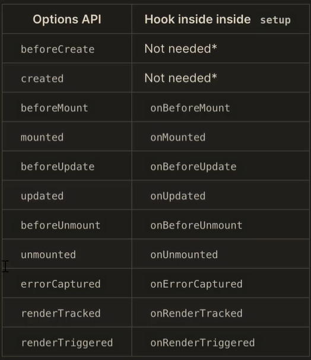

## 1、Composition API 设计动机

`Vue2.x`在设计中小型项目的时候，使用非常方便，开发效率也高。但是在开发一些大型项目的时候也会带来一定的限制，

在`Vue2.x`中使用的`API`是`Options API`,该类型的`API`包含一个描述组件选项(`data`,`methods`,`props`等)的对象，在使用`Options API`开发复杂的组件的时候，同一个功能逻辑的代码被拆分到不同的选项中，这样在代码量比较多的情况下就会导致不停的拖动滚动条才能把代码全部看清，非常的不方便。

而使用`Composition API`可以解决这样的问题。

下面先来看一下`Composition API`的介绍

**`Composition API `是`Vue.js 3.0` 中新增的一组`API`，是一组基于函数的`API`,可以更灵活的组织组件的逻辑。**

下面，我们通过`Composition API`来演示上面的案例

```js
import { reactive, onMounted, onUnmounted } from "vue";
function useMousePosition() {
  const position = reactive({
    x: 0,
    y: 0,
  });
  const upate = (e) => {
    position.x = e.pageX;
    position.y = e.pageY;
  };
  onMounted(() => {
    window.addEventListener("mousemove", update);
  });
  onUnmounted(() => {
    window.removeEventListener("mousemove", update);
  });
  return position;
}
export default {
  setup() {
    const position = useMousePosition();
    return {
      position,
    };
  },
};
```

在上面的代码中，我们可以看到关于获取鼠标位置的核心逻辑代码封装到一个函数中了，这样其它组件也可以使用，只需要封装到一个公共模块中，进行导出，其它组件进行导入即可。通过这一点，我们也能够看出，`Composition API` 提供了很好的代码的封装与复用性。

如果，现在我们需要添加一个新的功能，例如搜索的功能，我们只需要添加一个函数就可以了。

这样，我们以后在查看代码的时候，只需要查看某个具体实现业务的函数就可以了。因为核心的业务我们到封装到了一个函数中，不像`Options API`一样，把核心的业务都分散到了不同的位置，查看代码的时候，需要不断的拖动滚动条。

当然，在`Vue3.js`中可以使用`Composition API`也可以使用`Options API`,这里可以根据个人喜好来进行选择。如果开发的组件中需要提取可复用的逻辑，这时可以使用`Compositon API`,这样更加的方便。

最后，我们来做一个总结:

`Composition API`提供了一组基于函数的`API`,让我们能够更加灵活的组织组件的逻辑，也能够更加灵活的组织组件内的代码结构，还能够把一些逻辑功能从组件中提取出来，方便其它的组件重用。

## 2、性能提升

这一小节，我们来看一下关于`Vue3`中的性能的提升。

关于`Vue3`中的性能提升，主要体现在如下几点

第一: 响应式系统升级，在`Vue3`中使用`Pxory`重写了响应式系统

第二：编译优化，重写了虚拟`DMO`,提升了渲染的性能。

第三：源码体积的优化，减少了打包的体积

下面，我们先来看一下“响应式系统的升级”

在`Vue2.x`中响应式系统的核心是`defineProperty`,在初始化的时候，会遍历`data`中的所有成员，将其转换为`getter/setter`,如果`data`中的属性又是对象，需要通过递归处理每一个子对象中的属性，注意：这些都是在初始化的时候进行的。也就是，你没有使用这个属性，也进行了响应式的处理。

而在`Vue3`中使用的是`Proxy`对象来重写了响应式系统，并且`Proxy`的性能要高于`defineProperty`,并且`proxy`可以拦截属性的访问，删除，赋值等操作，不需要在初始化的时候遍历所有的属性，另外有多层属性的嵌套的时候，只有访问某个属性的时候，才会递归访问下一级的属性。使用`proxy`默认就可以监听到动态新增的属性，而`Vue2`中想动态新增一个属性，需要通过`Vue.set()`来进行处理。而且`Vue2`中无法监听到属性的删除，对数组的索引与`length`属性的修改也监听不到，而在`Vue3`中使用`proxy`可以监听动态的新增的属性，可以监听删除的属性，同时也可以监听数组的索引和`length`属性的修改操作。

所以`Vue3`中使用`proxy`以后，提升了响应式的性能和功能。

除了响应式系统的升级以外，`Vue3`中通过优化编译的过程，和重写虚拟`DOM`, 让首次渲染与更新的性能有了很大的提升。

下面，我们通过一个组件，来回顾一下`Vue2`中的编译过程

```vue
<template>
  <div id="app">
    <div>
      static root
      <div>static node</div>
    </div>
    <div>static node</div>
    <div>static node</div>
    <div>{{ count }}</div>
    <button @click="handler">button</button>
  </div>
</template>
```

我们知道在`Vue2`中，模板首先会被编译成`render`函数，这个过程是在构建的过程中完成的，在编译的时候会编译静态的根节点和静态节点，静态根节点要求节点中必须有一个静态的子节点.

当组件的状态发生变化后，会通知`watcher`,会触发`watcher`的`update`,最终去执行虚拟`DOM`的`patch`方法，遍历所有的虚拟节点，找到差异，然后更新到真实的`DOM`中，`diff`的过程中，会比较整个的虚拟`DOM`,先对比新旧的节点以及属性，然后在对比子节点。`Vue2`中渲染的最小的单位是组件，

在`vue2`中`diff`的过程会跳过，静态的根节点，因为静态根节点的内容不会发生变化，也就是说在`Vue2`中通过标记静态根节点，优化了`diff`的过程。但是在`vue2`中静态节点还需要进行`diff`,这个过程没有被优化。

在`Vue3`中标记和提升了所有的静态节点，`diff`的时候只需要对比动态节点内容。另外在`Vue3`中新引入了`Fragments`,这样在模板中不需要在创建一个唯一根节点的特性。模板中可以直接放文本内容，或者很多的同级的标签，当然这需要你在`vscode`中升级`vetur`插件，否则如果模板中没有唯一的根节点，`vscode`会提示错误。

下面，我们再来看一下：优化打包体积

在`Vue3`中移除了一些不常用的`API`,例如：`inline-template,filter`等。

同时`Vue3`对`Tree-shaking`的支持更好，通过编译阶段的静态分析，将没有引入的模块在打包的时候直接过滤掉。让打包后的体积更小。

## 3、Vite

`Vite`是针对`Vue3`的一个构建工具，`Vite`翻译成中文就是“快”的意思，也就是比基于`webpack`的`vue-cli`更快。

因为`vue-cli`在开发模式下必须对项目打包以后才能运行, 而且项目如果很大, 打包速度很慢

在讲解`Vite`之前，我们先来回顾一下在浏览中使用`ES Module`的方式。

现代浏览器都支持`ES Module`(`IE`不支持)

通过下面的方式加载模块

```js
<script type="module" src=".."></script>
```

支持模块的`script`默认具有延迟加载的特性，类似于`script`标签设置了`defer`.也就是说`type='module'`的`script`的标签相当于省略了`defer`, 它是在文档解析完后也就是`DOM`树生成之后，并且是在触发`DOMContentLoaded`事件前执行。

`Vite`的快就是体现在，使用了浏览器支持的`ES Module`的方式，避免了在开发环境下的打包，从而提升了开发的速度。

下面我们看一下`Vite`与`Vue-cli`的区别

它们两者之间最主要的区别就是：`Vite`在开发模式下不需要打包就可以直接运行。因为，在开发模式下，`vite`是使用了浏览器支持的`es module`加载模块，也就是通过`import`导入模块，浏览器通过`<script type='module'>`的形式加载模块代码，因为`vite`不需要打包项目，所以`vite`在开发模式下，打开页面是秒开的。

`Vue-cli`:在开发模式下必须对项目打包才可以运行，而且项目如果比较大，速度会很慢。

### `Vite`特点

第一：因为不需要打包，可以快速冷启动。

第二：代码是按需编译的，只有代码在当前需要加载的时候才会编译。不需要在开启开发服务器的时候，等待整个项目被打包。

第三：`Vite`支持模块的热更新。

`Vite`在生产环境下使用`Rollup`打包，`Rollup`基于浏览器原生的`ES Module`的方式来打包，从而不需要使用`babel`将`import`转换成`require`以及一些辅助函数，所以打包的体积比`webpack`更小。

下面，我们看一下`Vite`创建项目

```
npm init vite-app 项目名称
cd 项目名称
npm install
npm run dev
```

注意：`npm install`安装相应的依赖，这一步不能省略。

创建好项目以后，查看`index.html`文件，可以看到如下代码

```js
<script type="module" src="/src/main.js"></script>
```

以上就是加载了`src`下的`main.js`模块，在`main.js`模块中加载了`App.vue`这个模块，`App.vue`这个模块是单文件组件，浏览器不支持，但是页面可以正常的展示。那么它是如何处理的呢？

`vite`开启的服务会监听`.vue`后缀的请求，会将`.vue`文件解析成`js`文件。`vite`使用了浏览器支持的`es module`来加载模块，在开发环境下不会打包项目，所有模块的请求都会交给服务器来处理，服务器会处理浏览器不能识别的模块，如果是单文件组件，会调用`compiler-sfc`来编译单文件组件，并将编译的结果返回给浏览器。

## Composition API 基本使用

下面，我们来学习一下`Composition API`的应用，这里为了简单方便，我们先不使用`Vite`来创建项目。而使用浏览器原生的`es module`的形式，来加载`Vue`的模块。

创建好项目文件夹`composition-api-demo`后,执行如下命令安装最新的`Vue`版本

```
npm install vue@next
```

在项目目录下面创建`index.html`,代码如下：

```html
<!DOCTYPE html>
<html lang="en">
  <head>
    <meta charset="UTF-8" />
    <meta name="viewport" content="width=device-width, initial-scale=1.0" />
    <title>Document</title>
  </head>
  <body>
    <div id="app">
      x:{{position.x}}<br />
      y:{{position.y}}
    </div>
    <script type="module">
      import { createApp } from "./node_modules/vue/dist/vue.esm-browser.js";
      const app = createApp({
        data() {
          return {
            position: {
              x: 0,
              y: 0,
            },
          };
        },
      });
      app.mount("#app");
    </script>
  </body>
</html>
```

在上面的代码中，导入了`createApp`方法，该方法创建一个`Vue`的实例，同时将其绑定到了`id=app`的这个`div`上。在`createApp`这个方法中创建对应的选项内容。

注意：这里的`data`只能是函数的形式，不能是对象的形式。（注意：在`vscode`中安装了`Live Server `插件，所以右击`index.html`，在弹出的对话框中选择’open with Live Server ‘,这时会启动一个服务打开该页面，避免出现跨域的问题）

下面，我们开始使用`Compositon API`,使用该`API`，需要用到一个新的选项`setup`,`setup`是`composition api`的入口函数。

```html
<!DOCTYPE html>
<html lang="en">
  <head>
    <meta charset="UTF-8" />
    <meta name="viewport" content="width=device-width, initial-scale=1.0" />
    <title>Document</title>
  </head>
  <body>
    <div id="app">
      x:{{position.x}}<br />
      y:{{position.y}}
    </div>
    <script type="module">
      import { createApp } from "./node_modules/vue/dist/vue.esm-browser.js";
      const app = createApp({
        setup() {
          //setup可以有两个参数
          //第一个参数是`props`,props的作用是用来接收外部传入的参数，并且props是一个响应式的对象，并且不能被解构。
          //第二个参数是：context,context是一个对象，该对象有三个成员，分别是attrs,emit,slots,这个案例暂时没有用到。
          //setup的执行时机：是在props解析完毕，但是是在组件实例被创建之前执行的，所以在setup内部无法通过this获取组件的实例，因为组件的实例还没有被创建，所以在setup中无法访问到组件中的data,methods等。setup内的this指向的是undefined

          //下面创建positon对象，该对象目前是普通对象，并不是响应式的。
          const position = {
            x: 0,
            y: 0,
          };
          //将positon对象返回，这样可以在模板，以及生命周期的钩子函数中使用该对象
          return {
            position,
          };
        },
        //下面我们在mounted的钩子函数中，修改一下positon中的x的值，来验证是否为响应式的。
        mounted() {
          this.position.x = 100;
        },
      });
      console.log(app);
      app.mount("#app");
    </script>
  </body>
</html>
```

在`setup`方法中创建了一个`positon`对象，该对象并不是响应式的，下面看一下怎样将其修改成响应式的。

以前我们是在`data`这个选项中设置响应式的对象，当然这里还可以定义到`data`中，**但是为了能够将某一个逻辑的所有代码封装到一个函数中，**`vue3`中提供了一个新的`api`来创建响应式的对象。这个`api`就是`reactive`

首先导入该函数

```js
import {
  createApp,
  reactive,
} from "./node_modules/vue/dist/vue.esm-browser.js";
```

使用`reactive`函数将`positon`对象包裹起来。

```js
const position = reactive({
  x: 0,
  y: 0,
});
```

现在`position`对象就是响应式的对象了，刷新浏览器，可以看到`positon`中的`x`属性的值发生了更改。

## 生命周期钩子函数

这一小节，看一下怎样在`setup`中使用生命周期的钩子函数。

在`setup`中可以使用生命周期的钩子函数，但是需要在钩子函数名称前面加上`on`,然后首字母大写。例如:`mounted`



`setup`是在组件初始化之前执行的，是在`beforeCreate`与`created`之间执行的，所以`beforeCreate`与`created`的代码都可以放到`setup`函数中。

所以，在上图中，我们可以看到`beforeCreate`与`created`在`setup`中没有对应的实现。

其它的都是在钩子函数名称前面添加上`on`,并且首字母大写。

注意:`onUnmounted`类似于之前的`destoryed`，调用组件的`onUnmounted`方法会触发`unmounted`钩子函数

`renderTracked`与`renderTriggered`这两个钩子函数都是在`render`函数被重新调用的时候触发的。

不同是的是，在首次调用`render`的时候`renderTracked`也会被触发，`renderTriggered`在`render`首次调用的时候不会被触发。

了解了在`setup`中使用钩子函数的方式后，下面继续完善获取鼠标坐标位置的案例

在定义鼠标移动事件的时候，可以在原有代码的`mounted`钩子函数中定义，但是为了能够将获取鼠标位置的相关的逻辑代码封装到一个函数中，让任何一个组件都可以重用，这时使用`mounted`选项就不合适了。这样我们最好是在`setup`中使用生命周期的钩子函数，

```html
<!DOCTYPE html>
<html lang="en">
  <head>
    <meta charset="UTF-8" />
    <meta name="viewport" content="width=device-width, initial-scale=1.0" />
    <title>Document</title>
  </head>
  <body>
    <div id="app">
      x:{{position.x}}<br />
      y:{{position.y}}
    </div>
    <script type="module">
      //导入onMounted,onUnmounted函数
      import {
        createApp,
        reactive,
        onMounted,
        onUnmounted,
      } from "./node_modules/vue/dist/vue.esm-browser.js";
      const app = createApp({
        setup() {
          const position = reactive({
            x: 0,
            y: 0,
          });
          //获取鼠标的位置坐标
          const update = (e) => {
            position.x = e.pageX;
            position.y = e.pageY;
          };
          onMounted(() => {
            window.addEventListener("mousemove", update);
          });
          //onUnmounted类似于之前的destoryed
          onUnmounted(() => {
            window.removeEventListener("mousemove", update);
          });

          return {
            position,
          };
        },
        mounted() {
          this.position.x = 100;
        },
      });
      console.log(app);
      app.mount("#app");
    </script>
  </body>
</html>
```

在上面的代码中，首先导入了`onMounted,onUnmounted`

```js
import {
  createApp,
  reactive,
  onMounted,
  onUnmounted,
} from "./node_modules/vue/dist/vue.esm-browser.js";
```

定义获取鼠标位置的`update`函数

```js
//获取鼠标的位置坐标
const update = (e) => {
  position.x = e.pageX;
  position.y = e.pageY;
};
```

在`onMounted`钩子函数中注册`mousemove`事件

```js
onMounted(() => {
  window.addEventListener("mousemove", update);
});
```

在`onUnmounted`钩子函数中移除`mousemove`事件

```js
onUnmounted(() => {
  window.removeEventListener("mousemove", update);
});
```

现在，功能已经实现了，下面我们在将代码进行重构。

将获取鼠标位置的功能封装到一个函数中。

```html
<!DOCTYPE html>
<html lang="en">
  <head>
    <meta charset="UTF-8" />
    <meta name="viewport" content="width=device-width, initial-scale=1.0" />
    <title>Document</title>
  </head>
  <body>
    <div id="app">
      x:{{position.x}}<br />
      y:{{position.y}}
    </div>
    <script type="module">
      import {
        createApp,
        reactive,
        onMounted,
        onUnmounted,
      } from "./node_modules/vue/dist/vue.esm-browser.js";
      //将获取鼠标位置坐标的代码封装到了useMousePosition函数中
      function useMousePosition() {
        const position = reactive({
          x: 0,
          y: 0,
        });
        const update = (e) => {
          position.x = e.pageX;
          position.y = e.pageY;
        };
        onMounted(() => {
          window.addEventListener("mousemove", update);
        });
        onUnmounted(() => {
          window.removeEventListener("mousemove", update);
        });
        //将positon对象返回
        return position;
      }

      const app = createApp({
        setup() {
          //调用useMousePosition函数，接收返回的postion
          const position = useMousePosition();
          return {
            position,
          };
        },
        //下面我们在mounted的钩子函数中，修改一下positon中的x的值，来验证是否为响应式的。
        // mounted() {
        //   this.position.x = 100;
        // },
      });
      console.log(app);
      app.mount("#app");
    </script>
  </body>
</html>
```

在上面的代码中定义了，`useMousePosition`函数，在该函数中封装了获取鼠标位置的业务代码，最终返回。

在`setup`函数中调用`useMousePositon`函数，接收返回的`positon`,然后返回，这样在模板中可以展示鼠标的位置。

通过这个案例，我们可以体会出`Composition API`与`options API`的区别。

如果现在使用`options api`来实现这个案例，我们需要在`data`中定义`x,y`,在`methods`中定义`update`,这样把同一个逻辑的代码分散到了不同的位置，这样查找起来也非常的麻烦，而现在根这个逻辑函数相关的代码都封装到了一个函数中，这样方便了以后的维护也就是如果出错了，直接查找这个函数就可以了。并且这个函数也可以单独的放到一个模块中，这样在任何一个组件中都可以使用。

## 3、reactive/toRefs/ref

这一小节，我们来介绍`Compositiont API`中的三个函数`reactive/toRefs/ref`

这三个函数都是创建响应式数据的。

我们首先看一下`reactive`,该函数，我们在前面的案例中已经使用过，该函数的作用就是将一个对象设置为响应式的。现在，我们对前面写的程序进行一个简单的优化。

在模板中，我们是通过以下的方式来获取`x`与`y`的值。

```js
<div id="app">
        x:{{position.x}}<br/>
        y:{{position.y}}
    </div>
```

这样写笔记麻烦，可以简化成如下的形式

```js
<div id="app">
  x:{{ x }}
  <br />
  y:{{ y }}
</div>
```

同时，在`setup`函数中，进行如下的修改：

```js
//    const position=useMousePosition()
            const {x,y}=useMousePosition()
               return {
                   x,
                   y
               }
            },
```

我们知道，当我们调用`useMousePosition`方法的时候，返回的是一个`position`对象，该对象中包含了`x`与`y`两个属性，那么这里我们可以进行解构处理。

最后将解构出来的`x,y`返回，这样在模板中就可以直接使用`x,y`.

但是，当我们的鼠标在浏览器中移动的时候，`x,y`的值没有发生变化，说明它们不是响应式的了。

原因是什么呢？

原因是，当对`position`对象进行解构的时候，就是定义了两个变量`x,y`来接收解构出来的值。所以这里的`x,y`就是两个变量，与原有的对象没有任何关系。

但是，这里我们还是希望对模板进行修改呢？

可以使用`toRefs`

首先导入`toRefs`

```js
import {
  createApp,
  reactive,
  onMounted,
  onUnmounted,
  toRefs,
} from "./node_modules/vue/dist/vue.esm-browser.js";
```

然后在`useMousePosition`方法中，将返回的`position`对象,通过`toRefs`函数包括起来。

```js
return toRefs(position);
```

`toRefs`函数，可以将一个响应式对象中的所有属性转换成响应式的。

现在，通过浏览器进行测试，发现没有任何的问题了。

下面我们来解释一下`toRefs`的工作原理，首先传递给`toRefs`函数的参数，必须是一个响应式的对象(代理的对象)，而`position`就是一个通过`reactive`函数处理后的一个响应式对象。在`toRefs`方法内部首先会创建一个新的对象，然后会遍历传递过来的响应式对象内的所有属性，把属性的值都转换成响应式对象，然后再挂载到`toRefs`函数内部所创建的这个新的对象上，最后返回。

`toRefs`函数是把`reactive`返回的对象中的所有属性，都转换成了一个对象，所以对响应式对象进行解构的时候，解构出的每一个属性都是对象，对象是引用 传递的，所以解构出的数据依然是响应式的。

那么，我们解构`toRefs`返回的对象，解构出来的每个属性都是响应式的。

现在，我们先知道`toRefs`函数的作用就是：可以将一个响应式对象中的所有属性转换成响应式的。

后面还会继续探讨它的应用。

**下面，我们再来看一下`ref`函数的应用**

`ref`函数的作用就是把普通数据转换成响应式数据。与`reactive`不同的是，`reactive`是把一个对象转换成响应式数据。

`ref`可以把一个基本类型的数据包装成响应式对象。

下面，我们使用`ref`函数实现一个自增的案例。

```html
<!DOCTYPE html>
<html lang="en">
  <head>
    <meta charset="UTF-8" />
    <meta name="viewport" content="width=device-width, initial-scale=1.0" />
    <title>Document</title>
  </head>
  <body>
    <div id="app">
      <button @click="add">增加</button>
      <span>{{count}}</span>
    </div>
    <script type="module">
      import {
        createApp,
        ref,
      } from "./node_modules/vue/dist/vue.esm-browser.js";
      function useCount() {
        const count = ref(0);
        return {
          count,
          add: () => {
            count.value++;
          },
        };
      }
      createApp({
        setup() {
          return {
            ...useCount(),
          };
        },
      }).mount("#app");
    </script>
  </body>
</html>
```

下面，我们把上面的代码做一个解析：

首先在模板中有一个按钮，与展示数字的插值表达式。

下面导入`createApp`与`ref`函数。

虽然这个案例中的业务非常的简单，但是这里，我们还是单独的将其封装到一个函数中`useCount`中。

如果，我们写的是如下代码：

```js
const count = 0;
```

那么，`count`就是一个基本的数据类型的变量。

但是，如果写成如下的形式：

```js
const count = ref(0);
```

`count`就是一个响应式对象，该对象中会有一个`value`属性，该属性存储的就是具体的值。该属性中包含了`getter/setter`.

`useCount`方法将`count`与`add`方法返回。

在`setup`方法中调用`useCount`方法，并且将该方法返回的内容进行解构，注意：这里解构出来的`count`就是一个响应式的对象。

Todo..