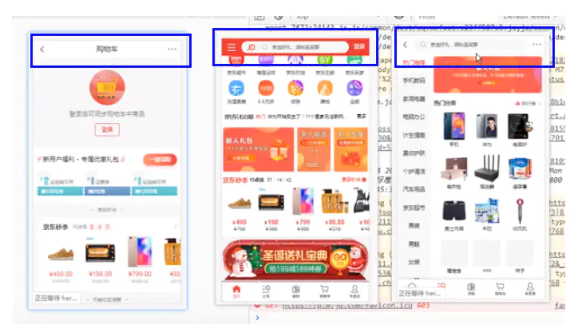
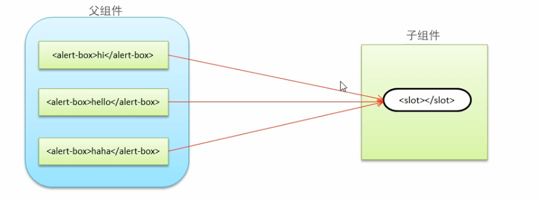

## MVVM 框架作用

数据(`Model`)和视图(`View`)是不能直接通讯的，而是需要通过`ViewModel`来实现双方的通讯。当数据(`Model`)变化的时候，`ViewModel`能够监听到这种变化，并及时通知`View`视图做出修改。同样的，当页面有事件触发的时候，`ViewModel`也能够监听到事件，并通知数据(`Model`)进行响应。所以`ViewModel`就相当于一个观察者，监控着双方的动作，并及时通知对方进行相应的操作。

简单的理解就是：`MVVM` 实现了将业务(数据)与视图进行分离的功能。

## MVVM 框架三要素

`MVVM`框架的三要素：响应式，模板引擎，渲染

响应式：`vue`如何监听数据的变化？

模板：`Vue`的模板如何编写和解析？怎样将具体的值替换掉`{{msg}}`内容，这就是模板引擎的解析。

渲染：`Vue`如何将模板转换成`html`? 其实就是有虚拟`DOM` 向真实`DOM`的转换。

## 模板语法

### v-bind 属性绑定

```js
<!DOCTYPE html>
<html lang="en">
<head>
  <meta charset="UTF-8">
  <meta http-equiv="X-UA-Compatible" content="IE=edge">
  <meta name="viewport" content="width=device-width, initial-scale=1.0">
  <title>Document</title>
  <script src="https://cdn.jsdelivr.net/npm/vue@2/dist/vue.js"></script>
</head>
<body>

  <div id="app">
    <h2 v-bind:title="msg">{{msg}}</h2>
  </div>


  <script>
    var app = new Vue({
  el: '#app',
  data: {
    msg: 'Hello Vue!'
  }
})
  </script>
</body>
</html>
```

### v-for 列表渲染

```html
<!DOCTYPE html>
<html lang="en">
  <head>
    <meta charset="UTF-8" />
    <meta name="viewport" content="width=device-width, initial-scale=1.0" />
    <title>列表渲染</title>
  </head>
  <body>
    <div id="app">
      <ul>
        <!-- users表示数组，item表示从数组中取出的对象,这个名字可以随意取 -->
        <!-- 注意 v-for必须结合key属性来使用，它会唯一标识数组中的每一项，未来当数组中的那一项改变的时候，它会只更新那一项，好处就是提升性能。注意key的值唯一，不能重复 -->
        <!-- index表示数组的索引值，该名字可以随意定义 -->
        <li v-for="(item,index) in users" :key="item.id">
          编号：{{item.id}} 姓名:{{item.name}}---索引:{{index}}
        </li>
      </ul>
    </div>
    <!-- <script src="vue.js"></script> -->
    <script>
      new Vue({
        el: "#app",
        data: {
          users: [
            {
              id: 1,
              name: "张三",
            },
            {
              id: 2,
              name: "李四",
            },
            {
              id: 3,
              name: "老王",
            },
          ],
        },
      });
    </script>
  </body>
</html>
```

### v-model 双向数据绑定

v-model 只能在 input/textarea/selet 也就是表单元素

```html
<!DOCTYPE html>
<html lang="en">
  <head>
    <meta charset="UTF-8" />
    <meta name="viewport" content="width=device-width, initial-scale=1.0" />
    <meta http-equiv="X-UA-Compatible" content="ie=edge" />
    <title>双向数据绑定</title>
    <script src="./vue.js"></script>
  </head>

  <body>
    <div id="app">
      <input type="text" v-model="userName" />
    </div>
    <script>
      const vm = new Vue({
        el: "#app",
        data: {
          userName: "zhangsan",
        },
      });
    </script>
  </body>
</html>
```

### v-on @监听事件

```vue
<!DOCTYPE html>
<html lang="en">
  <head>
    <meta charset="UTF-8" />
    <meta name="viewport" content="width=device-width, initial-scale=1.0" />
    <meta http-equiv="X-UA-Compatible" content="ie=edge" />
    <title>Document</title>
    <script src="./vue.js"></script>
  </head>

  <body>
    <div id="app">
      <span>{{ name }}</span>
      <!-- 通过v-on来指定对应的事件，然后后面跟上对应的方法名，方法的定义在methods完成 -->
      <button v-on:click="changeName">更换姓名</button>
    </div>
    <script>
      var vm = new new Vue({
        el: "#app",
        data: {
          name: "zhangsan",
        },
        // 通过methods完成函数或方法的定义
        methods: {
          changeName() {
            // 在methods中要获取data中的属性，需要通过this来完成，this表示的是vue实例。
            this.name = "itcast";
          },
        },
      })();
    </script>
  </body>
</html>
```

还可以通过简写的形式。建议以后都使用简写的形式

```vue
<button @click="changeName">更换姓名</button>
```

带参数的形式如下：

```vue
<button @click="changeNameByArg('laowang')">带参数的情况</button>

<script>
var vm = new new Vue({
  el: "#app",
  data: {
    name: "zhangsan",
  },
  // 通过methods完成函数或方法的定义
  methods: {
    changeName() {
      // 在methods中要获取data中的属性，需要通过this来完成，this表示的是vue实例。
      this.name = "itcast";
    },
    changeNameByArg(userName) {
      this.name = userName;
    },
  },
})();
</script>
```

### :class Class 与 style 绑定

略

### v-if v-show 条件渲染

略

### computed 计算属性

`计算属性出现的目的是解决模板中放入过多的逻辑会让模板过重且难以维护的问题.`

`且计算属性有缓存, 提升性能`

计算属性是根据 data 中已有的属性，计算得到一个新的属性.

下面，我们可以通过一个案例来学习一下计算属性、

在一个文本框中输入第一个名字，第二个文本框中输入第二个名字，然后展示全部名称。

```vue
<body>
    <div id="app">
        <input type="text" v-model="firstName">
        <input type="text" v-model="lastName">
        <!-- 这样是模板逻辑变得非常复杂，不易维护 -->
        <div>全名：{{firstName + lastName}}</div>


        <div>全名：{{fullName}}</div>
    </div>
    <script>
        var vm = new Vue({
            el: '#app',
            data: {
                firstName: '',
                lastName: ''
            },
            // 创建计算属性通过computed关键字，它是一个对象
            computed: {
                // 这里fullName就是一个计算属性，它是一个函数，但这个函数可以当成属性来使用
                fullName() {
                    return this.firstName + this.lastName
                }
            }
        })
    </script>
</body>
```

使用计算属性还有一个好处：
其实细心的话就会发现，调用 methods 里的方法也能实现和计算属性一样的效果，既然使用 methods 就可以实现，那为什么还需要计算属性呢？原因就是计算属性是基于他的依赖缓存的（所依赖的还是`data`中的数据）。一个计算属性所依赖的数据发生变化时，他才会重新取值

也就是说：只要相关依赖没有改变，对此访问计算属性得到的是之前缓 存的结果，不会多次执行。

下面我们测试一下：

```vue
<p>
        <!-- 总人数：{{users.length+"个"}} -->
        总人数：{{total}} 总人数：{{total}}
      </p>
```

在上面的代码中，我们使用`total`了两次。

下面在看一下关于计算属性中的代码修改：

```vue
computed: { total() { console.log("aaa"); //
计算属性是有缓存性：如果值没有发生变化，则页面不会重新渲染 return
this.users.length + "个"; }, },
```

这里，我们通过`console`输出字符串`aaa`,但是在控制台上只是输出了一次，因为，第二次使用`total`的时候，发现值没有变化，所以直接从缓存中获取了对应的值。并没有重新进行计算，这样带来的好处就是，性能得到了提升。

下面，我们换成`methods`函数的形式来看一下：

```vue
<p>
        <!-- 总人数：{{users.length+"个"}} -->
        总人数：{{total}} 总人数：{{total}} 总人数：{{getTotal()}}
        总人数：{{getTotal()}}
      </p>
```

在上面的代码中，调用了两次`getTotal`方法。

`getTotal`方法的实现如下：

```js
  methods: {
          getTotal: function () {
            console.log("methods");
            return this.users.length + "个";
          },
        },
```

实现的方式是差不多的，但是这里却执行了两次。（注意：由于本案例中给每一个`li`标签添加了` *@mousemove*`,所以只要鼠标移动到列表上，就会导致页面重新渲染，这时会不断的调用`getTotal`方法。）

所以通过上面案例的演示，可以明确的看出计算属性是有缓存的，也就是所依赖的`data`属性中的数据没有变化，那么是不会重新计算的。所以提升了对应的性能。

所以说，在进行大量耗时计算的时候，建议使用计算属性来完成。

如下代码：

```js
 data: {
          selectItem: "",
          num: 100
          }
```

在`data`中定义了`num` 属性，并且初始值为 100、

下面在计算属性中进行求和的运算，代码实现如下：

```js
 computed: {
          total() {
            console.log("aaa");
            // 计算属性是有缓存性：如果值没有发生变化，则页面不会重新渲染
            // return this.users.length + "个";
            let count = 0;
            for (let i = 0; i <= this.num; i++) {
              count += i;
            }
            return count;
          },
        },
```

通过演示，可以发现计算属性只是在第一次调用的时候，执行了一次，后续由于所依赖的数据`num`没有发生变化，所以即时调用多次，也并没有重新进行计算，而是获取上次计算的结果，所以说在进行大量耗时计算的时候，通过计算属性可以提升性能。

### 侦听器 Watch

`应用场景`: 执行异步请求或者进行开销比较大的操作的时候, 使用侦听器

侦听器就是侦听`data`中的数据变化，如果数据一旦发生变化就通知侦听器所绑定方法，来执行相应的操作。从这一点上，与计算属性是非常类似的。

但是，侦听器也有自己独有的应用场景。

执行异步或开销较大的操作。

下面，先来看一下侦听器的基本使用

我们使用侦听器来统计总人数。

```vue
<p>
   
        总人数：{{totalCount}}
      </p>
```

在`data`中定义`totalCount`属性。

```js
 data: {
          selectItem: "",
          num: 100,
          totalCount: 0
       }
```

使用`watch`来监听`users`数组的数据变化。

```js
   watch: {
          users: {
            immediate: true, //立即执行
            handler(newValue, oldValue) {
              this.totalCount = newValue.length + "个人";
            },
          },
        }
```

当`users`数组发生了变化后，就会执行`handler`这个函数，同时用于加上了`immediate`属性，并且该属性的值为`true`，表示的就是在初始化绑定的时候，也会去执行侦听器。因为`watch`在初始化绑定的时候是不会执行的，等到所监听的内容改变之后才会去侦听执行。

以上就是`watch`侦听器的基本使用，但是通过这个案例，我们发现还是使用计算属性来统计总人数更加的方便一些。

当然，侦听器有自己的应用场景，它的应用场景就是在执行异步请求或者进行开销比较大的操作的时候，会使用侦听器。

下面我们在通过一个案例，来体会一下`watch`侦听器的应用场景。

下面我们来看一个异步操作的情况。就是当用户在一个文本框中输入了用户名以后，要将输入的用户名发送到服务端，来检查该用户名是否已经被占用。

具体的实现代码如下：

```vue
<!DOCTYPE html>
<html lang="en">
  <head>
    <meta charset="UTF-8" />
    <meta name="viewport" content="width=device-width, initial-scale=1.0" />
    <title>侦听器</title>
  </head>
  <body>
    <div id="app">
      <div>
        <span>用户名</span>
        <!--这里使用了lazy,保证当文本框失去焦点后，才去执行对应操作-->
        <span><input type="text" v-model.lazy="uname" /></span>
        <span>{{ message }}</span>
      </div>
    </div>
    <script src="./vue.js"></script>
    <script>
      const vm = new Vue({
        el: "#app",
        data: {
          uname: "",
          message: "",
        },
        methods: {
          checkUserName: function (userName) {
            let that = this;
            setTimeout(function () {
              if (userName === "admin") {
                that.message = "用户名已经存在,请更改....";
              } else {
                that.message = "该用户名可以使用.....";
              }
            }, 3000);
          },
        },
        watch: {
          uname: function (value) {
            //调用后台接口，来验证用户名是被占用
            this.checkUserName(value);
            this.message = "正在校验用户名....";
          },
        },
      });
    </script>
  </body>
</html>
```

以上的案例，就是通过`watch`来监听`uname`的值是否发生变化，如果发生了变化，就通过发送异步请求来检查`uname`中的值，是否已经被占用。

通过以上的案例：我们可以看到`watch`是允许异步操作的，并且在我们得到最终的结果前，可以设置中间状态，这些都是计算属性无法做到的。

### 计算属性和侦听器对比

最后我们把计算属性与侦听器做一个总结，看一下它们的应用场景。

第一点：语境上的差异：

`watch`适合一个值发生了变化，对应的要做一些其它的事情，`适合一个值影响多个值的情形`。

例如，上面案例中的用户名检测，这里是一个`uname`发生了变化，但是这里做了很多其它的事情，例如修改`message`的值，发送异步请求。

而计算属性`computed`:一个值由其它的值得来，其它值发生了变化，对应的值也会变化，`适合做多个值影响一个值的情形`。

第二点：计算属性有缓存性。

由于这个特点，我们在实际的应用中，能用计算属性的，会首先考虑先使用计算属性。

第三点：侦听器选项提供了更加通用的方法，适合执行异步操作或者较大开销操作。

## 生命周期


### beforeCreate & created

`beforeCreate`: `Vue`实例初始化之后，以及事件初始化，以及组件的父子关系确定后执行该钩子函数，一般在开发中很少使用

`created`: 在调用该方法之前，初始化会被使用到的状态，状态包括`props`,`methods`,`data`,`computed`,`watch`.

而且会实现对`data`中属性的监听，也就是在`created`的时候数据已经和`data`属性进行了绑定。(放在`data`中的属性当值发生改变的时候，视图也会改变)。同时也会对传递到组件中的数据进行校验。

所以在执行`created`的时候，所有的状态都初始化完成，我们也完全可以在该阶段发送异步的`ajax`请求，获取数据。

但是，在`created`方法中，是无法获取到对应的的`$el`选项,也就是无法获取`Dom`. 所以说上题中选项`c`的说法是正确的。
如下代码所示：

```js
        created() {
          console.log("created");
          console.log("el===", this.$el);// undefined
          console.log("data==", this.$data);// 可以获取数据
          console.log("foo==", this.foo);//可以获取数据
        },
```

`created`方法执行完毕后，下面会判断对象中有没有`el`选项。如果有，继续执行下面的流程，也就是判断是否有`template`选项，如果没有`el`选项，则停止整个生命周期的流程，直到执行了`vm.$mount(el)`

后，才会继续向下执行生命周期的流程。

下面我们测试一下：

```vue
<script>
const vm = new Vue({
  // el: "#app",  //去掉了el选项
  data: {
    foo: "fooData",
  },
  methods: {
    update: function () {
      this.foo = "hello";
    },
    destroy: function () {
      //销毁资源
      this.$destroy();
    },
  },
  beforeCreate() {
    console.log("beforCreate");
  },
  created() {
    console.log("created");
    console.log("el===", this.$el);
    console.log("data==", this.$data);
    console.log("foo==", this.foo);
  },
  beforeMount() {
    console.log("beforeMount");
  },
  mounted() {
    console.log("mounted");
  },
  beforeUpdate() {
    console.log("beforeUpdate");
  },
  updated() {
    console.log("updated");
  },
  beforeDestroy() {
    console.log("beforeDestroy");
  },
  destroyed() {
    console.log("destroyed");
  },
});
</script>
```

在上面的代码中，我们将`el`选项去掉了，运行上面的代码后，我们发现执行完`created`方法后，整个流程就停止了。

现在，我们不添加`el`选项，但是手动执行`vm.$mount(el)`,也能够使暂停的生命周期进行下去。

如下代码所示：

```vue
<script>
const vm = new Vue({
  // el: "#app",//去掉了el选项
  data: {
    foo: "fooData",
  },
  methods: {
    update: function () {
      this.foo = "hello";
    },
    destroy: function () {
      //销毁资源
      this.$destroy();
    },
  },
  beforeCreate() {
    console.log("beforCreate");
  },
  created() {
    console.log("created");
    console.log("el===", this.$el);
    console.log("data==", this.$data);
    console.log("foo==", this.foo);
  },
  beforeMount() {
    console.log("beforeMount");
  },
  mounted() {
    console.log("mounted");
  },
  beforeUpdate() {
    console.log("beforeUpdate");
  },
  updated() {
    console.log("updated");
  },
  beforeDestroy() {
    console.log("beforeDestroy");
  },
  destroyed() {
    console.log("destroyed");
  },
});
vm.$mount("#app"); //添加了$mount方法
</script>
```

运行上面的代码，可以看到，虽然`vm`对象中没有`el`参数，但是通过`$mount(el)`动态添加的方式，也能够使生命周期顺利进行。

我们继续向下看，就是判断在对象中是否有`template`选项。

第一：如果`Vue`实例对象中有`template`参数选项，则将其作为模板编译成`render`函数，来完成渲染。

第二：如果没有`template`参数选项，则将外部的`HTML作`为模板编译（`template`），也就是说，`template`参数选项的优先级要比外部的`HTML`高

第三：如果第一条,第二条件都不具备，则报错

下面，我们看一下添加`template`的情况。

```vue
<!DOCTYPE html>
<html lang="en">
  <head>
    <meta charset="UTF-8" />
    <meta name="viewport" content="width=device-width, initial-scale=1.0" />
    <title>生命周期2</title>
  </head>
  <body>
    <script src="./vue.js"></script>
    <div id="app"></div>
    <script>
      const vm = new Vue({
        el: "#app",
        template: "<p>Hello {{message}}</p>",
        data: {
          message: "vue",
        },
      });
    </script>
  </body>
</html>
```

以上是在`Vue`实例中添加`template`的情况。

那么这里有一个比较有趣的问题就是，当模板同时放在`template`参数选项和外部`HTML`中，会出现什么情况呢？

如下代码所示：

```vue
<!DOCTYPE html>
<html lang="en">
  <head>
    <meta charset="UTF-8" />
    <meta name="viewport" content="width=device-width, initial-scale=1.0" />
    <title>生命周期2</title>
  </head>
  <body>
    <script src="./vue.js"></script>
    <div id="app">
      <p>你好</p>
    </div>
    <script>
      const vm = new Vue({
        el: "#app",
        template: "<p>Hello {{message}}</p>",
        data: {
          message: "vue",
        },
      });
    </script>
  </body>
</html>
```

在上面的代码中，我们添加了`template`属性，同时也在外部添加了模板内容，但是最终在页面上显示的是`Hello vue` 而不是“你好”。就是因为`template`参数的优先级比外部`HTML`的优先级要高。

当然，我们在开发中，基本上都是使用外部的`HTML`模板形式，因为更加的灵活。

### 为什么先判断 el, 再判断 template

就是因为`Vue`需要通过`el`的“选择器”找到对应的`template`.也就是说，`Vue`首先通过`el`参数去查找对应的`template`.如果没有找到`template`参数，则到外部`HTML`中查找，找到后将模板编译成`render`

函数（`Vue`的编译实际上就是指`Vue`把模板编译成`render`函数的过程）。

### beforeMount & mounted

下面，我们继续看一下生命周期的流程图。

接下来会触发`beforeMount`这个钩子函数：

在执行该钩子函数的时候，虚拟`DOM`已经创建完成(在 created 的 render 函数中生成了虚拟 dom)，马上就要渲染了(注意是马上, 并不是完成渲染)，在这里可以更改`data`中的数据，不会触发`updated`, 其实在`created`中也是可以更改数据，也不会触发`updated`函数

测试代码如下：

```js
  beforeMount() {
          console.log("beforeMount");
          console.log("beforeMount el===", this.$el);
          console.log("data==", this.$data);
          //this.foo = "abc"; //修改数据
          console.log("foo==", this.foo);
        },
```

通过上面的代码，我们可以获取`el`中的内容，同时也可以修改数据。

但是，这里需要注意的输入的`el`中的内容，`{{foo}}`还没有被真正的数据替换掉。而且对应的内容还没有挂载到页面上。

下面执行了`Create VM.$el and replace "el" with it`

经过这一步后，在模板中所写的`{{foo}}`会被具体的数据所替换掉。

所以下面执行`mounted`的时候，可以看到真实的数据。同时整个组件内容已经挂载到页面中了，数据以及真实`DOM`都已经处理好了，可以在这里操作真实`DOM`了，也就是在`mounted`的时候，页面已经被渲染完毕了，在这个钩子函数中，我们可以去发送`ajax`请求。

```js
  mounted() {
          console.log("mounted");
          console.log("mounted el===", this.$el);
          console.log("data==", this.$data);
          console.log("foo==", this.foo);
        }
```

所以说，最开始的问题中，`D`选项：`DOM渲染在mounted中就已经完成了`这句话的描述也是正确的。

### beforeUpdate & updated

下面继续看生命周期的流程，如下图所示：


当整个组件挂在完成后，有可能会进行数据的修改，当`Vue`发现`data`中的数据发生了变化，会触发对应组件的重新渲染，先后调用了`beforeUpdate` 和`updated`钩子函数。

在`updated`之前`beoreUpdate`之后有一个非常重要的操作就是虚拟`DOM`会重新构建，也就是新构建的虚拟`DOM`与上一次的虚拟`DOM`树利用`diff`算法进行对比之后重新渲染。

而到了`updated`这个方法，就表示数据已经更新完成，`dom`也重新`render`完成。

### beforeDestroy & destroyed

下面如果我们调用了`vm.$destroy`方法后，就会销毁所有的资源。


首先会执行`beforeDestroy` 这个钩子函数，这个钩子函数在实例销毁前调用，在这一步，实例仍然可用。

在该方法中，可以做一些清理的工作，例如：清除定时器等。

但是执行到`destroyed`钩子函数的时候，`Vue`实例已经被销毁，所有的事件监听器会被移除，所有的子实例也会被销毁。

### 总结

最后做一个简单的总结：

:::tip
beforeCreate( )// 该钩子函数执行时，组件实例还未创建.

created()//组件初始化完毕，各种数据可以使用，可以使用 ajax 发送异步请求获取数据

beforeMounted()// 未执行渲染，更新，虚拟 DOM 完成，真实 DOM 未创建

mounted()// 初始化阶段结束，真实 DOM 已经创建，可以发送异步请求获取数据,也可以访问 dom 元素

beforeUpdate()//更新前，可用于获取更新前各种状态数据

updated()//更新后执行该钩子函数，所有的状态数据是最新的。

beforeDestroy() // 销毁前执行，可以用于一些定时器的清除。

destroyed()//组件已经销毁，事件监听器被移除，所有的子实例也会被销毁。
:::

## 组件化应用

### 组件的基本使用

组件具体的创建过程如下：

```js
Vue.component("index", {
  template: "<div>我是首页的组件</div>",
});
```

第一个参数指定了所创建的组件的名字，第二个参数指定了模板。

组件创建好以后，具体的使用方式如下：

```html
<div id="app">
  <index></index>
</div>
```

注意：1. 模板 template 中只能有一个根节点;2. 组件的名字，如果采用驼峰命令的话，在使用的时候，就要加上 “-”，比如组件名字叫 indexA，那么在使用的时候就叫 index-a。

例如：

```js
Vue.component("componentA", {
  template: "<div>创建一个新的组件</div>",
});
```

组件的使用

```html
<component-a></component-a>
```

在 Vue 实例中所使用的选项，在组件中都可以使用**，但是要注意 data,在组件中使用时必须是一个函数。**

在组件中关于 data 不是一个对象，而是一个函数的原因，官方文档有明确的说明

https://cn.vuejs.org/v2/guide/components.html

组件创建完整的代码如下：

```html
<!DOCTYPE html>
<html lang="en">
  <head>
    <meta charset="UTF-8" />
    <meta name="viewport" content="width=device-width, initial-scale=1.0" />
    <meta http-equiv="X-UA-Compatible" content="ie=edge" />
    <title>组件创建</title>
    <script src="./vue.js"></script>
  </head>

  <body>
    <div id="app">
      <component-a></component-a>
      <index></index>
      <index></index>
      <about></about>
    </div>

    <script>
      Vue.component("componentA", {
        template: "<div>创建一个新的组件</div>",
      });
      Vue.component("index", {
        template: "<div>我是首页的组件</div>",
      });
      Vue.component("about", {
        template: '<div>{{msg}}<button @click="showMsg">单击</button></div>',
        data() {
          return {
            msg: "大家好",
          };
        },
        methods: {
          showMsg() {
            this.msg = "关于组件";
          },
        },
      });
      var vm = new Vue({
        el: "#app",
        data: {},
      });
    </script>
  </body>
</html>
```

### 全局组件和局部组件

略

## 组件通信

常见的组件的通信可以分为三类：

第一类: 父组件向子组件传递数据

第二类: 子组件向父组件传递数据

第三类：兄弟组件的数据传递。

### 父组件向子组件传值

props

### 子组件向父组件传值

两步

第一：子组件通过自定义事件向父组件传递信息。

```
<button v-on:click='$emit("countSum")'> 计算</button>
```

第二：父组件监听子组件的事件

```
<menu-item v-on:countSum='sum+=1'></menu-item>
```

具体的实现步骤如下：

1、构建基本的结构

```javascript
<div id="app"></div>;
var vm = new Vue({
  el: "#app",
  data: {},
});
```

2、构建相应的父组件。

```js
Vue.component("father", {
  template: "<div>我的儿子叫{{mySonName}}</div>",
  data() {
    return {
      mySonName: "",
    };
  },
});
```

3、 构建相应的子组件, 并且单击子组件中的按钮给父组件传值。

```js
  Vue.component('father', {
            template: '<div>我的儿子叫{{mySonName}}</div>',
            data() {
                return {
                    mySonName: ''
                }
            },
        components: {
                son: {
                    data() {
                        return {
                            myName: '小强'
                        }
                    },
                    template: '<button @click="emitMyName">我叫{{myName}}</button>',
                    methods: {
                        emitMyName() {
                            // 子组件传值给父组件需要用到$emit()方法，这个方法可以传递两个参数，一个是事件名称，一个是需要传递的数据
                            this.$emit('tellMyFatherMyName', this.myName)
                        }
                    }
                }
            }
  }
```

4、父组件接收子组件传递过来的数据。

注意在父组件中引用子组件，同时指定在子组件中定义的事件。

```js
   Vue.component('father', {
            template: '<div>我的儿子叫{{mySonName}}<son @tellMyFatherMyName="getMySonName"></son></div>',
            data() {
                return {
                    mySonName: ''
                }
            },
            methods: {
                getMySonName(data) {
                    this.mySonName = data;
                }
            }
   }
```

5、组件使用

```html
<div id="app">
  <father></father>
</div>
```

6、完整代码如下：

```html
<body>
  <div id="app">
    <father></father>
  </div>
  <script>
    Vue.component("father", {
      template:
        '<div>我的儿子叫{{mySonName}}<son @tellMyFatherMyName="getMySonName"></son></div>',
      data() {
        return {
          mySonName: "",
        };
      },
      methods: {
        getMySonName(data) {
          this.mySonName = data;
        },
      },
      components: {
        son: {
          data() {
            return {
              myName: "小强",
            };
          },
          template: '<button @click="emitMyName">我叫{{myName}}</button>',
          methods: {
            emitMyName() {
              // 子组件传值给父组件需要用到$emit()方法，这个方法可以传递两个参数，一个是事件名称，一个是需要传递的数据
              this.$emit("tellMyFatherMyName", this.myName);
            },
          },
        },
      },
    });
    var vm = new new Vue({
      el: "#app",
      data: {},
    })();
  </script>
</body>
```

### 兄弟组件之间数据传递

兄弟组件传值，通过事件总线完成。

1、定义父组件并且在父组件中，完成两个兄弟组件的创建。

```js
  <script>
        Vue.component('father', {
            template: '<div><son></son><daughter></daughter></div>',
            components: {
                son: {
                    data() {
                        return {
                            mySisterName: ''
                        }
                    },
                    template: '<div>我妹妹叫{{mySisterName}}</div>'
                },
                daughter: {
                    data() {
                        return {
                            myName: '小雪'
                        }
                    },
                    template: '<button @click="emitMyName">告诉哥哥我叫{{myName}}</button>',
                    methods: {
                        emitMyName() {

                        }
                    }
                }
            }
        })
        var vm = new Vue({
            el: '#app',
            data: {

            }
        })
    </script>
```

2、创建事件总线

通过事件总线发射一个事件名称和需要传递的数据 。

```js
  // 创建一个空的vue实例，作为事件总线
        var eventbus = new Vue()
          daughter: {
                    data() {
                        return {
                            myName: '小雪'
                        }
                    },
                    template: '<button @click="emitMyName">告诉哥哥我叫{{myName}}</button>',
                    methods: {
                        emitMyName() {
                            // 通过事件总线发射一个事件名称和需要传递的数据
                            eventbus.$emit('tellBroMyName', this.myName)
                        }
                    }
                }


```

3、通过 eventbus 的$on()方法去监听兄弟节点发射过来的事件

```js
 son: {
                    data() {
                        return {
                            mySisterName: ''
                        }
                    },
                    template: '<div>我妹妹叫{{mySisterName}}</div>',
                    mounted() {
                        // 通过eventbus的$on()方法去监听兄弟节点发射过来的事件
                        // $on有两个参数，一个是事件名称，一个是函数，该函数的默认值就是传递过来的数据
                        eventbus.$on('tellBroMyName', data => {
                            this.mySisterName = data
                        })
                    }
                },
```

4、组件的使用

```html
<div id="app">
  <father></father>
</div>
```

5、完整的代码如下：

```html
<body>
  <div id="app">
    <father></father>
  </div>
  <script>
    // 创建一个空的vue实例，作为事件总线
    var eventbus = new Vue();
    Vue.component("father", {
      template: "<div><son></son><daughter></daughter></div>",
      components: {
        son: {
          data() {
            return {
              mySisterName: "",
            };
          },
          template: "<div>我妹妹叫{{mySisterName}}</div>",
          mounted() {
            // 通过eventbus的$on()方法去监听兄弟节点发射过来的事件
            // $on有两个参数，一个是事件名称，一个是函数，该函数的默认值就是传递过来的数据
            eventbus.$on("tellBroMyName", (data) => {
              this.mySisterName = data;
            });
          },
        },
        daughter: {
          data() {
            return {
              myName: "小雪",
            };
          },
          template:
            '<button @click="emitMyName">告诉哥哥我叫{{myName}}</button>',
          methods: {
            emitMyName() {
              // 通过事件总线发射一个事件名称和需要传递的数据
              eventbus.$emit("tellBroMyName", this.myName);
            },
          },
        },
      },
    });
    var vm = new Vue({
      el: "#app",
      data: {},
    });
  </script>
</body>
```

## 插槽

**组件中的插槽**

组件中的插槽，**让使用者可以决定组件内部的一些内容到底展示什么**，也就是，插槽可以实现父组件向子组件传递模板内容。具有插槽的组件将会有更加强大的拓展性，

下面看一个实际应用的例子来体会一下插槽的引用场景。



三个页面中都有导航栏，基本结构都是一样的：左中右分别有一个东西，只是显示的内容不同而已。那我们如何来实现这种**结构相似但是内容不同**呢？
  你一定是想着，直接定义三个组件，然后在模板中分别显示不同的内容，对不对？
  首先，如果我们封装成三个组件，显然不合适，比如每个页面都有返回，这部分的内容我们就要重复去封装
  其次，如果我们封装成一个，还是不合理，因为有些左侧是菜单栏，有些中间是搜索框，有些是文字。
那我们该怎么办呢？其实很简单，用组件插槽。

上面最佳的解决办法是**将共性抽取到组件中，将不同暴露给插槽**，一旦我们**使用了插槽，就相当于预留了空间**，**空间的内容取决于使用者**

如下图所示：



通过上图，我们可以在父组件中使用子组件，同时由于在子组件中创建插槽`slot`，也就是相当于预留了空间，这时在父组件中使用子组件时，可以传递不同的内容。

下面看一下插槽的应用

基本使用方式

```vue
<!DOCTYPE html>
<html lang="en">
  <head>
    <meta charset="UTF-8" />
    <meta name="viewport" content="width=device-width, initial-scale=1.0" />
    <title>插槽基本使用</title>
  </head>
  <body>
    <div id="app">
      <alert-box>程序出现了bug</alert-box>
      <alert-box>程序出现了警告</alert-box>
    </div>
    <script src="./vue.js"></script>
    <script>
      Vue.component("alert-box", {
        template: `
                <div>
                    <strong>ERROR:</strong>
                    <slot></slot>
                </div>    
            `,
      });
      const vm = new Vue({
        el: "#app",
        data: {},
      });
    </script>
  </body>
</html>
```

通过上面的代码我们可以看到，在`alert-box`这个组件中，定义了一个插槽，也就是预留了一个位置，下面使用该组件的时候，都可以向该插槽中传递数据。而`<strong>`标签中的内容就相当于是一个公共的内容了。

当然在插槽中也是可以添加默认的内容的。

```js
  <div id="app">
      <alert-box>程序出现了bug</alert-box>
      <alert-box>程序出现了警告</alert-box>
      <alert-box></alert-box>
    </div>
    <script src="./vue.js"></script>
    <script>
      Vue.component("alert-box", {
        template: `
                <div>
                    <strong>ERROR:</strong>
                    <slot>默认内容</slot>
                </div>
            `,
      });
      const vm = new Vue({
        el: "#app",
        data: {},
      });
    </script>
```

在上面的代码中，我们给插槽添加了默认的内容，如果在使用`alert-box`组件的时候，没有给插槽传递值，就会展示插槽中的默认内容。

### 具名插槽

所谓的具名插槽就是有名字的插槽。

略

### 作用域插槽

应用场景：父组件对子组件的内容进行加工处理。这也是作用域插槽的一个很重要特性，

下面我们通过一个例子来体会一下这句话的作用。

首先，我们先创建一个用户列表。

```html
<!DOCTYPE html>
<html lang="en">
  <head>
    <meta charset="UTF-8" />
    <meta name="viewport" content="width=device-width, initial-scale=1.0" />
    <title>作用域插槽</title>
  </head>
  <body>
    <div id="app">
      <user-list :list="userList"></user-list>
    </div>
    <script src="./vue.js"></script>
    <script>
      Vue.component("user-list", {
        props: ["list"],
        template: `<div>
                <ul>
                    <li :key="item.id" v-for='item in list'>{{item.userName}}</li>
                 </ul>   
                </div>`,
      });
      const vm = new Vue({
        el: "#app",
        data: {
          userList: [
            {
              id: 1,
              userName: "张三",
            },
            {
              id: 2,
              userName: "李四",
            },
            {
              id: 3,
              userName: "王五",
            },
          ],
        },
      });
    </script>
  </body>
</html>
```

在上面的代码中，我们首先创建了一个`user-list`组件，在这个组件中接收父组件传递过来的用户数据，通过循环的方式展示传递过来的用户数据。

现在，这里有一个新的需求，就是修改某个用户名的颜色，让其高亮显示。这个需求应该怎样来处理呢？

我们是否可以在子组件`user-list`中实现这个功能呢？

虽然可以，但是一般不建议你这么做，因为一个组件创建好以后，一般不建议修改。你可以想一下，如果这个组件是其它人创建的，而且很多人都在用，如果直接修改这个子组件，就会造成很多的问题。

所以这里，还是从父组件中进行修改。也是通过父组件来决定子组件中的哪个用户名进行高亮显示。

下面对代码进行修改：

```html
<!DOCTYPE html>
<html lang="en">
  <head>
    <meta charset="UTF-8" />
    <meta name="viewport" content="width=device-width, initial-scale=1.0" />
    <title>作用域插槽</title>
  </head>
  <body>
    <div id="app">
      <user-list :list="userList">
        <template slot-scope="slotProps">
          <strong v-if="slotProps.info.id===2"
            >{{slotProps.info.userName}}</strong
          >
          <span v-else>{{slotProps.info.userName}}</span>
        </template>
      </user-list>
    </div>
    <script src="./vue.js"></script>
    <script>
      Vue.component("user-list", {
        props: ["list"],
        template: `<div>
                <ul>
                    <li :key="item.id" v-for='item in list'>
                        <slot :info="item">
                            {{item.userName}}
                            </slot>
                        </li>
                 </ul>   
                </div>`,
      });
      const vm = new Vue({
        el: "#app",
        data: {
          userList: [
            {
              id: 1,
              userName: "张三",
            },
            {
              id: 2,
              userName: "李四",
            },
            {
              id: 3,
              userName: "王五",
            },
          ],
        },
      });
    </script>
  </body>
</html>
```

通过上面的代码可以看到，为了能够实现父组件决定子组件中哪个用户名能够高亮显示，需要在设计子组件的时候，为其添加对应的插槽。

```html
template: `
<div>
  <ul>
    <li :key="item.id" v-for="item in list">
      <slot :info="item"> {{item.userName}} </slot>
    </li>
  </ul>
</div>
`,
```

在子组件的`template`模板中，添加了插槽，同时为其动态绑定一个属性`info`(这个属性的名字是可以随意命名的)，该属性的值为用户的信息。

绑定该属性的目的就是为了能够在父组件中获取用户的信息。

下面看一下父组件中的修改

```vue
<div id="app">
      <user-list :list="userList">
        <template slot-scope="slotProps">
          <strong v-if="slotProps.info.id===2"
            >{{slotProps.info.userName}}</strong
          >
          <span v-else>{{slotProps.info.userName}}</span>
        </template>
      </user-list>
    </div>
```

父组件在使用子组件`user-list`的时候，这里为其添加了`template`这个标签，而且这个标签的属性`slot-scope`是固定的，为其指定了一个值为`slotProps`,该值中，存储的就是从子组件中获取到的用户数据。

所以接下来通过`slotProps`获取`info`（注意这里要与子组件中的`slot`属性保持一致）中的用户数据。然后进行判断，如果用户编号为 2 的，为其加错，否者正常展示。

通过以上的案例，我们可以看到父组件通过作用域插槽实现了对子组件中数据的处理。其实这也就是为什么叫做作用域插槽的原因：

是因为模板虽然是在父级作用域（父组件）中渲染的，却能拿到子组件的数据。

### 作用域插槽案例

下面，我们通过一个列表的案例，来体会一下作用域插槽的应用。

首先我们先来做一个基本的列表组件


这里，我们首先使用的是具名插槽完成的，如下代码所示：

```html
<!DOCTYPE html>
<html lang="en">
  <head>
    <meta charset="UTF-8" />
    <meta name="viewport" content="width=device-width, initial-scale=1.0" />
    <title>作用域插槽案例</title>
  </head>
  <body>
    <div id="app">
      <my-list>
        <template slot="title"> 用户列表 </template>
        <template slot="content">
          <ul>
            <li v-for="item in listData" :key="item.id">{{item.userName}}</li>
          </ul>
        </template>
      </my-list>
    </div>
    <script src="./vue.js"></script>
    <script>
      Vue.component("my-list", {
        template: `
                <div class="list">
                    <div class="list-title">
                        <slot name="title"></slot>
                    </div>
                    <div class="list-content">
                        <slot name="content"></slot>
                    </div>
                </div>
            `,
      });
      const vm = new Vue({
        el: "#app",
        data: {
          listData: [
            { id: 1, userName: "张三" },
            {
              id: 2,
              userName: "李四",
            },
            {
              id: 3,
              userName: "王五",
            },
          ],
        },
      });
    </script>
  </body>
</html>
```

在上面的代码中，我们在子组件`my-list`中使用了`具名插槽`。然后父组件在使用子组件`my-list`的时候，可以通过`template`标签加上`slot`属性向具名插槽中传递数据。

虽然以上的写法满足了基本的需求，但是作为组件的使用者，这样的一个组件会让我们感觉非常的麻烦，也就是我们在使用`my-list`这个组件的时候，还需要自己去编写`content`区域的循环逻辑。这样就比较麻烦了，下面对上面的代码在做一些修改。

为了解决这个问题，我们可以把循环写到子组件中，这样我们在使用的时候，不需要写循环了，只是传递数据就可以了，这样就方便多了。其实这里我们就可以不用具名插槽了。

所以修改后的代码如下：

```html
<!DOCTYPE html>
<html lang="en">
  <head>
    <meta charset="UTF-8" />
    <meta name="viewport" content="width=device-width, initial-scale=1.0" />
    <title>作用域插槽案例</title>
  </head>
  <body>
    <div id="app">
      <my-list title="用户列表" :content="listData"> </my-list>
    </div>
    <script src="./vue.js"></script>
    <script>
      Vue.component("my-list", {
        props: ["title", "content"],
        template: `
                <div class="list">
                    <div class="list-title">

                        
                        {{title}}
                    </div>
                    <div class="list-content">

                        <ul class="list-content">
                            <li v-for="item in content" :key="item.id">{{item.userName}}</li>
                        </ul> 
                    </div>
                </div>
            `,
      });
      const vm = new Vue({
        el: "#app",
        data: {
          listData: [
            { id: 1, userName: "张三" },
            {
              id: 2,
              userName: "李四",
            },
            {
              id: 3,
              userName: "王五",
            },
          ],
        },
      });
    </script>
  </body>
</html>
```

在上面的代码中，我们没有使用插槽，直接将数据传递到子组件`my-list`中，然后在该子组件中接收到数据，并进行了循环遍历。

经过这一次的改造，满足了我们前面所提到的易用性问题，但是现在又有了新的问题，组件的拓展性不好。

每次只能生成相同结构的列表，一旦业务需要发生了变化，组件就不再使用了。比如，我现在有了新的需求，在一个列表的每个列表项前面加上一个小的`logo`,我总不能又写一个新的组件来适应需求的变化吧？

这里就可以使用作用域插槽来解决这个问题。

具体的实现代码如下所示：

```html
<!DOCTYPE html>
<html lang="en">
  <head>
    <meta charset="UTF-8" />
    <meta name="viewport" content="width=device-width, initial-scale=1.0" />
    <title>作用域插槽案例</title>
  </head>
  <body>
    <div id="app">
      <!-- 如果没有传递模板，那么子组件的插槽中只会展示用户名 -->
      <my-list title="用户列表" :content="listData"></my-list>
      <!-- 传递模板 -->
      <my-list title="用户列表2" :content="listData">
        <template slot-scope="scope">
          
          <span>{{scope.item.userName}}</span>
        </template>
      </my-list>
    </div>
    <script src="./vue.js"></script>
    <script>
      Vue.component("my-list", {
        props: ["title", "content"],
        template: `
                <div class="list">
                    <div class="list-title">
                        {{title}}
                    </div>
                    <div class="list-content">

                   <ul class="list-content">
                            <li v-for="item in content" :key="item.id">
                           <!--这里将content中的每一项数据绑定到slot的itemb变量上，在父组件中就可以获取到item变量-->     
                        <slot :item="item">{{item.userName}}</slot>
                                
                                </li>
                        </ul> 
                    </div>
                </div>
            `,
      });
      const vm = new Vue({
        el: "#app",
        data: {
          listData: [
            { id: 1, userName: "张三" },
            {
              id: 2,
              userName: "李四",
            },
            {
              id: 3,
              userName: "王五",
            },
          ],
        },
      });
    </script>
  </body>
</html>
```

在上面的代码中，我们首先在子组件`my-list`中，添加了作用域的插槽。

```html
<ul class="list-content">
  <li v-for="item in content" :key="item.id">
    <!--这里将content中的每一项数据绑定到slot的itemb变量上，在父组件中就可以获取到item变量-->
    <slot :item="item">{{item.userName}}</slot>
  </li>
</ul>
```

同时在父组件中，使用对应的插槽

```html
<div id="app">
  <!-- 如果没有传递模板，那么子组件的插槽中只会展示用户名 -->
  <my-list title="用户列表" :content="listData"></my-list>
  <!-- 传递模板 -->
  <my-list title="用户列表2" :content="listData">
    <template slot-scope="scope">
      
      <span>{{scope.item.userName}}</span>
    </template>
  </my-list>
</div>
```

再回到开始的问题，作用域插槽到底是干嘛用的？很显然，它的作用就如官网所说的一样：将组件的数据暴露出去。而这么做，给了组件的使用者根据数据定制模板的机会，组件不再是写死成一种特定的结构。

以上就是作用域插槽的应用，需要你仔细体会。

那么，在这里再次问一个问题，就是在你所使用的`Vue`插件或者是第三方的库中，有没有遇到使用作用域插槽的情况呢？

其实，比较典型的就是`element-ui`的`table`组件，它就可以通过添加作用域插槽改变渲染的原始数据。

如下图所示：


### 14.5 插槽应用总结

**为什么要使用插槽**

组件的最大特性就是复用性，而用好插槽能大大提高组件的可复用能力。

组件的复用性常见情形如*在有相似功能的模块中，他们具有类似的 UI 界面，通过使用组件间的通信机制传递数据，从而达到一套代码渲染不同数据的效果*。

然而这种利用组件间通信的机制只能满足在结构上相同，渲染数据不同的情形；假设两个相似的页面，他们只在某一模块（区域）有不同的`UI`效果(例如，前面所做的列表，发现可以显示不同的`ui`效果)，以上办法就做不到了。可能你会想，使用 `v-if` 和 `v-else`来特殊处理这两个功能模块，不就解决了？很优秀，解决了，但不完美。极端一点，假设我们有一百个这种页面，就需要写一百个`v-if`、`v-else-if`、`v-else`来处理？那组件看起来将不再简小精致，维护起来也不容易。

而 插槽 “**`SLOT`**”就可以完美解决这个问题

**什么情况下使用插槽**

顾名思义，插槽即往卡槽中插入一段功能块。还是举刚才的例子。如果有一百个基本相似，只有一个模块功能不同的页面，而我们只想写一个组件。可以将不同的那个模块单独处理成一个卡片，在需要使用的时候将对应的卡片插入到组件中即可实现对应的完整的功能页。而不是在组件中把所有的情形用`if-else`罗列出来（这里还是体会用户列表的案例）

可能你会想，那我把一个组件分割成一片片的插槽，需要什么拼接什么，岂不是只要一个组件就能完成所有的功能？思路上没错，但是需要明白的是，卡片是在父组件上代替子组件实现的功能，使用插槽无疑是在给父组件页面增加规模，如果全都使用拼装的方式，和不用组件又有什么区别（例如，用户列表案例中需要其他的显示方式，需要在父组件中进行添加）。因此，**插槽并不是用的越多越好**。

**插槽是组件最大化利用的一种手段，而不是替代组件的策略，当然也不能替代组件**。如果能在组件中实现的模块，或者只需要使用一次`v-else`， 或一次`v-else-if`，`v-else`就能解决的问题，都建议直接在组件中实现。
