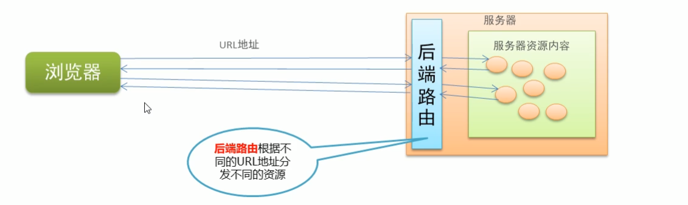
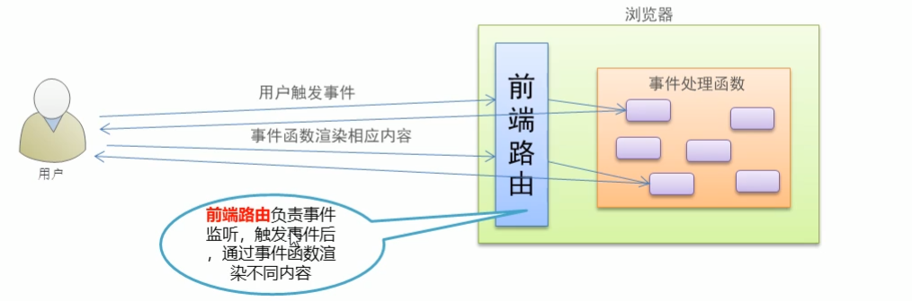
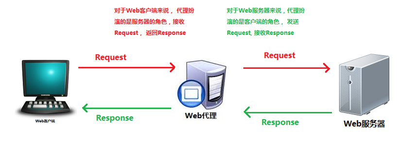
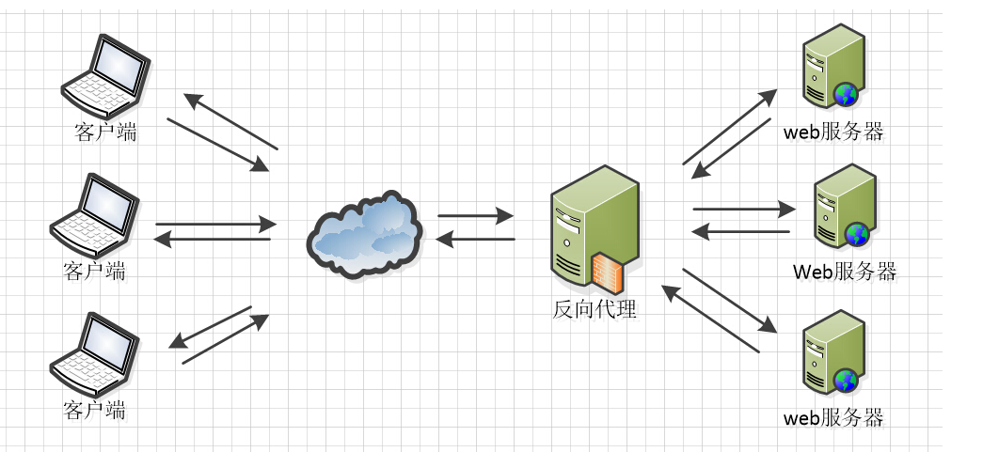

## 路由简介

路由是一个比较广义和抽象的概念，路由的本质就是**对应关系**。

在开发中，路由分为：

- ​ 后端路由
- ​ 前端路由

### 后端路由

- 概念：根据不同的用户 URL 请求，返回不同的内容
- 本质：URL 请求地址与服务器资源之间的对应关系



当输入不同的 url 地址, 向服务器发送请求, 服务器接到请求去查找对应资源, 然后构建响应报文, 返回给浏览器, 浏览器渲染内容

### 前端路由

- 概念：根据不同的用户事件，显示不同的页面内容
- 本质：用户事件与事件处理函数之间的对应关系



### SPA

- Ajax 前端渲染（前端渲染提高性能，但是不支持浏览器的前进后退操作）
- SPA（Single Page Application）单页面应用程序：整个网站只有一个页面，内 容的变化通过 Ajax 局部更新实现、同时支持浏览器地址栏的前进和后退操作
- SPA 实现原理之一：基于 URL 地址的 hash（hash 的变化会导致浏览器记录访问历 史的变化、但是 hash 的变化不会触发新的 URL 请求
- 在实现 SPA 过程中，最核心的技术点就是前端路由

## 基本使用

```html
<!DOCTYPE html>
<html lang="en">
  <head>
    <meta charset="UTF-8" />
    <meta name="viewport" content="width=device-width, initial-scale=1.0" />
    <title>router</title>
    <script src="https://cdn.jsdelivr.net/npm/vue@2/dist/vue.js"></script>
    <script src="./vue-router.js"></script>
  </head>
  <body>
    <div id="app">
      <router-link to="/user">User</router-link>
      <router-link to="/register">register</router-link>

      <router-view></router-view>
    </div>
    <script>
      const User = {
        template: `<h1>我是User</h1>`,
      };
      const Register = {
        template: `<h1>我是Register</h1>`,
      };
      const router = new VueRouter({
        routes: [
          { path: "/user", component: User },
          { path: "/register", component: Register },
        ],
      });
      const vm = new Vue({
        el: "#app",
        data: {},
        router,
      });
    </script>
  </body>
</html>
```

## 路由重定向

路由重定向指的是：用户在访问地址 A 的时候，强制用户跳转到地址 C ，从而展示特定的组件页面；

通过路由规则的 redirect 属性，指定一个新的路由地址，可以很方便地设置路由的重定向：

```js
var router = new VueRouter({
  routes: [
    // 其中，path 表示需要被重定向的原地址，redirect 表示将要被重定向到的新地址
    //当用户在地址栏中输入`/`,会自动的跳转到`/user`,而`/user`对应的组件为User
    { path: "/", redirect: "/user" },
    { path: "/user", component: User },
    { path: "/register", component: Register },
  ],
});
```

## 嵌套路由

点击父级路由链接显示模板内容

模板内容中又有子级路由链接

点击子级路由链接显示子级模板内容


```html
<!DOCTYPE html>
<html lang="en">
  <head>
    <meta charset="UTF-8" />
    <meta name="viewport" content="width=device-width, initial-scale=1.0" />
    <meta http-equiv="X-UA-Compatible" content="ie=edge" />
    <title>Document</title>
    <!-- 导入 vue 文件 -->
    <script src="./lib/vue_2.5.22.js"></script>
    <script src="./lib/vue-router_3.0.2.js"></script>
  </head>
  <body>
    <!-- 被 vm 实例所控制的区域 -->
    <div id="app">
      <router-link to="/user">User</router-link>
      <router-link to="/register">Register</router-link>

      <!-- 路由占位符 -->
      <router-view></router-view>
    </div>

    <script>
      const User = {
        template: "<h1>User 组件</h1>",
      };
      //修改Register组件
      const Register = {
        template: `<div>
          <h1>Register 组件</h1>
          <hr/>

          <!-- 子路由链接 -->
          <router-link to="/register/tab1">tab1</router-link>
          <router-link to="/register/tab2">tab2</router-link>

          <!-- 子路由的占位符 -->
          <router-view />
        <div>`,
      };

      const Tab1 = {
        template: "<h3>tab1 子组件</h3>",
      };

      const Tab2 = {
        template: "<h3>tab2 子组件</h3>",
      };

      // 创建路由实例对象
      const router = new VueRouter({
        // 所有的路由规则
        routes: [
          { path: "/", redirect: "/user" },
          { path: "/user", component: User },
          // children 数组表示子路由规则
          {
            path: "/register",
            component: Register,
            children: [
              { path: "/register/tab1", component: Tab1 },
              { path: "/register/tab2", component: Tab2 },
            ],
          },
        ],
      });

      // 创建 vm 实例对象
      const vm = new Vue({
        // 指定控制的区域
        el: "#app",
        data: {},
        // 挂载路由实例对象
        // router: router
        router,
      });
    </script>
  </body>
</html>
```

## 动态路由

思考：

```html
<!– 有如下 3 个路由链接 -->
<router-link to="/user/1">User1</router-link>
<router-link to="/user/2">User2</router-link>
<router-link to="/user/3">User3</router-link>
```

```js
// 定义如下三个对应的路由规则，是否可行？？？
{ path: '/user/1', component: User }
{ path: '/user/2', component: User }
{ path: '/user/3', component: User }
```

虽然以上规则可以匹配成功，但是这样写比较麻烦。如果有 100 个规则，那么写起来就会非常的麻烦。

通过观察，可以发现整个路由规则中只有后续的数字是在变化的。所以这里可以通过动态路由参数的模式进行路由匹配。

```js
var router = new VueRouter({
  routes: [
    // 动态路径参数 以冒号开头
    { path: "/user/:id", component: User },
  ],
});
```

```js
const User = {
  // 路由组件中通过$route.params获取路由参数
  template: "<div>User {{ $route.params.id }}</div>",
};
```

### 路由组件传递参数

`$route`与对应路由形成高度耦合，不够灵活，所以可以使用`props`将组件和路由解耦

第一种情况：

**props 的值为布尔类型**

```js
const router = new VueRouter({
  routes: [
    // 如果 props 被设置为 true，route.params 将会被设置为组件属性
    { path: "/user/:id", component: User, props: true },
  ],
});

const User = {
  props: ["id"], // 使用 props 接收路由参数
  template: "<div>用户ID：{{ id }}</div>", // 使用路由参数
};
```

在定义路由规则的时候，为其添加了`props`属性，并将其值设置为`true`.那么在组件中就可以通过`props:['id']`的形式来获取对应的参数值。

**第二种情况： `props`的值为对象类型**

```js
 const router = new VueRouter({
    routes: [
        // 如果 props 是一个对象，它会被按原样设置为组件属性
        //这里相当于给组件User,通过路由的形式传递了一个对象，而这时候id在User组件中就无法获取到了。
        { path: '/user/:id', component: User, props: { uname: 'lisi', age: 12 }}
    ]
  })

  const User = {
    props: ['uname', 'age'],
      template: ‘<div>用户信息：{{ uname + '---' + age}}</div>'
}
```

在上面的代码中，在路由规则中，通过`props`向用户组件中传递了一个对象，那么在`User`用户组件中可以接收到传递过来的对象。但是参数`id`无法接收到。

如果要解决这个问题，可以使用`props`的值为函数类型。也就是给`props`传递一个函数。

**第三种情况：`props`的值为函数类型**

```js
const router = new VueRouter({
    routes: [
        // 如果 props 是一个函数，则这个函数接收 route 对象为自己的形参
        //route就是参数对象。
        { path: '/user/:id',
        component: User,
        props: route => ({ uname: 'zs', age: 20, id: route.params.id })}
    ]
  })

  const User = {
    props: ['uname', 'age', 'id'],
      template: ‘<div>用户信息：{{ uname + '---' + age + '---' + id}}</div>'
}
```

## 命名路由

为了更加方便的表示路由的路径，可以给路由规则起一个别名，即为“命名路由”。

```js
const router = new VueRouter({
  routes: [
    {
      path: "/user/:id",
      name: "user",
      component: User,
    },
  ],
});
```

```vue
<!--单击链接，可以跳转到名称为`user`的这个路由规则，并且通过params进行参数的传递-->
<router-link :to="{ name: 'user', params: { id: 123 } }">User</router-link>
```

## 编程式导航

**页面导航的两种方式**

声明式导航：通过点击链接实现导航的方式，叫做声明式导航
例如：普通网页中的 `<a></a>` 链接 或 vue 中的 `<router-link></router-link>`
编程式导航：通过调用`JavaScript`形式的`API`实现导航的方式，叫做编程式导航
例如：普通网页中的 `location.href `

### 编程式导航基本用法

**编程式导航基本用法**

常用的编程式导航 API 如下：

`this.$router.push`('hash 地址')

`this.$router.go(n)`

```js
const User = {
  template: '<div><button @click="goRegister">跳转到注册页面</button></div>',
  methods: {
    goRegister: function () {
      // 用编程的方式控制路由跳转
      this.$router.push("/register");
    },
  },
};
```

**router.push() 方法的参数规则**

```js
// 字符串(路径名称)
router.push("/home");
// 对象
router.push({ path: "/home" });
// 命名的路由(传递参数)
router.push({ name: "/user", params: { userId: 123 } });
// 带查询参数，变成 /register?uname=lisi
router.push({ path: "/register", query: { uname: "lisi" } });
```

## 路由守卫

`Vue-router`中的路由守卫，主要是对其内容进行保护，如果没有对应的权限，则不允许访问。

我们首先来看一下全局守卫，也就是所有的路由都会经过全局守卫来进行检测。

```js
//实现全局守卫
router.beforeEach((to, from, next) => {
  //to:去哪个页面，from来自哪个页面，next继续执行.
  //判断哪个路由需要进行守卫，这里可以通过元数据方式
  if (to.meta.auth) {
    if (window.isLogin) {
      next();
    } else {
      next("/login?redirect=" + to.fullPath);
    }
  } else {
    next();
  }
});
```

在上面的代码中，创建了路由守卫，但是需要判断的是需要对哪个路由进行守卫，这里就是通过元数据来进行判断的。如果所跳转到的路由有元数据，并且对应的`auth`属性为`true`表明是需要进行守卫的，那么下面就需要校验用户是否登录,这里是通过判断否`window.isLogin`的值是否为`true`来进行判断的（这里简化了操作,实际应用中应该存储到`sessionStorage`），如果条件成立则表明用户登录，就继续访问用户希望访问到的页面，否则跳转到登录页面，而且将用户希望访问的页面地址也传递到了登录页面，这样用户登录成功后，可以直接跳转到要访问的页面。

如果没有元数据，则继续访问用户要访问的页面。

略

## addRoutes 动态路由添加

略

## 路由组件缓存

利用`keepalive`做组件缓存，保留组件状态，提高执行效率。

因为当进行路由切换的时候, 对应的组件会被重新创建, 同时数据也会不断的重新加载, 如果数据没有变化, 就没有必要每次重新加载相应数据, 此时就使用组件缓存即可

```js
<keep-alive include="home">
  <router-view></router-view>
</keep-alive>
```

使用`include`或者`exclude`时要给组件设置`name`（这个是组件的名称，组件的名称通过给组件添加`name`属性来进行设置）

当我们进行路由切换的时候，对应的组件会被重新创建，同时数据也会不断的重新加载。

如果数据没有变化，就没有必要每次都重新发送异步请求加载数据

现在，在`App`组件中添加`keep-alive`

因为切换的组件都是在该`router-view`中进行展示。

```html
  <!-- 右侧内容区域 -->
          <div class="content right"><div class="main-content">
            <keep-alive>
             <router-view />
             </keep-alive>
             </div></div>
        </div>
```

下面可以进行验证。

```js
const Rights = {
  template: `<div>
          <h3>权限管理区域</h3>
        </div>`,
  created() {
    console.log(new Date());
  },
};
```

**应用场景**

如果未使用 keep-alive 组件，则在页面回退时仍然会重新渲染页面，触发 created 钩子，使用体验不好。 在以下场景中使用 keep-alive 组件会显著提高用户体验，菜单存在多级关系，多见于列表页+详情页的场景如：

- 商品列表页点击商品跳转到商品详情，返回后仍显示原有信息
- 订单列表跳转到订单详情，返回，等等场景。

**生命周期：**
 `activated`和`deactivated`会在`keep-alive`内所有嵌套的组件中触发
  如：B 页面是缓存页面
    当 A 页面跳到 B 页面时，B 页面的生命周期：activated（可在此时更新数据）
   B 页面跳出时，触发 deactivated
   B 页面自身刷新时，会触发 created-mouted-activated

## Hash 模式与 History 模式

前端路由中，不管是什么实现模式，都是客户端的一种实现方式，也就是当路径发生变化的时候，是不会向服务器发送请求的。

如果需要向服务器发送请求，需要用到`ajax`方式。

### Hash 模式与 History 模式区别

1. 首先是表现形式的区别

**`Hash`模式**

```
https://www.baidu.com/#/showlist?id=22256
```

`hash`模式中路径带有`#`, `#`后面的内容作为路由地址。可以通过问号携带参数。

当然这种模式相对来说比较丑，路径中带有与数据无关的符号，例如`#`与`?`

`History`模式

```
https://www.baidu.com/showlist/22256
```

`History`模式是一个正常的路径的模式，如果要想实现这种模式，还需要服务端的相应支持。

2. 两者原理上的区别

`Hash`模式是基于锚点，以及`onhashchange`事件。

通过锚点的值作为路由地址，当地址发生变化后触发`onhashchange`事件。

`History`模式是基于`HTML5`中的`History API`

也就是如下两个方法

`history.pushState( )` `IE10`以后才支持

`history.replaceState( )`

### `History`模式的使用

`History`模式需要服务器的支持，为什么呢？

因为在单页面的应用中，只有一个页面，也就是`index.html`这个页面，服务端不存在`http://www.test.com/login`这样的地址，也就说如果刷新浏览器，

请求服务器，是找不到`/login`这个页面的，所以会出现`404`的错误。（在传统的开发模式下，输入以上的地址，会返回`login`这个页面，而在单页面应用中，只有一个页面为`index.html`）

所以说，在服务端应该除了静态资源外都返回单页应用的`index.html`

下面我们开始`history`模式来演示一下对应的问题。

在`web`目录下面，存放的是`index.html`,在`webserver`目录下面存放的是`node`代码。

下面看一下具体的`node`代码的实现。

app.js 文件中的代码如下：

```js
const path = require("path");
//导入处理history模式的模块
const history = require("connect-history-api-fallback");
const express = require("express");
const app = express();
//注册处理history模式的中间件
// app.use(history())
//处理静态资源的中间件,处理web目录下的index.html
app.use(express.static(path.join(__dirname, "../web")));
app.listen(3000, () => {
  console.log("服务器开启");
});
```

`connect-history-api-fallback`模块的安装如下(注意在上面的代码中还没有使用该模块)

```
npm install --save connect-history-api-fallback
```

下面还需要安装`express`

```
npm install express
```

启动服务

```
node app.js
```

现在在地址栏中输入:`http://localhost:3000`就可以访问网站了。

并且当我们去单击左侧的菜单的时候，可以实现页面的切换，同时单击“关于”的时候，会出现`NotFound`组件中的内容。

经过测试发现好像没有什么问题，那这是什么原因呢？你想一下当我们单击左侧菜单的时候，路由是怎样工作的呢？

因为现在我们开启了路由的`history`模式，而该模式是通过`HTML5`中的`history`中的`api`来完成路由的操作的，也就是当我们单击菜单的时候，是通过`history.pushState( ) `方法来修改地址栏中的地址，实现组件的切换，而且还会把地址保存的历史记录中（也就是可以单击浏览器中后退按钮，实现后退等操作），但是它并不会向服务器发送请求。

所以说现在整个操作都是在客户端完成的。

但是，当我刷新了浏览器以后，会出现怎样的情况呢？

当单击浏览器中的刷新按钮的时候，会向服务器发送请求，要求`node`服务器处理这个地址，但是服务器并没有处理该地址，所以服务器会返回`404`

以上就是如果`vue-router`开启了`history`模式后，出现的问题。

下面解决这个问题，在服务端启用`connect-history-api-fallback`模块就可以了，如下代码所示：

然后经过测试以后发现没有问题了。

那么现在你考虑一下，具体的工作方式是什么？

当我们在服务端开启对`history`模式的支持以后，我们刷新浏览器，会想服务器发送请求，例如:`http://localhost:3000/orders`

服务器接收该请求，那么用于服务器开启了`history`模式，然后服务器会检查，根据该请求所访问的页面是不存在的，所以会将单页面应用的`index.html`返回给浏览器。浏览器接收`index.html`页面后，会判断路由地址，发现地址为`orders`,所以会加载该地址对应的组件内容。

### 在 Nginx 服务器中配置`History`模式

**代理服务器**

**代理服务器**:一般是指局域网内部的机器通过代理服务器发送请求到互联网上的服务器,代理服务器一般作用在客户端。应用比如：GoAgent，翻墙神器.



**反向代理服务器**

**反向代理服务器：**在服务器端接受客户端的请求，然后把请求分发给具体的服务器进行处理，然后再将服务器的响应结果反馈给客户端。Nginx 就是其中的一种反向代理服务器软件。



## Vue Router 原理

这里先来复习一下`Hash`模式的工作原理。

- ·`URL`中`#`后面的内容作为路径地址，当地址改变的时候不会向服务器发送请求，但是会触发`hashchange`事件。
- 监听`hashchange`事件，在该事件中记录当前的路由地址，然后根据路由地址找到对应组件。
- 根据当前路由地址找到对应组件重新渲染。

下面再来复习一下`History`模式

- 通过`history.pushState()`方法改变地址栏，并且将当前地址记录到浏览器的历史记录中。当前浏览器不会向服务器发送请求
- 监听`popstate`事件，可以发现浏览器历史操作的变化，记录改变后的地址，单击前进或者是后退按钮的时候触发该事件
- 根据当前路由地址找到对应组件重新渲染

## 后续暂略