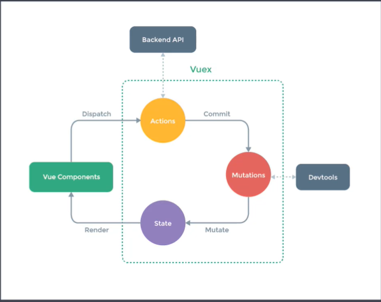

## 组件内状态管理流程

下面我们通过组件内状态管理的流程来回顾一下什么是组件内状态管理。`VUE`中最核心的两个功能就是数据驱动与组件化，使用组件化的开发，可以提高开发效率，提高可维护性。

```js
new Vue({
  data() {
    return {
      count: 0,
    };
  },
  template: `<div>{{count}}</div>`,
  methods: {
    add() {
      this.count++;
    },
  },
});
```

每个组件内都有自己的数据，模板，和方法。数据也称之为状态，每个组件都维护自己的状态。模板我们可以称之为视图，每个组件都有自己的视图，把状态绑定到视图上，最终呈现给用户。当用户与视图交换的时候，可能会更改状态，例如单击按钮，让`count`的值发生变化，当状态发生变化后，会自动更新到视图，更改状态的部分，我们可以称之为`actions`(方法)，以上描述的是单个组件的状态管理。但是在实际的开发中，可能多个组件都会共享状态，我们所说的状态管理，其实就是对状态集中管理和分发，解决多个组件共享状态的问题。

下面我们来看一下状态管理的组成：

- `state`:驱动应用的数据源（也就是状态）
- `view`:以声明方式将`state`映射到视图（通过把状态绑定到视图呈现给用户）
- `actions`:响应在`view`上的用户输入导致的状态变化。（用户与视图交换，改变状态的方式）

## 简易的状态管理方案

创建一个全局对象和改变该全局对象的方法

```js
// store.js
// 提供的user可以全局共享
export default {
  state: {
    user: {
      name: "zhangsan",
      age: 18,
      sex: "男",
    },
  },
  // 这个方法用于修改状态数据的
  setUserNameAction(name) {
    this.state.user.name = name;
  },
};
```

创建两个组件

`componentA.vue`文件中的代码如下：

```vue
<template>
  <div>
    <h1>componentA</h1>
    userName:{{ sharedState.user.name }}
    <button @click="change">修改</button>
  </div>
</template>
<script>
import store from "./store";
export default {
  methods: {
    change() {
      store.setUserNameAction("componentA");
    },
  },
  data() {
    return {
      sharedState: store.state,
      privateState: {}, //可以存储私有的状态
    };
  },
};
</script>
```

`componentB.vue`文件中的内容如下：

```vue
<template>
  <div>
    <h1>componentB</h1>
    userName:{{ sharedState.user.name }}
    <button @click="change">修改</button>
  </div>
</template>
<script>
import store from "./store";
export default {
  methods: {
    change() {
      store.setUserNameAction("componentB");
    },
  },
  data() {
    return {
      sharedState: store.state,
      privateState: {}, //可以存储私有的状态
    };
  },
};
</script>
```

以上两个组件文件内的代码是一样的，只是修改了不用的名称。

`App.vue`文件中的代码修改如下：

```vue
<template>
  <div id="app">
    <ComponentA></ComponentA>
    <ComponentB></ComponentB>
  </div>
</template>

<script>
import ComponentA from "./components/simplestate/componentA";
import ComponentB from "./components/simplestate/componentB";

export default {
  name: "App",
  components: {
    ComponentA,
    ComponentB,
  },
};
</script>

<style>
#app {
  font-family: Avenir, Helvetica, Arial, sans-serif;
  -webkit-font-smoothing: antialiased;
  -moz-osx-font-smoothing: grayscale;
  text-align: center;
  color: #2c3e50;
  margin-top: 60px;
}
</style>
```

在浏览器中进行测试的时候，单击不同组件中的按钮，都可以完成对公共状态的更新，这样就实现了对公共状态的一个全局管理的功能，当然在更新状态的时候，我们约定，不能直接修改对应的状态，而是通过相应的方法来实现对状态数据的更新操作。

以上就是我们所讲解的简易的状态管理方案

## Vuex 核心概念



要修改 state, 需要 dispatch 派发 actions, 在 actions 里可以进行异步操作, 也就是可以发送 ajax 请求获取服务端数据, 当异步请求结束, 拿到服务端返回的最新数据, 可以执行 commit 提交给 mutations, 在 mutations 当中记录状态的更改, 而且 mutations 是同步的, 所有状态的更改, 都是通过 mutations 来完成, 这样就可以通过 mutations 追踪状态的变化, 这样完成 state 的更新, 因为 state 是响应式的, 视图也会更新

### getter

是 vuex 的计算属性, 内部可以对计算结果进行缓存, 只有当依赖的状态发生改变以后, 才会重新计算

### mutation

是完成状态提交的, 也就是状态的变化必须通过 mutation 来完成, 而且必须是同步进行

### action

页面中用户操作更新状态, 先派发给 action, action 和 mutation 类似, 但是不同的是 action 里可以进行异步操作

### Module

略

### Vuex 严格模式

在前面的课程中，我们讲解过所有的状态的更新必须通过提交`Mutation`来完成，但是这仅仅是一个约定，其实我们可以再组件中直接通过`$store.state.msg`这种方式来直接修改`msg`这个状态的值。从语法的层面上来讲，这是没有问题的。但是，这样却破坏了`Vuex`的约定。开启了`Vuex`的严格模式后，如果在组件中直接修改`state`，会出现错误。

在`store/index.js`文件中，创建`Store`的实例的时候，开启严格模式：

```js
export default new Vuex.Store({
  strict: true,//开启严格模式
  state: {
    count: 0,
    msg: "Hello Vuex",
  },
```

在`App.vue`文件中，尝试修改`state`中的数据。

```vue
<h2>严格模式</h2>
<button @click="$store.state.msg = 'abc'">strict</button>
```

在浏览器中，当我们单击以上按钮的时候，在控制台中会出现错误，当然，视图中的内容也发生了改变。

注意：不能在生产环境中开启严格模式，因为严格模式会不断的检查是否出现直接修改状态的情况，这样会影响性能。我们可以在开发环境中开启严格模式，在生产环境中关闭严格模式。

所以，这里可以将`strict`的值，修改成如下的形式：

```js
export default new Vuex.Store({

    //当npm run build的时候，NODE_ENV的值为production，生产环境
  strict: process.env.NODE_ENV !== "production",
  state: {
    count: 0,
    msg: "Hello Vuex",
  },

```

## 案例

略

## 模拟 Vuex

Vuex 就是一个插件, 所以内部必须定义一个 install 方法, 同时 vuex 中最重要的就是 store 这个类, 所以要定义这个类.

在使用时是用 `Vue.use(Vuex)`, 所以在整个 Vuex 中, 是有一个相应的 install 函数的, 同时调用这个函数的时候, 会传递 vue 的实例

```js
let _Vue = null;
class Store {}
function install(Vue) {
  _Vue = Vue;
  _Vue.mixin({
    beforeCreate() {
      if (this.$options.store) {
        _Vue.prototype.$store = this.$options.store;
      }
    },
  });
}
export default {
  Store,
  install,
};
// 需要把Store注册到Vue原型上的$store属性上, 这样可以在全局使用$store来获取到Vuex的store, 所以要使用mixin混入, 在混入中注册beforeCreate方法, 在这个方法中获取在创建vue实例时传入的store对象
```

### 关于 Store 类的创建

在使用 store 的时候首先要创建它的对象, 也就是 new Vuex.Store({})

当我们创建时, 我们要传递相应参数, 这个参数是一个对象, 而在这个对象当中, 有 state, getter, mutations 等等内容, 如果要自己来实现这个 store 类的话, 就也要有相应的构造方法. 所以先定义个构造方法, 这个方法就是来接收在创建这个 store 类实例的时候传入的参数

```js
// 当创建类实例的时候, 会自动调用构造方法, 同时传递相应的参数
// 这个参数通过options来进行接收.
class Store {
  constructor(options) {
    const { state = {}, getters = {}, mutations = {}, actions = {} } = options;
    this.state = _Vue.observable(state);
    this.getters = Object.create(null);
    Object.keys(getters).forEach((key) => {
      Object.defineProperty(this.getters, key, {
        get: () => getters[key](state),
      });
    });
    this._mutations = mutations;
    this._actions = actions;
  }
  commit(type, payload) {
    this._mutations[type](this.state, payload);
  }
  dispatch(type, payload) {
    this._actions[type](this, payload);
  }
}
```
