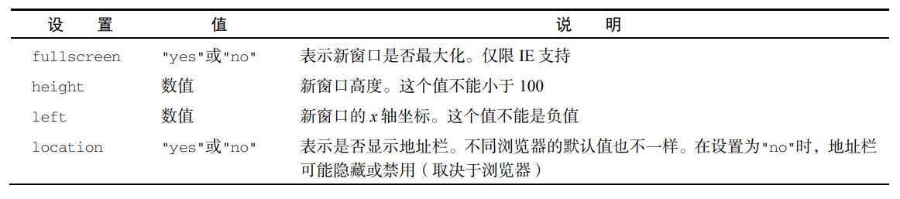
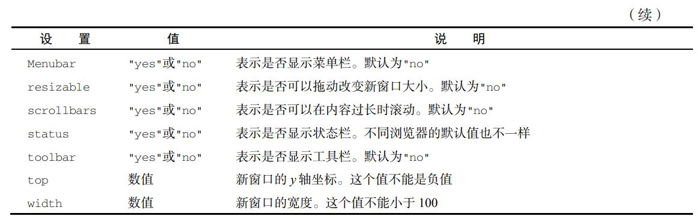

`摘记<Javascript高级程序设计> -- 马特 2020版 第十二章`

<!--truncate-->


# BOM

虽然 ECMAScript 把浏览器对象模型（BOM，Browser Object Model）描述为 JavaScript 的核心，但实际上 BOM 是使用 JavaScript 开发 Web 应用程序的核心。BOM 提供了与网页无关的浏览器功能对象. 多年来，BOM 是在缺乏规范的背景下发展起来的，因此既充满乐趣又问题多多。毕竟，浏览器开发商都按照自己的意愿来为它添砖加瓦。最终，浏览器实现之间共通的部分成为了事实标准，为 Web 开发提供了浏览器间互操作的基础。HTML5 规范中有一部分涵盖了 BOM 的主要内容，因为 W3C 希望将JavaScript 在浏览器中最基础的部分标准化。

## window 对象

BOM 的核心是 window 对象，表示浏览器的实例。window 对象在浏览器中有两重身份，

- 一个是ECMAScript 中的 Global 对象
- 另一个就是浏览器窗口的 JavaScript 接口

这意味着网页中定义的所有对象、变量和函数都以 window 作为其 Global 对象，都可以访问其上定义的全局方法。

### Global 作用域

因为 window 对象被复用为 ECMAScript 的 Global 对象，所以通过 var 声明的所有全局变量和函数都会变成 window 对象的属性和方法。比如：

```js
var age = 29;
var sayAge = () => alert(this.age);
alert(window.age); // 29 
sayAge(); // 29
window.sayAge(); // 29
```

这里，变量 age 和函数 sayAge()被定义在全局作用域中，它们自动成为了 window 对象的成员。因此，变量 age 可以通过 window.age 来访问，而函数 sayAge()也可以通过 window.sayAge()来访问。因为 sayAge()存在于全局作用域，this.age 映射到 window.age，所以就可以显示正确的结果了。

如果在这里使用 let 或 const 替代 var，则不会把变量添加给全局对象：

```js
let age = 29;
const sayAge = () => alert(this.age);
alert(window.age); // undefined
sayAge(); // undefined
window.sayAge(); // TypeError: window.sayAge is not a function
```

另外，访问未声明的变量会抛出错误，但是可以在 window 对象上查询是否存在可能未声明的变量。比如：

```js
// 这会导致抛出错误，因为 oldValue 没有声明
var newValue = oldValue;
// 这不会抛出错误，因为这里是属性查询
// newValue 会被设置为 undefined
var newValue = window.oldValue;
```

### 窗口关系

top 对象始终指向最上层（最外层）窗口，即浏览器窗口本身。而 parent 对象则始终指向当前窗口的父窗口。如果当前窗口是最上层窗口，则 parent 等于 top（都等于 window）。最上层的 window如果不是通过 window.open()打开的，那么其 name 属性就不会包含值

还有一个 self 对象，它是终极 window 属性，始终会指向 window。实际上，self 和 window 就是同一个对象。之所以还要暴露 self，就是为了和 top、parent 保持一致。

这些属性都是 window 对象的属性，因此访问 `window.parent`、`window.top` 和 `window.self`都可以。这意味着可以把访问多个窗口的 window 对象串联起来，比如 window.parent.parent。

### 窗口位置

window 对象的位置可以通过不同的属性和方法来确定。现代浏览器提供了 screenLeft 和screenTop 属性，用于表示窗口相对于屏幕左侧和顶部的位置 ，返回值的单位是 CSS 像素。

### 像素比

CSS 像素是 Web 开发中使用的统一像素单位。这个单位的背后其实是一个角度：0.0213°。如果屏幕距离人眼是一臂长，则以这个角度计算的 CSS 像素大小约为 1/96 英寸。这样定义像素大小是为了在不同设备上统一标准。

比如，低分辨率平板设备上 12 像素（CSS 像素）的文字应该与高清 4K 屏幕下12 像素（CSS 像素）的文字具有相同大小。这就带来了一个问题，不同像素密度的屏幕下就会有不同的缩放系数，以便把`物理像素（屏幕实际的分辨率）`转换为 `CSS 像素（浏览器报告的虚拟分辨率）`。

举个例子，手机屏幕的物理分辨率可能是 1920×1080，但因为其像素可能非常小，所以浏览器就需要将其分辨率降为较低的逻辑分辨率，比如 640×320。这个物理像素与 CSS 像素之间的转换比率由window.devicePixelRatio 属性提供。对于分辨率从 1920×1080 转换为 640×320 的设备，window.devicePixelRatio 的值就是 3。这样一来，12 像素（CSS 像素）的文字实际上就会用 36 像素的物理像素来显示。window.devicePixelRatio 实际上与每英寸像素数（DPI，dots per inch）是对应的。DPI 表示单位像素密度，而 window.devicePixelRatio 表示物理像素与逻辑像素之间的缩放系数。

### 窗口大小

在不同浏览器中确定浏览器窗口大小没有想象中那么容易。所有现代浏览器都支持 4 个属性：

- innerWidth
- innerHeight
- outerWidth
- outerHeight

innerWidth和 innerHeight 返回浏览器窗口中页面视口的大小（不包含浏览器边框和工具栏）。

outerWidth 和 outerHeight 返回浏览器窗口自身的大小（不管是在最外层 window 上使用，还是在窗格`<frame>`中使用）。

### 导航与打开新窗口

window.open()方法可以用于导航到指定 URL，也可以用于打开新浏览器窗口

这个方法接收 4个参数：

- 要加载的 URL
- 目标窗口
- 特性字符串
- 表示新窗口在浏览器历史记录中是否替代当前加载页面的布尔值

通常，调用这个方法时只传前 3 个参数，最后一个参数只有在不打开新窗口时才会使用。

如果 window.open()的第二个参数是一个已经存在的窗口或窗格（frame）的名字，则会在对应的窗口或窗格中打开 URL。下面是一个例子：

```js
// 与<a href="http://www.wrox.com" target="topFrame"/>相同
window.open("http://www.wrox.com/", "topFrame"); 
```

执行这行代码的结果就如同用户点击了一个 href 属性为"http://www.wrox.com"，target 属性为"topFrame"的链接。如果有一个窗口名叫"topFrame"，则这个窗口就会打开这个 URL；否则就会打开一个新窗口并将其命名为"topFrame"。第二个参数也可以是一个特殊的窗口名，比如_self、_parent、_top 或_blank。

**1. 弹出窗口**

如果 window.open()的第二个参数不是已有窗口，则会打开一个新窗口或标签页。第三个参数即特性字符串，用于指定新窗口的配置。如果没有传第三个参数，则新窗口（或标签页）会带有所有默认的浏览器特性（工具栏、地址栏、状态栏等都是默认配置）。如果打开的不是新窗口，则忽略第三个参数。特性字符串是一个逗号分隔的设置字符串，用于指定新窗口包含的特性。下表列出了一些选项。




这些设置需要以逗号分隔的名值对形式出现，其中名值对以等号连接。（特性字符串中不能包含空格。）来看下面的例子：

```js
window.open("http://www.wrox.com/",
 "wroxWindow",
 "height=400,width=400,top=10,left=10,resizable=yes");
```

这行代码会打开一个可缩放的新窗口，大小为 400 像素×400 像素，位于离屏幕左边及顶边各 10 像素的位置。

window.open()方法返回一个对新建窗口的引用。这个对象与普通 window 对象没有区别，只是为控制新窗口提供了方便。例如，某些浏览器默认不允许缩放或移动主窗口，但可能允许缩放或移动通过window.open()创建的窗口。跟使用任何 window 对象一样，可以使用这个对象操纵新打开的窗口。

```js
let wroxWin = window.open("http://www.wrox.com/",
 "wroxWindow",
 "height=400,width=400,top=10,left=10,resizable=yes");

 // 缩放
wroxWin.resizeTo(500, 500);
// 移动
wroxWin.moveTo(100, 100);
```

还可以使用 close()方法像这样关闭新打开的窗口：

```js
wroxWin.close();
```

这个方法只能用于 window.open()创建的弹出窗口。虽然不可能不经用户确认就关闭主窗口，但弹出窗口可以调用 top.close()来关闭自己。关闭窗口以后，窗口的引用虽然还在，但只能用于检查其 closed 属性了：

```js
wroxWin.close();
alert(wroxWin.closed); // true
```

新创建窗口的 window 对象有一个属性 opener，指向打开它的窗口。这个属性只在弹出窗口的最上层 window 对象（top）有定义，是指向调用 window.open()打开它的窗口或窗格的指针。例如：

```js
let wroxWin = window.open("http://www.wrox.com/",
 "wroxWindow",
 "height=400,width=400,top=10,left=10,resizable=yes");
alert(wroxWin.opener === window); // true 
```

虽然新建窗口中有指向打开它的窗口的指针，但反之则不然。窗口不会跟踪记录自己打开的新窗口，因此开发者需要自己记录。

在某些浏览器中，每个标签页会运行在独立的进程中。如果一个标签页打开了另一个，而 window对象需要跟另一个标签页通信，那么标签便不能运行在独立的进程中。在这些浏览器中，可以将新打开的标签页的 opener 属性设置为 null，表示新打开的标签页可以运行在独立的进程中。比如：

```js
let wroxWin = window.open("http://www.wrox.com/",
 "wroxWindow",
 "height=400,width=400,top=10,left=10,resizable=yes");
wroxWin.opener = null;
```

把 opener 设置为 null 表示新打开的标签页不需要与打开它的标签页通信，因此可以在独立进程中运行。这个连接一旦切断，就无法恢复了。

**2. 安全限制**

弹出窗口有段时间被在线广告用滥了。很多在线广告会把弹出窗口伪装成系统对话框，诱导用户点击。因为长得像系统对话框，所以用户很难分清这些弹窗的来源。为了让用户能够区分清楚，浏览器开始对弹窗施加限制。

IE 的早期版本实现针对弹窗的多重安全限制，包括不允许创建弹窗或把弹窗移出屏幕之外，以及不允许隐藏状态栏等。从 IE7 开始，地址栏也不能隐藏了，而且弹窗默认是不能移动或缩放的。Firefox 1禁用了隐藏状态栏的功能，因此无论 window.open()的特性字符串是什么，都不会隐藏弹窗的状态栏。

此外，浏览器会在用户操作下才允许创建弹窗。在网页加载过程中调用 window.open()没有效果而且还可能导致向用户显示错误。弹窗通常可能在鼠标点击或按下键盘中某个键的情况下才能打开。

**3. 弹窗屏蔽程序**

所有现代浏览器都内置了屏蔽弹窗的程序，因此大多数意料之外的弹窗都会被屏蔽。在浏览器屏蔽弹窗时，可能会发生一些事。如果浏览器内置的弹窗屏蔽程序阻止了弹窗，那么 window.open()很可能会返回 null。此时，只要检查这个方法的返回值就可以知道弹窗是否被屏蔽了，比如:

```js
let wroxWin = window.open("http://www.wrox.com", "_blank");
if (wroxWin == null){
 alert("The popup was blocked!");
} 
```

在浏览器扩展或其他程序屏蔽弹窗时，window.open()通常会抛出错误。因此要准确检测弹窗是否被屏蔽，除了检测 window.open()的返回值，还要把它用 try/catch 包装起来，像这样：

```js
let blocked = false;
try {
 let wroxWin = window.open("http://www.wrox.com", "_blank");
 if (wroxWin == null){
    blocked = true;
 }
} catch (ex){
 blocked = true;
}
if (blocked){
 alert("The popup was blocked!");
} 
```

无论弹窗是用什么方法屏蔽的，以上代码都可以准确判断调用 window.open()的弹窗是否被屏蔽了

## 定时器

setTimeout()方法通常接收两个参数：一个参数可以是包含 JavaScript 代码的字符串或者一个函数，第二个参数是要等待的毫秒数，而不是要执行代码的确切时间。该参数只是告诉 JavaScript 引擎在指定的毫秒数过后把任务添加到这个队列。如果队列是空的，则会立即执行该代码。如果队列不是空的，则代码必须等待前面的任务执行完才能执行。

调用 setTimeout()时，会返回一个表示该超时排期的数值 ID。这个超时 ID 是被排期执行代码的唯一标识符，可用于取消该任务。要取消等待中的排期任务，可以调用 clearTimeout()方法并传入超时 ID，如下面的例子所示：

```js
// 设置超时任务
let timeoutId = setTimeout(() => alert("Hello world!"), 1000);
// 取消超时任务
clearTimeout(timeoutId);
```

只要是在指定时间到达之前调用 clearTimeout()，就可以取消超时任务。在任务执行后再调用clearTimeout()没有效果。

:::info
注意 所有超时执行的代码（函数）都会在全局作用域中的一个匿名函数中运行，因此函
数中的 this 值在非严格模式下始终指向 window，而在严格模式下是 undefined。如果
给 setTimeout()提供了一个箭头函数，那么 this 会保留为定义它时所在的词汇作用域。
:::

setInterval()与 setTimeout()的使用方法类似，只不过指定的任务会每隔指定时间就执行一次，直到取消循环定时或者页面卸载。

:::info
注意 这里的关键点是，第二个参数，也就是间隔时间，指的是向队列添加新任务之前等
待的时间。比如，调用 setInterval()的时间为 01:00:00，间隔时间为 3000 毫秒。这意
味着 01:00:03 时，浏览器会把任务添加到执行队列。浏览器不关心这个任务什么时候执行
或者执行要花多长时间。因此，到了 01:00:06，它会再向队列中添加一个任务。由此可看
出，执行时间短、非阻塞的回调函数比较适合 setInterval()。
:::

setInterval()方法也会返回一个循环定时 ID，可以用于在未来某个时间点上取消循环定时。相对于 setTimeout()而言，取消定时的能力对 setInterval()更加重要。毕竟，如果一直不管它，那么定时任务会一直执行到页面卸载。下面是一个常见的例子：

```js
let num = 0, intervalId = null;
let max = 10;
let incrementNumber = function() {
 num++;
 // 如果达到最大值，则取消所有未执行的任务
 if (num == max) {
 clearInterval(intervalId);
 alert("Done");
 }
}
intervalId = setInterval(incrementNumber, 500);
```