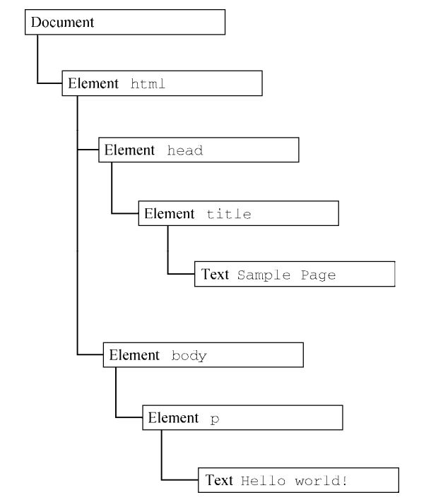

`摘记<Javascript高级程序设计> -- 马特 2020版 第十四章`

<!--truncate-->


# DOM

文档对象模型（DOM，Document Object Model）是 HTML 和 XML 文档的编程接口。DOM 表示由多层节点构成的文档，通过它开发者可以添加、删除和修改页面的各个部分。脱胎于网景和微软早期的动态 HTML（DHTML，Dynamic HTML），DOM 现在是真正跨平台、语言无关的表示和操作网页的方式。

## 节点层级

任何 HTML 或 XML 文档都可以用 DOM 表示为一个由节点构成的层级结构。以下面的 HTML为例：

```html
<html>
 <head>
 <title>Sample Page</title>
 </head>
 <body>
 <p>Hello World!</p>
 </body>
</html>
```

如果表示为层级结构，则如下图所示。



其中，document 节点表示每个文档的根节点。在这里，根节点的唯一子节点是`<html>`元素，我们称之为`文档元素（documentElement）`。每个文档只能有一个文档元素。在 HTML 页面中，文档元素始终是`<html>`元素。在 XML 文档中，则没有这样预定义的元素，任何元素都可能成为文档元素。

HTML 中的每段标记都可以表示为这个树形结构中的一个节点。元素节点表示 HTML 元素，属性节点表示属性，文档类型节点表示文档类型，注释节点表示注释。DOM 中总共有 12 种节点类型，这些类型都继承一种基本类型。

### Node 类型

DOM Level 1 描述了名为 Node 的接口，这个接口是所有 DOM 节点类型都必须实现的。Node 接口在 JavaScript中被实现为 Node 类型，在除 IE之外的所有浏览器中都可以直接访问这个类型。在 JavaScript中，所有节点类型都继承 Node 类型，因此所有类型都共享相同的基本属性和方法。

### Document 类型

Document 类型是 JavaScript 中表示文档节点的类型。在浏览器中，文档对象 document 是HTMLDocument 的实例（HTMLDocument 继承 Document），表示整个 HTML 页面。document 是 window对象的属性，因此是一个全局对象。

**1. 文档子节点**

略

**2. 文档信息**

document 作为 HTMLDocument 的实例，还有一些标准 Document 对象上所没有的属性。这些属性提供浏览器所加载网页的信息。

- 第一个属性是 title

包含`<title>`元素中的文本，通常显示在浏览器窗口或标签页的标题栏。

- URL
- domain
- referrer

referrer 包含链接到当前页面的那个页面的 URL. 如果当前页面没有来源，则 referrer 属性包含空字符串。

所有这些信息都可以在请求的 HTTP 头部信息中获取，只是在 JavaScript 中通过这几个属性暴露出来而已，如下面的例子所示：

```js
// 取得完整的 URL
let url = document.URL;
// 取得域名
let domain = document.domain;
// 取得来源
let referrer = document.referrer;
```

URL 跟域名是相关的。比如，如果 document.URL 是 `http://www.wrox.com/WileyCDA/`，则document.domain 就是 www.wrox.com。

在这些属性中，只有 domain 属性是可以设置的。出于安全考虑，给 domain 属性设置的值是有限制的。如果 URL包含子域名如 p2p.wrox.com，则可以将 domain 设置为"wrox.com"（URL包含“www”时也一样，比如 www.wrox.com）。不能给这个属性设置 URL 中不包含的值，比如：

```js
// 页面来自 p2p.wrox.com
document.domain = "wrox.com"; // 成功
document.domain = "nczonline.net"; // 出错！
```

当页面中包含来自某个不同子域的窗格（`<frame>`）或内嵌窗格（`<iframe>`）时，设置document.domain 是有用的。因为跨源通信存在安全隐患，所以不同子域的页面间无法通过 JavaScript通信。此时，在每个页面上把 document.domain 设置为相同的值，这些页面就可以访问对方的 JavaScript对象了。

比如，一个加载自 www.wrox.com 的页面中包含一个内嵌窗格，其中的页面加载自p2p.wrox.com。这两个页面的 document.domain 包含不同的字符串，内部和外部页面相互之间不能访问对方的 JavaScript 对象。如果每个页面都把 document.domain 设置为 wrox.com，那这两个页面之间就可以通信了。

浏览器对 domain 属性还有一个限制，即这个属性一旦放松就不能再收紧。比如，把document.domain 设置为"wrox.com"之后，就不能再将其设置回"p2p.wrox.com"，后者会导致错误，比如：

```js
// 页面来自 p2p.wrox.com
document.domain = "wrox.com"; // 放松，成功
document.domain = "p2p.wrox.com"; // 收紧，错误！
```

**3. 定位元素**

略

### Element 类型

除了Document 类型，Element 类型就是Web开发中最常用的类型了。Element 表示XML或HTML元素，对外暴露出访问元素标签名、子节点和属性的能力。

以下内容暂略

