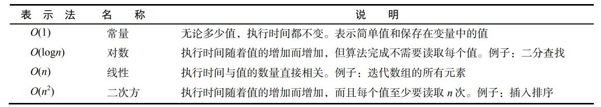

`摘记<Javascript高级程序设计> -- 马特 2020版 第28章 28-2`

<!--truncate-->

# 性能

相比 JavaScript 刚问世时，目前每个网页中 JavaScript 代码的数量已有极大的增长。代码量的增长也带来了运行时执行 JavaScript 的性能问题。

JavaScript 一开始就是一门`解释型语言`，因此执行速度比编译型语言要慢一些。Chrome 是第一个引入优化引擎将 JavaScript 编译为原生代码的浏览器。随后，其他主流浏览器也紧随其后，实现了 JavaScript 编译。

即使到了编译 JavaScript 时代，仍可能写出运行慢的代码。不过，如果遵循一些基本模式，就能保证写出执行速度很快的代码。

## 作用域意识

随着作用域链中作用域数量的增加，访问当前作用域外部变量所需的时间也会增加。访问全局变量始终比访问局部变量慢，因为必须遍历作用域链。任何可以缩短遍历作用域链时间的举措都能提升代码性能。

### 1. 避免全局查找

改进代码性能非常重要的一件事，可能就是要提防全局查询。全局变量和函数相比于局部值始终是最费时间的，因为需要经历作用域链查找。来看下面的函数：

```js
function updateUI() {
 let imgs = document.getElementsByTagName("img");
 for (let i = 0, len = imgs.length; i < len; i++) {
 imgs[i].title = '${document.title} image ${i}';
 }
 let msg = document.getElementById("msg");
 msg.innerHTML = "Update complete.";
} 
```

这个函数看起来好像没什么问题，但其中三个地方引用了全局 document 对象。如果页面的图片非常多，那么 for 循环中就需要引用 document 几十甚至上百次，每次都要遍历一次作用域链。`通过在局部作用域中保存 document 对象的引用，能够明显提升这个函数的性能，因为只需要作用域链查找。`通过创建一个指向 document 对象的局部变量，可以通过将全局查找的数量限制为一个来提高这个函数的性能：

```js
function updateUI() {
 let doc = document;
 let imgs = doc.getElementsByTagName("img");
 for (let i = 0, len = imgs.length; i < len; i++) {
 imgs[i].title = '${doc.title} image ${i}';
 }
 let msg = doc.getElementById("msg");
 msg.innerHTML = "Update complete.";
} 
```

这里先把 document 对象保存在局部变量 doc 中。然后用 doc 替代了代码中所有的 document。这样调用这个函数只会查找一次作用域链，相对上一个版本，肯定会快很多。

:::tip 经验规则
因此，一个经验规则就是，只要函数中有引用超过两次的全局对象，就应该把这个对象保存为一个局部变量。
:::

### 2. 不使用 with 语句

在性能很重要的代码中，应避免使用 with 语句。与函数类似，with 语句会创建自己的作用域，因此也会加长其中代码的作用域链。在 with 语句中执行的代码一定比在它外部执行的代码慢，因为作用域链查找时多一步。

## 选择正确的方法

与其他语言一样，影响性能的因素通常涉及算法或解决问题的方法。经验丰富的开发者知道用什么方法性能更佳。通常很多能在其他编程语言中提升性能的技术和方法同样也适用于 JavaScript。

### 1. 避免不必要的属性查找

在计算机科学中，算法复杂度使用大 O 表示法来表示。最简单同时也最快的算法可以表示为常量值或 O(1)。然后，稍微复杂一些的算法同时执行时间也更长一些。下表列出了 JavaScript 中常见算法的类型。



常量值或 O(1)，指字面量和保存在变量中的值，表示读取常量值所需的时间不会因值的多少而变化。读取常量值是效率极高的操作，因此非常快。来看下面的例子：

```js
let value = 5;
let sum = 10 + value;
console.log(sum);
```

以上代码查询了 4 次常量值：数值 5、变量 value、数值 10 和变量 sum。整体代码的复杂度可以认为是 O(1)。

### 2. 优化循环

循环是编程中常用的语法构造，因此在 JavaScript 中也十分常见。优化这些循环是性能优化的重要内容，因为循环会重复多次运行相同的代码，所以运行时间会自动增加。优化循环的基本步骤如下。

- (1) 简化终止条件。

因为每次循环都会计算终止条件，所以它应该尽可能地快。这意味着要避免属性查找或其他 O(n)操作。

- (2) 简化循环体

循环体是最花时间的部分，因此要尽可能优化。要确保其中不包含可以轻松转移到循环外部的密集计算。

- (3) 使用后测试循环

最常见的循环就是 for 和 while 循环，这两种循环都属于先测试循环。do-while就是后测试循环，避免了对终止条件初始评估 ，因此应该会更快

### 3. 展开循环

### 4. 避免重复解释

### 5. 其他性能优化注意事项

- 原生方法很快。

应该尽可能使用原生方法，而不是使用 JavaScript 写的方法。原生方法是使用 C或 C++等编译型语言写的，因此比 JavaScript 写的方法要快得多。JavaScript 中经常被忽视的是Math 对象上那些执行复杂数学运算的方法。这些方法总是比执行相同任务的 JavaScript 函数快得多，比如求正弦、余弦等

- switch 语句很快。

如果代码中有复杂的 if-else 语句，将其转换成 switch 语句可以变得更快。然后，通过重新组织分支，把最可能的放前面，不太可能的放后面，可以进一步提升性能

- 位操作很快。

## 优化 DOM 交互

在所有 JavaScript 代码中，涉及 DOM 的部分无疑是非常慢的。DOM 操作和交互需要占用大量时间，因为经常需要重新渲染整个或部分页面。此外，看起来简单的操作也可能花费很长时间，因为 DOM 中携带着大量信息。理解如何优化 DOM 交互可以极大地提升脚本的执行速度。

### 1. 实时更新最小化

访问 DOM 时，只要访问的部分是显示页面的一部分，就是在执行实时更新操作。之所以称其为实时更新，是因为涉及立即（实时）更新页面的显示，让用户看到。每次这样的更新，无论是插入一个字符还是删除页面上的一节内容，都会导致性能损失。这是因为浏览器需要为此重新计算数千项指标，之后才能执行更新。实时更新的次数越多，执行代码所需的时间也越长。反之，实时更新的次数越少，代码执行就越快。来看下面的例子：

```js
let list = document.getElementById("myList"),
 item;
for (let i = 0; i < 10; i++) {
 item = document.createElement("li");
 list.appendChild(item);
 item.appendChild(document.createTextNode('Item ${i}');
} 
```

以上代码向列表中添加了 10 项。每添加 1 项，就会有两次实时更新：一次添加`<li>`元素，一次为它添加文本节点。因为要添加 10 项，所以整个操作总共要执行 20 次实时更新。

为解决这里的性能问题，需要减少实时更新的次数。有两个办法可以实现这一点。第一个办法是从页面中移除列表，执行更新，然后再把列表插回页面中相同的位置。这个办法并不可取，因为每次更新时页面都会闪烁。第二个办法是使用文档片段构建 DOM 结构，然后一次性将它添加到 list 元素。这个办法可以减少实时更新，也可以避免页面闪烁。比如：

```js
let list = document.getElementById("myList"),
 fragment = document.createDocumentFragment(),
 item;
for (let i = 0; i < 10; i++) {
 item = document.createElement("li");
 fragment.appendChild(item);
 item.appendChild(document.createTextNode("Item " + i));
}
list.appendChild(fragment);
```

这样修改之后，完成同样的操作只会触发一次实时更新。这是因为更新是在添加完所有列表项之后一次性完成的。文档片段在这里作为新创建项目的临时占位符。最后，使用 appendChild()将所有项目都添加到列表中。别忘了，在把文档片段传给 appendChild()时，会把片段的所有子元素添加到父元素，片段本身不会被添加。

只要是必须更新 DOM，就尽量考虑使用文档片段来预先构建 DOM 结构，然后再把构建好的 DOM结构实时更新到文档中。

### 2. 使用事件委托

大多数 Web 应用程序会大量使用事件处理程序实现用户交互。一个页面中事件处理程序的数量与页面响应用户交互的速度有直接关系。为了减少对页面响应的影响，应该尽可能使用事件委托

事件委托利用了事件的冒泡。任何冒泡的事件都可以不在事件目标上，而在目标的任何祖先元素上处理。基于这个认知，可以把事件处理程序添加到负责处理多个目标的高层元素上。只要可能，就应该在文档级添加事件处理程序，因为在文档级可以处理整个页面的事件。

### 3. 注意 HTMLCollection

略