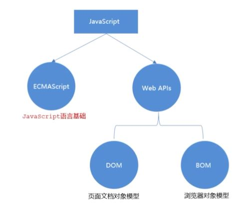
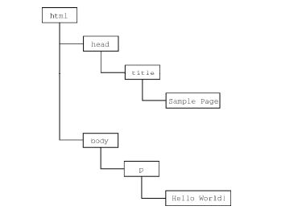

`摘记<Javascript高级程序设计> -- 马特 2020版 第一章`

<!--truncate-->

虽然JavaScript和ECMAScript基本上是同义词, 但JS远远不限于ECMA-262所定义的那样.  

没错, 完整JavaScript实现包含以下几个部分:
- 核心 (ECMAScript)
- 文档对象模型 (DOM)
- 浏览器对象模型 (BOM)



## ECMAScript

ECMAScript, 即ECMA-262定义的语言, 并不局限于Web浏览器. 事实上, 这门语言没有和输出之类的方法. 即ECMA-262将这门语言作为一个基准来定义, 以便在它之上再构建更稳健的脚本语言. **Web浏览器只是ECMAScript实现可能存在的一种宿主环境(host environment)** 宿主环境提供ECMAScript的基准实现 和 与环境自身交互必须的`扩展`

## DOM

**文档对象模型 (DOM, Document Object Model)** 是一个应用编程接口(API), 用于在HTML中使用扩展的XML. DOM将整个页面抽象为一组分层节点. HTML或XML页面的每个组成部分都是一种节点, 包含不同的数据. 比如下面的HTML页面:

```html
<html>
  <head>
    <title>Sample Page</title>
  </head>
  <body>
    <p>Hello World!</p>
  </body>
</html>
```

这些代码通过DOM可以表示为一组分层节点, 如图:



DOM 通过创建表示文档的树，让开发者可以随心所欲地控制网页的内容和结构。使用 DOM API，可以轻松地删除、添加、替换、修改节点。

### 为什么 DOM 是必需的

在 IE4 和 Netscape Navigator 4 支持不同形式的动态 HTML（DHTML）的情况下，开发者首先可以做到不刷新页面而修改页面外观和内容。这代表了 Web 技术的一个巨大进步，但也暴露了很大的问题。

由于网景和微软采用不同思路开发 DHTML，开发者写一个 HTML 页面就可以在任何浏览器中运行的好日子就此终结。

**为了保持 Web 跨平台的本性**，必须要做点什么。人们担心如果无法控制网景和微软各行其是，那么 Web 就会发生分裂，导致人们面向浏览器开发网页。就在这时，万维网联盟（W3C，World Wide Web Consortium）开始了制定 DOM 标准的进程。

## BOM

IE3 和 Netscape Navigator 3 提供了浏览器对象模型（BOM） API，用于支持访问和操作浏览器的窗口。使用 BOM，开发者可以操控浏览器显示页面之外的部分。而 BOM 真正独一无二的地方，当然也是问题最多的地方，就是它是唯一一个没有相关标准的 JavaScript 实现。

**HTML5**改变了这个局面，这个版本的 HTML 以正式规范的形式涵盖了尽可能多的 BOM 特性。由于 HTML5 的出现，之前很多与 BOM 有关的问题都迎刃而解了。

总体来说，BOM 主要针对浏览器窗口和子窗口（frame），不过人们通常会把任何特定于浏览器的扩展都归在 BOM 的范畴内。比如，下面就是这样一些扩展：
- 弹出新浏览器窗口的能力；
- 移动、缩放和关闭浏览器窗口的能力；
- navigator 对象，提供关于浏览器的详尽信息；
- location 对象，提供浏览器加载页面的详尽信息；
- screen 对象，提供关于用户屏幕分辨率的详尽信息；
- performance 对象，提供浏览器内存占用、导航行为和时间统计的详尽信息；
- 对 cookie 的支持；
- 其他自定义对象，如 XMLHttpRequest 和 IE 的 ActiveXObject。

因为在很长时间内都没有标准，所以每个浏览器实现的都是自己的 BOM。有一些所谓的事实标准，比如对于 window 对象和 navigator 对象，每个浏览器都会给它们定义自己的属性和方法。现在有了HTML5，BOM 的实现细节应该会日趋一致。

## 小结

JavaScript 是一门用来与网页交互的脚本语言，包含以下三个组成部分。
- ECMAScript：由 ECMA-262 定义并提供核心功能。
- 文档对象模型（DOM）：提供与网页内容交互的方法和接口。
- 浏览器对象模型（BOM）：提供与浏览器交互的方法和接口。
