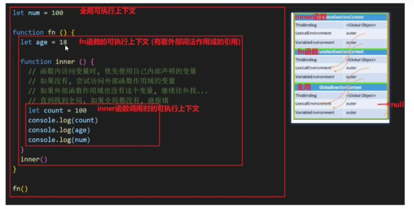
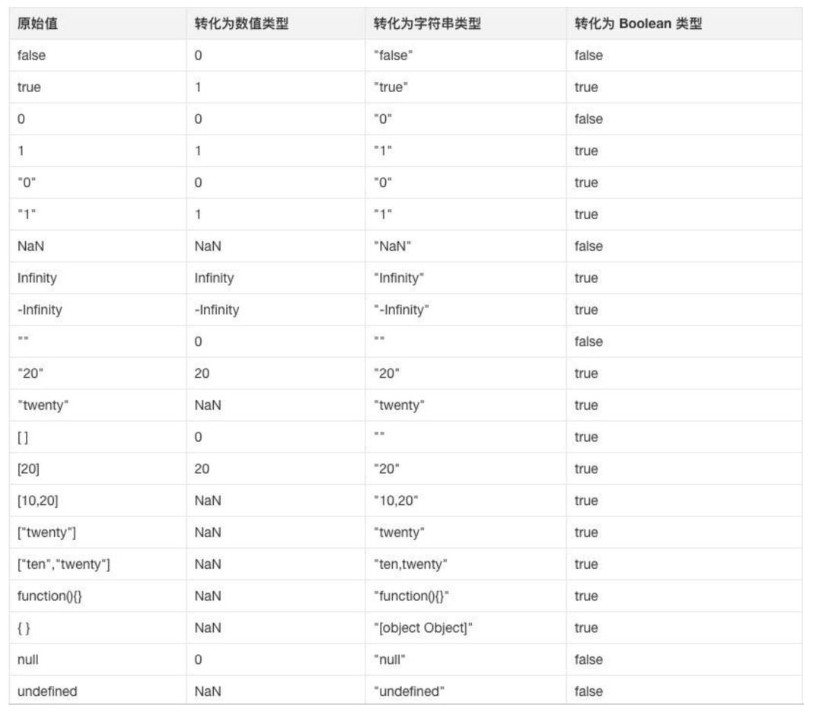
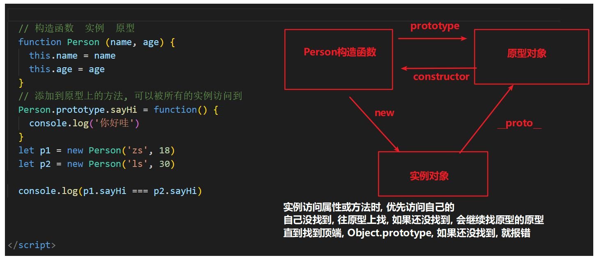

## 1. 谈谈对作用域链的理解



简单版:

内部函数可以访问到外部函数声明的变量, 外部函数又可以访问到全局的, 一层层的关系就是作用域链

正常版:

js 全局有全局可执行上下文, 每个函数调用时, 有着函数的可执行上下文, 当函数执行时会进入到 js 的调用栈, 每个可执行的上下文都会包含对于上一层可执行上下文的一个引用, 或者说叫词法作用域的引用. 说白了可以访问自己的变量, 也可以访问外部的变量, 这个外部上下文也有着对于再外部的上下文词法作用域的引用, 形成了作用于链

## 2. 谈谈对闭包的理解

- 对闭包的基本概念的理解
- 对闭包的作用的了解

### 什么是闭包?

- MDN 的官方解释:

  - 闭包是函数和声明该函数的词法环境的组合.

- 更通俗一点的解释:
  - 闭包 = 函数 + 该函数内可访问的所有函数外的变量
  - 或者说
  - 内部函数, 访问了外部函数的变量, 就可以形成闭包

### 闭包的基本形式

```js
// 闭包的基本形式
function fn() {
  let num = 1;
  function inner() {
    num = num + 1;
    console.log(num);
  }
}
let result = fn();
result(); //2
```

### 闭包的作用

常见应用: `实现数据私有`

例 1: 计数器

```js
let count = 0; // count是全局变量, 容易被随意修改

function fn() {
  count++;
  console.log("函数被调用了" + count + "次");
}
fn();

// 但我们希望有些数据是私有的, 不让外部随意的访问

function fn() {
  let count = 0;
}
fn();
console.log(count); //报错Uncaught ReferenceError: count is not defined, 因为fn函数一执行完, 函数里的就释放掉了
// 使用闭包
function fn() {
  let count = 0;

  function inner() {
    count++;
    console.log("函数被调用了" + count + "次");
  }
  return inner;
}
let result = fn();
result();
result();
result();
```

:::tip
注意: 外部函数中, 一般需要 return 引用, 内存才不会被释放
:::

例 2: 计数器

```js
for (var i = 1; i <= 5; i++) {
  setTimeout(() => {
    console.log(i);
  }, i * 1000);
}
// 6 6 6 6 6

// 如果把var 换成let 可以解决问题, 输出1,2,3,4,5, 但是没有let的话,
// 早期, 闭包还用于解决for循环中, 定时打印内容的问题

for (var i = 1; i <= 5; i++) {
  (function (num) {
    // 形参也可以理解为函数中局部变量
    setTimeout(() => {
      console.log(num);
    }, num * 1000);
  })(i);
}
```

## 3. js 中数据类型的隐式转换规则

在 if 语句、逻辑语句、数学运算逻辑、== 等情况下都可能出现隐式类型转换。

下表展示了一系列原始值，通过隐式转换成数字、字符串、布尔类型后所得到的值：



坑: 判断时, 尽量不要用 `==` , 要用 `===` ( 两个等号判断, 如果类型不同, 默认会进行隐式类型转换再比较)

## 4. 谈谈对原型链的理解

要讲清楚这个问题，主要着重这几个方面：

- 什么是原型对象
- 构造函数, 原型对象, 实例的三角关系图
- 原型链如何形成

```js
// 构造函数
function Person() {
  this.name = name;
  this.age = age;

  this.sayHi = function () {
    console.log("hello");
  };
}

let p1 = new Person("zs", 18);
let p2 = new Person("ls", 20);
console.log(p1.sayHi === p2.sayHi); //false

// 对比下图
```



**原型对象**

在 JavaScript 中，除去一部分内建函数，绝大多数的函数都会包含有一个叫做 `prototype` 的属性，指向原型对象，

基于构造函数创建出来的实例, 都可以共享访问原型对象的属性。

例如我们的 `hasOwnProperty`, `toString` ⽅法等其实是 Obejct 原型对象的方法，它可以被任何对象当做⾃⼰的⽅法来使⽤。

`hasOwnProperty` 用于判断, 某个属性, 是不是自己的 (还是原型链上的)

来看一段代码：

```js
let person = {
  name: "Tom",
  age: 18,
  job: "student",
};

console.log(person.hasOwnProperty("name")); // true
console.log(person.hasOwnProperty("hasOwnProperty")); // false
console.log(Object.prototype.hasOwnProperty("hasOwnProperty")); // true
```

可以看到，`hasOwnProperty` 并不是 `person` 对象的属性，但是 `person` 却能调用它。

那么 `person` 对象是如何找到 Object 原型中的 `hasOwnProperty` 的呢？这就要靠原型链的能力了。

需求: 简单绘制原型三角关系图!

**原型链**

在 JavaScript 中，每个对象中都有一个 `__proto__` 属性，这个属性指向了当前对象的构造函数的原型。

对象可以通过自身的 `__proto__`属性与它的构造函数的原型对象连接起来，

而因为它的原型对象也有 `__proto__`，因此这样就串联形成一个链式结构，也就是我们称为的原型链。


