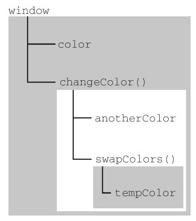

`摘记<Javascript高级程序设计> -- 马特 2020版 第四章 4-2`

<!--truncate-->

## 上下文定义

执行上下文（以下简称“上下文”）的概念在 JavaScript 中是颇为重要的。变量或函数的上下文决定了它们可以访问哪些数据，以及它们的行为。

每个上下文都有一个关联的变量对象（variable object），而这个上下文中定义的所有变量和函数都存在于这个对象上。虽然无法通过代码访问变量对象，但后台处理数据会用到它。

全局上下文是最外层的上下文。

根据 ECMAScript 实现的宿主环境，表示全局上下文的对象可能不一样。

在浏览器中，全局上下文就是我们常说的 window 对象, 因此所有通过 var 定
义的全局变量和函数都会成为 window 对象的属性和方法。

使用 let 和 const 的顶级声明不会定义在全局上下文中，但在作用域链解析上效果是一样的。`上下文在其所有代码都执行完毕后会被销毁，包括定义在它上面的所有变量和函数（全局上下文在应用程序退出前才会被销毁，比如关闭网页或退出浏览器）。`

## 作用域链

上下文中的代码在执行的时候，会创建变量对象的一个作用域链（scope chain）。
看一看下面这个例子：

```js
var color = "blue";
function changeColor() {
 if (color === "blue") {
 color = "red";
 } else {
 color = "blue";
 }
}
changeColor();

// 对这个例子而言，函数 changeColor()的作用域链包含两个对象：一个是它自己的变量对象（就是定义 arguments 对象的那个），另一个是全局上下文的变量对象。这个函数内部之所以能够访问变量color，就是因为可以在作用域链中找到它。

```

此外，局部作用域中定义的变量可用于在局部上下文中替换全局变量。看一看下面这个例子：

```js
var color = "blue";
function changeColor() {
 let anotherColor = "red";
 function swapColors() {
 let tempColor = anotherColor;
 anotherColor = color;
 color = tempColor;
 // 这里可以访问 color、anotherColor 和 tempColor
 }
 // 这里可以访问 color 和 anotherColor，但访问不到 tempColor
 swapColors();
}
// 这里只能访问 color
changeColor(); 
```

以上代码涉及 3 个上下文：`全局上下文`、`changeColor()的局部上下文`和 `swapColors()的局部上下文`。

`全局上下文`中有一个变量 color 和一个函数 changeColor()。changeColor()的局部上下文中有一个变量 anotherColor 和一个函数 swapColors()，但在这里可以访问全局上下文中的变量 color。

`swapColors()的局部上下文`中有一个变量 tempColor，只能在这个上下文中访问到。全局上下文和

`changeColor()的局部上下文`都无法访问到 tempColor。而在 swapColors()中则可以访问另外两个上下文中的变量，因为它们都是父上下文。下图展示了前面这个例子的作用域链。



### 作用域链增强

虽然执行上下文主要有全局上下文和函数上下文两种（eval()调用内部存在第三种上下文），但有其他方式来增强作用域链。某些语句会导致在作用域链前端临时添加一个上下文，这个上下文在代码执行后会被删除。通常在两种情况下会出现这个现象，即代码执行到下面任意一种情况时：

- try/catch 语句的 catch 块
- with 语句

这两种情况下，都会在作用域链前端添加一个变量对象。看下面的例子：

```js
function buildUrl() {
 let qs = "?debug=true";
 with(location){
 let url = href + qs;
 }
 return url;
} 
```

这里，with 语句将 location 对象作为上下文，因此 location 会被添加到作用域链前端。buildUrl()函数中定义了一个变量 qs。当 with 语句中的代码引用变量 href 时，实际上引用的是location.href，也就是自己变量对象的属性。在引用 qs 时，引用的则是定义在 buildUrl()中的那个变量，它定义在函数上下文的变量对象上。而在 with 语句中使用 var 声明的变量 url 会成为函数上下文的一部分，可以作为函数的值被返回；但像这里使用 let 声明的变量 url，因为被限制在块级作用域，所以在 with 块之外没有定义。