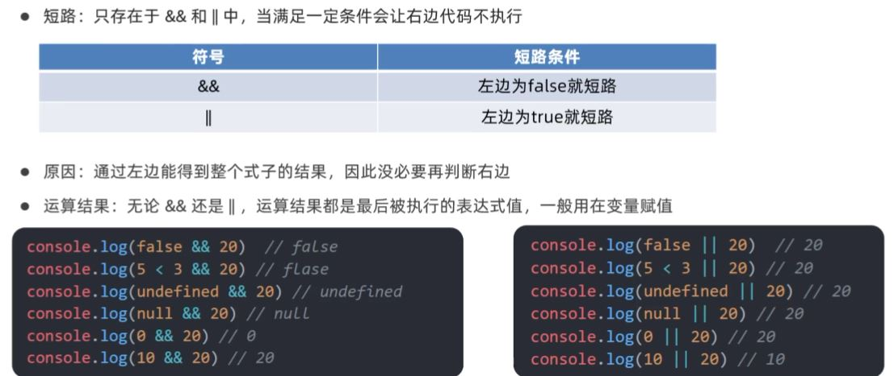

`摘记<Javascript高级程序设计> -- 马特 2020版 第三章`

<!--truncate-->

ECMAScript 有 6 种简单数据类型（也称为原始类型）：Undefined、Null、Boolean、Number、String 和 Symbol。Symbol（符号）是 ECMAScript 6 新增的。还有一种复杂数据类型叫 Object（对象）。

## `typeof 操作符`

因为 ECMAScript 的类型系统是松散的，所以需要一种手段来确定任意变量的数据类型。`typeof操作符`就是为此而生的。对一个值使用 typeof 操作符会返回下列字符串之一：

- "undefined"表示值未定义；
- "boolean"表示值为布尔值；
- "string"表示值为字符串；
- "number"表示值为数值；
- "object"表示值为对象（而不是函数）或 null；
- "function"表示值为函数；
- "symbol"表示值为符号。

:::caution 注意
注意typeof在某些情况下返回的结果可能会让人费解，但技术上讲还是正确的。比如，调用typeofnull 返回的是"object"。这是因为特殊值 null 被认为是一个对空对象的引用。

严格来讲，函数在 ECMAScript 中被认为是对象，并不代表一种数据类型。可是，
函数也有自己特殊的属性。为此，就有必要通过 typeof 操作符来区分函数和其他对象。
:::

## `Undefined 类型`

Undefined 类型只有一个值，就是特殊值 undefined。当使用 var 或 let 声明了变量但没有初始化时，就相当于给变量赋予了 undefined 值：
```js
let message;
console.log(message == undefined); // true
```
在这个例子中，变量 message 在声明的时候并未初始化。而在比较它和 undefined 的字面值时，两者是相等的。这个例子等同于如下示例：
```js
let message = undefined;
console.log(message == undefined); // true

// 这里，变量 message 显式地以 undefined 来初始化。但这是不必要的，因为默认情况下，任何未经初始化的变量都会取得 undefined 值。
```

:::caution 注意
注意，包含 undefined 值的变量跟未定义变量是有区别的。请看下面的例子：
:::

```js
let message; // 这个变量被声明了，只是值为 undefined
// 确保没有声明过这个变量
// let age
console.log(message); // "undefined"
console.log(age); // 报错
```

在上面的例子中，第一个 console.log 会指出变量 message 的值，即"undefined"。而第二个console.log 要输出一个未声明的变量 age 的值，因此会导致报错。对未声明的变量，只能执行一个有用的操作，就是对它调用 typeof。（对未声明的变量调用 delete 也不会报错，但这个操作没什么用，实际上在严格模式下会抛出错误。）

在对未初始化的变量调用 typeof 时，返回的结果是"undefined"，但对未声明的变量调用它时，返回的结果还是"undefined"，这就有点让人看不懂了。比如下面的例子：

```js
let message; // 这个变量被声明了，只是值为 undefined
// 确保没有声明过这个变量
// let age
console.log(typeof message); // "undefined"
console.log(typeof age); // "undefined"
```

无论是声明还是未声明，typeof 返回的都是字符串"undefined"。逻辑上讲这是对的，因为虽然严格来讲这两个变量存在根本性差异，但它们都无法执行实际操作。

:::caution 注意
注意 即使未初始化的变量会被自动赋予 undefined 值，但我们仍然建议在声明变量的
同时进行初始化。这样，当 typeof 返回"undefined"时，你就会知道那是因为给定的变
量尚未声明，而不是声明了但未初始化。
:::

undefined 是一个假值。因此，如果需要，可以用更简洁的方式检测它。不过要记住，也有很多其他可能的值同样是假值。所以一定要明确自己想检测的就是 undefined 这个字面值，而不仅仅是假值。

```js
let message; // 这个变量被声明了，只是值为 undefined
// age 没有声明
if (message) {
 // 这个块不会执行
}
if (!message) {
 // 这个块会执行
}
if (age) {
 // 这里会报错
} 
```

## `Null 类型`

Null 类型同样只有一个值，即特殊值 null。逻辑上讲，`null 值表示一个空对象指针`，这也是给typeof 传一个 null 会返回"object"的原因：

```js
let car = null;
console.log(typeof car); // "object"
```
在定义将来要保存对象值的变量时，建议使用 null 来初始化，不要使用其他值。这样，只要检查这个变量的值是不是 null 就可以知道这个变量是否在后来被重新赋予了一个对象的引用，比如：
```js
if (car != null) {
 // car 是一个对象的引用
} 
```
undefined 值是由 null 值派生而来的，因此 ECMA-262 将它们定义为表面上相等，如下面的例子所示：

```js
console.log(null == undefined); // true
```

即使 null 和 undefined 有关系，它们的用途也是完全不一样的。如前所述，永远不必显式地将变量值设置为 undefined。但 null 不是这样的。任何时候，只要变量要保存对象，而当时又没有那个对象可保存，就要用 null 来填充该变量。这样就可以保持 null 是空对象指针的语义，并进一步将其与 undefined 区分开来。

null 是一个假值。因此，如果需要，可以用更简洁的方式检测它。不过要记住，也有很多其他可能的值同样是假值。所以一定要明确自己想检测的就是 null 这个字面值，而不仅仅是假值。

```js
let message = null;
let age;

if (message) {
 // 这个块不会执行
}
if (!message) {
 // 这个块会执行
} 

if (age) {
 // 这个块不会执行
}
if (!age) {
 // 这个块会执行
} 
```

---

## `Boolean 类型`

Boolean（布尔值）类型是 ECMAScript 中使用最频繁的类型之一，有两个字面值：true 和 false。
这两个布尔值不同于数值，因此 true 不等于 1，false 不等于 0。

虽然布尔值只有两个，但所有其他 ECMAScript 类型的值都有相应布尔值的等价形式。要将一个其他类型的值转换为布尔值，可以调用特定的 Boolean()转型函数：
```js
let message = "Hello world!";
let messageAsBoolean = Boolean(message);
```

在这个例子中，字符串 message 会被转换为布尔值并保存在变量 messageAsBoolean 中。Boolean()转型函数可以在任意类型的数据上调用，而且始终返回一个布尔值。什么值能转换为 true或 false 的规则取决于数据类型和实际的值。下表总结了不同类型与布尔值之间的转换规则。

|  数据类型   | 转换为 true 的值  | 转换为 false 的值  |
|  ----  | ----  | ----  |
| Boolean  | true | false |
| String  | 非空字符串  | ""（空字符串） |
| Number  | 非零数值（包括无穷值） | 0、NaN |
| Object  | 任意对象 | null |
| Undefined  | N/A（不存在） | undefined |

---

## `Number 类型`

### 值的范围
由于内存的限制，ECMAScript 并不支持表示这个世界上的所有数值。ECMAScript 可以表示的最小数值保存在 Number.MIN_VALUE 中，这个值在多数浏览器中是 5e324；可以表示的最大数值保存在Number.MAX_VALUE 中，这个值在多数浏览器中是 1.797 693 134 862 315 7e+308。如果某个计算得到的数值结果超出了 JavaScript 可以表示的范围，那么这个数值会被自动转换为一个特殊的 Infinity（无穷）值。任何无法表示的负数以-Infinity（负无穷大）表示，任何无法表示的正数以 Infinity（正无穷大）表示。

### NaN
有一个特殊的数值叫 NaN，意思是“不是数值”（Not a Number），用于表示本来要返回数值的操作失败了（而不是抛出错误）。比如，用 0 除任意数值在其他语言中通常都会导致错误，从而中止代码执行。但在 ECMAScript 中，0、+0 或0 相除会返回 NaN：

```js
console.log(0/0); // NaN
console.log(-0/+0); // NaN
```

如果分子是非 0 值，分母是有符号 0 或无符号 0，则会返回 Infinity 或-Infinity：

```js
console.log(5/0); // Infinity
console.log(5/-0); // -Infinity
```

NaN 有几个独特的属性。首先，任何涉及 NaN 的操作始终返回 NaN（如 NaN/10），在连续多步计算时这可能是个问题。其次，NaN 不等于包括 NaN 在内的任何值。例如，下面的比较操作会返回 false：
```js
console.log(NaN == NaN); // false 
```

为此，ECMAScript 提供了 isNaN()函数。该函数接收一个参数，可以是任意数据类型，然后判断这个参数是否“不是数值”。把一个值传给 isNaN()后，该函数会尝试把它转换为数值。某些非数值的值可以直接转换成数值，如字符串"10"或布尔值。任何不能转换为数值的值都会导致这个函数返回true。举例如下：
```js
console.log(isNaN(NaN)); // true
console.log(isNaN(10)); // false，10 是数值
console.log(isNaN("10")); // false，可以转换为数值 10
console.log(isNaN("blue")); // true，不可以转换为数值
console.log(isNaN(true)); // false，可以转换为数值 1
```

---

## `Object 类型`

ECMAScript 中的对象其实就是一组数据和功能的集合。对象通过 new 操作符后跟对象类型的名称
来创建。开发者可以通过创建 Object 类型的实例来创建自己的对象，然后再给对象添加属性和方法：
```js
let o = new Object();
```
Object 的实例本身并不是很有用，但理解与它相关的概念非常重要。类似 Java 中的 java.lang.Object，ECMAScript 中的 Object 也是派生其他对象的基类。Object 类型的所有属性和方法在派生的对象上同样存在。每个 Object 实例都有如下属性和方法。

- constructor：用于创建当前对象的函数。在前面的例子中，这个属性的值就是 Object()函数。
- hasOwnProperty(propertyName)：用于判断当前对象实例（不是原型）上是否存在给定的属性。要检查的属性名必须是字符串（如 o.hasOwnProperty("name")）或符号。
- isPrototypeOf(object)：用于判断当前对象是否为另一个对象的原型。
- propertyIsEnumerable(propertyName)：用于判断给定的属性是否可以使用for-in 语句枚举。与 hasOwnProperty()一样，属性名必须是字符串。
- toLocaleString()：返回对象的字符串表示，该字符串反映对象所在的本地化执行环境。
- toString()：返回对象的字符串表示。
- valueOf()：返回对象对应的字符串、数值或布尔值表示。通常与 toString()的返回值相同。

---

## `操作符`

### 递增/递减操作符

递增和递减操作符直接照搬自 C 语言，但有两个版本：前缀版和后缀版。

```js
let age = 29;
++age;

相当于

let age = 29;
age = age + 1;
```

无论使用前缀递增还是前缀递减操作符，变量的值都会在语句被求值之前改变。（在计算机科学中，这通常被称为具有副作用。）请看下面的例子：

```js
let age = 29;
let anotherAge = --age + 2;
console.log(age); // 28
console.log(anotherAge); // 30 
```

``前置操作符``: 先自加或自减 再使用
``后置操作符``: 先使用 后自加或自减
```js
let i = 1
console.log(++i + 2)  // 4
console.log(i++ + 2)  // 3 打印完后i是2
```

### 布尔操作符

布尔操作符一共有 3 个：`逻辑非、逻辑与和逻辑或`。

**1. 逻辑非**

逻辑非操作符由一个叹号（!）表示，可应用给 ECMAScript 中的任何值。这个操作符始终返回布尔值，无论应用到的是什么数据类型。逻辑非操作符首先将操作数转换为布尔值，然后再对其取反。换句话说，逻辑非操作符会遵循如下规则。
- 如果操作数是对象，则返回 false。
- 如果操作数是空字符串，则返回 true。
- 如果操作数是非空字符串，则返回 false。
- 如果操作数是数值 0，则返回 true。
- 如果操作数是非 0 数值（包括 Infinity），则返回 false。
- 如果操作数是 null，则返回 true。
- 如果操作数是 NaN，则返回 true。
- 如果操作数是 undefined，则返回 true。

逻辑非操作符也可以用于把任意值转换为布尔值。同时使用两个叹号（!!），相当于调用了转型函数 Boolean()。无论操作数是什么类型，第一个叹号总会返回布尔值。第二个叹号对该布尔值取反，从而给出变量真正对应的布尔值。结果与对同一个值使用 Boolean()函数是一样的：
```js
console.log(!!"blue"); // true
console.log(!!0); // false
console.log(!!NaN); // false
console.log(!!""); // false
console.log(!!12345); // true
```

**2. 逻辑与**

逻辑与操作符由两个和号（&&）表示，应用到两个值，如下所示：
```js
let result = true && false;
```
逻辑与操作符遵循如下真值表：

| 第一个操作数 | 第二个操作数 | 结 果 |
|  ----  | ----  | ----  |
| true  | true | true |
| true  | false | false |
| false | true | false |
| false | false | false |

逻辑与操作符是一种短路操作符，意思就是如果第一个操作数决定了结果，那么永远不会对第二个操作数求值。对逻辑与操作符来说，如果第一个操作数是 false，那么无论第二个操作数是什么值，结果也不可能等于 true。看下面的例子：

```js
let found = true;
let result = (found && someUndeclaredVariable); // 这里会出错
console.log(result); // 不会执行这一行
```
上面的代码之所以会出错，是因为 someUndeclaredVariable 没有事先声明，所以当逻辑与操作符对它求值时就会报错。变量 found 的值是 true，逻辑与操作符会继续求值变量 someUndeclaredVariable。但是由于 someUndeclaredVariable 没有定义，不能对它应用逻辑与操作符，因此就报错了。假如变量 found 的值是 false，那么就不会报错了：

```js
let found = false;
let result = (found && someUndeclaredVariable); // 不会出错
console.log(result); // 会执行
```

**3. 逻辑或**  
逻辑或操作符由两个管道符（||）表示，如下所示：
```js
let result = true || false;
```
逻辑或操作符遵循如下真值表：

| 第一个操作数 | 第二个操作数 | 结 果 |
|  ----  | ----  | ----  |
| true  | true | true |
| true  | false | true |
| false | true | true |
| false | false | false |

同样与逻辑与类似，逻辑或操作符也具有短路的特性。只不过对逻辑或而言，第一个操作数求值为true，第二个操作数就不会再被求值了。看下面的例子：
```js
let found = true;
let result = (found || someUndeclaredVariable); // 不会出错
console.log(result); // 会执行
```
跟前面的例子一样，变量 someUndeclaredVariable 也没有定义。但是，因为变量 found 的值为 true，所以逻辑或操作符不会对变量 someUndeclaredVariable 求值，而直接返回 true。假如把found 的值改为 false，那就会报错了：
```js
let found = false;
let result = (found || someUndeclaredVariable); // 这里会出错
console.log(result); // 不会执行这一行
```
利用这个行为，可以避免给变量赋值 null 或 undefined。比如：
```js
let myObject = preferredObject || backupObject; 
```
在这个例子中，变量 myObject 会被赋予两个值中的一个。其中，preferredObject 变量包含首选的值，backupObject 变量包含备用的值。如果 preferredObject 不是 null，则它的值就会赋给myObject；如果 preferredObject 是 null，则 backupObject 的值就会赋给 myObject。这种模式在 ECMAScript 代码中经常用于变量赋值


**4. 逻辑与与逻辑或的短路**  



`有5个值是当false来看的`:  
- false  
- 数字0  
- ''  
- undefined  
- null

---

### 相等操作符
判断两个变量是否相等是编程中最重要的操作之一。在比较字符串、数值和布尔值是否相等时，过程都很直观。但是在比较两个对象是否相等时，情形就比较复杂了。ECMAScript 中的相等和不相等操作符，原本在比较之前会执行类型转换，但很快就有人质疑这种转换是否应该发生。最终，ECMAScript提供了两组操作符。第一组是等于和不等于，它们在比较之前执行转换。第二组是全等和不全等，它们在比较之前不执行转换。

**1. 等于和不等于**  
ECMAScript 中的等于操作符用两个等于号（==）表示，如果操作数相等，则会返回 true。不等于操作符用叹号和等于号（!=）表示，如果两个操作数不相等，则会返回 true。这两个操作符都会先进行类型转换（通常称为`强制类型转换`）再确定操作数是否相等

下表总结了一些特殊情况及比较的结果。

| 表 达 式 | 结 果 |
|  ----  | ----  |
| null == undefined  | true |
| "NaN" == NaN  | false |
| 5 == NaN  | false |
| NaN == NaN  | false |
| NaN != NaN  | true |
| false == 0  | true |
| true == 1  | true |
| true == 2  | false |
| undefined == 0  | false |
| null == 0  | false |
| "5" == 5  | true |

**2. 全等和不全等**  

全等和不全等操作符与相等和不相等操作符类似，只不过它们在比较相等时不转换操作数。全等操作符由 3 个等于号（===）表示，只有两个操作数在不转换的前提下相等才返回 true，比如：

```js
let result1 = ("55" == 55); // true，转换后相等
let result2 = ("55" === 55); // false，不相等，因为数据类型不同
```

虽然 null == undefined 是 true（因为这两个值类似），但 null === undefined 是false，因为它们不是相同的数据类型。