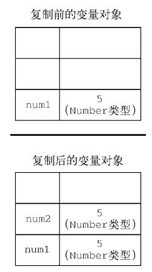
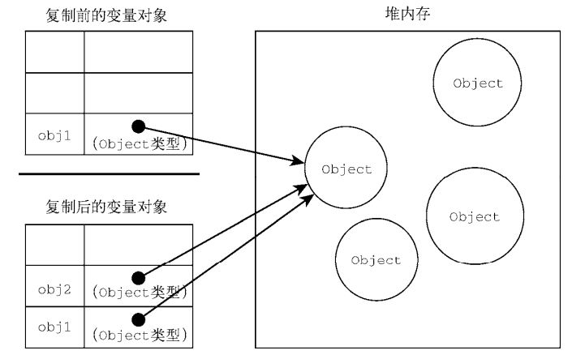

`摘记<Javascript高级程序设计> -- 马特 2020版 第四章 4-1原始值与引用值`

<!--truncate-->

## `原始值与引用值`

### 原始类型的初始化可以只使用原始字面量形式

原始类型的初始化可以只使用原始字面量形式。如果使用的是 new 关键字，则 JavaScript 会创建一个 Object 类型的实例，但其行为类似原始值。下面来看看这两种初始化方式的差异：

```js
let name1 = "Nicholas";
let name2 = new String("Matt");
name1.age = 27;
name2.age = 26;
console.log(name1.age); // undefined
console.log(name2.age); // 26
console.log(typeof name1); // string
console.log(typeof name2); // object 
```

### 复制值

**原始值**

除了存储方式不同，原始值和引用值在通过变量复制时也有所不同。在通过变量把一个原始值赋值到另一个变量时，原始值会被复制到新变量的位置。请看下面的例子：

```js
let num1 = 5;
let num2 = num1; 
```

:::tip
这里，num1 包含数值 5。当把 num2 初始化为 num1 时，num2 也会得到数值 5。这个值跟存储在num1 中的 5 是完全独立的，因为它是那个值的副本。

这两个变量可以独立使用，互不干扰。这个过程下图所示。
:::



**引用值**

在把引用值从一个变量赋给另一个变量时，存储在变量中的值也会被复制到新变量所在的位置。区别在于，这里复制的值实际上是一个指针，它指向存储在堆内存中的对象。操作完成后，两个变量实际上指向同一个对象，因此一个对象上面的变化会在另一个对象上反映出来，如下面的例子所示：

```js
let obj1 = new Object();
let obj2 = obj1;
obj1.name = "Nicholas";
console.log(obj2.name); // "Nicholas" 
```

在这个例子中，变量 obj1 保存了一个新对象的实例。然后，这个值被复制到 obj2，此时两个变量都指向了同一个对象。在给 obj1 创建属性 name 并赋值后，通过 obj2 也可以访问这个属性，因为它们都指向同一个对象。下图展示了变量与堆内存中对象之间的关系。



---

### 传递参数

`ECMAScript 中所有函数的参数都是按值传递的`。这意味着函数外的值会被复制到函数内部的参数中，就像从一个变量复制到另一个变量一样。如果是原始值，那么就跟原始值变量的复制一样，如果是引用值，那么就跟引用值变量的复制一样。对很多开发者来说，这一块可能会不好理解，毕竟变量有按值和按引用访问，而传参则只有按值传递。

在按值传递参数时，值会被复制到一个局部变量（即一个命名参数，或者用 ECMAScript 的话说，就是 arguments 对象中的一个槽位）。在按引用传递参数时，值在内存中的位置会被保存在一个局部变量，这意味着对本地变量的修改会反映到函数外部。（这在 ECMAScript 中是不可能的。）来看下面这个例子：

```js
function addTen(num) {
 num += 10;
 return num;
}
let count = 20;
let result = addTen(count);
console.log(count); // 20，没有变化
console.log(result); // 30
```

这里，函数 addTen()有一个参数 num，它其实是一个局部变量。在调用时，变量 count 作为参数传入。count 的值是 20，这个值被复制到参数 num 以便在 addTen()内部使用。在函数内部，参数 num的值被加上了 10，但这不会影响函数外部的原始变量 count。参数 num 和变量 count 互不干扰，它们只不过碰巧保存了一样的值。如果 num 是按引用传递的，那么 count 的值也会被修改为 30。这个事实在使用数值这样的原始值时是非常明显的。但是，如果变量中传递的是对象，就没那么清楚了。比如，再看这个例子：

```js
function setName(obj) {
 obj.name = "Nicholas";
}
let person = new Object();
setName(person);
console.log(person.name); // "Nicholas" 
```

这一次，我们创建了一个对象并把它保存在变量 person 中。然后，这个对象被传给 setName()方法，并被复制到参数 obj 中。在函数内部，obj 和 person 都指向同一个对象。结果就是，即使对象是按值传进函数的，obj 也会通过引用访问对象。当函数内部给 obj 设置了 name 属性时，函数外部的对象也会反映这个变化，因为 obj 指向的对象保存在全局作用域的堆内存上。很多开发者错误地认为，当在局部作用域中修改对象而变化反映到全局时，就意味着参数是按引用传递的。为证明对象是按值传递的，我们再来看看下面这个修改后的例子：

```js
function setName(obj) {
 obj.name = "Nicholas";
 obj = new Object();
 obj.name = "Greg";
}
let person = new Object();
setName(person);
console.log(person.name); // "Nicholas" 
```

这个例子前后唯一的变化就是 setName()中多了两行代码，将 obj 重新定义为一个有着不同 name的新对象。当 person 传入 setName()时，其 name 属性被设置为"Nicholas"。然后变量 obj 被设置为一个新对象且 name 属性被设置为"Greg"。如果 person 是按引用传递的，那么 person 应该自动将指针改为指向 name 为"Greg"的对象。可是，当我们再次访问 person.name 时，它的值是"Nicholas"，这表明函数中参数的值改变之后，原始的引用仍然没变。当 obj 在函数内部被重写时，它变成了一个指
向本地对象的指针。而那个本地对象在函数执行结束时就被销毁了。

:::info 注意
ECMAScript 中函数的参数就是局部变量。
:::

### 确定类型 typeof与instanceof

之前提到的 `typeof` 操作符最适合用来判断一个变量是否为原始类型。更确切地说，它是判断一个变量是否为`字符串、数值、布尔值或 undefined` 的最好方式。如果值是对象或 `null`，那么 `typeof`返回`"object"`，如下面的例子所示：

```js
let s = "Nicholas";
let b = true;
let i = 22;
let u;
let n = null;
let o = new Object();
console.log(typeof s); // string
console.log(typeof i); // number
console.log(typeof b); // boolean
console.log(typeof u); // undefined
console.log(typeof n); // object
console.log(typeof o); // object 
```

`typeof` 虽然对原始值很有用，但它对引用值的用处不大。我们通常不关心一个值是不是对象，而是想知道它是什么类型的对象。为了解决这个问题，ECMAScript 提供了 `instanceof` 操作符，语法如下：

```js
result = variable instanceof constructor
```

如果变量是给定引用类型（由其原型链决定）的实例，则 `instanceof`操作符返回 true。来看下面的例子：

```js
console.log(person instanceof Object); // 变量 person 是 Object 吗？
console.log(colors instanceof Array); // 变量 colors 是 Array 吗？
console.log(pattern instanceof RegExp); // 变量 pattern 是 RegExp 吗？
```

按照定义，所有引用值都是 Object 的实例，因此通过 instanceof 操作符检测任何引用值和Object 构造函数都会返回 true。类似地，如果用 instanceof 检测原始值，则始终会返回 false，因为原始值不是对象。

:::caution
typeof 操作符在用于检测函数时也会返回"function"。当在 Safari（直到 Safari 5）和 Chrome（直到 Chrome 7）中用于检测正则表达式时，由于实现细节的原因，typeof也会返回"function"。ECMA-262 规定，任何实现内部[[Call]]方法的对象都应该在typeof 检测时返回"function"。因为上述浏览器中的正则表达式实现了这个方法，所以 typeof 对正则表达式也返回"function"。在 IE 和 Firefox 中，typeof 对正则表达式返回"object"。
:::
